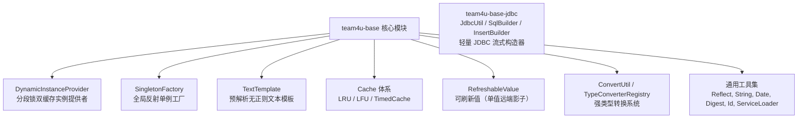

# 核心基础组件 (team4u-base)

# 背景

`team4u-base` 是整个 Team4u Framework 的基石模块。它定义了框架底层的核心抽象，并提供了涵盖**并发实例提供者**、**高性能文本模板解析**、**轻量级本地缓存**、**通用强类型转换**以及**通用工具类库**等零外部强依赖的高性能基础能力。轻量 JDBC 工具与 SQL 构建器位于独立模块 `team4u-base-jdbc`。

---

# 设计

## 设计理念

`team4u-base` 遵循“**轻量、高效、低开销、高容错**”的设计原则，为框架各上层模块（如 Config、Router、Policy、Criterion、Bean、Log、Proxy）提供坚实可靠的底层基础设施支撑：



---

## 核心特性总览

| 模块能力 | 核心类 / 接口 | 说明与特征 |
| :--- | :--- | :--- |
| **动态实例提供者** | `DynamicInstanceProvider<I, C, T>` | 分段锁防并发击穿，支持从输入源 (`I`) 到配置解析 (`C`) 再到实例创建 (`T`) 的统一双缓存流水线 |
| **通用单例工厂** | `SingletonFactory` | 基于 `DynamicInstanceProvider` 与 LFU 缓存的高性能全局反射单例桶 |
| **预解析文本模板** | `TextTemplate` | 预解析 `${var}` 占位符为静态段与变量段，运行时纯 `StringBuilder` 拼接，渲染时不做正则解析 |
| **轻量缓存体系** | `LRUCache`, `LFUCache`, `TimedCache`, `CacheUtil` | 纯 Java 原生实现的内存缓存，支持访问淘汰、频率淘汰与 TTL 自动过期及原子 `getOrCreate` |
| **可刷新值** | `RefreshableValue<T>` | 单值远端影子的声明式封装：三个时间戳（软死期/硬死期/冷却）+ 单飞 + 变更回调，并发安全开箱即用 |
| **类型转换体系** | `ConvertUtil`, `TypeConverterRegistry` | 支持标量、时间、集合、数组、枚举与 JavaBean 的全类型安全转换，支持扩展 SPI |
| **极简 JDBC 构建器**（`team4u-base-jdbc`） | `JdbcUtil`, `SqlBuilder`, `InsertBuilder`, `UpdateBuilder` | 轻量流式 SQL 拼接与命名参数绑定，支持实体自动下划线映射与自增键返回 |
| **健壮服务加载器** | `ServiceLoaderUtil` | 强化 Java 原生 SPI，捕获单实现类加载异常，防止单点故障蔓延 |

---

## 组件位置与包结构

```text
com.team4u.framework.base
├── cache                            # 缓存抽象与实现 (Cache, LRUCache, LFUCache, TimedCache, CacheUtil)
├── config                           # 配置解析接口 (ConfigParser, StringConfigParser)
├── convert                          # 类型转换体系 (ConvertUtil, TypeConverterRegistry, 各 TypeConverter)
├── instance                         # 实例工厂与提供者 (DynamicInstanceProvider, SingletonFactory, InstanceFactory)
├── refresh                          # 可刷新值 (RefreshableValue)
└── util                             # 通用工具类库 (Assert, BeanUtil, ReflectUtil, StringUtil, DateUtil, DigestUtil, IdUtil, TextTemplate, TypeReference, TypeUtil 等)
```

JDBC 工具位于 `team4u-base-jdbc`，但保留 `com.team4u.framework.base.jdbc` 包名：

```text
com.team4u.framework.base.jdbc
└── JdbcUtil / SqlBuilder / InsertBuilder / UpdateBuilder / SqlExpression
```

---

## 文档导航

- [快速开始](quick-start.md)：依赖引入与各子模块基础工具快速上手
- [动态实例与单例工厂](base-instance.md)：分段锁并发控制、双缓存语义、DynamicInstanceProvider 与 SingletonFactory
- [文本模板解析器 (TextTemplate)](base-template.md)：预解析机制、Map/Function 灵活渲染与变量提取
- [通用轻量缓存体系](base-cache.md)：LRU、LFU 与 TimedCache 缓存特性、淘汰机制与用法
- [可刷新值 (RefreshableValue)](base-refresh.md)：三个时间戳语义模型、单飞与并发契约、典型场景
- [类型转换器体系 (ConvertUtil)](base-convert.md)：TypeConverter 注册表、转换优先级与复杂类型转换
- [极简 JDBC 构建工具 (JdbcUtil)](base-jdbc.md)：SqlBuilder、InsertBuilder、UpdateBuilder 与极简 CRUD
- [实战案例](base-sample.md)：动态插件加载器、高性能路由 Key 生成与轻量数据访问实战
