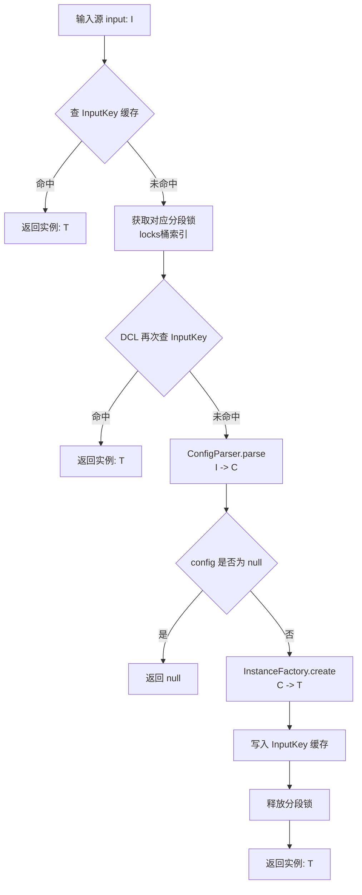

# 动态实例与单例工厂

`DynamicInstanceProvider<I, C, T>` 是框架底层最高频使用的核心基础支撑组件之一，用于将“输入源对象 / 配置字符串 (`I`)”通过“配置解析 (`C`)”转换为“可执行的对象实例 (`T`)”（如规则策略、拦截器、路由器）。

---

## 核心设计与执行流程



### 1. 双缓存空间隔离语义
- **`InputKey` 空间**：通过 `get(I input)` 访问时，以 `new InputKey(input)` 缓存最终创建的实例 `T`；
- **`ConfigKey` 空间**：通过 `getByConfig(C config)` 访问时，以 `new ConfigKey(config)` 缓存最终创建的实例 `T`；
- 两个包装键使用不同的类型标签，彻底避免了具有相同 `hashCode` 的输入源与配置对象之间的键空间污染。

### 2. 分段锁并发控制 (Striped Lock)
内部维护了固定长度为 128 的分段锁桶：
```java
private final Object[] locks = new Object[128];

private Object getLock(Object key) {
    return locks[(key.hashCode() & 0x7FFFFFFF) % locks.length];
}
```
- 在高并发 Cache Miss 情况下，将锁竞争分散至 128 个锁槽中；
- 采用双重检查锁（DCL）设计，在获取锁后二次校验缓存，确保同一输入源的解析和实例化逻辑全局仅执行一次。

---

## 构造与核心 API 清单

### 1. 静态工厂构造
```java
// 1. 基于 LRU 缓存的泛型构造
public static <I, C, T> DynamicInstanceProvider<I, C, T> createLru(
        int capacity,
        ConfigParser<I, C> configParser,
        InstanceFactory<C, T> instanceFactory);

// 2. 针对输入为 String 的便捷 LRU 构造
public static <C, T> DynamicInstanceProvider<String, C, T> createStringLru(
        int capacity,
        StringConfigParser<C> configParser,
        InstanceFactory<C, T> instanceFactory);
```

### 2. 实例获取与管理方法
| 方法签名 | 说明 |
| :--- | :--- |
| `T get(I input)` | 根据输入源获取实例（自动完成查缓存、加锁、解析配置、创建实例并写入缓存） |
| `T getByConfig(C config)` | 直接根据已有的配置对象获取实例并缓存 |
| `void invalidate(Object key)` | 同时移除 `InputKey(key)` 与 `ConfigKey(key)` 对应的缓存项 |
| `void clear()` | 清空提供者中的所有缓存 |
| `int cacheSize()` | 获取当前缓存中的条目总数 |

---

## 全局单例工厂 (`SingletonFactory`)

基于 `DynamicInstanceProvider` 实现的通用无配置反射单例桶：

```java
package com.team4u.framework.base.instance;

public class SingletonFactory {

    private static final DynamicInstanceProvider<Class<?>, Class<?>, Object> PROVIDER = 
            new DynamicInstanceProvider<>(
                    CacheUtil.newLFUCache(1000),   // 容量 1000 的 LFU 缓存
                    clazz -> clazz,                // Input -> Config: 直接为类本身
                    ReflectUtil::newInstance       // Config -> Instance: 反射实例化
            );

    /** 获取指定类型的全局单例 */
    public static <T> T getInstance(Class<T> clazz);

    /** 移除特定类型的单例缓存 */
    public static void invalidate(Class<?> clazz);

    /** 清空所有单例缓存 */
    public static void clear();
}
```

### 使用示例：
```java
import com.team4u.framework.base.instance.SingletonFactory;

// 自动延迟单例反射创建并缓存，线程安全且具备 LFU 热点淘汰能力
OrderService service = SingletonFactory.getInstance(OrderService.class);
```

---

## 健壮服务加载器 (`ServiceLoaderUtil`)

在 Java 原生 SPI 基础上增加了单类异常捕获与容错机制。当类路径下某个损坏的实现类抛出 `ServiceConfigurationError` 或 `ClassNotFoundException` 时，不会中断其他合法实现类的加载：

```java
import com.team4u.framework.base.util.ServiceLoaderUtil;
import java.util.List;

// 加载首个可用的服务实现
MyPlugin plugin = ServiceLoaderUtil.loadFirstAvailable(MyPlugin.class);

// 容错加载所有可用的服务实现列表
List<MyPlugin> plugins = ServiceLoaderUtil.loadAvailableList(MyPlugin.class);
```
