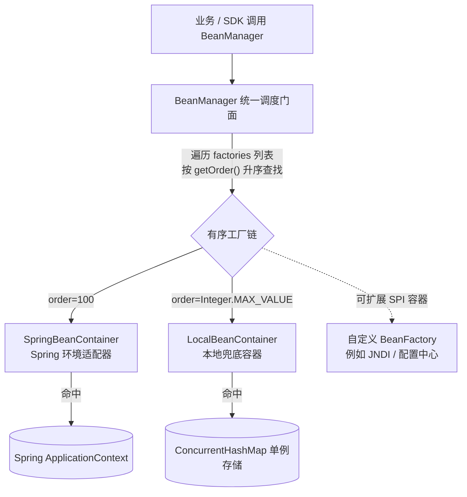

# 对象容器组件 (team4u-bean / team4u-bean-spring)

# 背景

在开发底层 SDK、公共中间件工具包或框架插件时，开发者经常面临以下两难抉择：

- **强绑定 Spring 容器的代价**：若直接使用 `@Autowired`、`@Component` 或 `ApplicationContext`，则强行要求依赖该 SDK 的所有宿主项目必须引入庞大的 Spring 体系，无法在轻量级 CLI 工具、纯 Java 守护进程、Android 或独立单元测试中运行。
- **自研单例容器的并发陷阱**：若自己在 SDK 中维护 `static Map` 单例池，在多线程高并发启动与懒加载阶段容易发生死锁、锁竞争或多次初始化问题。
- **双体系割裂与割裂适配**：同一个通用组件既希望在纯 Java 环境下作为一个轻量本地单例桶使用，又希望在 Spring 环境下能透明代理并访问 Spring 容器中注册的 Bean。

`team4u-bean` 提供纯 Java 的本地对象管理与 `BeanManager` 门面；`team4u-bean-spring` 以普通 Spring 配置显式桥接 `ApplicationContext`。

---

# 设计

## 设计理念



## 核心概念

| 概念 | 类/接口路径 | 说明 |
| :--- | :--- | :--- |
| `BeanManager` | `com.team4u.framework.bean.BeanManager` | 统一管理门面单例，持有多个 `BeanFactory`，提供 `getBean`、`getRequiredBean`、`loadBean`、`getBeansOfType` |
| `BeanFactory` | `com.team4u.framework.bean.core.BeanFactory` | 只读查询接口，定义 `getBean(name)`、`getBean(type)`、`getBeansOfType(type)` 与 `getOrder()` |
| `BeanRegistry` | `com.team4u.framework.bean.core.BeanRegistry` | 写入注册接口，定义 `registerBean(name, bean)` 与 `registerBean(bean)` |
| `LocalBeanContainer` | `com.team4u.framework.bean.provider.LocalBeanContainer` | 默认本地容器实现，基于 `ConcurrentHashMap`，作为所有单例 Bean 的兜底存储（`order = Integer.MAX_VALUE`） |
| `SpringBeanContainer` | `com.team4u.framework.bean.provider.SpringBeanContainer` | `team4u-bean-spring` 中的 Spring 容器适配器（`order = 100`），由 `Team4uBeanConfiguration` 显式注册，实现 `ApplicationContextAware`，自动将 Spring 托管 Bean 挂载至管理门面 |
| `BeanInitializedEvent` | `com.team4u.framework.bean.event.BeanInitializedEvent` | Bean 初始化就绪事件，注册成功后由 `EventDispatcher` 触发通知 |
| `NoSuchBeanDefinitionException` | `com.team4u.framework.bean.exception.NoSuchBeanDefinitionException` | 当调用 `getRequiredBean` 未找到对应 Bean 时抛出的异常 |

---

## 核心特性

- **职责清晰隔离 (ISP / SRP)**：只读查询接口 `BeanFactory` 与写入注册接口 `BeanRegistry` 严格分离。
- **并发安全与懒加载** (`loadBean`)：基于原子检查与本地注册机制，确保在并发访问下耗时的初始化逻辑安全执行。
- **SPI 扩展机制**：支持通过 Java 标准 SPI（`ServiceLoader`）自动发现并注册第三方自定义容器源。
- **显式 Spring 桥接**：Spring 环境添加 `team4u-bean-spring`，用 `@Import(Team4uBeanConfiguration.class)` 注册 `SpringBeanContainer`；SDK 代码仍只依赖 `team4u-bean` 的 `BeanManager`。

---

## 组件位置与包结构

```text
team4u-bean
└── src/main/java/com/team4u/framework/bean
    ├── core                                     # 核心接口定义
    │   ├── BeanFactory.java                     # 只读查找接口 (getBean, getBeansOfType, getOrder)
    │   └── BeanRegistry.java                    # 写入注册接口 (registerBean)
    ├── event                                    # 事件模型
    │   ├── BeanInitializedEvent.java            # Bean 就绪事件
    │   └── EventDispatcher.java                 # 内部事件分发器
    ├── exception                                # 异常定义
    │   └── NoSuchBeanDefinitionException.java   # Bean 未找到异常
    ├── provider                                 # 内置容器提供者
    │   └── LocalBeanContainer.java              # 本地 ConcurrentHashMap 兜底容器
    └── BeanManager.java                         # 统一管理门面

team4u-bean-spring
└── src/main/java/com/team4u/framework/bean
    ├── provider
    │   └── SpringBeanContainer.java             # Spring ApplicationContext 适配器（FQCN 保持不变）
    └── spring
        └── Team4uBeanConfiguration.java        # 普通 @Configuration，显式注册唯一适配器
```

---

## 文档导航

- [快速开始](quick-start.md)：本地注册获取与 Spring 桥接接入
- [本地容器与原子懒加载](bean-container.md)：`LocalBeanContainer`、`loadBean` 原理与事件通知
- [Spring 容器显式桥接](bean-spring.md)：`team4u-bean-spring`、`Team4uBeanConfiguration`、优先级与生命周期
- [SPI 扩展与优先级排序](bean-spi.md)：自定义 BeanFactory、getOrder 排序规则与多源聚合
- [实战案例](bean-sample.md)：通用 SDK 无依赖单例设计与多源 Bean 查找实战
