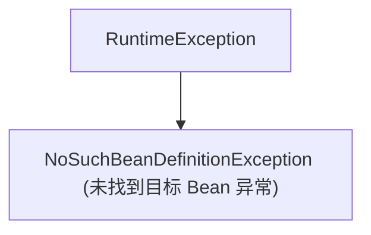
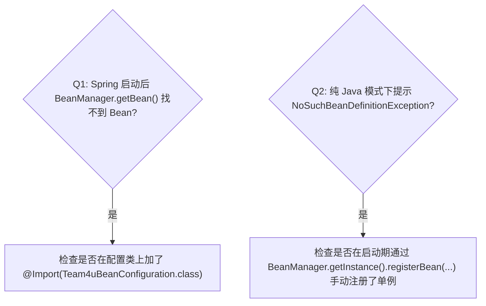

# 容器异常与诊断排查手册

在组件依赖注入与动态 Bean 检索过程中，`team4u-bean` 提供了结构化的异常类型与诊断排查指引。

---

## 异常类体系

### `NoSuchBeanDefinitionException` 触发场景

| 场景 | 异常信息特征 | 根本原因 | 排查自查步骤 |
| :--- | :--- | :--- | :--- |
| **按类型查找失败** | `No qualifying bean of type com.example.MyService` | 容器中未注册该类型的实例 | 1. 确认该类标注了 `@Component` / `@Service`； 2. 确认在 Spring 扫描路径下； 3. 确认已 `@Import(Team4uBeanConfiguration.class)`。 |
| **按名称查找失败** | `No bean named 'myBean'` | 容器中不存在指定名称的 Bean | 1. 检查 `@Component("myBean")` 中的名称拼写； 2. 检查 BeanManager 是否加载了对应的上下文。 |
| **类型不匹配** | `Bean named 'myBean' is not of type ...` | 找到同名 Bean 但无法转换为目标接口 | 检查是否存在名称冲突的同名 Bean 实例。 |

---

## 常见排查自查清单

---

## 关联章节与进一步阅读

- 了解容器门面与多级查找链：[容器门面与提供者体系](bean-container.md)
- 了解 Spring 容器桥接：[Spring 容器集成与配置](bean-spring.md)
- 了解事件派发：[容器事件派发与生命周期监听](bean-events.md)
