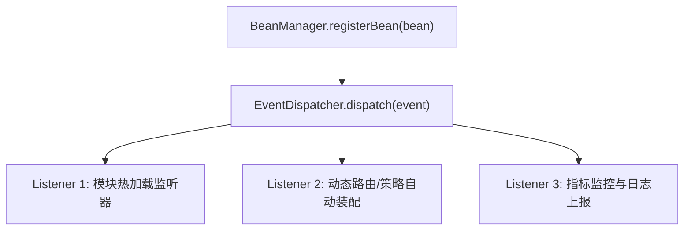

# 容器事件派发与生命周期监听

在大型框架与模块化系统中，组件初始化完成、动态 Bean 注册与容器就绪需要向外发布生命周期通知。`team4u-bean` 提供了轻量级的 **`EventDispatcher`（事件分发中心）** 与 **`BeanInitializedEvent`（Bean 初始化事件）**。

---

## 核心事件模型



---

## 1. 监听 Bean 初始化事件：`BeanInitializedEvent`

当一个 Bean 被成功加载至 `BeanManager` 时，会触发 `BeanInitializedEvent`：

```java
import com.team4u.framework.bean.event.BeanInitializedEvent;
import com.team4u.framework.bean.event.EventDispatcher;

// 注册全局事件监听器
EventDispatcher.getInstance().registerListener(BeanInitializedEvent.class, event -> {
    String beanName = event.getBeanName();
    Object beanInstance = event.getBean();
    log.info("检测到新 Bean 初始化: name={}, class={}", beanName, beanInstance.getClass().getName());
    
    // 如果是动态策略，自动注册到策略路由中心
    if (beanInstance instanceof CustomStrategy) {
        StrategyRegistry.register((CustomStrategy) beanInstance);
    }
});
```

---

## 2. 自定义业务事件分发

`EventDispatcher` 也可作为轻量级应用内事件总线使用：

```java
public class UserRegisteredEvent {
    private final String userId;
    // ...
}

// 注册监听器
EventDispatcher.getInstance().registerListener(UserRegisteredEvent.class, event -> {
    sendWelcomeEmail(event.getUserId());
});

// 发布事件
EventDispatcher.getInstance().dispatch(new UserRegisteredEvent("U123456"));
```

---

## 关联章节与进一步阅读

- 了解容器门面与多级查找链：[容器门面与提供者体系](bean-container.md)
- 了解 Spring 容器桥接：[Spring 容器集成与配置](bean-spring.md)
- 了解 SPI 扩展实现：[自定义 BeanFactory SPI 扩展](bean-spi.md)
- 查阅容器异常与排查手册：[容器异常与诊断排查手册](bean-diagnostics.md)
