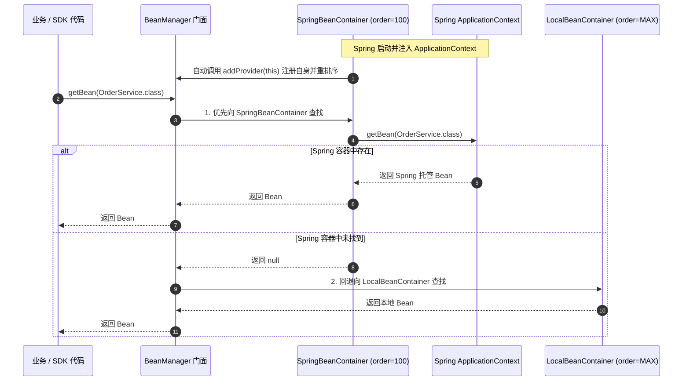

# Spring 容器无缝桥接

当开发一个供多个业务团队使用的通用中间件或 SDK 时，宿主工程通常是 Spring Boot 项目。`SpringBeanContainer` 实现了“两套体系，一套接口”的透明桥接。

---

## 桥接工作原理



---

## `SpringBeanContainer` 核心实现细节

```java
package com.team4u.framework.bean.provider;

public class SpringBeanContainer implements BeanFactory, BeanRegistry, ApplicationContextAware {

    private ApplicationContext applicationContext;

    @Override
    public void setApplicationContext(ApplicationContext applicationContext) throws BeansException {
        this.applicationContext = applicationContext;
        // 自动将当前容器注入全局 BeanManager 门面并重排优先级
        BeanManager.getInstance().addProvider(this);
    }

    @Override
    public int getOrder() {
        return 100; // 优先级高于 LocalBeanContainer (Integer.MAX_VALUE)
    }

    @Override
    public <T> boolean registerBean(String beanName, T bean) {
        if (!isContextActive()) {
            return false;
        }

        // 向 Spring 运行时动态注册单例 Bean
        if (applicationContext instanceof ConfigurableApplicationContext) {
            ConfigurableListableBeanFactory beanFactory = 
                    ((ConfigurableApplicationContext) applicationContext).getBeanFactory();
            if (!beanFactory.containsSingleton(beanName)) {
                beanFactory.registerSingleton(beanName, bean);
                return true;
            }
        }
        return false;
    }
}
```

---

## 接入方式

在 Spring Boot 应用的配置类中注册 `SpringBeanContainer`：

```java
import com.team4u.framework.bean.provider.SpringBeanContainer;
import org.springframework.context.annotation.Bean;
import org.springframework.context.annotation.Configuration;

@Configuration
public class Team4uBeanAutoConfiguration {

    @Bean
    public SpringBeanContainer springBeanContainer() {
        return new SpringBeanContainer();
    }
}
```

### 核心优势
- **完全解耦**：底层 SDK 内部无需在代码中引入任何 Spring 强依赖注解（如 `@Autowired`、`@Component`），直接使用 `BeanManager.getInstance().getBean(...)`；
- **环境自适应**：在单元测试或纯 Java 运行环境下，代码自动回退到 `LocalBeanContainer`，保证测试和脚本秒级启动。
