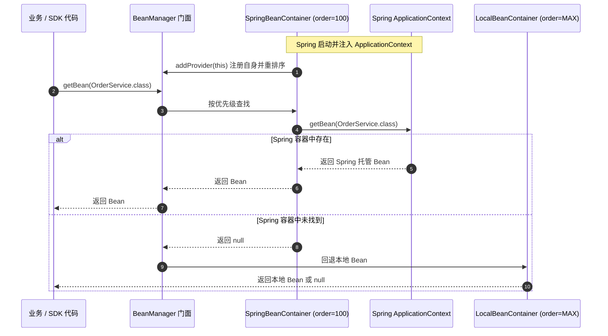

# Spring 容器显式桥接 (team4u-bean-spring)

`team4u-bean` 提供纯 Java 的 `BeanManager` 和本地容器。`team4u-bean-spring` 只提供 Spring 5.3 适配器和一条显式配置入口：`Team4uBeanConfiguration`。

---

## 依赖与接入

应用配置类显式 `@Import` 该配置；没有 Boot starter、`spring.factories` 或自动配置类：

```xml
<dependency>
    <groupId>com.team4u</groupId>
    <artifactId>team4u-bean</artifactId>
    <version>1.0.0-SNAPSHOT</version>
</dependency>
<dependency>
    <groupId>com.team4u</groupId>
    <artifactId>team4u-bean-spring</artifactId>
    <version>1.0.0-SNAPSHOT</version>
</dependency>
```

```java
import com.team4u.framework.bean.spring.Team4uBeanConfiguration;
import org.springframework.context.annotation.Configuration;
import org.springframework.context.annotation.Import;

@Configuration
@Import(Team4uBeanConfiguration.class)
public class ApplicationConfiguration {
}
```

`Team4uBeanConfiguration` 是普通 Spring `@Configuration`，只注册一个 `@Bean SpringBeanContainer`。应用仍可使用组件扫描，但这个配置必须显式导入，保证依赖选择和上下文装配可见。

---

## 桥接行为

`SpringBeanContainer` 保持原有 FQCN：`com.team4u.framework.bean.provider.SpringBeanContainer`。Spring 初始化它时注入 `ApplicationContext`，并把它注册到 `BeanManager` 的有序 Provider 链：



可用行为包括：

- 按名称、类型和类型集合从 `BeanManager` 读取 Spring Bean。
- 在活动 `ConfigurableApplicationContext` 中动态注册 singleton。
- 上下文关闭或未激活后，查询返回空值，动态注册返回 `false`。

