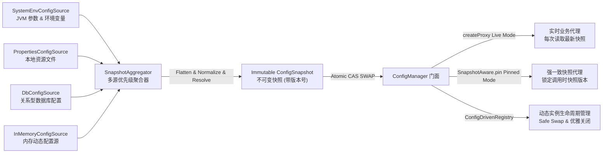

# 配置管理组件 (team4u-config)

# 背景

在现代微服务与分布式应用中，配置管理是支撑系统弹性治理与动态运维的核心基础设施。随着业务的发展，配置体系往往面临如下痛点：

- **多源冲突与覆盖混乱**：系统参数、环境变量、本地 properties 文件、远程数据库及配置中心各存一份，优先级混乱难以统一治理。
- **配置读取非类型安全**：散落大量的 `getString("server.port")`，缺乏强类型检查与结构化校验，重构极易出错。
- **热更新导致“撕裂读取 (Torn Read)”**：在单次业务请求或长事务计算期间，若底层配置发生热重载，可能导致同一请求的前半部分使用了旧配置，后半部分使用了新配置，产生严重的数据不一致。
- **配置与组件生命周期脱节**：配置变更后，开发者往往需要手写繁琐的监听器去销毁旧连接池并重建新实例，极易引发内存泄漏或连接未优雅释放。

`team4u-config` 是一个轻量级、高性能、强类型安全的 Java 配置管理框架。它通过“**不可变快照 (Immutable Snapshot) 驱动**”的设计理念，彻底解决了多源冲突、热更新抖动与配置到对象的安全映射问题。

---

# 设计

## 设计理念

框架将配置视为一个版本演进的不可变数据流。底层通过多源并发加载并聚合为全局唯一的不可变快照，对外提供 Live（实时）与 Pinned（快照锚定）双模动态代理：



## 核心特性

- **不可变快照 (Immutable Snapshot)**：每次重载生成全局不可变快照，并通过 `AtomicReference` 执行原子替换，彻底杜绝多线程读取竞争与脏读。
- **双模代理 (Live vs Pinned)**：Live 模式始终读取最新快照，实现业务无感热更新；Pinned 模式锁定请求入口时刻的版本，保障长事务与批处理强一致性。
- **Java Bean 声明式代理**：支持普通 POJO，结合 `@ConfigPrefix`、`@ConfigKey`、`@ConfigRequired`、`@ConfigConverter`，自动将字段初始值作为缺失兜底默认值。
- **智能松散绑定 (Relaxed Binding)**：自动归一化键名，透明兼容驼峰（camelCase）、中划线（kebab-case）、下划线（snake_case）与点分隔符。
- **占位符深度嵌套与防死锁**：支持 `${db.${env}.host:localhost}` 嵌套语法与默认值，内置递归深度限制（最大 20 层）与循环依赖检测。
- **防抖热重载 (Debounce Window)**：内置防抖时间窗口（默认 500ms），将高频瞬时修改合并为单次原子重载；单元测试可设为 0 实现同步重载。
- **配置驱动组件生命周期 (`ConfigDrivenRegistry`)**：配置变更自动安全热替换运行时对象（Safe Swap），旧实例自动执行 `AutoCloseable` 优雅释放。
- **全局引导与锁定 (`ConfigBootstrap`)**：支持集中化注册并在应用就绪后执行 `lock()`，防止运行期配置源被非法篡改。

---

## 核心概念

| 概念 | 类路径 / 接口 | 说明 |
| :--- | :--- | :--- |
| `ConfigManager` | `com.team4u.framework.config.core.ConfigManager` | 配置管理器核心总控门面，提供 `global()`、`builder()`、`createProxy()` 与 `registerChangeListener()` |
| `ConfigSnapshot` | `com.team4u.framework.config.core.domain.ConfigSnapshot` | 不可变配置快照，包含版本号、扁平化条目 (`ConfigEntry`)、松散匹配索引与树形结构化视图 |
| `SnapshotAware` | `com.team4u.framework.config.core.proxy.SnapshotAware` | 快照感知接口，通过 `SnapshotAware.pin(proxy)` 将实时代理锁定为固定版本的快照代理 |
| `ConfigSource` | `com.team4u.framework.config.core.spi.ConfigSource` | 配置源 SPI 接口（`name()`, `priority()`, `load()`），支持 Tombstone 墓碑失效机制 |
| `ConfigWatcher` | `com.team4u.framework.config.core.spi.ConfigWatcher` | 配置变更监听器 SPI 接口，负责探测原始数据源变动并向 `HotReloadManager` 发送重载信号 |
| `ConfigDrivenRegistry<T>` | `com.team4u.framework.config.core.support.ConfigDrivenRegistry` | 配置驱动的对象注册表，统一管理“配置变更 -> 实例热构建 -> 优雅关闭” |
| `ConfigBootstrap` | `com.team4u.framework.config.core.ConfigBootstrap` | 全局引导配置类，支持全局源注册与 `lock()` 防篡改保护 |
| `DbConfigSource` / `DbConfigWatcher` | `com.team4u.framework.config.db.*` | `team4u-config-db` 模块提供的数据库配置源与最大时间戳轮询监听器 |
| `TestConfigContext` | `com.team4u.framework.config.test.TestConfigContext` | `team4u-config-test` 模块提供的零延迟同步测试上下文工具 |

---

## 模块结构

| 模块 | 说明 | 核心依赖 |
| :--- | :--- | :--- |
| **`team4u-config-core`** | 核心配置引擎：快照聚合、显式绑定、可选代理创建、占位符解析、防抖热重载与过渡 Spring 自动装配 | `team4u-base`, `team4u-policy`, `team4u-proxy`, `team4u-serializer-json` |
| **`team4u-config-db`** | 数据库配置扩展：基于 JDBC 的关系型数据库配置全量加载与低开销时间戳轮询监听器 | `team4u-config-core`, JDBC / DataSource |
| **`team4u-config-test`** | 单元测试支持：提供 `TestConfigContext` 内存隔离配置环境，默认 0 延迟同步热重载，并显式注入过渡代理创建器 | `team4u-config-core` |

`createProxy` 需要显式 `ConfigProxyCreator` 或唯一的 ServiceLoader 实现；当前代理实现仍暂留在 core，Task 9 会拆分为 `team4u-config-proxy`。
使用 `JsonPropertyConverter` 的应用必须显式提供 JSON 引擎：添加 `team4u-serializer-jackson` 或注册自定义 `JsonSerializerPolicy`。

---

## 组件位置与包结构

```text
com.team4u.framework.config
├── core                             # 配置核心模块 (team4u-config-core)
│   ├── annotation                   # 声明式注解 (@ConfigPrefix, @ConfigKey, @ConfigRequired, @ConfigConverter)
│   ├── convert                      # 属性类型转换器 (PropertyConverter, JsonPropertyConverter, PropertyConverterRegistry)
│   ├── domain                       # 领域模型与异常 (ConfigSnapshot, ConfigEntry, ConfigMissingException, ConfigConversionException)
│   ├── internal                     # 核心内部实现 (DefaultConfigManager, DefaultConfigBinder, PlaceholderResolver, HotReloadManager, SnapshotAggregator)
│   ├── proxy                        # 动态代理核心 (ConfigProxyFactory, ConfigMethodInterceptor, SnapshotAware)
│   ├── spi                          # SPI 接口与内置源 (ConfigSource, ConfigSourceRegistry, ConfigWatcher, ConfigWatcherRegistry, ConfigBinder, InMemoryConfigSource, PropertiesConfigSource, SystemEnvConfigSource)
│   ├── spring                       # Spring 自动装配 (Team4uConfigAutoConfiguration)
│   ├── support                      # 配置驱动支持 (ConfigDrivenRegistry)
│   ├── ConfigBootstrap.java         # 全局引导与锁定控制
│   ├── ConfigChangeListener.java    # 变更监听函数式接口
│   └── ConfigManager.java           # 配置管理器门面与 Builder
├── db                               # 数据库扩展模块 (team4u-config-db)
│   ├── DbConfigOptions.java         # 数据表与字段自定义映射选项
│   ├── DbConfigSource.java          # 数据库配置全量加载源
│   └── DbConfigWatcher.java         # 数据库变更时间戳轮询监听器
└── test                             # 测试支持模块 (team4u-config-test)
    └── TestConfigContext.java       # 单元测试内存配置上下文工具
```

---

## 文档导航

- [快速开始](quick-start.md)：依赖引入、配置文件准备与基础使用
- [类型安全代理与注解](config-proxy.md)：Java Bean 代理、声明式注解、松散绑定与 Live/Pinned 双模
- [多源配置与数据库扩展](config-source.md)：多源优先级聚合、Tombstone 墓碑机制与 DB 插件配置
- [热重载与变更监听](config-reload.md)：ConfigWatcher 机制、防抖窗口、Fail-Fast 与配置溯源
- [配置驱动实例生命周期](config-instance.md)：ConfigDrivenRegistry、Safe Swap 与资源优雅关闭
- [实战案例与测试支持](config-sample.md)：微服务配置实战、Spring 集成与 TestConfigContext 测试
