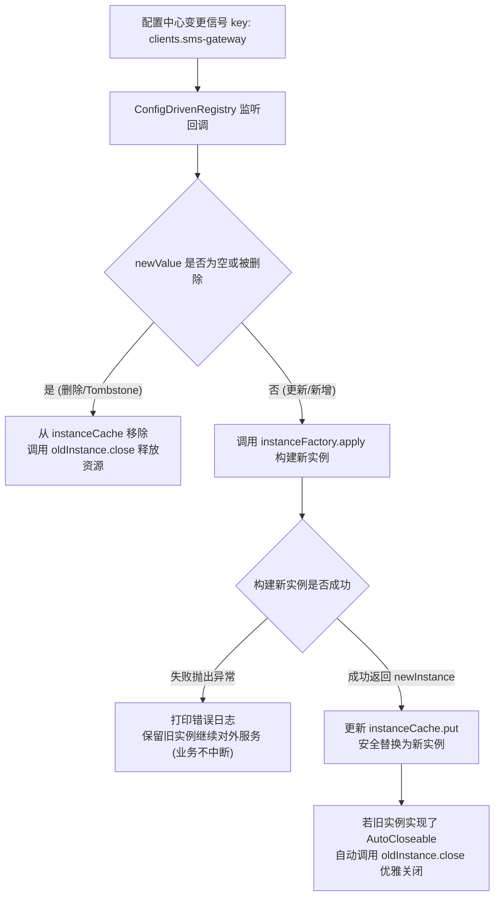

# 配置驱动实例生命周期

在企业级基础架构中，经常面临“**配置变更 -> 运行时组件实例热重建与安全替换**”的诉求（例如：动态多租户数据源、动态 HTTP 客户端连接池、动态消息队列消费者、动态限流/路由规则）。

`team4u-config-core` 提供了 `ConfigDrivenRegistry<T>` 组件，统一治理重型运行时对象的创建、热替换与资源优雅销毁。

> [!NOTE]
> **何时使用 `ConfigDrivenRegistry` vs 动态代理 (`createProxy`)？**
> - **纯配置数据读取**：若只需读取配置属性（如超时时间、开关状态），使用 `@ConfigPrefix` + `configManager.createProxy(...)` 即可获得强类型安全的不可变快照代理。
> - **重型运行时组件管理**：若配置变更需要**重新构造持有着连接池、线程池或底层句柄的运行时组件**，并在替换后安全调用 `close()` 释放旧资源，则应使用 `ConfigDrivenRegistry<T>`。

---

## 核心设计理念



- **安全热替换 (Safe Swap)**：
  - 收到配置变更通知后，**先尝试使用新配置构建新实例**；
  - 只有在新实例构建成功后，才执行缓存引用的原子替换；
  - 若新配置存在格式错误、网络不可达等导致构建失败，系统会捕获异常并告警，**继续保留旧实例对外服务**，保证系统高可用与业务连续性。
- **资源优雅关闭 (Graceful Shutdown)**：
  - 当旧实例被替换淘汰，或配置被物理删除/标记失效（Tombstone）时，框架自动检测其实例是否实现了 `java.lang.AutoCloseable` 接口；
  - 若实现，则自动调用 `close()` 方法释放底层网络连接、线程池或句柄，杜绝连接泄漏和内存溢出。
- **延迟初始化与 O(1) 极速读取**：
  - 首次通过 `get(configKey)` 访问时，按需执行延迟构建（`computeIfAbsent`）；
  - 后续读取直接命中内部 `ConcurrentHashMap`，不再重复反射与反序列化。
- **监听器与实例全生命周期销毁 (`destroy()`)**：
  - 调用 `destroy()` 时，首先注销与 `ConfigManager` 的监听句柄，随后遍历所有已缓存的实例执行 `closeQuietly()` 彻底释放资源。

---

## 支持的配置格式与适用范围

### 原生支持：单 Key 文档型配置 (1 Key = 1 Object)
`ConfigDrivenRegistry` 的底层工厂函数契约是 `Function<String, T>`，因此要求**单个 Key 必须承载该组件所需的完整配置内容**：

- **典型格式**：JSON、YAML、XML、自定分隔文本或连接串。
- **配置示例**：
  ```properties
  # 场景 A：通配符多实例模式 (clients.*)
  clients.sms={"name":"sms-client","endpoint":"https://sms.aliyun.com","timeout":5000}
  clients.pay={"name":"pay-client","endpoint":"https://pay.alipay.com","timeout":3000}

  # 场景 B：精确键单实例模式 (clients.default)
  clients.default={"name":"default-client","endpoint":"https://api.example.com","timeout":3000}
  ```

### 暂不支持：展开式 Properties 属性树 (Flat Key-Value Tree)
`ConfigDrivenRegistry` **目前不支持**由多条散落的独立属性 Key 聚合驱动单个组件，例如：

```properties
# ⚠️ 展开式属性树（当前 ConfigDrivenRegistry 无法直接聚合解析）
server.name=team4u-demo
server.port=8080
server.connect-timeout=5000
server.db.url=jdbc:mysql://localhost:3306/test
server.db.username=root
server.description=${server.name} is running on port ${server.port}
```

> [!TIP]
> **展开式 Properties 属性树的推荐方案**：
> 如果配置是以扁平散落的属性树形式组织，推荐使用框架的 **[类型安全动态代理 (`ConfigManager.createProxy`)](config-proxy.md)**：
> - 定义标注了 `@ConfigPrefix("server")` 的 Java Bean 配置类；
> - 调用 `configManager.createProxy(ServerConfig.class)`，框架将自动完成多属性的松散绑定（Relaxed Binding）、占位符递归解析（`${...}`）与类型转换；
> - 运行时业务组件直接依赖该动态代理对象即可享受属性级别的实时热更新。

---

## 完整实战示例：动态 HTTP 客户端连接池

### 定义配置类与受配置驱动的运行时组件

最佳实践是**定义专门的配置类（POJO）**，并让**运行时组件直接持有该配置类实例与底层资源**：

```java
import lombok.Data;
import lombok.Getter;
import org.slf4j.Logger;
import org.slf4j.LoggerFactory;

/**
 * HTTP 客户端结构化配置类
 */
@Data
public class HttpClientConfig {
    private String name;
    private String endpoint;
    private int timeout = 3000;
    private int maxConnections = 100;
}

/**
 * 受配置驱动的运行时组件（持有配置类与底层连接池，实现 AutoCloseable 优雅关闭）
 */
public class DynamicHttpClient implements AutoCloseable {
    private static final Logger log = LoggerFactory.getLogger(DynamicHttpClient.class);

    @Getter
    private final HttpClientConfig config;
    private final boolean isClosed;

    public DynamicHttpClient(HttpClientConfig config) {
        if (config == null) {
            throw new IllegalArgumentException("HttpClientConfig must not be null");
        }
        this.config = config;
        this.isClosed = false;
        log.info("初始化 HTTP 客户端连接池: name={}, endpoint={}, timeout={}ms, maxConnections={}",
                config.getName(), config.getEndpoint(), config.getTimeout(), config.getMaxConnections());
    }

    public String sendRequest(String path) {
        if (isClosed) {
            throw new IllegalStateException("Client is already closed: " + config.getName());
        }
        return "Response from [" + config.getEndpoint() + path + "] within " + config.getTimeout() + "ms";
    }

    @Override
    public void close() {
        log.info("优雅关闭旧的 HTTP 客户端连接池: name={}, endpoint={}", config.getName(), config.getEndpoint());
        // 执行底层 Apache HttpClient / OkHttp / Netty 连接池销毁与线程池释放
    }
}
```

### 场景一：多实例连接池管理（通配符模式 `clients.*`）

适用于系统按渠道、租户等维护多个独立连接池的场景（如短信客户端 `clients.sms`、支付客户端 `clients.pay` 等）：

```java
import com.team4u.framework.config.core.ConfigManager;
import com.team4u.framework.config.core.support.ConfigDrivenRegistry;
import com.team4u.framework.serializer.json.JsonUtil;

public class MultiHttpClientManager {

    public static void main(String[] args) {
        ConfigManager configManager = ConfigManager.global();

        // 注册通配符多实例注册表：显式指定 "clients.*" 规则
        ConfigDrivenRegistry<DynamicHttpClient> clientRegistry = new ConfigDrivenRegistry<>(
                configManager,
                "clients.*", // 明确指定通配符规则，批量监听所有 clients. 开头的配置项
                rawJsonConfig -> {
                    // 反序列化为 HttpClientConfig 配置类并构建运行时组件
                    HttpClientConfig config = JsonUtil.toBean(rawJsonConfig, HttpClientConfig.class);
                    return new DynamicHttpClient(config);
                }
        );

        // 模拟配置中心配置:
        // clients.sms={"name":"sms-client","endpoint":"https://sms.aliyun.com","timeout":5000,"maxConnections":200}
        // clients.pay={"name":"pay-client","endpoint":"https://pay.alipay.com","timeout":3000,"maxConnections":50}
        
        // 获取指定实例（支持短标识 "sms" 或完整键 "clients.sms"，首次延迟构建，后续 O(1) 缓存命中）
        DynamicHttpClient smsClient = clientRegistry.get("sms");
        System.out.println(smsClient.sendRequest("/send"));

        // 当配置中心推送 clients.sms 的更新时：
        // ConfigDrivenRegistry 会自动解析新配置 -> 构建新 DynamicHttpClient -> 安全替换缓存 -> 优雅关闭旧连接池
        // clients.pay 等其他实例保持原样运行，不受任何影响
    }
}
```

### 场景二：单实例连接池管理（精确键模式 `clients.default`）

适用于系统只需维护一个全局默认 HTTP 连接池的场景：

```java
public class SingleHttpClientManager {

    public static void main(String[] args) {
        ConfigManager configManager = ConfigManager.global();

        // 注册单实例注册表：显式指定精确键 "clients.default"（无通配符）
        ConfigDrivenRegistry<DynamicHttpClient> defaultClientRegistry = new ConfigDrivenRegistry<>(
                configManager,
                "clients.default", // 精确匹配单个配置键，防止同前缀其他键误触
                rawJsonConfig -> {
                    HttpClientConfig config = JsonUtil.toBean(rawJsonConfig, HttpClientConfig.class);
                    return new DynamicHttpClient(config);
                }
        );

        // 模拟配置中心配置:
        // clients.default={"name":"default-client","endpoint":"https://api.example.com","timeout":3000,"maxConnections":100}

        // 获取全局单例客户端（直接调用无参 get()）
        DynamicHttpClient defaultClient = defaultClientRegistry.get();
        System.out.println(defaultClient.sendRequest("/health"));

        // 当 clients.default 配置变更时：
        // 自动触发热重载构建新连接池 -> 替换缓存 -> 优雅关闭旧连接池
    }
}
```

---

## 模式与 API 对比

| 模式 | 规则写法 | 监听机制 | 读取 API | 适用场景 |
| :--- | :--- | :--- | :--- | :--- |
| **通配符多实例模式** | `"clients.*"` / `"router.*"` | `clients.*`（`*` 通配符前缀匹配） | `get("sms")` 或 `get("clients.sms")`（自动补全前缀） | 多通道连接池、动态路由表、重试策略集等多实例池 |
| **精确键单实例模式** | `"clients.default"` / `"app.datasource"` | `clients.default`（精确匹配，防误触） | `get()`（无参直取） | 全局单一连接池、数据源、消息消费组等单组件生命周期管理 |

---

## 框架内部关键实现解析

`ConfigDrivenRegistry.java` 的核心热更新逻辑如下：

```java
private void onConfigChanged(String key, String oldValue, String newValue) {
    if (newValue == null || newValue.trim().isEmpty()) {
        // 配置移除/Tombstone 时清理缓存并释放旧资源
        removeAndClose(key);
        return;
    }

    // 安全替换：先构建新实例，成功后执行替换以保证高可用
    try {
        T newInstance = createInstance(key, newValue);
        if (newInstance != null) {
            T oldInstance = instanceCache.put(key, newInstance);
            if (oldInstance != null && oldInstance != newInstance) {
                closeQuietly(oldInstance);
            }
        }
    } catch (Exception e) {
        // 热更新构建失败时保留旧实例，确保服务连续性
        log.error("Failed to hot-reload instance for key [{}]. Keeping the old instance.", key, e);
    }
}
```
