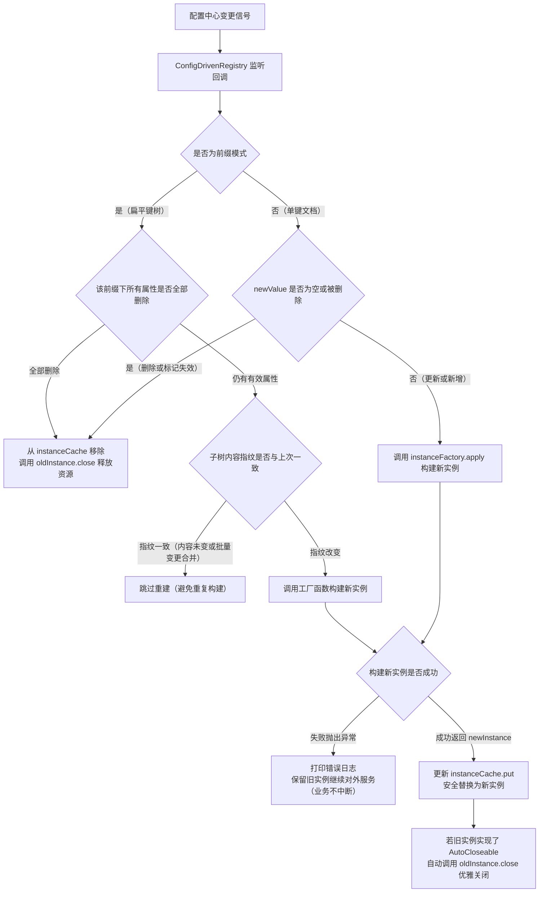

# 配置驱动实例生命周期

在企业级基础架构中，经常面临“**配置变更 -> 运行时组件实例热重建与安全替换** ”的诉求（例如：动态多租户数据源、动态 HTTP 客户端连接池、动态消息队列消费者、动态限流与路由规则）。

`team4u-config` 提供了 `ConfigDrivenRegistry<T>` 组件，统一治理重型运行时对象的创建、热替换与资源优雅销毁。

> [!NOTE]
> **何时使用 `ConfigDrivenRegistry` 与动态代理 `createProxy`？**
> - **纯配置数据读取** ：若只需读取配置属性（如超时时间、开关状态），使用 `@ConfigPrefix` + `configManager.createProxy(...)` 即可获得强类型安全的不可变快照代理。
> - **重型运行时组件管理** ：若配置变更需要**重新构造持有着连接池、线程池或底层句柄的运行时组件** ，并在替换后安全调用 `close()` 释放旧资源，则应使用 `ConfigDrivenRegistry<T>`。

---

## 核心设计理念


```mermaid
graph TD
    Change["配置中心变更信号"] --> Listener["ConfigDrivenRegistry 监听回调"]
    
    Listener --> CheckPrefix{"是否为前缀模式"}
    CheckPrefix -->|"是（扁平键树）"| CheckPrefixEmpty{"该前缀下所有属性是否全部删除"}
    CheckPrefixEmpty -->|"全部删除"| Remove["从 instanceCache 移除<br/>调用 oldInstance.close 释放资源"]
    CheckPrefixEmpty -->|"仍有有效属性"| CheckFingerprint{"子树内容指纹是否与上次一致"}
    CheckFingerprint -->|"指纹一致（内容未变或批量变更合并）"| Ignore["跳过重建（避免重复构建）"]
    CheckFingerprint -->|"指纹改变"| BuildPrefix["调用工厂函数构建新实例"]
    
    CheckPrefix -->|"否（单键文档）"| CheckDel{"newValue 是否为空或被删除"}
    CheckDel -->|"是（删除或标记失效）"| Remove
    CheckDel -->|"否（更新或新增）"| BuildSingle["调用 instanceFactory.apply 构建新实例"]
    
    BuildPrefix --> TryBuild{"构建新实例是否成功"}
    BuildSingle --> TryBuild
    
    TryBuild -->|"失败抛出异常"| KeepOld["打印错误日志<br/>保留旧实例继续对外服务（业务不中断）"]
    TryBuild -->|"成功返回 newInstance"| Swap["更新 instanceCache.put<br/>安全替换为新实例"]
    Swap --> CloseOld["若旧实例实现了 AutoCloseable<br/>自动调用 oldInstance.close 优雅关闭"]
```

- **安全热替换** ：
  - 收到配置变更通知后，**先尝试使用新配置构建新实例** ；
  - 只有在新实例构建成功后，才执行缓存引用的原子替换；
  - 若新配置存在格式错误、网络不可达等导致构建失败，系统会捕获异常并告警，**继续保留旧实例对外服务** ，保证系统高可用与业务连续性。
- **资源优雅关闭** ：
  - 当旧实例被替换淘汰，或配置被物理删除或标记失效时，框架自动检测其实例是否实现了 `java.lang.AutoCloseable` 接口；
  - 若实现，则自动调用 `close()` 方法释放底层网络连接、线程池或句柄，杜绝连接泄漏和内存溢出。
- **延迟初始化与极速读取** ：
  - 首次通过 `get(...)` 访问时，按需执行延迟构建（`computeIfAbsent`）；
  - 后续读取直接命中内部 `ConcurrentHashMap`，实现 O(1) 极速缓存读取，无需重复反射与解析。
- **生命周期完整销毁** ：
  - 调用 `destroy()` 时，首先注销与 `ConfigManager` 的监听句柄，随后遍历所有已缓存的实例执行优雅关闭，彻底释放资源。

---

## 支持的配置模式与驱动机制

`ConfigDrivenRegistry` 支持单键文档型配置与扁平键前缀模式两种核心驱动方式，覆盖从微型组件到多租户复杂连接池的全场景生命周期管理。

### 单键文档型配置

单个配置键承载该组件所需的完整配置内容，工厂函数输入为单个配置键的原始字符串值：

- **配置格式** ：JSON、YAML、XML、自定分隔文本或连接串。
- **配置示例** ：
  ```properties
  # 通配符多实例模式：clients.*
  clients.sms={"name":"sms-client","endpoint":"https://sms.aliyun.com","timeout":5000}
  clients.pay={"name":"pay-client","endpoint":"https://pay.alipay.com","timeout":3000}

  # 精确键单实例模式：clients.default
  clients.default={"name":"default-client","endpoint":"https://api.example.com","timeout":3000}
  ```

### 扁平键前缀模式

由散落在多条独立属性键下的配置树共同驱动运行时实例，工厂函数输入为强类型字典读取器 `MapReader` 与可选的实例标识：

- **配置格式** ：扁平 Properties 属性树，支持嵌套结构、类型自动转换与占位符解析。
- **配置示例** ：
  ```properties
  # 前缀单实例模式：server.*
  server.name=team4u-demo
  server.port=8080
  server.connect-timeout=5000
  server.db.url=jdbc:mysql://localhost:3306/test
  server.db.username=root
  server.description=${server.name} is running on port ${server.port}

  # 前缀多实例模式：clients.*
  clients.sms.name=sms-client
  clients.sms.endpoint=https://sms.aliyun.com
  clients.sms.timeout=5000
  clients.sms.max-connections=200

  clients.pay.name=pay-client
  clients.pay.endpoint=https://pay.alipay.com
  clients.pay.timeout=3000
  clients.pay.max-connections=100
  ```

- **指纹比对与批量变更合并** ：当一次快照重载中批量修改了同一实例下的多个属性键时，框架通过子树内容指纹检测，仅触发一次实例重建，避免回调风暴与重复初始化。
- **分层删除语义** ：当删除个别属性键时，视为子树配置变更并执行安全热重建；当该前缀下的所有属性键均被删除或标记失效时，实例从注册表中移除，并自动调用 `close()` 执行优雅关闭。

---

## 完整实战示例：动态 HTTP 客户端连接池

### 定义配置类与受配置驱动的运行时组件

最佳实践是**定义专门的配置类（POJO）** ，并让**运行时组件直接持有该配置类实例与底层资源** ：

```java
import lombok.Data;
import lombok.Getter;
import org.slf4j.Logger;
import org.slf4j.LoggerFactory;

/**
 * HTTP 客户端结构化配置类
 */
@Data
public class HttpClientConfig {
    private String name;
    private String endpoint;
    private int timeout = 3000;
    private int maxConnections = 100;
}

/**
 * 受配置驱动的运行时组件（持有配置类与底层连接池，实现 AutoCloseable 优雅关闭）
 */
public class DynamicHttpClient implements AutoCloseable {
    private static final Logger log = LoggerFactory.getLogger(DynamicHttpClient.class);

    @Getter
    private final String id;
    @Getter
    private final HttpClientConfig config;
    private final boolean isClosed;

    public DynamicHttpClient(HttpClientConfig config) {
        this(null, config);
    }

    public DynamicHttpClient(String id, HttpClientConfig config) {
        if (config == null) {
            throw new IllegalArgumentException("HttpClientConfig must not be null");
        }
        this.id = id;
        this.config = config;
        this.isClosed = false;
        log.info("初始化 HTTP 客户端连接池: id={}, name={}, endpoint={}, timeout={}ms, maxConnections={}",
                id, config.getName(), config.getEndpoint(), config.getTimeout(), config.getMaxConnections());
    }

    public String sendRequest(String path) {
        if (isClosed) {
            throw new IllegalStateException("Client is already closed: " + config.getName());
        }
        return "Response from [" + config.getEndpoint() + path + "] within " + config.getTimeout() + "ms";
    }

    @Override
    public void close() {
        log.info("优雅关闭旧的 HTTP 客户端连接池: id={}, name={}, endpoint={}", id, config.getName(), config.getEndpoint());
        // 执行底层 Apache HttpClient / OkHttp / Netty 连接池销毁与线程池释放
    }
}
```

### 通配符多实例连接池管理

适用于使用单个 JSON 配置键维护多通道独立连接池的场景：

```java
import com.team4u.framework.config.core.ConfigManager;
import com.team4u.framework.config.core.support.ConfigDrivenRegistry;
import com.team4u.framework.serializer.json.JsonUtil;

public class MultiHttpClientManager {

    public static void main(String[] args) {
        ConfigManager configManager = ConfigManager.global();

        // 注册通配符多实例注册表：显式指定 "clients.*" 规则
        ConfigDrivenRegistry<DynamicHttpClient> clientRegistry = ConfigDrivenRegistry.forKeys(
                configManager,
                "clients.*",
                rawJsonConfig -> {
                    HttpClientConfig config = JsonUtil.toBean(rawJsonConfig, HttpClientConfig.class);
                    return new DynamicHttpClient(config);
                }
        );

        // 获取指定实例（支持短标识 "sms" 或完整键 "clients.sms"）
        DynamicHttpClient smsClient = clientRegistry.get("sms");
        System.out.println(smsClient.sendRequest("/send"));

        // 当 clients.sms 配置更新时，自动构建新实例替换旧实例并安全关闭旧连接池
        // clients.pay 等其他实例保持原样运行，不受任何影响
    }
}
```

### 精确键单实例连接池管理

适用于使用单个 JSON 配置键维护系统全局默认连接池的场景：

```java
public class SingleHttpClientManager {

    public static void main(String[] args) {
        ConfigManager configManager = ConfigManager.global();

        // 注册单实例注册表：显式指定精确键 "clients.default"
        ConfigDrivenRegistry<DynamicHttpClient> defaultClientRegistry = ConfigDrivenRegistry.forKey(
                configManager,
                "clients.default",
                rawJsonConfig -> {
                    HttpClientConfig config = JsonUtil.toBean(rawJsonConfig, HttpClientConfig.class);
                    return new DynamicHttpClient(config);
                }
        );

        // 获取全局单例客户端（直接调用无参 get()）
        DynamicHttpClient defaultClient = defaultClientRegistry.get();
        System.out.println(defaultClient.sendRequest("/health"));
    }
}
```

### 扁平键前缀单实例管理

适用于多条散落的独立属性键（如 `server.port`、`server.db.url`）聚合驱动单个重型服务端实例的场景：

```java
public class PrefixServerManager {

    public static void main(String[] args) {
        ConfigManager configManager = ConfigManager.global();

        // 基于静态工厂注册前缀单实例注册表：绑定 "server" 前缀
        ConfigDrivenRegistry<DynamicHttpClient> serverRegistry = ConfigDrivenRegistry.forPrefix(
                configManager,
                "server",
                reader -> {
                    // 通过 MapReader 强类型字典读取器绑定 POJO
                    HttpClientConfig config = reader.toBean(HttpClientConfig.class);
                    return new DynamicHttpClient(config);
                }
        );

        // 获取全局单例组件（支持无参 get()）
        DynamicHttpClient server = serverRegistry.get();
        System.out.println(server.sendRequest("/status"));

        // 任一 server.* 属性更新均会自动触发安全热重建；多次批量更新合并构建一次；全量删除时优雅关闭
    }
}
```

### 扁平键前缀多实例管理

适用于多租户、多渠道场景下，每个租户由一组独立扁平键驱动（如 `clients.sms.*`、`clients.pay.*`）：

```java
public class PrefixMultiClientManager {

    public static void main(String[] args) {
        ConfigManager configManager = ConfigManager.global();

        // 基于静态工厂注册前缀多实例注册表：绑定 "clients" 前缀
        // 实例标识自动取前缀后第一段路径（如 "clients.sms.endpoint" 提取实例标识 "sms"）
        ConfigDrivenRegistry<DynamicHttpClient> clientRegistry = ConfigDrivenRegistry.forPrefixes(
                configManager,
                "clients",
                (instanceId, reader) -> {
                    HttpClientConfig config = reader.toBean(HttpClientConfig.class);
                    return new DynamicHttpClient(instanceId, config);
                }
        );

        // 获取指定子实例（支持短标识 "sms" 或完整前缀 "clients.sms"）
        DynamicHttpClient smsClient = clientRegistry.get("sms");
        DynamicHttpClient payClient = clientRegistry.get("clients.pay");

        System.out.println(smsClient.sendRequest("/send"));
        System.out.println(payClient.sendRequest("/checkout"));

        // 修改 clients.sms.* 下任何属性仅热更新 smsClient，payClient 实例完全不受影响
    }
}
```

---

## 模式与接口对比

| 模式 | 创建方式 | 监听规则 | 工厂入参 | 读取接口 | 适用场景 |
| :--- | :--- | :--- | :--- | :--- | :--- |
| **单键通配符多实例** | `ConfigDrivenRegistry.forKeys(mgr, "clients.*", factory)` | `clients.*` | `String rawConfig` 或 `(key, rawConfig)` | `get("sms")` 或 `get("clients.sms")` | 单键 JSON 文档的多渠道连接池、动态路由表 |
| **单键精确单实例** | `ConfigDrivenRegistry.forKey(mgr, "clients.default", factory)` | `clients.default` | `String rawConfig` 或 `(key, rawConfig)` | `get()` | 单键 JSON 文档的全局单一连接池、数据源 |
| **扁平键前缀单实例** | `ConfigDrivenRegistry.forPrefix(mgr, "server", factory)` | `server.*` | `MapReader subtree` 或 `(id, reader)` | `get()` 或 `get("server")` | 展开式属性树驱动的全局单一服务端或重型组件 |
| **扁平键前缀多实例** | `ConfigDrivenRegistry.forPrefixes(mgr, "clients", factory)` | `clients.*` | `(id, reader)` 或 `MapReader subtree` | `get("sms")` 或 `get("clients.sms")` | 展开式属性树驱动的多租户、多渠道动态组件池 |
| **自定义策略扩展** | `ConfigDrivenRegistry.forStrategy(mgr, strategy)` | 自定义规则或默认实例键 | 自定义策略行为 | `get()` 或 `get("key")` | 自定义键规则、专用配置源解析等扩展场景 |

---

## 实例生命周期可观测性

`ConfigDrivenRegistry` 提供细粒度的生命周期事件监听能力，支持监控组件实例的创建、热替换、替换失败以及下线销毁全流程。

### 生命周期事件语义

通过实现 `ConfigDrivenRegistryListener<T>` 接口，可捕获以下四类生命周期事件：

| 事件回调方法 | 触发时机 | 参数说明 | 典型用途 |
| :--- | :--- | :--- | :--- |
| `onInstanceCreated(String instanceKey, T instance)` | 实例初次创建成功时触发（含惰性读取或运行时新增配置项） | `instanceKey` 为实例标识，`instance` 为新建实例对象 | 注册运行时度量指标、上报启动事件、初始化关联监控 |
| `onInstanceSwapped(String instanceKey, T oldInstance, T newInstance)` | 配置变更触发新实例构建成功并完成原子替换时触发 | `oldInstance` 为被替换的旧实例，`newInstance` 为生效的新实例 | 刷新服务健康状态、记录热替换审计日志、通知上层依赖组件 |
| `onInstanceSwapFailed(String instanceKey, Exception cause)` | 配置变更尝试热重载但工厂构建抛出异常时触发 | `instanceKey` 为实例标识，`cause` 为工厂抛出的构建异常 | 发送系统报警通知、记录异常指标（此时旧实例继续对外服务） |
| `onInstanceRemoved(String instanceKey, T instance)` | 配置项被物理删除或整子树清空，实例被移除并关闭时触发 | `instanceKey` 为实例标识，`instance` 为被优雅关闭的实例对象 | 注销度量指标、清理关联外部注册、记录下线审计日志 |

### 监听器注册与用法示例

通过门面对象的 `addListener` 方法注册监听器，该方法返回 `AutoCloseable` 注销句柄，支持随时取消监听：

```java
ConfigDrivenRegistry<DynamicHttpClient> registry = ConfigDrivenRegistry.forKeys(
        configManager, "clients.*", DynamicHttpClient::new);

// 注册生命周期监听器
AutoCloseable listenerHandle = registry.addListener(new ConfigDrivenRegistryListener<DynamicHttpClient>() {
    @Override
    public void onInstanceCreated(String instanceKey, DynamicHttpClient instance) {
        log.info("HTTP 客户端初次创建完成: key={}", instanceKey);
        Metrics.counter("http.client.created", "key", instanceKey).increment();
    }

    @Override
    public void onInstanceSwapped(String instanceKey, DynamicHttpClient oldInstance, DynamicHttpClient newInstance) {
        log.info("HTTP 客户端热更新替换成功: key={}", instanceKey);
        Metrics.counter("http.client.swapped", "key", instanceKey).increment();
    }

    @Override
    public void onInstanceSwapFailed(String instanceKey, Exception cause) {
        log.error("HTTP 客户端热更新失败，继续沿用旧实例: key={}", instanceKey, cause);
        AlertService.send("HTTP客户端热更新失败告警", cause.getMessage());
    }

    @Override
    public void onInstanceRemoved(String instanceKey, DynamicHttpClient instance) {
        log.info("HTTP 客户端已下线并销毁: key={}", instanceKey);
        Metrics.counter("http.client.removed", "key", instanceKey).increment();
    }
});

// 若后续不再需要监听，显式关闭注销句柄即可
listenerHandle.close();
```

> [!NOTE]
> **异常隔离与执行语义** ：
> 监听器回调采用同步调用。为确保注册表状态流转的高可用性与健壮性，任何监听器实现抛出的异常均由框架捕获并记录警告日志，绝不中断后续监听器通知链路，亦不影响实例的热重载流程。

---

## 轻量级配置仓库 AbstractJsonConfigRepository<T>

`ConfigDrivenRegistry` 面向“重建持有着底层资源的重型运行时组件”的场景；若要管理的只是一份**纯数据快照** （规则表、开关集、名单映射），则应使用同在 `team4u-config` 的抽象模板 `AbstractJsonConfigRepository<T>`（`com.team4u.framework.config.core.support` 包）。

它收编了“从 `ConfigManager` 读单个 JSON Key -> 反序列化为 T -> 原子替换内存引用”的同构骨架，子类最少只需提供一个配置键：

```java
import com.team4u.framework.base.util.TypeReference;
import java.util.Collections;
import java.util.Map;

public class FeatureRuleRepository extends AbstractJsonConfigRepository<Map<String, FeatureRule>> {

    @Override
    protected String configKey() {
        return "app.feature.rules"; // 必须实现：该仓库绑定的配置键
    }

    @Override
    protected TypeReference<Map<String, FeatureRule>> typeReference() {
        // 提供后自动走 JsonUtil 反序列化；不提供则需覆写 parseJson
        return new TypeReference<Map<String, FeatureRule>>() { };
    }

    @Override
    protected Map<String, FeatureRule> emptyConfig() {
        // 可选：配置为空/被删除时的缺省值（默认 null）
        return Collections.emptyMap();
    }

    @Override
    protected void onConfigLoaded(Map<String, FeatureRule> oldValue,
                                  Map<String, FeatureRule> newValue) {
        // 可选：变更回调（首次加载/热更新/stop 重置均触发）
    }
}
```

生命周期：`init(configManager)` 挂载监听并完成首次加载，`stop()` 幂等注销；运行期用 `get()` 无锁读 volatile 引用。

**统一降级语义** ：

| 场景 | 行为 |
| :--- | :--- |
| 首次 `init()` 加载失败 | 抛 `IllegalStateException`，启动期快速失败 |
| 运行期热更新失败 | 保留旧配置并记录警告日志，业务不中断 |
| 配置被删除或置空 | 回退 `emptyConfig()` 缺省值 |

> [!TIP]
> **选型建议** ：配置变更是“换零件”（连接池、客户端）用 `ConfigDrivenRegistry` ；只是“换参数表”（规则、名单、阈值）用 `AbstractJsonConfigRepository` ；纯属性绑定读取用动态代理 `createProxy` 。

---

## 框架内部关键实现解析

`ConfigDrivenRegistry` 内部采用门面模式与策略模式设计，核心生命周期行为抽象为公开策略接口 `InstanceResolutionStrategy`（位于 `com.team4u.framework.config.core.spi` 包）：

- **能力推导与默认键** ：策略通过 `defaultInstanceKey()` 推导是否支持无参 `get()` 调用。返回非空值时，无参 `get()` 自动路由至该实例键；返回空时，调用无参 `get()` 将明确抛出不支持操作异常。
- **实例生命周期治理** ：策略负责实例键解析 `resolveInstanceKey`、实例构建 `createInstance` 与变更调度 `onConfigChanged`；门面统一提供 `safeSwap` 安全替换骨架与 `removeAndClose` 实例销毁。
- **空值契约** ：工厂函数返回 null 表示该键无对应实例且不入缓存；前缀模式下子树无有效条目时获取实例直接返回 null。

```java
// 门面统一调度配置变更并委托策略处理
private void onConfigChanged(String key, String oldValue, String newValue) {
    strategy.onConfigChanged(this, key, oldValue, newValue);
}

// 公共安全替换骨架：先构建新实例，成功后原子替换并释放旧实例
public void safeSwap(String instanceKey, Supplier<T> supplier, Consumer<T> onSuccess) {
    try {
        T newInstance = supplier.get();
        if (newInstance != null) {
            T oldInstance = instanceCache.put(instanceKey, newInstance);
            if (onSuccess != null) {
                onSuccess.accept(newInstance);
            }
            if (oldInstance != null && oldInstance != newInstance) {
                closeQuietly(oldInstance);
            }
            log.info("Instance hot-reloaded successfully for [{}].", instanceKey);
        }
    } catch (Exception e) {
        log.error("Failed to hot-reload instance for [{}]. Keeping the old instance.", instanceKey, e);
    }
}
```

框架内置单键策略 `SingleKeyResolutionStrategy` 与前缀策略 `PrefixResolutionStrategy`（位于 `com.team4u.framework.config.core.support` 包），第三方开发者亦可通过实现 `InstanceResolutionStrategy` 接口并经由 `ConfigDrivenRegistry.forStrategy` 工厂口无缝扩展自定义驱动规则。

