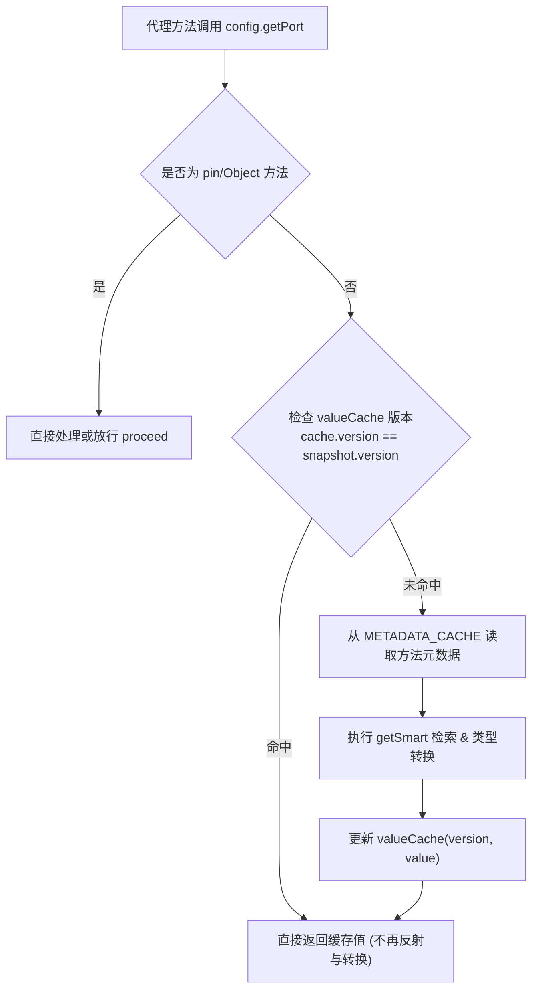

# 类型安全代理与注解

`ConfigManager` 通过 `ConfigProxyCreator` 创建实时代理，使配置访问如同操作本地普通 Java Bean 一样自然、类型安全且具备编译期检查。引入 `team4u-config-proxy` 后，唯一 ServiceLoader 实现会被自动发现；该适配器也携带普通 Java Bean 代理所需的 ByteBuddy 运行时依赖。未显式提供创建器且未引入适配器时，`createProxy` 会快速失败，不会退回绑定 POJO。

---

## 声明式注解体系

框架提供了 4 个核心注解，支持标注在类、方法或字段上：

### `@ConfigPrefix`
在配置类级别声明统一的前缀，支持与编程式前缀级联组合：

```java
import com.team4u.framework.config.core.annotation.ConfigPrefix;
import lombok.Getter;

@Getter
@ConfigPrefix("datasource.mysql")
public class MysqlConfig {
    private String url;
    private String username;
    // 最终读取的配置键为: datasource.mysql.url, datasource.mysql.username
}
```

> [!NOTE]
> 如果在 `createProxy("app", MysqlConfig.class)` 中显式传入了前缀 "app"，则最终生效前缀为 "app.datasource.mysql"。

---

### `@ConfigKey`
用于显式指定某个属性或方法的配置键名，跳过默认根据 Getter 方法名推断的逻辑：

- **相对路径**：`@ConfigKey("max-active")`，拼接到类前缀后（如 `datasource.mysql.max-active`）。
- **绝对路径（以点号 `.` 开头）**：`@ConfigKey(".global.cluster-id")`，忽略类前缀，直接匹配根路径 `global.cluster-id`。

```java
import com.team4u.framework.config.core.annotation.ConfigKey;
import com.team4u.framework.config.core.annotation.ConfigPrefix;
import lombok.Getter;

@Getter
@ConfigPrefix("server")
public class ServerConfig {

    // 相对路径：最终键为 server.custom-port
    @ConfigKey("custom-port")
    private int port;

    // 绝对路径（以 . 开头）：忽略 "server" 前缀，最终键为 global.environment
    @ConfigKey(".global.environment")
    private String env;
}
```

---

### `@ConfigRequired`
将配置项标记为必填项。

- 校验时机：在运行时调用 Getter 属性时触发。
- 触发条件：当配置源中未找到对应值，**且 JavaBean 字段没有初始默认值**（即 Getter 返回 `null`）时，立即抛出 `ConfigMissingException`。
- 若字段已赋予初始值，则当配置缺失时会优雅回退到初始值，不会抛出异常。

```java
import com.team4u.framework.config.core.annotation.ConfigRequired;
import lombok.Getter;

@Getter
public class SecurityConfig {

    @ConfigRequired
    private String apiKey; // 若未配置且初始值为 null，访问 getApiKey() 抛出 ConfigMissingException

    @ConfigRequired
    private int timeout = 3000; // 即使标记了 @ConfigRequired，缺失时仍安全返回 3000
}
```

---

### `@ConfigConverter`
针对复杂数据结构（如 JSON 对象、自定义格式字符串），指定专用的属性转换器。

- 实现 `PropertyConverter<T>` 接口（继承自 `KeyedPolicy`）。
- 内置 `JsonPropertyConverter`：利用 JSON 反序列化器将配置字符串转换为目标对象或泛型集合。

```java
import com.team4u.framework.config.core.annotation.ConfigConverter;
import com.team4u.framework.config.core.convert.JsonPropertyConverter;
import lombok.Getter;
import java.util.List;

@Getter
public class GatewayRuleConfig {

    // 将配置中的 JSON 字符串自动反序列化为 WhiteListRule 对象
    @ConfigConverter(JsonPropertyConverter.class)
    private WhiteListRule whiteList;

    @Getter
    public static class WhiteListRule {
        private List<String> ipList;
        private boolean enabled;
    }
}
```

---

## 字段初始值作为兜底默认值

框架设计的一大核心亮点是：**直接使用 JavaBean 字段的初始值作为配置缺失时的默认值**。

```java
import lombok.Getter;

@Getter
public class ThreadPoolConfig {
    private int corePoolSize = 10;   // 配置中心缺失时，默认返回 10
    private int maxPoolSize = 50;    // 配置中心缺失时，默认返回 50
    private long keepAliveTime = 60; // 默认 60 秒
}
```

### 底层原理
在 `ConfigProxyFactory` 创建代理时，会通过反射实例化一份真实的委托 Bean 实例 (`delegate`)。当拦截器从快照检索不到配置值时，会通过 `MethodInvocation.proceed()` 调用真实 Bean 的 Getter 方法，从而天然保留字段的初始值。

---

## 智能松散绑定 (Relaxed Binding)

为了兼容各种命名风格（如环境变量的大写下划线、YAML 的中划线、Properties 的点号、Java 的驼峰），框架在 `ConfigSnapshot` 构造阶段自动构建了**归一化索引** (`looseIndex`)。

归一化算法（`ConfigSnapshot.normalize`）：
```text
key -> key.toLowerCase().replace(".", "").replace("-", "").replace("_", "")
```

对于 JavaBean 属性 `maxDbConnections`，以下配置形式均能自动且无缝地精准匹配：

- `server.maxDbConnections` (标准驼峰)
- `server.max-db-connections` (Kebab-Case 中划线)
- `server.max_db_connections` (Snake-Case 下划线)
- `server.max.db.connections` (点号分隔)
- `SERVER_MAX_DB_CONNECTIONS` (环境变量风格)

### 键名冲突仲裁优先级
当多个原始键归一化后发生冲突时（例如同时存在 `app.max-connections` 与 `app_max_connections`），框架按照如下优先级仲裁获胜者：
1. 点号分隔小写键（优先级最高，如 `app.max.connections`）
2. 中划线小写键（如 `app.max-connections`）
3. 下划线小写键（如 `app_max_connections`）
4. 纯小写键
5. 其他形式

---

## 动态嵌套对象代理

若配置类中的字段为复杂对象类型（且非基本类型、String、数组、集合、Map、Optional），框架在配置缺失时会自动递归为该字段创建**子动态代理**：

```java
@Getter
@ConfigPrefix("cluster")
public class ClusterConfig {
    private String name;
    private NodeConfig master; // 自动创建前缀为 "cluster.master" 的动态代理
    private NodeConfig slave;  // 自动创建前缀为 "cluster.slave" 的动态代理
}

@Getter
public class NodeConfig {
    private String host = "127.0.0.1";
    private int port = 6379;
}
```

当访问 `clusterConfig.getMaster().getHost()` 时，内部自动检索配置键 `cluster.master.host`。

---

## 代理双模式：Live vs Pinned

通过 `ConfigManager.createProxy()` 创建的代理默认工作在 **Live Mode（实时模式）**。通过接口 `SnapshotAware.pin()` 可以将其锚定为**Pinned Mode（快照模式）**。

| 特性维度 | Live Mode (实时代理，默认) | Pinned Mode (快照锚定代理) |
| :--- | :--- | :--- |
| **底层快照源** | 每次调用均从 `ConfigManager` 获取最新的不可变快照 | 锁定调用 `pin()` 那一时刻的固定快照引用 |
| **热更新响应** | 配置更新后立即生效，全局业务无感刷新 | 后续全局快照演进不影响该实例，值绝对保持不变 |
| **一致性语义**| 最终一致（同一长流程内多次调用可能读取不同版本） |**强一致**（全流程版本锁定，彻底杜绝“撕裂读取”） |
| **适用场景** | Web API 响应、实时业务开关、网关流控、健康检查 | 长事务处理、批量数据计算、连接池/驱动初始化 |

### 最佳实践：长流程快照锚定

所有生成的代理实例均自动隐式实现了 `SnapshotAware` 接口。使用静态工具方法 `SnapshotAware.pin(proxy)` 即可完成转换：

```java
import com.team4u.framework.config.core.proxy.SnapshotAware;

public class OrderSettlementService {

    @Autowired
    private AppConfig liveConfig; // 注入的全局实时代理

    public void processLargeOrderBatch(List<Order> orders) {
        // 1. 在批处理任务入口处执行锚定，获得当前时刻的不可变快照代理
        AppConfig pinnedConfig = SnapshotAware.pin(liveConfig);

        // 2. 整个批处理循环中使用 pinnedConfig，确保上千笔订单计算规则绝对一致
        for (Order order : orders) {
            double rate = pinnedConfig.getDiscountRate();
            long maxLimit = pinnedConfig.getMaxCreditLimit();
            settleOrder(order, rate, maxLimit);
        }
    }
}
```

---

## 性能优化：两级缓存与版本失效

为了达到极致的属性读取性能，`ConfigMethodInterceptor` 采用了双层缓存架构：



1. **元数据静态缓存** (`METADATA_CACHE`)：全局缓存方法的返回类型、注解元数据与解析器，避免重复反射检索方法与字段。
2. **版本化结果缓存** (`valueCache`)：以 `Method` 为键，存储 `(version, value)` 缓存节点。在快照未发生变更时，方法调用直接命中缓存，**不再重复字符串检索与类型转换**；当发生配置热重载时，快照版本号递增，缓存即时失效并重新计算。
