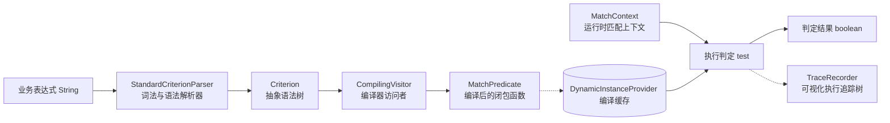

# Criterion 表达式组件 (team4u-criterion)

# 背景

在业务系统开发中，经常面临大量动态变化的判定与规则路由需求，例如：

- **营销活动与资格判定**：年龄介于 18~35、标签包含 VIP、近 30 天消费满额且在活动白名单中。
- **网关流量灰度与 A/B 分流**：按用户 ID Hash 圈选 20% 用户（带实验盐值保证正交性），或特定 App 版本号以上放行。
- **风控合规与交易拦截**：单笔交易超限、特定 IP 网段拦截、黑白名单快速排查。
- **动态业务路由与状态流转**：根据复杂的业务上下文决定下一节点走向。

传统的实现方式通常面临以下困境：

- **硬编码 `if/else`**：业务规则与核心代码深度耦合，频繁变更导致上线周期长、维护成本极高。
- **引入通用脚本引擎（如 Groovy/SpEL/Aviator）**：
  - 语法复杂度高，函数嵌套冗长，非技术或运营人员上手门槛大。
  - 性能开销显著，反射调用与频繁对象创建容易导致 GC 抖动。
  - 遇到空指针或类型不匹配容易抛出异常，缺乏生产级异常容错与降级保护。
  - 缺乏执行链路追踪，复杂组合规则未命中时难以排查究竟卡在哪一个条件。

`team4u-criterion` 是一个专为业务规则判定设计的轻量级、纳秒级、高扩展 DSL 规则引擎。它专注于“**业务规则如何极简表达、如何高效判定、如何白盒排障**”。

---

# 设计

## 设计理念

Criterion 将规则生命周期拆解为三个阶段：**DSL 词法解析 (Parsing) -> 闭包函数编译 (Compiling) -> 高并发无锁判定 (Evaluation)**。



Criterion 具备以下核心设计特色：

- **DSL 自然语义**：语法无限接近自然语言与 SQL（如 `age > 18 && status == 'ACTIVE'`，`items is not empty`，`tags contains any ['A', 'B']`）。
- **JIT 闭包直出与纳秒级执行**：解析后的 AST 会被编译为纯 Java Lambda 闭包（`MatchPredicate`），执行过程无反射、无动态解释，单次匹配仅需纳秒级别。
- **0 GC 核心路径与智能宽容比较**：内置 `ValueOptimizer`、`FastNumberUtil` 和 `ObjectCompareUtil`，在整数、浮点数原生类型比较与逻辑组合数组遍历中实现全程 0 GC，自动兼容字符串与数值比较。
- **白盒排障 (Trace)**：内置 `TraceRecorder` 与 `TraceTreeRenderer`，可生成树状可视化执行日志，精确展示每个子条件的入参、预期与命中状态（`[Y]` / `[N]`）。
- **按需延迟解析 (Lazy Resolve)**：支持结合 `LazyAttributeResolver` 延迟拉取 RPC 或数据库属性，配合逻辑短路规则，避免不必要的外部网络调用。
- **默认容错机制**：生产环境下字段缺失或类型异常默认返回 `false` 并记录日志，不阻断主业务链路；亦可按需开启严格模式（`strictMode`）。

---

## 核心概念

| 概念 | 说明 |
| :--- | :--- |
| `Criteria` | 规则引擎核心门面，提供 `matches`、`parse`、`trace`、`getVariables`、`compileExpression` 等统一接口，线程安全且单例复用 |
| `CriterionBootstrap` | 全局引导配置类，提供全局算子、转换器及编译器的统一注册入口与锁定机制（`lock`） |
| `MatchContext` | 运行时匹配上下文（非线程安全，单次请求独立），持有实际值对象（`actual`）、动态变量 Map（`attributes`）、延迟解析器与追踪器 |
| `Criterion` | 抽象语法树（AST）节点基类，代表一个可判定的规则单元 |
| `MatchPredicate` | 函数式匹配谓词接口，即 AST 编译后可直接调用的执行闭包（`context -> boolean`） |
| `CriterionParser` | 表达式解析器接口，负责将 DSL 文本解析为 `Criterion` 语法树（默认实现为 `StandardCriterionParser`） |
| `SyntaxHandler` | 语法处理器接口，负责特定 DSL 语法的词法识别与 AST 节点构建 |
| `CriterionCompiler<T>` | 针对特定 `Criterion` 节点的编译器，负责将 AST 节点转换为 `MatchPredicate` 闭包 |
| `CompilerRegistry` | 编译器注册中心，集中管理所有 AST 节点的编译策略 |
| `ValueConverter` | 类型转换器 SPI 接口，负责属性在比较前的前置转换（如 `:date`、`:size`、`:version`、`:number`、`:string`） |
| `TraceNode` / `TraceRecorder` | 执行追踪节点与记录器，记录表达式执行路径与子节点命中状态 |
| `LazyAttributeResolver` | 延迟属性解析器，按需加载外部属性，配合短路逻辑最大化吞吐量 |

---

## 内置语法特性一览

| 语法类型 | DSL 语法示例 | 说明 |
| :--- | :--- | :--- |
| **关系比较** | `age >= 18`，`status != 'CANCEL'` | 关系比较（`==`、`=`、`!=`、`>`、`>=`、`<`、`<=`），支持数值宽容比较 |
| **逻辑运算** | `age > 18 && (vip == true \|\| score >= 90)` | 支持逻辑与（`&&`）、逻辑或（`\|\|`）、括号优先级与短路求值 |
| **区间范围** | `age between [18, 60]`，`score between (60, 100]` | 数值与版本区间判定，`[]` 闭区间，`()` 开区间 |
| **集合包含** | `status in ['PAID', 'SUCCESS']` | 判断目标值是否在指定常量集合或动态变量集合内 |
| **容器包含** | `tags contains 'VIP'`，`roles contains all ['A', 'B']` | 判断集合/数组是否包含特定元素、包含全部（`containsAll`）或任一（`containsAny`） |
| **空值与存在性** | `address is null`，`items is not empty` | 判断目标对象是否为 null，或集合/字符串是否为空（`is null`, `is not null`, `is empty`, `is not empty`） |
| **概率灰度** | `it prob 0.3` | 按照指定浮点概率随机命中（如 `0.3` 表示 30% 概率） |
| **哈希分流** | `userId hash 0.2` | 基于目标字段 Hash 取模（MurmurHash64）实现稳定一致性灰度分流，支持盐值（`salt`） |
| **正则与通配** | `email =~ '.*@example\\.com$'`，`name like 'J*'` | 正则表达式匹配（`=~` / `regex`）与 AntPath 通配符匹配（`like`） |
| **极简语法糖** | `18`，`'SUCCESS'` | `18` 等价于 `it == 18`；`'admin'` 等价于 `it == 'admin'` |
| **类型转换器** | `createTime:date > '2023-01-01'`，`followers:size > 1000` | 支持 `:date`、`:size`、`:version`、`:number`、`:string` 前置转换 |
| **动态变量** | `age >= $minAge && userLevel in $allowedLevels` | 以 `$` 开头的变量自动从 `MatchContext` 的 attributes 中获取 |

---

## 组件位置与包结构

```text
com.team4u.framework.criterion
├── compiler                     # 编译器与 JIT 闭包生成 (CompilerRegistry, CompilingVisitor, ValueOptimizer)
│   └── impl                     # 各 AST 节点的内置编译器实现 (BetweenCriterionCompiler, InCriterionCompiler, HashProbabilityCriterionCompiler 等)
├── model                        # 抽象语法树 AST 模型 (Criterion, LogicCriterion, InCriterion 等)
│   ├── convert                  # 类型转换器 (ValueConverter, DateValueConverter, VersionValueConverter 等)
│   └── value                    # 固定值与动态变量模型 (FixedValue, VariableValue, ValueFactory)
├── parser                       # 词法与语法解析器 (StandardCriterionParser, CharTokenScanner, CriterionKeywords)
│   ├── handler                  # 各语法处理器 (BetweenSyntaxHandler, InSyntaxHandler, HashProbabilitySyntaxHandler 等)
│   └── token                    # 词法 Token 与 TokenType 定义
├── trace                        # 执行链路追踪器与树状渲染 (TraceRecorder, TraceNode, TraceTreeRenderer)
├── util                         # 0 GC 高性能数值与对象比较工具 (FastNumberUtil, ObjectCompareUtil, CriterionCollectionUtil)
├── Criteria.java                # 规则引擎核心门面与 Builder
├── CriterionBootstrap.java       # 全局引导配置与安全锁
├── LazyAttributeResolver.java   # 延迟加载属性解析器
└── MatchContext.java            # 运行时匹配上下文
```

---

## 与其他组件联动

- **[路由组件](../router/README.md)**：`team4u-router` 内置的 `ExpressionRouter` 直接基于 Criterion 运行。
- **[配置组件](../config/README.md)**：DSL 规则文本可下发至统一配置中心，配合变更监听实现运行时热生效。
- **[日志治理组件](../log/README.md)**：`team4u-log` 的动态染色规则基于 Criterion DSL 进行条件过滤。

---

## 文档导航

- [快速开始](quick-start.md)：从引入依赖到执行一次规则判定与可视化 Trace
- [DSL 语法指南](criterion-syntax.md)：全量运算符、组合逻辑、动态变量与类型转换器详解
- [编译与 0 GC 优化](criterion-compiler.md)：AST 闭包编译原理、ValueOptimizer 0 GC 优化、MurmurHash64 盐值分流与属性延迟加载
- [执行链路追踪 Trace](criterion-trace.md)：TraceNode 节点结构、控制台可视化输出与排障实践
- [扩展机制与 SPI](criterion-extension.md)：自定义操作符、转换器、语法处理器与编译器 SPI
- [实战案例](criterion-sample.md)：营销圈选、网关灰度、风控拦截与微服务延迟加载实战
