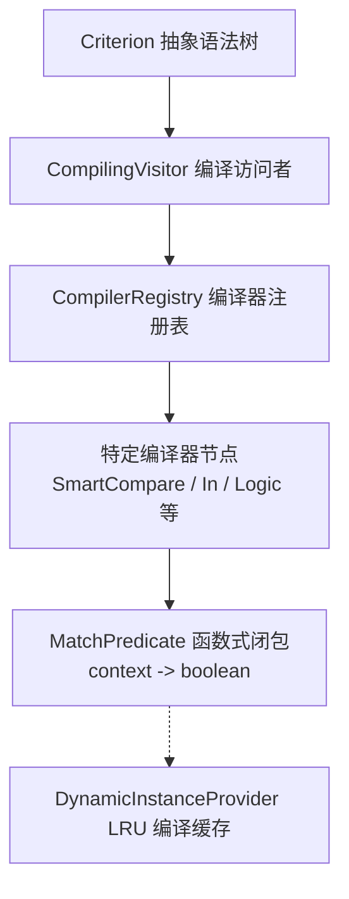

# 编译与 0 GC 优化

Criterion 区别于传统解释型表达式引擎的核心特征在于：**JIT 闭包预编译与核心判定路径的 0 GC 设计**。

---

## 闭包编译机制



1. **AST 预优化**：在解析阶段，静态常量、正则表达式等在编译期完成类型推断与预编译（例如 `Pattern.compile`、常量折叠与静态 Set 分拣）。
2. **直出闭包函数**：AST 节点被转换为纯 Java `MatchPredicate`（函数式接口 `context -> boolean`），运行期直接调用函数式方法，无任何反射与字符串解析开销。
3. **编译缓存**：内部基于 `DynamicInstanceProvider` 构建默认容量为 1000 的 LRU 编译缓存，同一个表达式文本仅在首次加载时编译一次。

---

## 0 GC 极速路径与性能优化细节

在大规模高并发的核心网关、推荐分流与支付交易链路中，规则判定引擎的临时对象创建（如 `BigDecimal`、`Iterator`、装箱对象）会引发频繁的 Minor GC 停顿。Criterion 在底层做了极其精细的 0 GC 优化：

### `ValueOptimizer` 编译期值优化器
针对规则中的预期值（如 `age > 18` 中的 `18`），`ValueOptimizer` 会在编译期窥探其类型：
- **静态常量优化 (`FixedValue`)**：在编译期提前完成类型转换并常驻内存。生成的 `CompiledValue` 闭包在运行时**直接返回常量引用**，零计算分支、零对象分配。
- **静态集合预构建 (`optimizeToSet`)**：对于 `in ['A', 'B', 'C']` 或 `containsAll`，若所有元素均为字面常量，编译器在编译期直接构建好不可变的静态 `HashSet`，避免运行期每次匹配时重复创建集合。

### `FastNumberUtil` 与原生类型极速比对
`SmartCompareCriterionCompiler` 内置了原生类型极速分支：
- **原生 Long 比较**：当预期值是整数常量（如 `18`），编译器直接生成 `buildStaticLongPredicate` 闭包。若运行时实际入参也是整数，直接执行 `Long.compare(actualNum.longValue(), constantLong)`，**全程 0 装箱、0 临时对象分配**。
- **原生 Double 比较**：当预期值是浮点数常量，编译器直接生成 `buildStaticDoublePredicate` 闭包执行 `Double.compare`。
- **彻底消除 `BigDecimal` 堆分配**：相比传统引擎使用 `BigDecimal` 进行宽容比对，Criterion 原生数值比对性能提升数倍且无 GC 负担。

### `LogicCriterionCompiler` 消除迭代器分配
在编译 `&&` 与 `||` 组合逻辑时，编译器在编译期将子规则列表转换为原生数组 `MatchPredicate[]`。运行时遍历数组比遍历 `List` 更快，且**完全避免了 `Iterator` 迭代器对象的内存分配**。

### `HashProbabilityCriterionCompiler` 64 位哈希分流
Hash 分流采用高离散度的 **MurmurHash64** 算法：
$$\text{scale} = \frac{(\text{HashUtil.murmur64}(\text{salt} + \text{actual}) \ \& \ \text{Long.MAX\_VALUE}) \pmod{10000}}{10000.0}$$
- **纳秒级运算**：直接基于字节数组进行位运算。
- **盐值正交性 (`salt`)**：通过 `context.getAttribute("salt", "")` 获取实验盐值，确保不同业务开关与实验之间流量正交独立。

---

## 属性延迟加载 (Lazy Resolve)

在很多复杂业务规则中，某些属性需要发起昂贵的 RPC 调用或数据库查询（例如：查询用户的风控黑名单状态、查询累计积分）。

借助逻辑短路（`&&`）与 `LazyAttributeResolver`，如果前面的简单条件不满足，后续昂贵属性将**永远不会被触发加载**：

```java
import com.team4u.framework.criterion.Criteria;
import com.team4u.framework.criterion.LazyAttributeResolver;
import com.team4u.framework.criterion.MatchContext;

User user = new User(10086, "Alice", 25);
MatchContext context = MatchContext.of(user);

// 声明式注册延迟解析器
LazyAttributeResolver resolver = new LazyAttributeResolver()
        .register("inBlacklist", () -> queryRiskServiceFromRemote(user.getId()))
        .register("creditScore", (ctx, key) -> queryCreditScoreFromDb(user.getId()));

// 正确绑定属性解析器
context.setAttributeResolver(resolver);

// 执行匹配：若 age >= 18 不满足，后面的 $inBlacklist 与 $creditScore 绝不会发起远程调用！
boolean match = Criteria.global().matches(
        "age >= 18 && $inBlacklist == false && $creditScore > 650",
        context
);
```

---

## 容错模式与严格模式 (Strict Mode)

- **默认安全容错模式**：生产环境中，若入参缺少属性、发生 null 指针或格式转换异常，引擎会打印 warn 日志并安全返回 `false`，绝不会阻断业务主链路。
- **严格模式 (`withStrictMode(true)`)**：在开发测试或必须强校验的合规场景下，可以开启严格模式，遇到异常时直接抛出 `CriterionEvaluationException`：

```java
MatchContext context = MatchContext.of(user).withStrictMode(true);
```

---

## 表达式预热 (Pre-warming)

为了消除首次执行匹配时的毫秒级 JIT 编译抖动，建议在服务启动或配置更新推送时调用 `compileExpression` 预热缓存：

```java
public void onConfigReceived(List<String> expressions) {
    for (String expr : expressions) {
        Criteria.global().compileExpression(expr);
    }
}
```
