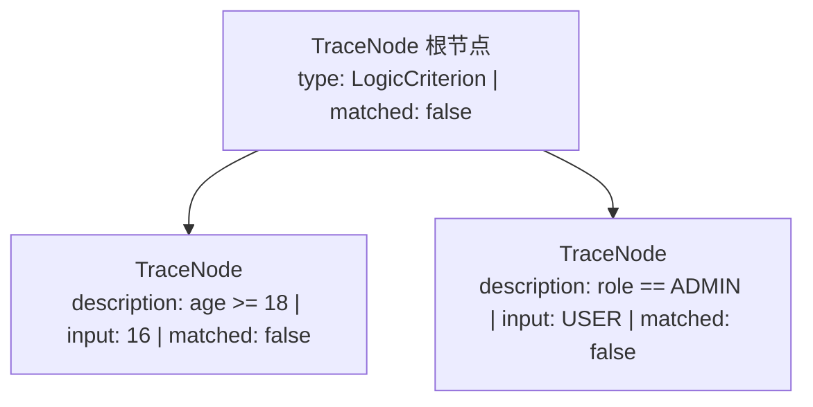

# 执行链路追踪 Trace

在线上复杂的组合规则中，当规则评估为 `false` 时，传统的黑盒引擎无法告知究竟是哪一个子条件未满足。`team4u-criterion` 内置了白盒执行链路追踪系统。

---

## 追踪核心模型



### `TraceNode` 节点结构

| 字段 | 类型 | 说明 |
| :--- | :--- | :--- |
| `type` | `String` | AST 节点类型（对应 Criterion 实现类的 SimpleName，如 `PropertyCriterion`, `LogicCriterion`） |
| `description` | `String` | 节点规则描述（如 `age >= 18`，`role == 'ADMIN'`） |
| `input` | `Object` | 运行时从上下文提取并传入当前节点的实际输入值（`actual`） |
| `matched` | `boolean` | 当前节点判定结果（`true` / `false`） |
| `children` | `List<TraceNode>` | 子节点追踪列表（如组合逻辑展开的子分支） |
| `criterion` | `Criterion` | 原始 AST 规则对象（transient 修饰） |

### `TraceTreeRenderer` 树状渲染器

`TraceTreeRenderer` 负责将多层嵌套的 `TraceNode` 结构渲染为直观的紧凑字符串。

- **逻辑合并**：对 `PropertyCriterion` 且只有一个比较子节点的场景自动合并，消除冗余层级，输出如 `age >= 18 {16}[N]`。
- **状态符号**：`[Y]` 表示当前节点满足（Yes），`[N]` 表示不满足（No）。
- **短路可视化**：因逻辑与（`AND`）或逻辑或（`OR`）导致未执行的后续节点不会出现在 Trace 树中，直观反映运行时的短路路径。

---

## Trace 使用示例

```java
import com.team4u.framework.criterion.Criteria;
import com.team4u.framework.criterion.MatchContext;
import com.team4u.framework.criterion.trace.TraceNode;

import java.util.HashMap;
import java.util.Map;

public class TraceDemo {

    public static void main(String[] args) {
        Map<String, Object> params = new HashMap<>();
        params.put("age", 16);
        params.put("role", "USER");
        params.put("score", 95);

        MatchContext context = MatchContext.of(params);
        String expression = "age >= 18 && (role == 'ADMIN' || score > 90)";

        // 执行 Trace 判定
        TraceNode root = Criteria.global().trace(expression, context);

        System.out.println("最终判定: " + root.isMatched()); // false
        System.out.println("追踪轨迹: " + root.render());
    }
}
```

### 控制台轨迹输出分析

```text
最终判定: false
追踪轨迹: (age >= 18 {16}[N] AND (role == 'ADMIN' {"USER"}[N] OR score > 90 {95}[Y])[Y])[N]
```

- `{16}[N]`：表示 `age >= 18` 节点的实际输入为 `16`，判定结果为不匹配 (`[N]`)。
- `{"USER"}[N]`：表示 `role == 'ADMIN'` 不匹配。
- `{95}[Y]`：表示 `score > 90` 实际输入为 `95`，判定为匹配 (`[Y]`)。
- 整个 `AND` 逻辑因左侧 `age >= 18` 为 `[N]` 发生短路，最终产出 `[N]`。

---

## 排障与线上监控集成

在风控拦截、营销排查或灰度分流系统中，可以将未命中的 Trace 文本直接记录到日志或返回给排障控制台：

```java
TraceNode trace = Criteria.global().trace(ruleExpression, userContext);
if (!trace.isMatched()) {
    log.info("用户未命中权益圈选规则, trace: {}", trace.render());
}
```
