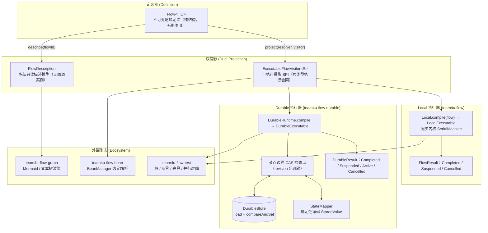

# 轻量化流程组件 (team4u-flow)

# 背景

在订单履约、支付结算、逆向退款、复杂审批流与数据清洗等业务场景中，流程通常由一系列线性转换、条件分支、外部交互与补偿清理逻辑组成。传统的实现方式通常面临以下困境：

- **大单体 Service / 脚本方法**：业务逻辑、RPC 调用、异常捕获与状态回滚深度耦合在单一方法中；步骤难以独立测试与 Mock，局部修改极易产生意外副作用。
- **重型工作流引擎（BPMN / 反射式 DSL）**：引入庞大依赖、表结构与运行时容器；强类型退化为 `Object` 与字符串反射，丢失编译期类型安全；启动慢、调用栈深，内存级同步编排成本过高。
- **单机同步与持久化恢复割裂**：本地执行与跨进程崩溃恢复通常是不兼容的两套 API；单机验证后若需增加检查点，往往需要重写流程逻辑。
- **布尔与异常承载分支语义过载**：“成功产出 / 业务拒绝 / 无适用分支 / 技术失败”被压缩成 `boolean`、`null` 或 `RuntimeException`，无法在类型层面区分“正常业务拒绝”与“技术故障”。
- **容器与依赖注入割裂**：纯 Lambda 编排难以直接注入 Spring 托管的 DAO、RPC 客户端与事务切面；反射动态查找又带来性能损耗与类型退化。

`team4u-flow` 是一个专为业务流程设计的轻量级、强类型流程编排组件，提供类型安全的流水线编排、无缝的容器集成与统一的崩溃恢复支持。

---

# 设计

## 设计理念

`team4u-flow` 采用“**不可变定义 -> 双投影编译 -> 多执行器驱动**”的架构设计。流程定义（`Flow<I, O>`）纯粹描述拓扑结构，本身不可执行；同一份定义既可投影为高性能内存同步执行器（`Local`），也可投影为支持断点续跑的持久化执行器（`Durable`）。

---

## 核心特性

- **Bean 一等公民**：节点原生支持 `Class<? extends Operation>` 与可选限定符；编译期一次性解析绑定容器单例，运行期直接调用无反射，Spring 事务与 AOP 切面代理完整保留。
- **一个定义，两种执行器**：
  - **Local 同步执行**：`Local.compile(flow).run(input)` 内存驱动，零序列化与持久化开销，挂起、取消、并行、超时全部可用。
  - **Durable 崩溃恢复**：`DurableRuntime.compile` 在节点边界以 CAS 乐观锁自动提交检查点，进程重启后 `recover` 从最后快照断点续跑。
- **强类型流水线与不可变定义**：步骤输入输出严格推导（`A -> B -> C`），类型不匹配在编译期报错；组合方法全部返回新 `Flow` 实例，定义天然线程安全。
- **四态业务结果与执行生命周期分层**：业务层通过 `Outcome<T>`（`Accepted` / `Rejected` / `Skipped` / `Failed`）明确语义，仅 `Accepted` 携带输出；执行层通过 `FlowResult<O>` / `DurableResult<O>` 表达生命周期状态。
- **可选步骤透传原值**：`thenOptional` 声明可选步骤，节点弃权返回 `Skipped` 时自动透传步骤入口原值继续执行，无需伪装为 `Accepted`。
- **零 Lambda 序列化与确定性幂等键**：Durable 快照仅保存框架元数据与编码后的 `StoredValue` 槽位，绝不序列化代码或 Lambda；每个节点注入稳定幂等键 `invocationId`（`flowId:flowVersion:executionId:path`），解决外部副作用幂等难题。
- **扩展点开放，运行时节点封闭**：业务步骤（`Operation`）、治理策略（`Policy` / `PersistentPolicy`）、并行合并（`JoinStrategy`）与容器解析（`OperationResolver`）开放扩展；运行时计划封闭为八种核心节点，语义清晰可控。
- **零外部运行时依赖**：核心模块仅依赖 JDK，架构轻量纯粹。

---

## 模块划分与包结构

| Maven 坐标 (`com.team4u`) | 定位 | 依赖说明 |
| :--- | :--- | :--- |
| `team4u-flow` | 核心模块：Flow DSL、四态 Outcome、Local 执行器、并行与挂起机制 | 仅依赖 JDK |
| `team4u-flow-durable` | 持久化模块：Durable 执行器、快照信封、StateMapper、CAS 检查点与恢复 | 依赖 `team4u-flow` |
| `team4u-flow-durable-kv` | KV 存储适配模块：基于 `KvStore` 与 CAS 乐观锁的持久化快照存储实现 (`KvDurableStore`) | 依赖 `team4u-flow-durable`、`team4u-kv`、`team4u-serializer-json` |
| `team4u-flow-ratelimiter` | 限流治理适配模块：基于 `team4u-ratelimiter` 的开箱即用限流策略（`RateLimitPolicy`） | 依赖 `team4u-flow`、`team4u-ratelimiter` |
| `team4u-flow-retry` | 重试治理适配模块：基于 `team4u-retry` 的多算法退避、条件重试与动态规则适配器（`FlowRetryPolicy`） | 依赖 `team4u-flow`、`team4u-retry` |
| `team4u-flow-graph` | 可视化模块：Mermaid 流程图与紧凑文本树渲染器 | 依赖 `team4u-flow`（仅描述面） |
| `team4u-flow-bean` | 容器集成模块：BeanManager 容器绑定解析器，保留 AOP 与代理 | 依赖 `team4u-flow`、`team4u-bean` |
| `team4u-flow-test` | 测试支持模块：桩对象、Trace 收集器、断言库与测试夹具 | 依赖 `team4u-flow`、JUnit |

---

## 完整章节导航与主题专栏

为了便于深入研读，组件文档按照语义层级、控制治理、持久化以及工程运维拆分为独立专章：

### 1. 入门与概览
- [快速开始 (Quick Start)](quick-start.md)：5 分钟体验流水线编排、条件路由、挂起恢复与持久化断点续跑。

### 2. 核心语义与模型
- [四态业务结果与生命周期模型](flow-outcome.md)：深入剖析 `Outcome<T>` 四态闭集、`Reason` / `Failure` 诊断值对象、`Outcome.map` 映射与 `FlowResult` / `DurableResult` 执行生命周期。
- [四态传播规则与消费机制](flow-propagation.md)：顺序流水线短路机制、`Skipped` 弃权的三大消费场景（`thenOptional` / `firstApplicable` / `route`）与 `recoverWith` 补偿。
- [运行时节点与 DSL 编排原语](flow-nodes.md)：8 种封闭运行时节点（`INVOKE`, `SEQUENCE`, `ROUTE`, `FALLBACK`, `PARALLEL`, `AWAIT`, `CONTROL`, `COMPLETE`）与 AST 降级编译。
- [核心语义全景总览](flow-semantics.md)：核心机制全景摘要与快速索引。

### 3. 控制与治理
- [流程治理：Policy 策略、Retry 重试与 Timeout 控制](flow-governance.md)：无状态 `Policy<K>` 网关拦截、指数退避重试与幂等键继承、`Timeout` 作用域超时与洋葱圈嵌套顺序。
- [并行分支与汇合治理](flow-parallel.md)：`parallel` 并发执行、四大内置 `JoinStrategy`、True Wait-All 退出合同与 Local/Durable 调度差异。
- [挂起续接与协作式取消合同](flow-suspend.md)：`await` 与 `ResumePoint`、Local 单次消费句柄 `Suspension`、`Cancellation` CAS 取消令牌与竞态防御。
- [Local 线程模型与死锁防御机制](flow-threading.md)：Dispatcher 与 Worker 双线程池分工、`ForkJoinPool` 工作窃取补偿与两级静态死锁防御规则。

### 4. 容器与持久化
- [Bean 容器集成与 Spring 治理](flow-bean.md)：声明式 Class 与限定符绑定、`BeanOperationResolver` 编译期解析、Spring `@Transactional` 与 AOP 代理无损保留。
- [Durable 状态机与 CAS 检查点机制](flow-durable-core.md)：Durable 核心架构、命令集、节点边界 CAS 检查点、`revision` 乐观锁、版本强隔离与 `invocationId` 稳定幂等键。
- [Durable 两段式恢复协议与 PersistentPolicy](flow-durable-resume.md)：挂起恢复两阶段 CAS 提交、崩溃重放与信号冲突防御、`PersistentPolicy` 状态持久化与 `WaitUntil`/`RetryAt` 定时唤醒。
- [快照存储结构与 StateMapper 编解码](flow-durable-snapshot.md)：`DurableSnapshot` 槽位布局、`StateMapper` 确定性编解码契约与 Jackson 生产配置。
- [DurableStore 存储 SPI 与 KV 适配](flow-durable-kv.md)：`DurableStore` SPI 契约、`InMemoryDurableStore` 与基于 `team4u-kv` 的 `KvDurableStore` 多存储后端适配。
- [Durable 持久化全景总览](flow-durable.md)：Durable 执行器设计与使用全景摘要。

### 5. 运维与工程化
- [可视化图表渲染与双投影架构](flow-graph.md)：双投影架构、`FlowDescription` 只读描述模型、Mermaid 6 通道流程图与紧凑文本树渲染。
- [测试支持与测试套件](flow-test.md)：`FlowAssertions` 流畅断言库、`OperationStub`/`PolicyStub` 桩对象、`ParallelBarrier` 并发同步屏障与测试夹具。
- [诊断码体系与故障排查手册](flow-diagnostics.md)：运行时 Failed 失败码、Skipped 弃权码、编译期校验码与 Durable 异常排查自查清单。
- [扩展机制与 SPI 开发指南](flow-extension.md)：自定义 Operation、Policy、JoinStrategy、OperationResolver、Observer、StateMapper 与 DurableStore。
- [实战案例库与生产模式](flow-sample.md)：电商订单履约全链路、风控校验与动态规则路由、多支付降级重试与跨系统异步审批恢复实战。
