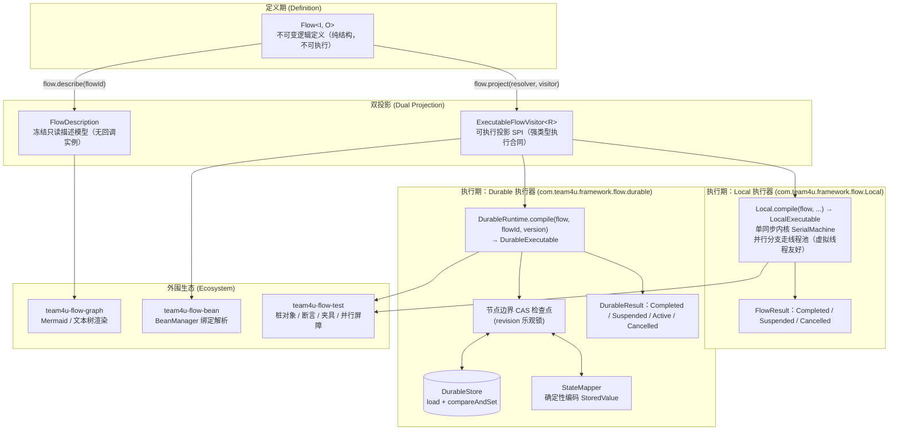

# 轻量化类型化流程组件 (team4u-flow)

# 背景

在企业级业务系统开发中，诸如**订单履约**、**支付结算**、**逆向退款**、**复杂数据清洗**等业务场景，天然由一系列线性转换、条件分支、外部交互与补偿清理逻辑组成。

传统的实现方式通常面临以下困境：

- **大单体 Service / 脚本方法模式**：
  - 业务逻辑、第三方 RPC 调用、异常捕获与状态回滚深度交织在一个庞大的方法中。
  - 单个步骤难以独立进行单元测试与 Mock，修改局部逻辑极易产生意外副作用。
- **引入重型工作流/流程引擎（如 BPMN / 反射式 DSL 引擎）**：
  - 引入庞大的第三方依赖、数据库表结构和复杂的运行时容器。
  - 强类型在引擎内部退化为 `Object`、`Map<String, Object>` 或动态字符串反射调用，丢失全部编译期类型安全与重构支持。
  - 启动慢、调用栈深、性能开销大，在常规内存级同步编排中往往"杀鸡用牛刀"。
- **内存同步编排与分布式持久化恢复机制割裂**：
  - 本地单机同步执行与跨进程崩溃恢复通常采用完全不兼容的两套 API。
  - 业务在单机验证完毕后，若需增加检查点恢复，往往需要推翻重写整个流程逻辑。
- **布尔与异常承载业务分支语义过载**：
  - "成功产出 / 业务拒绝 / 无适用分支 / 技术失败"被压缩成 `boolean`、`null` 或 `RuntimeException`，调用方无法在类型层面区分"正常拒绝"与"需要告警的故障"。
- **容器与依赖注入割裂**：
  - 纯函数/Lambda 式编排在真实业务中难以直接注入 Spring 托管的 DAO、RPC 客户端与事务切面；而传统工作流的反射动态查找又带来严重的性能损耗与类型退化。

`team4u-flow` 是一个专为 Java 业务流编排设计的轻量级、强类型流程组件，采用**新版四态类型化 Flow**方案回应上述痛点：

- **Bean 是一等公民**：Flow DSL 原生支持以 `Class` 与 `qualifier`（Spring Bean 名称）进行声明式编排；在编译期一次性解析绑定容器单例，运行期零反射损耗，Spring AOP 代理与事务切面原样保留。
- **一个不可变定义，两种执行器**：逻辑 `Flow<I, O>` 只描述结构、本身不可执行；同一份定义既可投影为 `Local` 同步执行器，也可投影为 `Durable` 持久化执行器，无需改写业务代码。
- **四态 Outcome 类型化结果**：`Accepted`（携值成功）、`Rejected`（业务拒绝）、`Skipped`（弃权/跳过）、`Failed`（执行失败）严格闭集，仅 `Accepted` 携带输出，分支语义不再依赖布尔与异常约定。
- **零 Lambda 序列化**：Durable 快照只保存框架元数据与编码后的 `StoredValue` 槽位，绝不序列化 Java 代码、Operation 实例或 Lambda 表达式。
- **确定性幂等调用键**：每个节点注入 `flowId:flowVersion:executionId:path` 格式的 `invocationId`，在重试与崩溃恢复重放时保持稳定，直击外部副作用幂等难题。

---

# 设计

## 核心架构



## 核心设计特色

- **Bean 是一等公民与 Spring 无缝集成**：
  - 编排节点原生支持以 `Class<? extends Operation>` 与可选限定符（Spring Bean 名称）声明；编译期一次性解析绑定，运行期零反射查找开销；Spring `@Transactional`、AOP 代理拦截完整保留。
- **一个定义，两种执行器**：
  - Local 极速执行：`Local.compile(flow).run(input)` 同步驱动，零序列化、零持久化开销；挂起、取消、并行、超时全部可用。
  - Durable 崩溃恢复：`DurableExecutable.start(executionId, input)` 在节点边界 CAS 落检查点，进程重启后 `recover` 从最后提交的快照续跑。
- **强类型流水线与不可变定义**：
  - 步骤前后输入输出严格推导（`A -> B -> C`），类型不匹配在编译期报错；所有组合方法返回新的 `Flow` 实例，定义天然线程安全。
- **四态业务结果 + 三态执行结果分层**：
  - 业务层 `Outcome<T>`：Accepted / Rejected / Skipped / Failed，仅 Accepted 携带输出。
  - 执行层 `FlowResult<O>`：Completed（携带最终 Outcome）/ Suspended（携带续接句柄）/ Cancelled（仅保留 executionId）。
- **扩展点开放，运行时节点封闭**：
  - `Operation`、`Policy`、`PersistentPolicy`、`JoinStrategy` 是扩展点；运行时计划封闭为八种节点，不提供自定义节点。
- **零运行时依赖边界**：
  - 核心模块 `team4u-flow` 仅依赖 JDK（Java 8+），通过 Maven Enforcer 禁止引入第三方运行时依赖。

---

# 核心概念

| 概念 | 说明 |
| :--- | :--- |
| `Flow<I, O>` | 不可变逻辑流程定义；只描述结构，需经 `Local` / `DurableRuntime` / `BeanFlows` 编译后才可执行 |
| `Bean 绑定` | 以 `Class` 与 `qualifier` 声明节点，编译期由 `OperationResolver` 从 Spring/Bean 容器一次性解析为单例 Bean |
| `BeanFlows` | `team4u-flow-bean` 提供的门面工具，一行代码完成基于 `BeanManager` 的流编译 (`BeanFlows.compile(flow)`) |
| `Operation<I, O>` | 业务步骤扩展点：`(OperationContext, I) -> Outcome<O>`，同步、可复用、线程安全 |
| `Outcome<T>` | 业务四态闭集：`Accepted(value)` / `Rejected(Reason)` / `Skipped(Reason)` / `Failed(Failure)`，仅 Accepted 携带输出 |
| `Reason` | 业务拒绝/弃权的稳定诊断信息：`code`（稳定业务码）、`message`、`details` |
| `Failure` | 执行失败的稳定诊断信息：`code`、`message`、`details`；异常统一转 `OPERATION_EXCEPTION` / `TIMEOUT` 稳定码 |
| `FlowResult<O>` | Local 执行三态闭集：`Completed(outcome)` / `Suspended(suspension)` / `Cancelled(executionId)` |
| `Suspension<O>` | Local 挂起续接句柄，不透明、单次消费，仅可由产生它的 `LocalExecutable` 恢复 |
| `ResumePoint<R>` | 类型化挂起点标识，name 在同一 Flow 内唯一；恢复信号类型 `R` 由其承载 |
| `Policy<K>` | 无状态可重放网关扩展点：`before -> Gate(Proceed/Reject/Fail)`，`after` 默认空实现 |
| `PersistentPolicy<K, S>` | 状态由框架持久化的控制策略：before 闭集 `Proceed/WaitUntil/Reject/Fail`，after 闭集 `Return/RetryAt` |
| `JoinStrategy<O>` | Parallel wait-all 汇合后的显式合并扩展点：`(ParallelResults) -> Outcome<O>` |
| 八节点 Kind | 运行时计划封闭为 `INVOKE / SEQUENCE / ROUTE / FALLBACK / PARALLEL / AWAIT / CONTROL / COMPLETE` |
| `Cancellation` | 协作式取消令牌：CAS 置位 + 中断绑定线程 + 父子级联；Parallel 采用 true wait-all 退出保证 |
| `invocationId` | 节点幂等键，格式 `flowId:flowVersion:executionId:path`；重试与恢复重放时保持稳定 |
| `FlowDescription` | 纯只读结构描述模型，不含任何回调实例；graph 模块唯一依赖的结构面 |
| `ExecutableFlowVisitor<R>` | 可执行投影 SPI：遍历已校验、已解析绑定的运行时计划，暴露强类型执行合同 |
| `DurableRuntime` | 持久化运行时：持有 store / stateMapper / observer，把 Flow 编译为 `DurableExecutable` |
| `DurableExecutable<I, O>` | 绑定 `(flowId, flowVersion)` 的可恢复执行入口：`start/resume/recover/cancel/snapshot` |
| `DurableStore` | 快照存储 SPI：`load` + `compareAndSet(expectedRevision, update)`，`expectedRevision=-1` 表示不存在才创建（含内置 `InMemoryDurableStore`） |
| `DurableSnapshot` | 快照信封：仅框架元数据（lifecycle、revision、frame 元数据）+ 编码后的 `StoredValue` 槽 |
| `StateMapper` | 应用状态编解码 SPI：`encode/decode`，须满足确定性契约（同一值多次编码结果 `equals` 相等）；默认 `DefaultStateMapper` 仅支持标量/byte[]/Instant |
| `DurableResult<O>` | Durable 命令结果闭集：`Completed(outcome)` / `Suspended(resumePoint)` / `Active(wakeAt)` / `Cancelled` |

> **提示**：节点 `path`（如 `$/1/selector`）用于单次编译产物内的观测、断言与图渲染定位，框架不承诺 path 在 Flow 结构变更或跨版本间保持稳定，不要将其持久化或用于跨版本比对。

---

# 模块划分

| Maven 坐标 (`com.team4u`) | 定位 | 依赖 |
| :--- | :--- | :--- |
| `team4u-flow` | 核心：类型化 Outcome/Flow DSL、sealed 运行时计划、同步内核、Local 投影、Policy/并行/挂起/观察者 | 仅 JDK |
| `team4u-flow-durable` | Durable 投影：快照信封、StateMapper、revision CAS 检查点与恢复 | `team4u-flow` |
| `team4u-flow-graph` | 结构渲染：`FlowGraphs.mermaid()/text().render(FlowDescription)` | `team4u-flow`（仅静态描述面） |
| `team4u-flow-bean` | 容器绑定：`BeanFlows.compile` / `BeanOperationResolver`，从 `BeanManager` 解析 class+qualifier 绑定，代理原样保留 | `team4u-flow`、`team4u-bean` |
| `team4u-flow-test` | 测试支持：`OperationStub`、`PolicyStub`、`TraceCollector`、`FlowAssertions`、Local/Durable 夹具、`ParallelBarrier` | `team4u-flow`、`team4u-flow-durable`、JUnit |

依赖始终保持单向：durable 依赖 core；graph/bean/test 只依赖各自声明的下层模块，绝不反向依赖。

## 组件位置

```text
modules/flow
├── core    (com.team4u:team4u-flow, 包 com.team4u.framework.flow)
│   ├── Flow.java                # 不可变类型化 DSL（step/then/use/route/parallel/await/policy/retry/timeout）
│   ├── Outcome.java             # 业务四态闭集
│   ├── FlowResult.java          # Local 执行三态闭集
│   ├── Local.java               # Local 投影入口
│   ├── LocalExecutable.java     # 同步/异步 run 与 resume、Suspension 归属校验
│   ├── Operation/Policy/PersistentPolicy/JoinStrategy   # 扩展点
│   ├── Compiler/PlanNode        # sealed 运行时计划（八节点）
│   ├── SerialMachine            # 单同步内核（一帧栈一驱动）
│   └── ExecutableFlowVisitor    # 可执行投影 SPI
├── durable (com.team4u:team4u-flow-durable, 包 com.team4u.framework.flow.durable)
│   ├── DurableRuntime.java      # 运行时 builder + compile
│   ├── DurableExecutable.java   # start/resume/recover/cancel/snapshot/startAsync/resumeAsync
│   ├── DurableStore.java        # load + compareAndSet SPI（含 InMemoryDurableStore）
│   ├── DurableSnapshot.java     # 快照信封（仅元数据 + StoredValue 槽）
│   └── StateMapper.java         # 确定性编解码 SPI（含 DefaultStateMapper：仅标量/byte[]/Instant）
├── graph   (com.team4u:team4u-flow-graph, 包 com.team4u.framework.flow.graph)
│   ├── FlowGraphs.java          # 渲染器工厂
│   ├── MermaidFlowGraphRenderer # 六通道 Mermaid 渲染
│   └── TextFlowGraphRenderer    # 紧凑文本树渲染
├── bean    (com.team4u:team4u-flow-bean, 包 com.team4u.framework.flow.bean)
│   ├── BeanFlows.java           # BeanManager 之上的 Local 编译入口
│   └── BeanOperationResolver.java # class+qualifier 绑定解析（代理原样）
└── test    (com.team4u:team4u-flow-test, 包 com.team4u.framework.flow.test)
    ├── OperationStub / PolicyStub      # 四态桩与调用记录
    ├── TraceCollector                  # 事件轨迹收集
    ├── FlowAssertions                  # 四态/三态/Durable 断言
    ├── LocalFixture / DurableFixture   # 执行夹具
    └── ParallelBarrier                 # 并行重叠验证屏障
```

---

# 组件联动

1. **定义**：以 `Flow.step(...).then(...)` 等组合方法构建 `Flow<I, O>`；支持直接传入 Lambda 实例或 `Class` / `qualifier` 容器绑定；定义不可变、可复用、线程安全。
2. **结构投影**：`flow.describe(flowId)` 导出 `FlowDescription`，交给 graph 模块渲染 Mermaid/文本图；描述面不含任何回调实例。
3. **可执行投影**：`flow.project(resolver, visitor)`（或 `Local.compile` / `DurableRuntime.compile` 内部调用）先经 `Compiler` 校验结构、解析 class+qualifier 绑定，再经 `ExecutableFlowVisitor` 导出强类型执行计划。
4. **Local 执行**：`LocalExecutable.run(input)` 同步返回 `FlowResult`；`await` 挂起返回 `Suspended`，用 `resume(suspension, point, signal)` 续接（Suspension 单次消费）；并行分支由线程池真并发执行，wait-all 后交给 `JoinStrategy`。
5. **Durable 执行**：`DurableExecutable.start(executionId, input)` 逐节点 CAS 提交检查点；挂起返回 `Suspended`，`resume(executionId, pointName, signal)` 先把信号独立落库再驱动续接；进程重启后 `recover(executionId)` 从最后提交快照继续。
6. **观测**：`FlowObserver` 收集同步执行事件（Local 与 Durable 通用），`DurableObserver` 额外接收检查点提交/恢复/信号落库事件；test 模块的 `TraceCollector` 即其开箱实现。
7. **容器集成**：bean 模块以 `BeanFlows.compile(flow)` / `BeanFlows.compile(flow, beanManager)` 把绑定解析交给容器，Spring 场景下代理原样保留、不拆包，执行期直接调用单例。

---

# 文档导航

- [快速开始](quick-start.md)：从纯 Java 到 Spring/Bean 绑定、route/parallel/await 与 Durable 恢复的最短路径。
- [核心语义与机制](flow-semantics.md)：四态语义与传播规则、八节点语义、Policy/重试/超时、取消合同、异常转稳定 Failed。
- [Spring / Bean 容器集成](flow-bean.md)：Bean 是一等公民、Spring `@Transactional` 与 AOP 代理保留、编译期解析与诊断。
- [Durable 持久化执行](flow-durable.md)：快照边界、CAS 检查点、resume 两段提交、PersistentPolicy 状态持久化与版本兼容。
- [可视化与图表渲染](flow-graph.md)：FlowDescription 投影、六通道、取消不进 join、opaque 路由键与配置摘要。
- [测试支持与断言](flow-test.md)：testkit 全 API 示例。
- [扩展机制与 SPI](flow-extension.md)：扩展点清单与双投影 SPI（可执行合同 vs 纯描述）。
- [实战案例](flow-sample.md)：订单风控路由降级、支付审批挂起恢复与 Spring Bean 一等公民履约实战。
