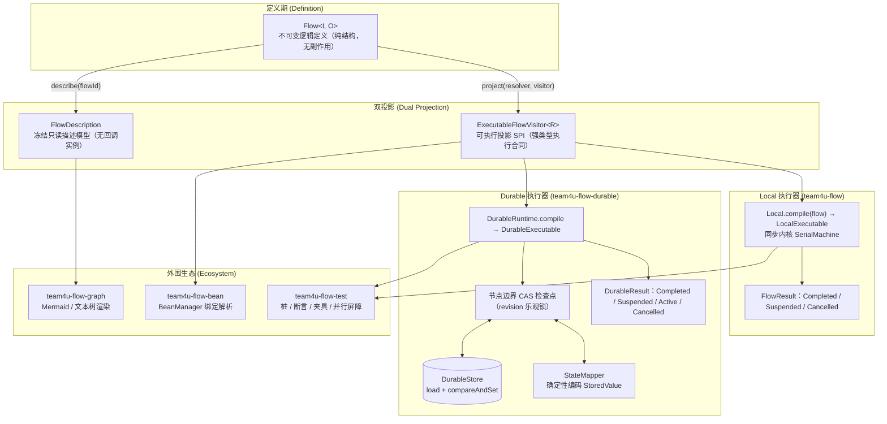

# 轻量化流程组件 (team4u-flow)

# 背景

订单履约、支付结算、逆向退款、复杂数据清洗等业务场景中，流程通常由一系列线性转换、条件分支、外部交互与补偿清理逻辑组成。传统的实现方式通常面临以下困境：

- **大单体 Service / 脚本方法**：业务逻辑、RPC 调用、异常捕获与状态回滚深度耦合在单一方法中；步骤难以独立测试与 Mock，局部修改极易产生意外副作用。
- **重型工作流引擎（BPMN / 反射式 DSL）**：引入庞大依赖、表结构与运行时容器；强类型退化为 `Object` 与字符串反射，丢失编译期类型安全；启动慢、调用栈深，内存级同步编排成本过高。
- **单机同步与持久化恢复割裂**：本地执行与跨进程崩溃恢复通常是不兼容的两套 API；单机验证后若需增加检查点，往往需要重写流程逻辑。
- **布尔与异常承载分支语义过载**：“成功产出 / 业务拒绝 / 无适用分支 / 技术失败”被压缩成 `boolean`、`null` 或 `RuntimeException`，无法在类型层面区分“正常业务拒绝”与“技术故障”。
- **容器与依赖注入割裂**：纯 Lambda 编排难以直接注入 Spring 托管的 DAO、RPC 客户端与事务切面；反射动态查找又带来性能损耗与类型退化。

`team4u-flow` 是一个专为业务流程设计的轻量级、强类型流程编排组件，提供类型安全的流水线编排、无缝的容器集成与统一的崩溃恢复支持。

---

# 设计

## 设计理念

`team4u-flow` 采用“**不可变定义 -> 双投影编译 -> 多执行器驱动**”的架构设计。流程定义（`Flow<I, O>`）纯粹描述拓扑结构，本身不可执行；同一份定义既可投影为高性能内存同步执行器（`Local`），也可投影为支持断点续跑的持久化执行器（`Durable`）。



---

## 核心特性

- **Bean 一等公民**：节点原生支持 `Class<? extends Operation>` 与可选限定符；编译期一次性解析绑定容器单例，运行期直接调用无反射，Spring 事务与 AOP 切面代理完整保留。
- **一个定义，两种执行器**：
  - **Local 同步执行**：`Local.compile(flow).run(input)` 内存驱动，零序列化与持久化开销，挂起、取消、并行、超时全部可用。
  - **Durable 崩溃恢复**：`DurableRuntime.compile` 在节点边界以 CAS 乐观锁自动提交检查点，进程重启后 `recover` 从最后快照断点续跑。
- **强类型流水线与不可变定义**：步骤输入输出严格推导（`A -> B -> C`），类型不匹配在编译期报错；组合方法全部返回新 `Flow` 实例，定义天然线程安全。
- **四态业务结果与执行生命周期分层**：业务层通过 `Outcome<T>`（`Accepted` / `Rejected` / `Skipped` / `Failed`）明确语义，仅 `Accepted` 携带输出；执行层通过 `FlowResult<O>` / `DurableResult<O>` 表达生命周期状态。
- **可选步骤透传原值**：`thenOptional` 声明可选步骤，节点弃权返回 `Skipped` 时自动透传步骤入口原值继续执行，无需伪装为 `Accepted`。
- **零 Lambda 序列化与确定性幂等键**：Durable 快照仅保存框架元数据与编码后的 `StoredValue` 槽位，绝不序列化代码或 Lambda；每个节点注入稳定幂等键 `invocationId`（`flowId:flowVersion:executionId:path`），解决外部副作用幂等难题。
- **扩展点开放，运行时节点封闭**：业务步骤（`Operation`）、治理策略（`Policy` / `PersistentPolicy`）、并行合并（`JoinStrategy`）与容器解析（`OperationResolver`）开放扩展；运行时计划封闭为八种核心节点，语义清晰可控。
- **零外部运行时依赖**：核心模块仅依赖 JDK，架构轻量纯粹。

---

## 核心概念

| 概念 | 说明 |
| :--- | :--- |
| `Flow<I, O>` | 不可变逻辑流程定义，仅描述拓扑结构，需经编译后方可执行 |
| `Local` / `LocalExecutable` | 本地同步执行器门面与可执行句柄，提供同步 `run` 与异步 `runAsync` |
| `DurableRuntime` / `DurableExecutable` | 持久化执行器运行时与可执行句柄，支持 `start`、`resume`、`recover` 与 `cancel` |
| `Operation<I, O>` | 业务步骤扩展点，接收上下文与输入，返回四态 `Outcome<O>` |
| `Outcome<T>` | 业务结果四态闭集：`Accepted(value)`、`Rejected(reason)`、`Skipped(reason)`、`Failed(failure)` |
| `Reason` / `Failure` | 不可变诊断信息对象，包含稳定的业务码 `code`、说明 `message` 与扩展详情 `details` |
| `FlowResult<O>` | Local 执行结果闭集：`Completed(outcome)`、`Suspended(suspension)`、`Cancelled(executionId)` |
| `DurableResult<O>` | Durable 执行结果闭集：`Completed(outcome)`、`Suspended(resumePoint)`、`Active(wakeAt)`、`Cancelled` |
| `Suspension<O>` | Local 挂起续接句柄，不透明且单次消费，仅可由对应执行器恢复 |
| `ResumePoint<R>` | 类型化挂起点标识，持有挂起点名称与恢复信号类型 `R` |
| `Cancellation` | 协作式取消令牌，支持 CAS 置位、线程中断与级联取消 |
| `Policy<K>` | 无状态网关策略扩展点，提供 `before` 拦截与 `after` 回调 |
| `PersistentPolicy<K, S>` | 状态由框架持久化的控制策略扩展点，支持跨崩溃恢复 |
| `JoinStrategy<O>` | 并行分支汇聚策略，将全部分支结果合并为单个 `Outcome<O>` |
| `DurableStore` | 持久化快照存储 SPI，提供 `load` 与 `compareAndSet` 乐观锁操作 |
| `StateMapper` | 应用状态编解码 SPI，提供确定性序列化与反序列化契约 |
| `FlowObserver` / `DurableObserver` | 流程执行与持久化事件观察者，提供全链路事件监听 |

---

## 模块划分与包结构

| Maven 坐标 (`com.team4u`) | 定位 | 依赖说明 |
| :--- | :--- | :--- |
| `team4u-flow` | 核心模块：Flow DSL、四态 Outcome、Local 执行器、并行与挂起机制 | 仅依赖 JDK |
| `team4u-flow-durable` | 持久化模块：Durable 执行器、快照信封、StateMapper、CAS 检查点与恢复 | 依赖 `team4u-flow` |
| `team4u-flow-graph` | 可视化模块：Mermaid 流程图与紧凑文本树渲染器 | 依赖 `team4u-flow`（仅描述面） |
| `team4u-flow-bean` | 容器集成模块：BeanManager 容器绑定解析器，保留 AOP 与代理 | 依赖 `team4u-flow`、`team4u-bean` |
| `team4u-flow-test` | 测试支持模块：桩对象、Trace 收集器、断言库与测试夹具 | 依赖 `team4u-flow`、JUnit |

```text
com.team4u.framework.flow
├── api                          # 核心扩展点 (Operation, Policy, PersistentPolicy, JoinStrategy, ResumePoint)
├── compiler                     # 拓扑校验与运行时执行计划 (Compiler, PlanNode, NodeDescriptor)
├── desc                         # 只读描述模型 (FlowDescription, NodeDescription, BindingDescriptor)
├── engine                       # 同步内核与驱动机制 (SerialMachine, ParallelRunner, CancellationCoordinator)
├── model                        # 结果模型 (Outcome, FlowResult, Reason, Failure, Cancellation, Suspension)
├── spi                          # 核心 SPI (OperationResolver, ExecutableFlowVisitor, ControlKind)
├── Flow.java                    # 不可变 DSL 构建入口
├── Local.java                   # Local 执行器门面
└── LocalExecutable.java         # Local 可执行句柄

com.team4u.framework.flow.durable
├── engine                       # 状态机内核与断点恢复 (DurableMachine, CheckpointManager)
├── snapshot                     # 快照信封与编解码 (DurableSnapshot, StateMapper, StoredValue)
├── store                        # 存储 SPI 与内存实现 (DurableStore, InMemoryDurableStore)
├── DurableExecutable.java       # Durable 可执行句柄
└── DurableRuntime.java          # Durable 运行时构建器

com.team4u.framework.flow.graph
└── FlowGraphs.java              # Mermaid 与紧凑文本树渲染门面

com.team4u.framework.flow.bean
├── BeanFlows.java               # 容器绑定编译门面
└── BeanOperationResolver.java   # BeanManager 绑定解析器

com.team4u.framework.flow.test
├── FlowAssertions.java          # 统一流断言工具
├── LocalFixture.java            # Local 测试夹具
├── DurableFixture.java          # Durable 测试夹具
├── OperationStub.java           # 业务操作桩
├── PolicyStub.java              # 控制策略桩
├── ParallelBarrier.java         # 并行并发验证屏障
└── TraceCollector.java          # 事件轨迹收集器
```

---

## 与其他组件联动

- [**对象容器组件**](../bean/README.md)：通过 `team4u-flow-bean` 与 `team4u-bean-spring`，支持以 Class 和限定符直接声明节点，透明保留 Spring 事务与 AOP 代理。
- [**表达式组件**](../criterion/README.md)：可在 `route` 选择器或 `Policy` 中结合 Criterion DSL 实现动态规则路由与风控过滤。
- [**键值存储组件**](../kv/README.md)：可基于统一存储抽象实现自定义 `DurableStore`。

---

## 文档导航

- [快速开始](quick-start.md)：从引入依赖到执行基础流水线、条件路由、挂起恢复与持久化执行
- [核心语义与机制](flow-semantics.md)：四态传播规则、八节点语义、控制策略、线程模型与完整诊断码
- [Bean 容器集成](flow-bean.md)：声明式 Bean 绑定、编译期解析、Spring 事务与 AOP 切面保留
- [Durable 持久化执行](flow-durable.md)：CAS 检查点协议、StateMapper 确定性契约、恢复机制与存储 SPI
- [可视化与图表渲染](flow-graph.md)：FlowDescription 结构投影、Mermaid 六通道图与文本树渲染
- [测试支持与断言](flow-test.md)：桩对象、Trace 轨迹收集、双执行器断言与测试夹具
- [扩展机制与 SPI](flow-extension.md)：自定义扩展点、双投影 SPI 与框架集成
- [实战案例](flow-sample.md)：电商履约、订单风控降级与支付审批挂起恢复实战
