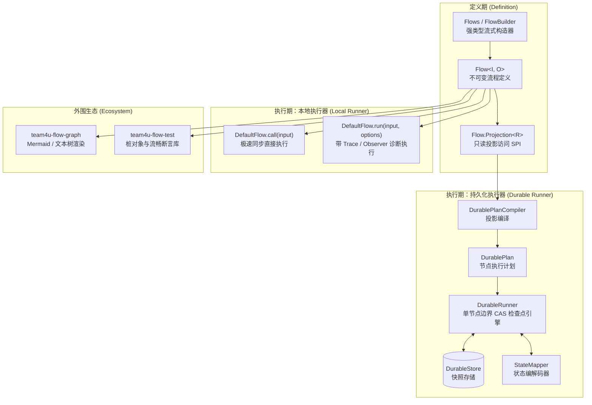

# 轻量化流程组件 (team4u-flow)

# 背景

在企业级业务系统开发中，诸如**订单履约**、**支付结算**、**逆向退款**、**复杂数据清洗**等业务场景，天然由一系列线性转换、条件分支、外部交互与补偿清理逻辑组成。

传统的实现方式通常面临以下困境：

- **大单体 Service / 脚本方法模式**：
  - 业务逻辑、第三方 RPC 调用、异常捕获与状态回滚深度交织在一个庞大的方法中。
  - 单个步骤难以独立进行单元测试与 Mock，修改局部逻辑极易产生意外副作用。
- **引入重型工作流/流程引擎（如 BPMN / 反射式 DSL 引擎）**：
  - 引入庞大的第三方依赖、数据库表结构和复杂的运行时容器。
  - 强类型在引擎内部退化为 `Object`、`Map<String, Object>` 或动态字符串反射调用，丢失全部编译期类型安全与重构支持。
  - 启动慢、调用栈深、性能开销大，在常规内存级同步编排中往往“杀鸡用牛刀”。
- **内存同步编排与分布式持久化恢复机制割裂**：
  - 本地单机同步执行与跨进程崩溃恢复通常采用完全不兼容的两套 API。
  - 业务在单机验证完毕后，若需增加检查点恢复，往往需要推翻重写整个流程逻辑。

`team4u-flow` 是一个专为 Java 业务流编排设计的轻量级、强类型、高可扩展流程引擎。它提出了 **“一个不可变定义，两种执行器（Local 同步 / Durable 持久化）”** 的核心设计理念。

---

# 设计

## 核心架构



## 核心设计特色

- **一个定义，两种执行器**：
  - 本地极速执行：`flow.call(input)` 纯 Java 8 原生执行，零序列化、零持久化开销。
  - 持久化崩溃恢复：`durableFlow.start(id, input)` 自动在节点边界进行 CAS 检查点落库，断电/重启后 `recover` 无缝续跑。
- **强类型流水线与不可变定义**：
  - 步骤前后输入输出严格推导（`A -> B -> C`），类型不匹配在编译期报错；流程一旦 `build()` 即完全不可变，天然多线程安全。
- **严谨的三态结果模型**：
  - 清晰区分 `SUCCEEDED`（成功产出）、`STOPPED`（业务条件不满足正常终止，不触发 recover）与 `FAILED`（技术异常失败，保留原始 cause 并触发 recover）。
- **确定性幂等调用键**：
  - 节点上下文自动注入格式为 `[flowId:version:]executionId#nodeAddress` 的 `invocationId`，在重试与崩溃恢复重放时保持绝对稳定，直击外部副作用幂等难题。
- **零运行时依赖边界**：
  - 核心模块 `team4u-flow` 仅依赖 Java 8 JDK，通过 Maven Enforcer 严禁依赖任何第三方库。

---

## 核心概念

| 概念 | 说明 |
| :--- | :--- |
| `Flow<I, O>` | 不可变流程定义契约，对外提供 `call`、`run`、`describe`、`project` 入口 |
| `Flows` | 流程工厂门面，提供 `Flows.begin(id)` 流式构造入口与便捷单步 Flow 工厂 |
| `FlowBuilder<I, C>` | 强类型流程构造器，每次链式调用均产出新不可变状态 |
| `Step<I, O>` / `Step.Contextual` | 核心业务转换节点函数（`I -> O`） |
| `Action<I>` / `Action.Contextual` | 副作用透传节点函数（透传当前值） |
| `Condition<I>` | 业务守卫判定条件函数（返回 `boolean`） |
| `StepContext` | 节点执行上下文，提供 `flowId`、`executionId`、`nodeId`、`nodePath` 与确定性 `invocationId` |
| `FlowResult<O>` | 不可变三态结果（`SUCCEEDED` / `STOPPED` / `FAILED`） |
| `StopReason` | 不可变业务停止原因（包含业务码 `code` 与详细说明 `message`） |
| `FailureContext` | 不可变技术失败上下文（记录故障节点与原始 `cause`） |
| `CompletionContext` | 终态清理只读上下文（在 `ensure` 中安全访问成功值、停止原因或失败信息） |
| `Flow.Projection<R>` | 只读访问 Visitor SPI，解耦核心定义与外部 Durable 编译、图形渲染器 |
| `FlowDescription` | 不包含任何 callback 实例的纯只读结构模型 |
| `DurableRuntime` | 持久化流程运行时环境，管理存储、编解码器与多版本流程注册表 |
| `DurableFlow<I, O>` | 绑定了特定版本的持久化流程实例（提供 `start`、`recover`、`retry`、`cancel`、`load` 命令） |
| `DurableStore` | 快照存储 SPI，仅提供查询与基于 `expectedRevision` 的 CAS 乐观锁保存 |
| `DurableSnapshot` | 流程执行快照信封，记录 `revision`、`lifecycle`、`frameState`、`slots` 与失败摘要 |

---

## 组件位置与模块划分

```text
com.team4u.framework.flow
├── modules/flow/core (com.team4u:team4u-flow)
│   ├── Flow.java                    # 不可变流程契约与 Projection SPI
│   ├── Flows.java                   # 流程构造工厂门面
│   ├── FlowBuilder.java             # 强类型流式构造器
│   ├── FlowResult.java              # 不可变三态结果模型
│   ├── StepContext.java             # 节点执行上下文与幂等键
│   ├── StepInterceptor.java         # 步骤责任链拦截器
│   ├── FlowObserver.java            # 流程事件观察者
│   └── FlowTrace.java               # 树状执行轨迹模型
├── modules/flow/durable (com.team4u:team4u-flow-durable)
│   ├── DurableRuntime.java          # 持久化运行时与版本注册
│   ├── DurableFlow.java             # 持久化流程实例与命令集
│   ├── DurableSnapshot.java         # CAS 乐观锁快照信封
│   ├── DurableStore.java            # 快照存储 SPI (含 InMemoryDurableStore)
│   └── StateMapper.java             # 状态编解码 SPI (含 DefaultStateMapper)
├── modules/flow/graph (com.team4u:team4u-flow-graph)
│   ├── FlowGraphs.java              # 渲染器工厂入口
│   ├── MermaidFlowGraphRenderer     # 标准 Mermaid 流程图渲染
│   └── TextFlowGraphRenderer        # 控制台 ASCII 树形图渲染
└── modules/flow/test (com.team4u:team4u-flow-test)
    ├── FlowAssertions.java          # 链式断言入口
    ├── FlowResultAssert.java        # 结果断言
    ├── FlowTraceAssert.java         # 轨迹顺序与节点断言
    └── StepStub.java / ActionStub   # 节点测试桩对象
```

---

## 与其他组件联动

- [**状态机组件**](../fsm/README.md)：单实体的有限状态迁移由 `team4u-fsm` 判定，跨实体、长链路的宏观编排由 `team4u-flow` 调度。
- [**Criterion 表达式组件**](../criterion/README.md)：`guard` 守卫条件与 `choose` 分支选择器可直接嵌入 Criterion 表达式进行动态圈选路由。
- [**租约组件**](../lease/README.md)：在多节点集群中运行 `DurableFlow` 的后台排空或补偿调度时，可结合 `team4u-lease` 保证单节点执行。
- [**限流与 Singleflight 组件**](../ratelimiter/README.md)：可通过 `StepInterceptor` 将 `team4u-ratelimiter` 或 `team4u-singleflight` 透明织入流程节点中。

---

## 文档导航

- [快速开始](quick-start.md)：从依赖引入到编写第一条流水线与持久化恢复
- [核心语义与机制](flow-semantics.md)：节点类型、三态结果、确定性幂等键、异常合并与拦截器机制
- [Durable 持久化执行](flow-durable.md)：状态机模型、CAS 检查点快照、崩溃恢复与多版本并存
- [可视化与图表渲染](flow-graph.md)：Mermaid 流程图与 ASCII 文本树渲染
- [测试支持与断言](flow-test.md)：测试桩对象与链式断言库
- [扩展机制与 SPI](flow-extension.md)：自定义存储、状态编解码器与 Projection 访问
- [实战案例](flow-sample.md)：电商全链路下单、智能分账路由与长周期异步履约实战
