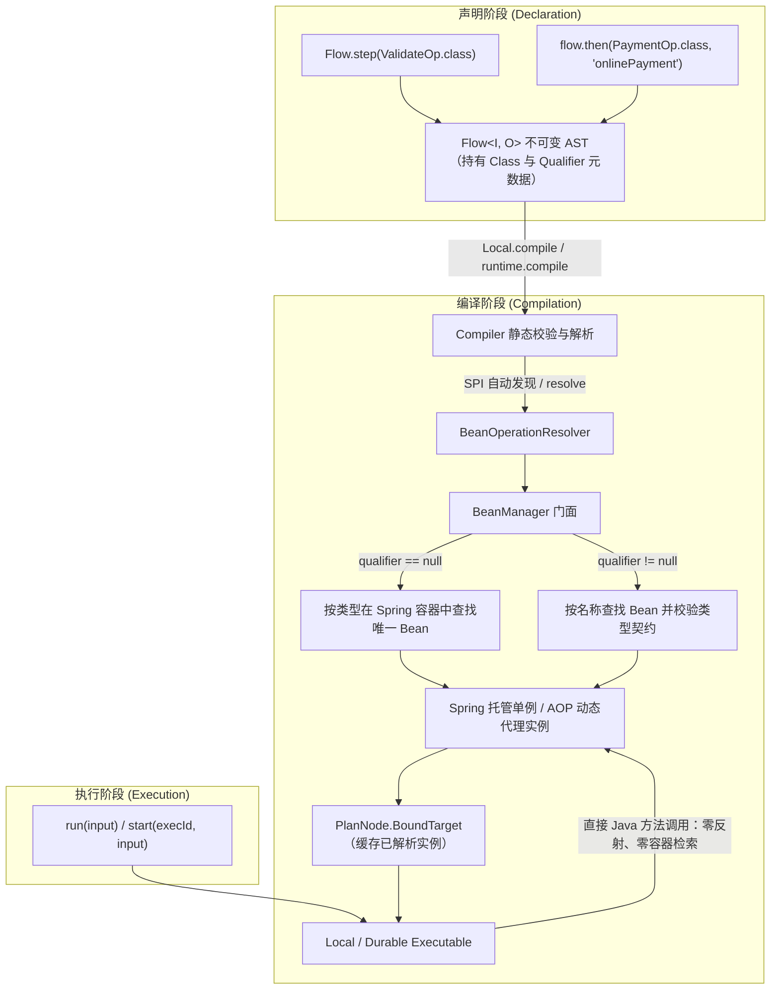

# Bean 容器集成与 Spring 治理

`team4u-flow-bean` 为流程引擎提供原生容器依赖注入能力。它支持直接在 DSL 中使用 **Class** 与 **Class + qualifier** 声明步骤；在编译期由 `BeanOperationResolver` 一次性完成 Bean 解析与绑定，运行期直接调用单例实例（零反射查找），同时透明保留 Spring 声明式事务（`@Transactional`）与 AOP 代理切面。

---

## 引入依赖

通过统一 BOM 引入 `team4u-flow-bean` 与 Spring 适配器：

```xml
<dependencies>
    <!-- Flow 与 Bean 绑定模块（传递依赖 team4u-flow、team4u-bean） -->
    <dependency>
        <groupId>com.team4u</groupId>
        <artifactId>team4u-flow-bean</artifactId>
    </dependency>

    <!-- Spring 容器适配器（Spring 环境按需引入） -->
    <dependency>
        <groupId>com.team4u</groupId>
        <artifactId>team4u-bean-spring</artifactId>
    </dependency>
</dependencies>
```

---

## 绑定形式与 DSL 支持

### 绑定形式总览

| 绑定形式 | 声明写法 | 解析时机 | 适用场景 |
| :--- | :--- | :--- | :--- |
| **实例绑定** | `Flow.step(lambda)` / `Flow.step(new Op())` | 无需解析，直接持有物理引用 | 纯 Java 模式、简单内联转换、单元测试桩 |
| **Class 绑定** | `Flow.step(ValidateOp.class)` | 编译期按类型在容器中唯一查找 | Spring 托管的无多实现的单例 Bean |
| **Class + Qualifier 绑定** | `Flow.step(PaymentOp.class, "onlinePayment")` | 编译期按 Bean 名称在容器中查找并校验契约 | 同一契约存在多个实现（如多渠道支付、多策略插件） |

所有绑定形式在运行时的执行性能完全一致——Class 绑定仅在编译期完成查找并缓存实例引用，运行期均为直接方法调用。

### 支持类绑定的 DSL 入口

| 编排操作 | 类型绑定重载 | 类型 + 限定符绑定重载 |
| :--- | :--- | :--- |
| **单步起点** | `Flow.step(Class<Op>)` | `Flow.step(Class<Op>, "beanName")` |
| **顺序步骤** | `flow.then(Class<Op>)` | `flow.then(Class<Op>, "beanName")` |
| **可选步骤** | `flow.thenOptional(Class<Op>)` | `flow.thenOptional(Class<Op>, "beanName")` |
| **上下文调用** | `flow.use(Class<Op>, proj, merge)` | `flow.use(Class<Op>, "beanName", proj, merge)` |
| **条件路由** | `Flow.route(Class<Op>)` | `Flow.route(Class<Op>, "beanName")` |
| **并行分支** | `Branch.of(name, Class<Op>)` | `Branch.of(name, Class<Op>, "beanName")` |
| **无状态网关** | `flow.policy(Class<Policy>, keyFn)` | `flow.policy(Class<Policy>, "beanName", keyFn)` |
| **持久化策略** | `flow.persistentPolicy(Class<PPolicy>, keyFn)` | `flow.persistentPolicy(Class<PPolicy>, "beanName", keyFn)` |

---

## Spring 环境接入实践

### 声明 Spring Bean 业务组件

业务操作直接使用 `@Component` 或 `@Service` 声明，支持 `@Autowired` 依赖注入与 `@Transactional` 事务注解：

```java
import com.team4u.framework.flow.api.Operation;
import com.team4u.framework.flow.api.OperationContext;
import com.team4u.framework.flow.model.*;
import org.springframework.beans.factory.annotation.Autowired;
import org.springframework.stereotype.Component;
import org.springframework.transaction.annotation.Transactional;

@Component
public class ValidateOrderOperation implements Operation<OrderRequest, OrderRequest> {

    @Autowired
    private OrderRuleRepository ruleRepository;

    @Override
    public Outcome<OrderRequest> execute(OperationContext context, OrderRequest order) {
        if (order.getAmount() <= 0) {
            return Outcome.rejected(Reason.of("INVALID_AMOUNT", "订单金额必须为正数"));
        }
        if (!ruleRepository.isValidRegion(order.getRegion())) {
            return Outcome.rejected(Reason.of("UNSUPPORTED_REGION", "不支持的配送区域"));
        }
        return Outcome.accepted(order);
    }
}

@Component("onlinePaymentOperation")
public class PaymentOperation implements Operation<OrderRequest, Receipt> {

    @Autowired
    private PaymentGatewayClient paymentGatewayClient;

    @Override
    @Transactional(rollbackFor = Exception.class) // Spring 事务切面原样生效
    public Outcome<Receipt> execute(OperationContext context, OrderRequest order) {
        // 利用 context.invocationId() 保证外部调用幂等
        PaymentResponse response = paymentGatewayClient.charge(
                context.invocationId(), order.getOrderId(), order.getAmount());

        if (!response.isSuccess()) {
            return Outcome.failed(Failure.of("PAYMENT_FAILED", response.getErrorMessage()));
        }
        return Outcome.accepted(new Receipt(order.getOrderId(), response.getTxId(), "PAID"));
    }
}
```

### 装配与编译 Flow

通过 `@Import(Team4uBeanConfiguration.class)` 桥接 Spring 容器至 `BeanManager`，并在 `@Configuration` 中完成 Flow 定义与编译：

```java
import com.team4u.framework.bean.spring.Team4uBeanConfiguration;
import com.team4u.framework.flow.Flow;
import com.team4u.framework.flow.Local;
import com.team4u.framework.flow.LocalExecutable;
import org.springframework.context.annotation.Bean;
import org.springframework.context.annotation.Configuration;
import org.springframework.context.annotation.Import;

@Configuration
@Import(Team4uBeanConfiguration.class) // 桥接 Spring 容器至 BeanManager
public class OrderFlowConfiguration {

    @Bean
    public Flow<OrderRequest, Receipt> orderFlowDefinition() {
        // 声明纯逻辑流：仅引用契约类型与限定符，不持有 Bean 物理引用
        return Flow.step(ValidateOrderOperation.class)
                .then(PaymentOperation.class, "onlinePaymentOperation");
    }

    @Bean
    public LocalExecutable<OrderRequest, Receipt> orderExecutable(
            Flow<OrderRequest, Receipt> orderFlowDefinition) {
        // 引入 team4u-flow-bean 后，Local.compile / Local.from 默认通过 SPI 自动发现 BeanOperationResolver
        return Local.compile(orderFlowDefinition);

        // 若需定制 flowId / flowVersion / 观察者：
        // return Local.from(orderFlowDefinition)
        //         .flowId("order-checkout")
        //         .flowVersion(1)
        //         .observer(loggingObserver)
        //         .compile();
    }
}
```

### 业务 Service 调用

```java
@Service
public class OrderServiceImpl implements OrderService {

    @Autowired
    private LocalExecutable<OrderRequest, Receipt> orderExecutable;

    @Override
    public OrderResponse handleOrder(OrderRequest request) {
        FlowResult<Receipt> result = orderExecutable.run(request);

        if (result instanceof FlowResult.Completed) {
            Outcome<Receipt> outcome = ((FlowResult.Completed<Receipt>) result).outcome();
            if (outcome instanceof Outcome.Accepted) {
                return OrderResponse.success(((Outcome.Accepted<Receipt>) outcome).value());
            } else if (outcome instanceof Outcome.Rejected) {
                return OrderResponse.reject(((Outcome.Rejected<Receipt>) outcome).reason());
            } else {
                return OrderResponse.fail(((Outcome.Failed<Receipt>) outcome).failure());
            }
        }
        throw new IllegalStateException("Unexpected execution result: " + result);
    }
}
```

---

## 容器解析机制与动态代理处理

### 解析链路



### 动态代理双模态处理

- **执行期透明生效**：`BeanOperationResolver` 查找到 Spring 代理对象后直接原样绑定，`@Transactional` 声明式事务、`@Cacheable` 缓存与自定义 AOP 切面完整触发；
- **描述期智能解包**：导出只读描述模型 `FlowDescription`（用于 Mermaid 图表渲染）时，框架自动探测并解包出实际契约接口，避免渲染出 `com.sun.proxy.$Proxy42` 或 `PaymentOperation$$EnhancerBySpringCGLIB` 这类动态代理类名。

---

## SPI 自动发现机制与零配置接入

`team4u-flow-bean` 遵循 Java 标准 SPI 契约，内置了 `OperationResolver` 的服务提供者配置：

- **自动装配**：只要项目中引入了 `team4u-flow-bean` 依赖，`Local.compile(flow)`、`Local.from(flow)...compile()` 以及 `Durable.builder(store).build()` 将通过 `ServiceLoaderUtil` **自动发现并激活 `BeanOperationResolver`** ；
- **零额外参数**：业务代码与 `@Configuration` 中无需手动传递或配置任何 `OperationResolver` 参数；
- **优雅降级**：在无 IoC 容器的纯 Java 环境中（未引入 `team4u-flow-bean`），解析器自动回退为默认的 `rejecting()` 模式，遇到未绑定的 Class 步骤时在编译期精确阻断并告警；
- **显式覆盖**：若需使用非全局的自定义 `BeanManager`，仍可通过 `.resolver(new BeanOperationResolver(customManager))` 进行显式覆盖。

---

## Durable 长流程容器绑定

Durable 持久化执行器在引入 `team4u-flow-bean` 后，同样**默认通过 SPI 自动挂载 Bean 解析器**：

```java
@Configuration
public class DurableFlowConfiguration {

    @Bean
    public Durable durableRuntime(DurableStore durableStore) {
        // 默认自动装配 Spring BeanOperationResolver，无需手动配置 resolver
        return Durable.builder(durableStore).build();
    }

    @Bean
    public DurableExecutable<OrderRequest, Receipt> durableOrderExecutable(
            Durable durableRuntime,
            Flow<OrderRequest, Receipt> orderFlowDefinition) {
        return durableRuntime.compile(orderFlowDefinition, "order-fulfillment", 1);
    }
}
```

> [!IMPORTANT]
> **持久化零 Bean 污染原则**：
> Durable 快照仅持久化元数据与业务槽位（`StoredValue`），**绝对不序列化 Bean 实例或类代码**。
> 进程重启后由 `BeanOperationResolver` 重新从 Spring 容器中获取单例并继续驱动，保证了跨版本与跨进程恢复的绝对安全。

---

## 常见编译期绑定错误排查

所有绑定问题均在**编译期**收集为 `FlowBuildException` 并一次性抛出：

| 诊断码 | 错误场景 | 典型异常消息 | 运维自查与修复建议 |
| :--- | :--- | :--- | :--- |
| **`MISSING_BINDING`** | 容器中未找到 Bean | `No qualifying bean of type com.example.MyOperation` | 确认类上标注了 `@Component` / `@Service` 并在扫描范围内；确认已 `@Import(Team4uBeanConfiguration.class)`。 |
| **`MISSING_BINDING`** | Qualifier 限定符未找到 | `No bean named 'strictValidator' for contract com.example.ValidateOp` | 检查限定符名称与 `@Component("strictValidator")` 声明是否一致。 |
| **`INVALID_BINDING`** | 类未实现契约 | `Class com.example.Foo does not implement Operation, Policy or PersistentPolicy` | 确认绑定的 Class 实现了对应的扩展点接口。 |
| **`BINDING_TYPE`** | Bean 类型不匹配 | `Resolved object does not implement Operation` | 检查 Spring 容器中同名 Bean 的实际实现类类型。 |

---

## 关联章节与进一步阅读

- 了解四态传播规则与完整诊断码：[核心语义与机制](flow-semantics.md)
- 了解 CAS 检查点与崩溃续跑：[Durable 状态机与 CAS 检查点机制](flow-durable-core.md)
- 查看完整的 Spring Boot 履约实战案例：[实战案例库与生产模式](flow-sample.md)
