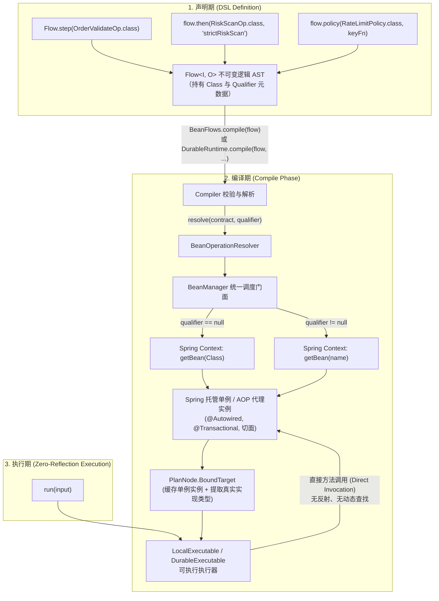

# Spring / Bean 容器与一等公民集成 (team4u-flow-bean)

# 背景与设计理念

在传统流程编排框架中，开发者常常面临两难困境：
- **静态 Lambda / 纯函数模式**：在 DEMO 中看似清爽，但在真实的复杂企业级系统中，每个业务步骤（`Operation`）和控制策略（`Policy`）通常需要依赖 Spring 容器管理的数据访问层（DAO/Repository）、RPC 客户端（Feign/Dubbo）、分布式缓存（Redis）以及本地配置。若引擎仅支持显式传入实例，会导致流程编排处充斥大量繁琐的手工对象组装或反模式的全局静态查找。
- **重型动态反射引擎**：部分工作流引擎虽然支持 Spring Bean 查找，但多在运行期通过字符串进行低效的反射调用，在牺牲编译期类型安全的同时带来巨大的性能损耗与深调用栈。

`team4u-flow` 确立了 **"Bean 是一等公民 (Bean as a First-Class Citizen)"** 的核心架构设计：
1. **类型化声明与容器解耦**：Flow DSL 原生支持以 `Class<? extends Operation>` 及可选限定符 `qualifier`（Spring Bean 名称）进行声明。逻辑流定义仅构建不可变抽象语法树（AST），保持强类型安全且不依赖任何具体 IoC 容器。
2. **编译期一次性解析 (Compile-Time One-Shot Resolution)**：在流程编译阶段（`BeanFlows.compile` 或 `DurableRuntime.compile`），`BeanOperationResolver` 通过统一的 `BeanManager` 门面从 Spring / 本地容器中一次性解析并绑定单例 Bean 实例。
3. **零运行期反射损耗**：执行期直接调用已绑定的单例实例，无任何运行期反射查找开销，兼具 Spring 依赖注入的便利与原生调用的极致性能。
4. **透明保留 AOP 动态代理**：无论目标 Bean 是被 Spring `@Transactional`、AOP 切面还是动态代理包装，框架原样保留代理对象并确保拦截链路完整触发，同时智能提取契约接口供节点元数据与图渲染使用。

---

# 核心架构与解析流转



---

# 依赖引入

通过统一 BOM 引入 `team4u-flow-bean` 与 Spring 适配模块 `team4u-bean-spring`：

```xml
<dependencies>
    <!-- Flow 核心组件 -->
    <dependency>
        <groupId>com.team4u</groupId>
        <artifactId>team4u-flow</artifactId>
    </dependency>

    <!-- Flow 与 BeanManager 绑定桥接模块 -->
    <dependency>
        <groupId>com.team4u</groupId>
        <artifactId>team4u-flow-bean</artifactId>
    </dependency>

    <!-- Spring 容器适配器 (Spring 环境必需) -->
    <dependency>
        <groupId>com.team4u</groupId>
        <artifactId>team4u-bean-spring</artifactId>
    </dependency>
</dependencies>
```

---

# 声明式 DSL 绑定全景

`Flow` 核心 DSL 的所有构建入口均原生支持 Class 与 Class + Qualifier 绑定：

| 编排操作 | Class 绑定语法 | Class + Qualifier 绑定语法 | 描述 |
| :--- | :--- | :--- | :--- |
| **单步起点** | `Flow.step(Class<Op>)` | `Flow.step(Class<Op>, "beanName")` | 以 Bean 作为流程首个节点 |
| **顺序流水线** | `flow.then(Class<Op>)` | `flow.then(Class<Op>, "beanName")` | 串联后续 Bean 节点 |
| **可选步骤** | `flow.thenOptional(Class<Op>)` | `flow.thenOptional(Class<Op>, "beanName")` | Skipped 时透传原值继续执行 |
| **上下文调用** | `flow.use(Class<Op>, proj, merge)` | `flow.use(Class<Op>, "beanName", proj, merge)` | 调用 Bean 但保留主流程上下文 |
| **条件路由** | `Flow.route(Class<Op>)` | `Flow.route(Class<Op>, "beanName")` | 使用 Bean 计算路由选择键 |
| **无状态网关** | `flow.policy(Class<Policy>, keyFn)` | `flow.policy(Class<Policy>, "beanName", keyFn)` | 挂载 Bean 网关策略（限流/熔断等） |
| **持久化策略** | `flow.persistentPolicy(Class<PPolicy>, keyFn)` | `flow.persistentPolicy(Class<PPolicy>, "beanName", keyFn)` | 挂载持久化状态策略（跨重启控制） |

---

# Spring 环境完整开发范式

## 1. 声明 Spring Bean 业务组件

业务操作与策略直接使用 `@Component` 或 `@Service` 声明，自由注入各种 Spring 依赖，并支持使用 `@Transactional` 等注解：

```java
package com.example.order.flow;

import com.team4u.framework.flow.api.Operation;
import com.team4u.framework.flow.api.OperationContext;
import com.team4u.framework.flow.model.Outcome;
import com.team4u.framework.flow.model.Reason;
import com.team4u.framework.flow.model.Failure;
import org.springframework.beans.factory.annotation.Autowired;
import org.springframework.stereotype.Component;
import org.springframework.transaction.annotation.Transactional;

// 1. 参数校验节点
@Component
public class ValidateOrderOperation implements Operation<OrderRequest, OrderRequest> {

    @Autowired
    private OrderRuleRepository ruleRepository;

    @Override
    public Outcome<OrderRequest> execute(OperationContext context, OrderRequest order) {
        if (order.getAmount() <= 0) {
            return Outcome.rejected(Reason.of("INVALID_AMOUNT", "订单金额必须为正数"));
        }
        if (!ruleRepository.isValidRegion(order.getRegion())) {
            return Outcome.rejected(Reason.of("UNSUPPORTED_REGION", "不支持的配送区域"));
        }
        return Outcome.accepted(order);
    }
}

// 2. 支付扣款节点 (支持 Spring 声明式事务与 AOP 代理)
@Component("onlinePaymentOperation")
public class PaymentOperation implements Operation<OrderRequest, Receipt> {

    @Autowired
    private PaymentGatewayClient paymentGatewayClient;

    @Autowired
    private OrderAccountService accountService;

    @Override
    @Transactional(rollbackFor = Exception.class)
    public Outcome<Receipt> execute(OperationContext context, OrderRequest order) {
        // 利用 context.invocationId() 确保外部调用幂等
        PaymentResponse response = paymentGatewayClient.charge(
                context.invocationId(), order.getOrderId(), order.getAmount());
        
        if (!response.isSuccess()) {
            return Outcome.failed(Failure.of("PAYMENT_FAILED", response.getErrorMessage()));
        }
        
        accountService.recordTransaction(order.getOrderId(), response.getTxId());
        return Outcome.accepted(new Receipt(order.getOrderId(), response.getTxId(), "PAID"));
    }
}
```

## 2. 激活 Spring 桥接并装配 Flow

在 Spring 配置类中通过 `@Import(Team4uBeanConfiguration.class)` 启用 `SpringBeanContainer` 桥接，并在 Spring `@Bean` 中定义 Flow 并完成编译：

```java
package com.example.order.config;

import com.example.order.flow.*;
import com.team4u.framework.bean.spring.Team4uBeanConfiguration;
import com.team4u.framework.flow.Flow;
import com.team4u.framework.flow.LocalExecutable;
import com.team4u.framework.flow.bean.BeanFlows;
import org.springframework.context.annotation.Bean;
import org.springframework.context.annotation.Configuration;
import org.springframework.context.annotation.Import;

@Configuration
@Import(Team4uBeanConfiguration.class) // 桥接 Spring ApplicationContext 至 BeanManager
public class OrderFlowConfiguration {

    @Bean
    public Flow<OrderRequest, Receipt> orderFlowDefinition() {
        // 声明纯逻辑流：仅引用 Class 与 Qualifier，不直接持有 Bean 实例
        return Flow.step(ValidateOrderOperation.class)
                .then(PaymentOperation.class, "onlinePaymentOperation");
    }

    @Bean
    public LocalExecutable<OrderRequest, Receipt> orderExecutable(
            Flow<OrderRequest, Receipt> orderFlowDefinition) {
        // 编译期一次性从 Spring 容器解析所有 Bean 依赖，并生成高性能可执行单例
        return BeanFlows.compile(orderFlowDefinition);
    }
}
```

## 3. 在业务 Service 中注入并执行

```java
package com.example.order.service;

import com.example.order.flow.OrderRequest;
import com.example.order.flow.Receipt;
import com.team4u.framework.flow.FlowResult;
import com.team4u.framework.flow.LocalExecutable;
import com.team4u.framework.flow.model.Outcome;
import org.springframework.beans.factory.annotation.Autowired;
import org.springframework.stereotype.Service;

@Service
public class OrderServiceImpl implements OrderService {

    @Autowired
    private LocalExecutable<OrderRequest, Receipt> orderExecutable;

    @Override
    public OrderResponse handleOrder(OrderRequest request) {
        // 同步直接执行，直接调用底层已绑定的 Spring Bean 实例
        FlowResult<Receipt> result = orderExecutable.run(request);

        if (result instanceof FlowResult.Completed) {
            Outcome<Receipt> outcome = ((FlowResult.Completed<Receipt>) result).outcome();
            if (outcome instanceof Outcome.Accepted) {
                return OrderResponse.success(((Outcome.Accepted<Receipt>) outcome).value());
            } else if (outcome instanceof Outcome.Rejected) {
                return OrderResponse.reject(((Outcome.Rejected<Receipt>) outcome).reason());
            } else {
                return OrderResponse.fail(((Outcome.Failed<Receipt>) outcome).failure());
            }
        }
        throw new IllegalStateException("Unexpected execution result: " + result);
    }
}
```

---

# 核心机制与技术深度

## 1. 编译期解析与单例缓存

在调用 `BeanFlows.compile(flow)` 时：
1. 框架递归遍历 AST 逻辑节点，收集所有 `Binding`。
2. 以 `BindingKey(contract, qualifier, kind)` 为键查询 `BeanOperationResolver`。
3. 若流程中存在多个节点引用同一个 Bean，`Compiler` 会自动进行单例解析缓存，避免对同一 Bean 重复检索。
4. 一旦编译完成，`LocalExecutable` 内部持有已绑定对象的硬引用，运行期调用（`run`）不走任何字典检索与反射查找。

## 2. AOP 动态代理与契约接口提取

在 Spring 应用中，许多 Bean 会被 Spring 框架生成代理（例如 JDK 动态代理、CGLIB 代理、事务拦截器、安全切面）。

- **执行期代理完整保留**：`BeanOperationResolver` 在查找到 Spring 代理对象后，将其**原样传给执行器**。当流程引擎驱动该节点时，将精准穿透 Spring 的拦截器链（`MethodInterceptor`），确保 `@Transactional`、日志拦截、安全校验等切面百分之百生效。
- **描述期契约智能解包**：在生成只读描述模型 `FlowDescription`（用于 Mermaid 图表渲染与日志打印）时，`OperationResolver.implementationClass(resolved)` 会自动解包 JDK 动态代理，提取出业务显式实现的契约接口类型，避免图表中出现 `com.sun.proxy.$Proxy42` 这类无意义的动态代理类名。

## 3. Durable 长流程持久化中的 Bean 解析

对于需要跨机器重启、持久化快照和崩溃恢复的长流程（Durable Flow），Bean 同样是一等公民：

```java
import com.team4u.framework.flow.bean.BeanFlows;
import com.team4u.framework.flow.durable.DurableExecutable;
import com.team4u.framework.flow.durable.DurableRuntime;
import com.team4u.framework.flow.durable.DurableStore;

@Configuration
public class DurableFlowConfiguration {

    @Bean
    public DurableExecutable<OrderRequest, Receipt> durableOrderExecutable(
            DurableStore durableStore,
            Flow<OrderRequest, Receipt> orderFlowDefinition) {
        
        // 构建 DurableRuntime 并注入 Bean 解析器
        DurableRuntime runtime = DurableRuntime.builder(durableStore)
                .operationResolver(BeanFlows.resolver()) // 挂载 BeanOperationResolver
                .build();

        // 编译为持久化可执行对象
        return runtime.compile(orderFlowDefinition, "order-fulfillment", 1);
    }
}
```

> **注意**：Durable 执行器在检查点持久化快照时，**绝不序列化任何 Bean 实例或代码**，仅保存流程元数据与经过 `StateMapper` 编码的业务数据载荷（`StoredValue`）。当应用崩溃重启后执行 `recover(executionId)` 时，新进程重新通过 `BeanOperationResolver` 从 Spring 容器中取得单例 Bean 继续驱动后续节点！

## 4. 纯 Java / 非 Spring 环境下的 BeanManager 使用

若在纯 Java 脚本、CLI 工具或独立单元测试中运行，无需 Spring 也可享受 Bean 容器能力：

```java
import com.team4u.framework.bean.BeanManager;
import com.team4u.framework.flow.bean.BeanFlows;

// 1. 在本地容器中手动注册单例
BeanManager.getInstance().registerBean("customValidator", new CustomValidateOperation());
BeanManager.getInstance().registerBean(new DefaultPaymentOperation());

// 2. 编译并运行
LocalExecutable<OrderRequest, Receipt> executable = BeanFlows.compile(flow);
```

---

# 常见错误排查与诊断

当流程编译期依赖解析失败时，框架会收集并抛出带有详细节点路径（`path`）的 `FlowBuildException`：

### 1. `NoSuchBeanDefinitionException` (未找到目标 Bean)
- **现象**：`FlowBuildException: MISSING_BINDING at $/0: No qualifying bean of type com.example.MyOperation`
- **原因**：Spring 容器中未注册该 Class 对应的 Bean。
- **解决**：检查目标类是否添加了 `@Component` / `@Service` 注解，或者所在包路径是否在 Spring `@ComponentScan` 扫描范围内。

### 2. 限定符不匹配 (Qualifier Mismatch)
- **现象**：`FlowBuildException: MISSING_BINDING at $/1: No bean named 'strictValidator' for contract com.example.ValidateOperation`
- **原因**：Spring 容器中存在该类型的 Bean，但其 Bean 名称与 Flow 中声明的 qualifier 不一致。
- **解决**：检查 `@Component("strictValidator")` 名称是否与 Flow DSL 中的限定符拼写一致。

### 3. 类型不匹配 (`BINDING_TYPE` / `INVALID_BINDING`)
- **现象**：`FlowBuildException: BINDING_TYPE: Bean named 'myBean' has type com.example.OtherService but must implement com.team4u.framework.flow.api.Operation`
- **原因**：指定的 Bean 名称存在，但该 Bean 并未实现 `Operation` 或 `Policy` 契约接口。
- **解决**：确保所有绑定的类均正确实现 `Operation<I, O>`、`Policy<K>` 或 `PersistentPolicy<K, S>` 接口。
