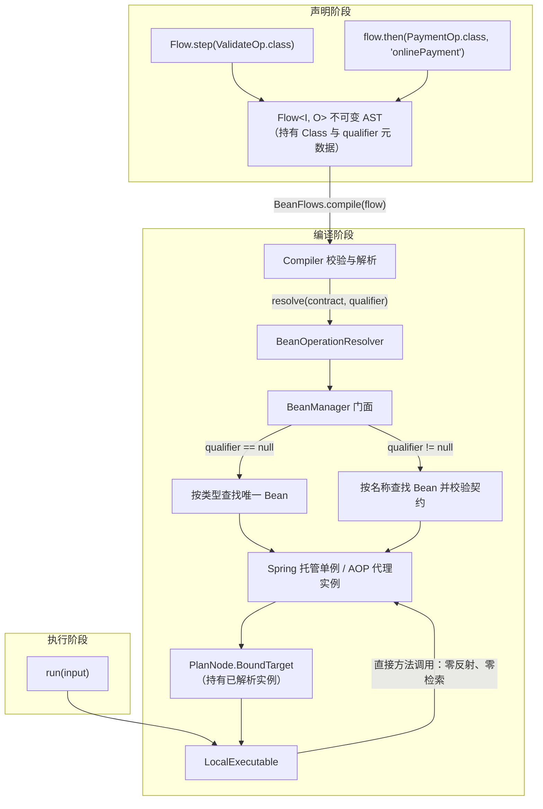

# Bean 容器集成

`team4u-flow-bean` 为流程引擎提供容器依赖注入能力。它支持直接在 DSL 中使用 **Class** 与 **Class + qualifier** 声明步骤；在编译期由 `BeanOperationResolver` 一次性完成 Bean 解析与绑定，运行期直接调用单例实例（零反射查找），同时透明保留 Spring 声明式事务（`@Transactional`）与 AOP 代理切面。

---

## 引入依赖

通过统一 BOM 引入 `team4u-flow-bean` 与 Spring 适配器：

```xml
<dependencies>
    <!-- Flow 与 Bean 绑定模块（传递依赖 team4u-flow、team4u-bean） -->
    <dependency>
        <groupId>com.team4u</groupId>
        <artifactId>team4u-flow-bean</artifactId>
    </dependency>

    <!-- Spring 容器适配器（Spring 环境按需引入） -->
    <dependency>
        <groupId>com.team4u</groupId>
        <artifactId>team4u-bean-spring</artifactId>
    </dependency>
</dependencies>
```

---

## 绑定形式与 DSL 支持

### 绑定形式总览

| 绑定形式 | 声明写法 | 解析时机 | 适用场景 |
| :--- | :--- | :--- | :--- |
| **实例绑定** | `Flow.step(lambda)` / `Flow.step(new Op())` | 无需解析，直接持有 | 纯 Java 模式、简单步骤、单元测试桩 |
| **Class 绑定** | `Flow.step(ValidateOp.class)` | 编译期按类型在容器中唯一查找 | Spring 托管的无多实现的单例 Bean |
| **Class + qualifier 绑定** | `Flow.step(PaymentOp.class, "onlinePayment")` | 编译期按 Bean 名称在容器中查找 | 同一契约存在多个实现（如多渠道支付） |

所有绑定形式在运行时的执行性能完全一致——Class 绑定仅在编译期完成查找并缓存实例引用。

### 支持类绑定的 DSL 入口

| 编排操作 | 类型绑定重载 | 类型 + 限定符绑定重载 |
| :--- | :--- | :--- |
| **单步起点** | `Flow.step(Class<Op>)` | `Flow.step(Class<Op>, "beanName")` |
| **顺序步骤** | `flow.then(Class<Op>)` | `flow.then(Class<Op>, "beanName")` |
| **可选步骤** | `flow.thenOptional(Class<Op>)` | `flow.thenOptional(Class<Op>, "beanName")` |
| **上下文调用** | `flow.use(Class<Op>, proj, merge)` | `flow.use(Class<Op>, "beanName", proj, merge)` |
| **条件路由** | `Flow.route(Class<Op>)` | `Flow.route(Class<Op>, "beanName")` |
| **并行分支** | `Branch.of(name, Class<Op>)` | `Branch.of(name, Class<Op>, "beanName")` |
| **无状态网关** | `flow.policy(Class<Policy>, keyFn)` | `flow.policy(Class<Policy>, "beanName", keyFn)` |
| **持久化策略** | `flow.persistentPolicy(Class<PPolicy>, keyFn)` | `flow.persistentPolicy(Class<PPolicy>, "beanName", keyFn)` |

### 可选 Bean 步骤 (thenOptional)

当某个 Bean 仅适用于部分业务数据时，Bean 返回 `Skipped`，并使用 `thenOptional` 编排：

```java
@Component
public class CouponEnrichmentOperation implements Operation<OrderRequest, OrderRequest> {

    @Override
    public Outcome<OrderRequest> execute(OperationContext context, OrderRequest order) {
        if (order.getCouponCode() == null) {
            return Outcome.skipped(Reason.of("NO_COUPON", "未提供优惠券"));
        }
        return Outcome.accepted(order.applyCoupon());
    }
}

Flow<OrderRequest, Receipt> flow = Flow.step(ValidateOrderOperation.class)
        .thenOptional(CouponEnrichmentOperation.class)
        .thenOptional(MemberEnrichmentOperation.class, "memberEnrichmentOperation")
        .then(PaymentOperation.class, "onlinePaymentOperation");
```

---

## Spring 环境接入实践

### 声明业务组件

业务操作直接使用 `@Component` 或 `@Service` 声明，支持 `@Autowired` 依赖注入与 `@Transactional` 事务注解：

```java
import com.team4u.framework.flow.api.Operation;
import com.team4u.framework.flow.api.OperationContext;
import com.team4u.framework.flow.model.*;
import org.springframework.beans.factory.annotation.Autowired;
import org.springframework.stereotype.Component;
import org.springframework.transaction.annotation.Transactional;

@Component
public class ValidateOrderOperation implements Operation<OrderRequest, OrderRequest> {

    @Autowired
    private OrderRuleRepository ruleRepository;

    @Override
    public Outcome<OrderRequest> execute(OperationContext context, OrderRequest order) {
        if (order.getAmount() <= 0) {
            return Outcome.rejected(Reason.of("INVALID_AMOUNT", "订单金额必须为正数"));
        }
        if (!ruleRepository.isValidRegion(order.getRegion())) {
            return Outcome.rejected(Reason.of("UNSUPPORTED_REGION", "不支持的配送区域"));
        }
        return Outcome.accepted(order);
    }
}

@Component("onlinePaymentOperation")
public class PaymentOperation implements Operation<OrderRequest, Receipt> {

    @Autowired
    private PaymentGatewayClient paymentGatewayClient;

    @Override
    @Transactional(rollbackFor = Exception.class) // 事务切面原样生效
    public Outcome<Receipt> execute(OperationContext context, OrderRequest order) {
        // 利用 context.invocationId() 保证外部调用幂等
        PaymentResponse response = paymentGatewayClient.charge(
                context.invocationId(), order.getOrderId(), order.getAmount());

        if (!response.isSuccess()) {
            return Outcome.failed(Failure.of("PAYMENT_FAILED", response.getErrorMessage()));
        }
        return Outcome.accepted(new Receipt(order.getOrderId(), response.getTxId(), "PAID"));
    }
}
```

### 装配与编译 Flow

通过 `@Import(Team4uBeanConfiguration.class)` 桥接 Spring 容器至 `BeanManager`，并在 `@Configuration` 中完成 Flow 定义与编译：

```java
import com.team4u.framework.bean.spring.Team4uBeanConfiguration;
import com.team4u.framework.flow.Flow;
import com.team4u.framework.flow.LocalExecutable;
import com.team4u.framework.flow.bean.BeanFlows;
import org.springframework.context.annotation.Bean;
import org.springframework.context.annotation.Configuration;
import org.springframework.context.annotation.Import;

@Configuration
@Import(Team4uBeanConfiguration.class) // 桥接 Spring 容器
public class OrderFlowConfiguration {

    @Bean
    public Flow<OrderRequest, Receipt> orderFlowDefinition() {
        // 声明纯逻辑流：仅引用契约类型与限定符，不持有 Bean 物理引用
        return Flow.step(ValidateOrderOperation.class)
                .then(PaymentOperation.class, "onlinePaymentOperation");
    }

    @Bean
    public LocalExecutable<OrderRequest, Receipt> orderExecutable(
            Flow<OrderRequest, Receipt> orderFlowDefinition) {
        // 编译期一次性从 Spring 容器解析所有 Bean 依赖
        return BeanFlows.compile(orderFlowDefinition);
    }
}
```

### 业务 Service 调用

```java
@Service
public class OrderServiceImpl implements OrderService {

    @Autowired
    private LocalExecutable<OrderRequest, Receipt> orderExecutable;

    @Override
    public OrderResponse handleOrder(OrderRequest request) {
        FlowResult<Receipt> result = orderExecutable.run(request);

        if (result instanceof FlowResult.Completed) {
            Outcome<Receipt> outcome = ((FlowResult.Completed<Receipt>) result).outcome();
            if (outcome instanceof Outcome.Accepted) {
                return OrderResponse.success(((Outcome.Accepted<Receipt>) outcome).value());
            } else if (outcome instanceof Outcome.Rejected) {
                return OrderResponse.reject(((Outcome.Rejected<Receipt>) outcome).reason());
            } else {
                return OrderResponse.fail(((Outcome.Failed<Receipt>) outcome).failure());
            }
        }
        throw new IllegalStateException("Unexpected execution result: " + result);
    }
}
```

---

## 容器解析机制

### 解析链路



### BeanManager 门面与容器优先级

`BeanManager` 是统一对象容器管理门面，按 `getOrder()` 优先级遍历查找：

| 容器类型 | 优先级 | 说明 |
| :--- | :--- | :--- |
| `SpringBeanContainer` | `100`（高优先级） | Spring 容器适配器，注入 `ApplicationContext` 后自动激活 |
| `LocalBeanContainer` | `Integer.MAX_VALUE`（兜底） | 基于 `ConcurrentHashMap` 的本地单例容器 |
| 第三方扩展 | 自定义 | 通过 Java 标准 SPI 注册的自定义 `BeanFactory` |

### 编译期一次性解析与缓存

- **契约校验**：绑定的 Class 必须实现 `Operation`、`Policy` 或 `PersistentPolicy` 接口，否则抛出 `INVALID_BINDING`；
- **解析结果缓存**：同一 Class 或限定符在流程中被多次引用时仅解析一次；
- **运行期零反射**：编译完成后，执行期均为直接 Java 方法调用。

`BeanFlows` 门面 API：

| API 方法 | 说明 |
| :--- | :--- |
| `BeanFlows.compile(flow)` | 使用全局 `BeanManager` 编译流程 |
| `BeanFlows.compile(flow, beanManager)` | 使用指定 `BeanManager` 实例编译流程 |
| `BeanFlows.resolver()` | 获取全局 `BeanManager` 解析器句柄 |
| `BeanFlows.resolver(beanManager)` | 获取指定 `BeanManager` 的解析器句柄 |

### 动态代理与事务/切面保留

- **执行期原样保留**：`BeanOperationResolver` 查找到 Spring 代理对象后直接原样绑定，`@Transactional`、安全校验与 AOP 切面完整触发；
- **描述期智能解包**：导出只读描述模型 `FlowDescription`（用于 Mermaid 图表渲染）时，自动解包出实际契约接口，避免渲染出 `com.sun.proxy.$Proxy42` 这类动态代理类名。

### 纯 Java 环境使用

在无 Spring 的环境下，亦可直接通过 `LocalBeanContainer` 手动注册单例：

```java
import com.team4u.framework.bean.BeanManager;
import com.team4u.framework.flow.bean.BeanFlows;

// 1. 注册单例 Bean
BeanManager.getInstance().registerBean("validator", new CustomValidateOperation());
BeanManager.getInstance().registerBean(new DefaultPaymentOperation());

// 2. 编译并执行
LocalExecutable<OrderRequest, Receipt> executable = BeanFlows.compile(flow);
```

---

## Durable 长流程容器绑定

Durable 持久化执行器同样原生支持 Bean 绑定：

```java
@Configuration
public class DurableFlowConfiguration {

    @Bean
    public DurableExecutable<OrderRequest, Receipt> durableOrderExecutable(
            DurableStore durableStore,
            Flow<OrderRequest, Receipt> orderFlowDefinition) {

        DurableRuntime runtime = DurableRuntime.builder(durableStore)
                .operationResolver(BeanFlows.resolver()) // 挂载 Bean 解析器
                .build();

        return runtime.compile(orderFlowDefinition, "order-fulfillment", 1);
    }
}
```

> [!NOTE]
> Durable 快照仅持久化元数据与业务槽位（`StoredValue`），**绝不序列化 Bean 实例或类代码**。进程重启后由 `BeanOperationResolver` 重新从容器中获取单例并继续驱动。

---

## 常见错误排查

所有绑定问题均在**编译期**收集为 `FlowBuildException` 并一次性抛出：

### 未找到目标 Bean (`MISSING_BINDING`)
- **异常示例**：`MISSING_BINDING at $/0: No qualifying bean of type com.example.MyOperation`
- **排查方法**：确认类上标注了 `@Component` / `@Service` 并在组件扫描范围内；确认已通过 `@Import(Team4uBeanConfiguration.class)` 引入配置。

### 限定符不匹配 (`MISSING_BINDING`)
- **异常示例**：`MISSING_BINDING at $/1: No bean named 'strictValidator' for contract com.example.ValidateOperation`
- **排查方法**：检查限定符名称与 `@Component("strictValidator")` 声明是否一致。

### 限定符找到但类型不匹配 (`MISSING_BINDING`)
- **异常示例**：`MISSING_BINDING at $/0: Bean named 'myBean' has type com.example.OtherService but must implement com.example.ValidateOperation`
- **排查方法**：确认 Bean 实现类实现了声明的契约接口。

### 解析对象未实现契约 (`BINDING_TYPE`)
- **异常示例**：`BINDING_TYPE at $/0: Resolved object does not implement Operation`
- **排查方法**：确认解析器返回的实例严格实现了 `Operation`、`Policy` 或 `PersistentPolicy` 接口。

---

## 下一步

- 了解四态传播规则与完整诊断码：[核心语义与机制](flow-semantics.md)
- 了解 CAS 检查点与崩溃续跑：[Durable 持久化执行](flow-durable.md)
- 查看完整的 Spring Boot 履约示例：[实战案例](flow-sample.md)
