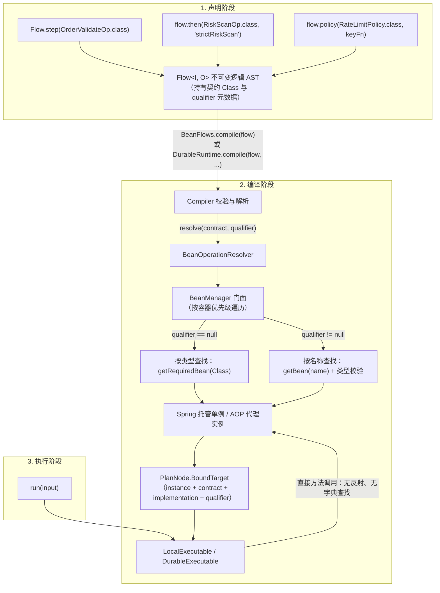

# Bean 容器集成

> 层级：L1 集成件 · 前置：quick-start 2.x · 模块：team4u-flow-bean + team4u-bean(-spring)

`team4u-flow-bean` **不引入任何新的流程语义**：四态 Outcome、节点编排、执行器行为与 core 完全一致。它只做一件事——把"节点写法"从 Lambda/实例扩展到 **Class** 与 **Class + qualifier** 的容器绑定：编译期由 `BeanOperationResolver` 一次性解析并绑定单例，运行期直接调用已绑定实例（零反射查找），Spring 事务与 AOP 代理原样保留。对 L1 用户而言，它是进入容器环境的自然延伸，**不是新的一层**。

在没有它之前，用户面临两难：只传硬编码实例，则装配处充斥手工对象组装（真实业务的 Operation/Policy 往往依赖 DAO、RPC 客户端、缓存与配置）；引入运行期字符串反射查找的引擎，则丢失编译期类型安全并付出每次调用的反射开销。Bean 绑定取两者的中点：**声明期只写 Class（类型安全），编译期一次性绑定（一次性成本），执行期直调（零反射）**。

---

# 1. 三种绑定形式

## 1.1 总览

| 绑定形式 | 写法 | 解析时机 | 适用场景 |
| :--- | :--- | :--- | :--- |
| 实例绑定 | `Flow.step(lambda)` / `Flow.step(new Op())` | 无需解析，直接持有 | 纯 Java 模式、测试、简单步骤 |
| Class 绑定 | `Flow.step(ValidateOp.class)` | 编译期按类型查找唯一 Bean | Spring 托管的单例节点 |
| Class + qualifier 绑定 | `Flow.step(PaymentOp.class, "onlinePayment")` | 编译期按 Bean 名称查找 | 同一契约存在多个实现（如多支付渠道） |

三种形式的**编排语义完全相同**——Class 绑定只是把"实例从哪来"推迟到编译期回答。类型查找要求容器中该类型**唯一匹配**；同类型存在多个候选时应改用 qualifier。

## 1.2 支持类绑定的 DSL 入口

所有构建入口均有对应的 Class / Class+qualifier 重载：

| 编排操作 | 类型绑定 | 类型 + 限定符绑定 |
| :--- | :--- | :--- |
| 单步起点 | `Flow.step(Class<Op>)` | `Flow.step(Class<Op>, "beanName")` |
| 顺序步骤 | `flow.then(Class<Op>)` | `flow.then(Class<Op>, "beanName")` |
| 可选步骤 | `flow.thenOptional(Class<Op>)` | `flow.thenOptional(Class<Op>, "beanName")` |
| 上下文调用 | `flow.use(Class<Op>, proj, merge)` | `flow.use(Class<Op>, "beanName", proj, merge)` |
| 条件路由 | `Flow.route(Class<Op>)` | `Flow.route(Class<Op>, "beanName")` |
| 并行分支 | `Branch.of(name, Class<Op>)` | `Branch.of(name, Class<Op>, "beanName")` |
| 无状态网关 | `flow.policy(Class<Policy>, keyFn)` | `flow.policy(Class<Policy>, "beanName", keyFn)` |
| 持久化策略 | `flow.persistentPolicy(Class<PPolicy>, keyFn)` | `flow.persistentPolicy(Class<PPolicy>, "beanName", keyFn)` |

## 1.3 可选 Bean 步骤

当某 Bean 只适用于部分输入、后续节点仍需继续时，Bean 应返回真实 Skipped，并用 `thenOptional` 编排：

```java
@Component
public class CouponEnrichmentOperation
        implements Operation<OrderRequest, OrderRequest> {

    @Override
    public Outcome<OrderRequest> execute(
            OperationContext context, OrderRequest order) {
        if (order.getCouponCode() == null) {
            return Outcome.skipped(Reason.of("NO_COUPON", "订单没有优惠券"));
        }
        return Outcome.accepted(order.applyCoupon());
    }
}

Flow<OrderRequest, Receipt> flow = Flow.step(ValidateOrderOperation.class)
        .thenOptional(CouponEnrichmentOperation.class)
        .thenOptional(MemberEnrichmentOperation.class, "memberEnrichmentOperation")
        .then(PaymentOperation.class, "onlinePaymentOperation");
```

解析仍发生在编译期，Skipped 节点的代理、qualifier、节点元数据与完成事件全部保留；只有 Skipped 被 optional 边界处理（透传进入前原值），Rejected/Failed 照常终止流水线。

类型约束：`thenOptional` 的 Bean 契约必须是 `Operation<O, O>`——原值透传只在输入输出类型相同时才安全。跨类型场景应使用普通 `then`，或用同类型候选流程显式构造 `firstApplicable`。完整作用域规则见[核心语义](flow-semantics.md)。

---

# 2. Spring 环境接入

## 2.1 依赖引入

通过统一 BOM 引入（版本对齐仓库发布版本）：

```xml
<dependencies>
    <!-- Flow 与 Bean 绑定模块（传递引入 team4u-flow、team4u-bean） -->
    <dependency>
        <groupId>com.team4u</groupId>
        <artifactId>team4u-flow-bean</artifactId>
    </dependency>

    <!-- Spring 容器适配器（Spring 环境必需） -->
    <dependency>
        <groupId>com.team4u</groupId>
        <artifactId>team4u-bean-spring</artifactId>
    </dependency>
</dependencies>
```

## 2.2 声明业务组件

业务操作直接用 `@Component` / `@Service` 声明，自由注入 Spring 依赖，支持 `@Transactional` 等注解：

```java
import com.team4u.framework.flow.api.Operation;
import com.team4u.framework.flow.api.OperationContext;
import com.team4u.framework.flow.model.*;
import org.springframework.beans.factory.annotation.Autowired;
import org.springframework.stereotype.Component;
import org.springframework.transaction.annotation.Transactional;

@Component
public class ValidateOrderOperation implements Operation<OrderRequest, OrderRequest> {

    @Autowired
    private OrderRuleRepository ruleRepository;

    @Override
    public Outcome<OrderRequest> execute(OperationContext context, OrderRequest order) {
        if (order.getAmount() <= 0) {
            return Outcome.rejected(Reason.of("INVALID_AMOUNT", "订单金额必须为正数"));
        }
        if (!ruleRepository.isValidRegion(order.getRegion())) {
            return Outcome.rejected(Reason.of("UNSUPPORTED_REGION", "不支持的配送区域"));
        }
        return Outcome.accepted(order);
    }
}

// 支付扣款节点：声明式事务与 AOP 代理正常生效（见 3.4 节）
@Component("onlinePaymentOperation")
public class PaymentOperation implements Operation<OrderRequest, Receipt> {

    @Autowired
    private PaymentGatewayClient paymentGatewayClient;

    @Override
    @Transactional(rollbackFor = Exception.class)
    public Outcome<Receipt> execute(OperationContext context, OrderRequest order) {
        // 利用 context.invocationId() 保证外部调用幂等
        PaymentResponse response = paymentGatewayClient.charge(
                context.invocationId(), order.getOrderId(), order.getAmount());

        if (!response.isSuccess()) {
            return Outcome.failed(Failure.of("PAYMENT_FAILED", response.getErrorMessage()));
        }
        return Outcome.accepted(
                new Receipt(order.getOrderId(), response.getTxId(), "PAID"));
    }
}
```

## 2.3 装配流程与编译

`@Import(Team4uBeanConfiguration.class)` 会把 `SpringBeanContainer` 注册为 Spring Bean；它在拿到 `ApplicationContext` 时自动注册进全局 `BeanManager`（见 3.2 节）。Flow 定义与编译放在同一个 `@Configuration`：

```java
import com.example.order.flow.*;
import com.team4u.framework.bean.spring.Team4uBeanConfiguration;
import com.team4u.framework.flow.Flow;
import com.team4u.framework.flow.LocalExecutable;
import com.team4u.framework.flow.bean.BeanFlows;
import org.springframework.context.annotation.*;

@Configuration
@Import(Team4uBeanConfiguration.class) // 桥接 Spring 容器至 BeanManager
public class OrderFlowConfiguration {

    @Bean
    public Flow<OrderRequest, Receipt> orderFlowDefinition() {
        // 声明纯逻辑流：仅引用契约类型与限定符，不持有 Bean 实例
        return Flow.step(ValidateOrderOperation.class)
                .then(PaymentOperation.class, "onlinePaymentOperation");
    }

    @Bean
    public LocalExecutable<OrderRequest, Receipt> orderExecutable(
            Flow<OrderRequest, Receipt> orderFlowDefinition) {
        // 编译期一次性从 Spring 容器解析全部 Bean 绑定
        return BeanFlows.compile(orderFlowDefinition);
    }
}
```

## 2.4 执行

业务 Service 注入编译产物直接调用，行为与 core 完全一致：

```java
@Service
public class OrderServiceImpl implements OrderService {

    @Autowired
    private LocalExecutable<OrderRequest, Receipt> orderExecutable;

    @Override
    public OrderResponse handleOrder(OrderRequest request) {
        FlowResult<Receipt> result = orderExecutable.run(request);

        if (result instanceof FlowResult.Completed) {
            Outcome<Receipt> outcome = ((FlowResult.Completed<Receipt>) result).outcome();
            if (outcome instanceof Outcome.Accepted) {
                return OrderResponse.success(((Outcome.Accepted<Receipt>) outcome).value());
            } else if (outcome instanceof Outcome.Rejected) {
                return OrderResponse.reject(((Outcome.Rejected<Receipt>) outcome).reason());
            } else {
                return OrderResponse.fail(((Outcome.Failed<Receipt>) outcome).failure());
            }
        }
        throw new IllegalStateException("Unexpected execution result: " + result);
    }
}
```

---

# 3. 解析机制

## 3.1 解析链路



## 3.2 BeanManager 门面与容器优先级

`BeanManager` 是 team4u-bean 提供的全局门面（`BeanManager.getInstance()` 单例），按 `getOrder()` 优先级遍历一串 `BeanFactory` 容器：

| 容器 | 优先级 | 说明 |
| :--- | :--- | :--- |
| `SpringBeanContainer` | 100（高） | Spring 适配器。**只有作为 Spring Bean 装配并注入 `ApplicationContext` 时才激活**，激活时自动注册进 `BeanManager`；未激活或上下文未就绪时返回 null，不参与查找 |
| `LocalBeanContainer` | 兜底 | 基于 `ConcurrentHashMap` 的本地容器，支持 `registerBean` 动态注册，发布 `BeanInitializedEvent` |
| 其他 | 自定义 | 通过 Java SPI 声明的 `BeanFactory` 实现会被自动发现并按 order 排序；单个实现初始化失败仅告警跳过 |

`getBean(Class)` / `getBean(String)` 返回**第一个**匹配容器中的实例；名称冲突时高优先级容器胜出。

## 3.3 编译期一次性解析与缓存

`BeanFlows.compile(flow)` 内部调用 `Local.compile(flow, new BeanOperationResolver(beanManager))`，编译器对每个类绑定：

1. 先做绑定合法性检查：契约必须实现对应的 marker 接口（`Operation` / `Policy` / `PersistentPolicy`），否则报 `INVALID_BINDING`；
2. 以 `(contract, qualifier, kind)` 为键调用 `resolver.resolve(contract, qualifier)`——**解析结果与失败信息都会缓存**：同一 Bean 被多个节点引用只查找一次；同一失败被多个节点引用时，每个节点都报出**同一条**错误消息；
3. 校验解析对象确实实现了 marker 接口与声明的具体契约，否则报 `BINDING_TYPE`；
4. 绑定为 `PlanNode.BoundTarget`（instance + contract + implementation + qualifier），执行器持有实例硬引用。

编译完成后，`run` 只做直接方法调用，不走任何字典检索与反射查找。若用 `Local.compile(flow)`（默认拒绝解析器）编译含类绑定的流程，同样在编译期报 `MISSING_BINDING: No resolver for com.example.MyOperation`。

`BeanFlows` 门面一览：

| 入口 | 说明 |
| :--- | :--- |
| `BeanFlows.compile(flow)` | 用全局 `BeanManager` 编译内存流 |
| `BeanFlows.compile(flow, beanManager)` | 用指定 `BeanManager` 编译 |
| `BeanFlows.resolver()` | 全局 `BeanManager` 的解析器（供 `Local.compile(flow, resolver)` 挂载） |
| `BeanFlows.resolver(beanManager)` | 指定 `BeanManager` 的解析器 |

`BeanOperationResolver` 亦可直接构造：`new BeanOperationResolver()`（全局）或 `BeanOperationResolver.global()`。

## 3.4 动态代理与事务/切面保留

Spring 中的 Bean 常被代理包装（JDK 动态代理、CGLIB、事务拦截器、安全切面）。框架分两个阶段区别对待：

- **执行期代理原样保留**：`BeanOperationResolver` 查找到 Spring 代理对象后**原样绑定**（不 unwrap、不复刻）。流程驱动该节点时调用的是代理本身，`@Transactional`、日志拦截、安全校验等拦截链路完整触发。JDK 代理与 CGLIB 代理均有测试守护（同一代理实例原样绑定、advice 恰好执行一次）。
- **描述期智能解包**：生成只读描述模型 `FlowDescription`（用于图渲染与日志，见[可视化](flow-graph.md)）时，`OperationResolver.implementationClass(resolved)` 对 JDK 动态代理解包出第一个非 marker 契约接口，避免图中出现 `com.sun.proxy.$Proxy42` 这类代理类名；非代理对象返回实际 Class。

## 3.5 纯 Java 环境使用

无 Spring 时，直接向本地容器注册单例即可使用同一套绑定语法：

```java
import com.team4u.framework.bean.BeanManager;
import com.team4u.framework.flow.bean.BeanFlows;

// 1. 在本地容器中手动注册单例（带名 / 以类全限定名为名）
BeanManager.getInstance().registerBean("customValidator", new CustomValidateOperation());
BeanManager.getInstance().registerBean(new DefaultPaymentOperation());

// 2. 编译并运行
LocalExecutable<OrderRequest, Receipt> executable = BeanFlows.compile(flow);
```

---

# 4. Durable 长流程支持

Durable 执行器同样支持 Bean 绑定——挂载同一个解析器即可：

```java
import com.team4u.framework.flow.bean.BeanFlows;
import com.team4u.framework.flow.durable.*;

@Configuration
public class DurableFlowConfiguration {

    @Bean
    public DurableExecutable<OrderRequest, Receipt> durableOrderExecutable(
            DurableStore durableStore,
            Flow<OrderRequest, Receipt> orderFlowDefinition) {

        DurableRuntime runtime = DurableRuntime.builder(durableStore)
                .operationResolver(BeanFlows.resolver()) // 挂载 BeanOperationResolver
                .build();

        // 编译为持久化可执行对象（flowId + flowVersion）
        return runtime.compile(orderFlowDefinition, "order-fulfillment", 1);
    }
}
```

检查点快照**绝不序列化任何 Bean 实例或代码**，只保存流程元数据与经 `StateMapper` 编码的业务载荷。崩溃重启后执行 `recover(executionId)`，新进程通过 `BeanOperationResolver` 重新从容器取得单例继续驱动——这也是 `StateMapper`/`StoredValue` 要求确定性编码的原因之一。Durable 全貌见[持久化执行](flow-durable.md)。

---

# 5. 常见错误排查

所有绑定错误都在**编译期**收集为 `FlowBuildException`，一条问题渲染为 `错误码 at 节点路径: 消息`（如 `MISSING_BINDING at $/0: ...`），多条用分号聚合一次抛出。`problems()` 可编程读取 `(code, path, message)` 列表。

### 1. 未找到目标 Bean
- **现象**：`MISSING_BINDING at $/0: No qualifying bean of type com.example.MyOperation`
- **原因**：容器中不存在该类型的 Bean。若用 `Local.compile(flow)`（默认拒绝解析器）编译类绑定，消息为 `No resolver for com.example.MyOperation`。
- **解决**：确认类上有 `@Component` / `@Service` 且在组件扫描范围内；Spring 环境确认已 `@Import(Team4uBeanConfiguration.class)`；同类型存在多个候选也会走到这里——改用 qualifier 指定。

### 2. 限定符不匹配
- **现象**：`MISSING_BINDING at $/1: No bean named 'strictValidator' for contract com.example.ValidateOperation`
- **原因**：按名称找不到该 Bean——限定符拼写与 `@Component("strictValidator")` 声明不一致，或该名称未注册。
- **解决**：核对限定符与 Bean 名称拼写；纯 Java 环境确认已 `registerBean("strictValidator", ...)`。

### 3. 限定符找到但类型不匹配
- **现象**：`MISSING_BINDING at $/0: Bean named 'myBean' has type com.example.OtherService but must implement com.example.ValidateOperation`
- **原因**：按名称找到了 Bean，但它未实现声明的契约接口（`BeanOperationResolver` 抛出该消息，编译器包装为 `MISSING_BINDING`）。
- **解决**：确保绑定的类实现 `Operation<I, O>` / `Policy<K>` / `PersistentPolicy<K, S>` 对应契约。

### 4. 解析对象未实现契约（BINDING_TYPE）
- **现象**：`BINDING_TYPE at $/0: Resolved object does not implement Operation`（或具体契约名）
- **原因**：解析器返回了非 null 对象，但未实现 marker 接口或声明的具体契约。使用 `BeanOperationResolver` 时罕见（其自身已做契约校验），多见于自定义 `OperationResolver` 返回了仅实现泛化接口的对象。
- **解决**：让 resolver 返回严格实现声明契约的实例；契约与实现的匹配规则见[扩展机制](flow-extension.md)。

---

# 6. 延伸阅读

- [核心语义](flow-semantics.md)：四态流转与 optional/firstApplicable 完整规则；[扩展机制](flow-extension.md)：`OperationResolver` SPI。
- [快速开始](quick-start.md) 2.2 节：容器绑定最短示例；[实战案例](flow-sample.md)：Spring 完整业务流。
