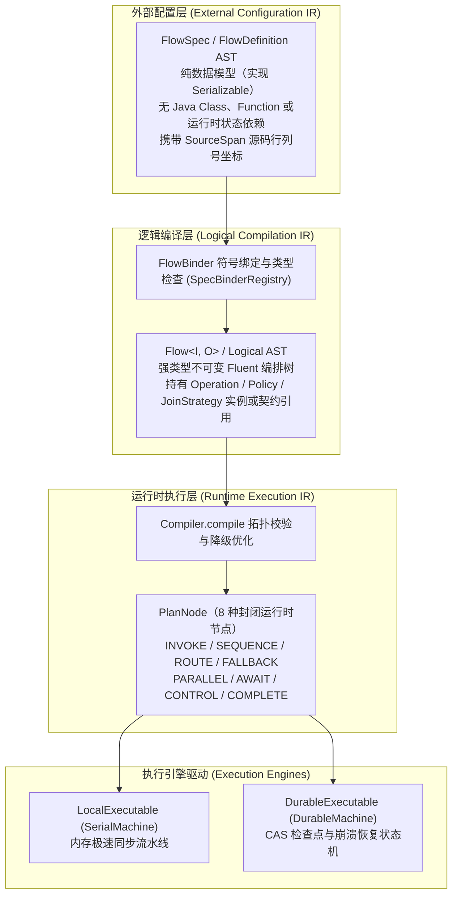
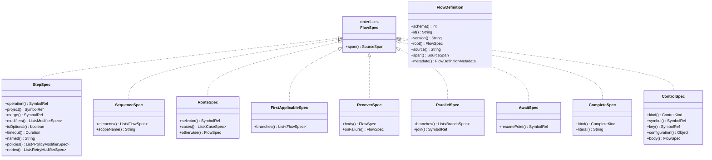
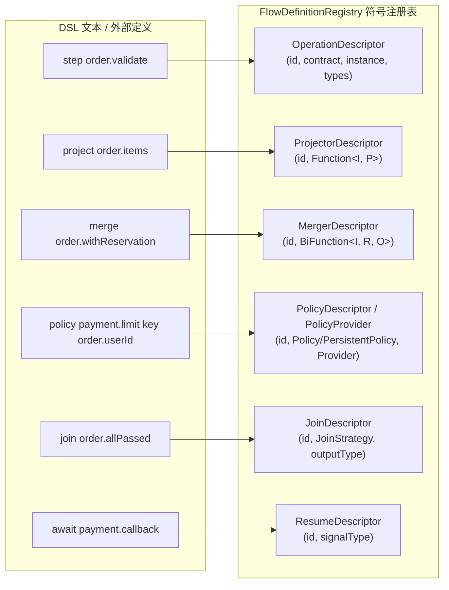
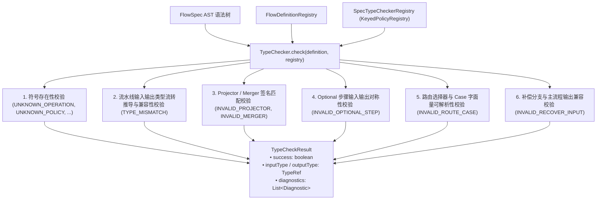
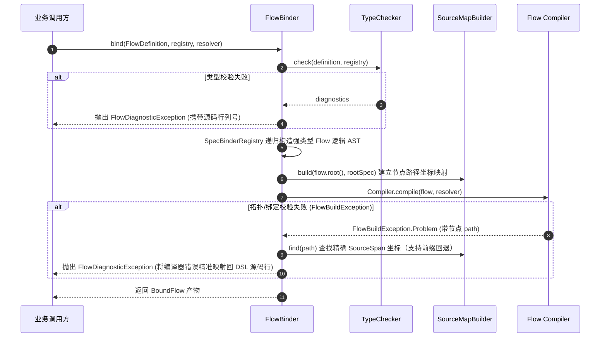

# 外部流程定义与符号注册 (team4u-flow-definition)

`team4u-flow-definition` 提供了面向外部配置（文本 DSL、JSON、YAML、低代码可视化引擎等）的纯数据流程定义模型（FlowSpec AST）、解耦符号注册表（FlowDefinitionRegistry）、静态类型推导与校验系统（TypeChecker）、源码坐标映射（SourceMap）、配置字典安全提取器（ConfigMapReader）以及不可变流程发布器（FlowPublisher）。

---

## 引入依赖

```xml
<dependency>
    <groupId>com.team4u</groupId>
    <artifactId>team4u-flow-definition</artifactId>
</dependency>
```

---

## 三层中间表示架构 (Three-tier IR System)

`team4u-flow` 采用严格分层的三层中间表示（Intermediate Representation, IR）架构，实现配置层、编译层与执行层的正交解耦：



### 三层 IR 对比说明

| 层次 | 核心模型 | 状态与依赖特征 | 核心作用与职责 |
| :--- | :--- | :--- | :--- |
| **外部配置 IR** | [`FlowDefinition`](file:///root/code/team4u-framework/modules/flow/definition/src/main/java/com/team4u/framework/flow/definition/model/FlowDefinition.java), [`FlowSpec`](file:///root/code/team4u-framework/modules/flow/definition/src/main/java/com/team4u/framework/flow/definition/model/FlowSpec.java) | 纯数据、无代码/Lambda、强不可变集合包装 | 承载 DSL 语法树、JSON/YAML 配置及可视化建模输出，精确记录源码行列坐标 |
| **逻辑编译 IR** | [`Flow`](file:///root/code/team4u-framework/modules/flow/core/src/main/java/com/team4u/framework/flow/Flow.java), [`Logical`](file:///root/code/team4u-framework/modules/flow/core/src/main/java/com/team4u/framework/flow/compiler/Logical.java) | 强类型、不可变、绑定具体 Operation 与策略契约 | 负责步骤输入输出类型推导、组合语义校验与双投影描述 |
| **运行时执行 IR** | [`PlanNode`](file:///root/code/team4u-framework/modules/flow/core/src/main/java/com/team4u/framework/flow/compiler/PlanNode.java) | 封闭 8 种节点、编译优化、扁平化拓扑 | 驱动内存栈虚拟机（Local）与持久化状态机（Durable）稳定执行 |

---

## 纯数据 AST 模型全景 (FlowSpec AST)

所有外部配置模型均实现 [`FlowSpec`](file:///root/code/team4u-framework/modules/flow/definition/src/main/java/com/team4u/framework/flow/definition/model/FlowSpec.java) 接口，且严格为不可变的纯数据载体。构造函数内部全部实施防御性拷贝与 `Collections.unmodifiableList` / `Collections.unmodifiableMap` 包装。



### 核心语法节点说明

- [`StepSpec`](file:///root/code/team4u-framework/modules/flow/definition/src/main/java/com/team4u/framework/flow/definition/model/StepSpec.java)：业务步骤规范，持有 operation 符号以及附带的修饰器列表，内聚提供 `project()`、`merge()`、`isOptional()`、`timeout()`、`named()`、`policies()`、`retries()` 等只读解析方法。
- [`SequenceSpec`](file:///root/code/team4u-framework/modules/flow/definition/src/main/java/com/team4u/framework/flow/definition/model/SequenceSpec.java)：顺序执行流水线规范，保持严格不可变列表 `elements`。
- [`RouteSpec`](file:///root/code/team4u-framework/modules/flow/definition/src/main/java/com/team4u/framework/flow/definition/model/RouteSpec.java)：多路条件路由规范，包含选择器 `selector`、条件分支列表 `cases` 与缺省分支 `otherwise`。
- [`FirstApplicableSpec`](file:///root/code/team4u-framework/modules/flow/definition/src/main/java/com/team4u/framework/flow/definition/model/FirstApplicableSpec.java)：首选候选分支规范，按序尝试各分支直至出现首个非 `Skipped` 结果。
- [`RecoverSpec`](file:///root/code/team4u-framework/modules/flow/definition/src/main/java/com/team4u/framework/flow/definition/model/RecoverSpec.java)：失败补偿规范，包裹主执行体 `body` 与故障发生时的补偿分支 `onFailure`。
- [`ParallelSpec`](file:///root/code/team4u-framework/modules/flow/definition/src/main/java/com/team4u/framework/flow/definition/model/ParallelSpec.java)：结构化并发规范，包含多命名分支 `branches` 与结果汇聚策略 `join` 符号。
- [`AwaitSpec`](file:///root/code/team4u-framework/modules/flow/definition/src/main/java/com/team4u/framework/flow/definition/model/AwaitSpec.java)：异步外部挂起规范，持有挂起点符号 `resumePoint`。
- [`CompleteSpec`](file:///root/code/team4u-framework/modules/flow/definition/src/main/java/com/team4u/framework/flow/definition/model/CompleteSpec.java)：终态常数结果规范。种类（`CompleteKind`）覆盖 `ACCEPTED`、`REJECTED`、`SKIPPED`、`FAILED`，附带字面量或错误码 `literal`。
- [`ControlSpec`](file:///root/code/team4u-framework/modules/flow/definition/src/main/java/com/team4u/framework/flow/definition/model/ControlSpec.java)：作用域级治理控制规范。类型（`ControlKind`）覆盖 `POLICY`、`RETRY`、`TIMEOUT`、`NAMED`、`SCOPE`，并包裹被治理的目标 `body`。

### 修饰器规范体系 (ModifierSpec)

修饰器用于对单个步骤或作用域进行增强，统一实现 [`ModifierSpec`](file:///root/code/team4u-framework/modules/flow/definition/src/main/java/com/team4u/framework/flow/definition/model/ModifierSpec.java) 接口：

| 修饰器模型 | 语法表达 | 语义与作用 |
| :--- | :--- | :--- |
| [`ProjectModifierSpec`](file:///root/code/team4u-framework/modules/flow/definition/src/main/java/com/team4u/framework/flow/definition/model/ProjectModifierSpec.java) | `project <projector-id>` | 从上游复合状态中提取当前步骤所需的入参（$I \to P$） |
| [`MergeModifierSpec`](file:///root/code/team4u-framework/modules/flow/definition/src/main/java/com/team4u/framework/flow/definition/model/MergeModifierSpec.java) | `merge <merger-id>` | 将步骤产出结果合并回主状态流水线（$(I, R) \to O$） |
| [`OptionalModifierSpec`](file:///root/code/team4u-framework/modules/flow/definition/src/main/java/com/team4u/framework/flow/definition/model/OptionalModifierSpec.java) | `optional` | 声明可选步骤；步骤弃权返回 `Skipped` 时自动透传步骤入口原值继续执行 |
| [`NamedModifierSpec`](file:///root/code/team4u-framework/modules/flow/definition/src/main/java/com/team4u/framework/flow/definition/model/NamedModifierSpec.java) | `named "<label>"` | 为步骤或作用域赋予业务展示标签，用于可视化图表与日志追踪 |
| [`TimeoutModifierSpec`](file:///root/code/team4u-framework/modules/flow/definition/src/main/java/com/team4u/framework/flow/definition/model/TimeoutModifierSpec.java) | `timeout <duration>` | 为步骤配置执行超时时限（如 `1s`, `500ms`） |
| [`PolicyModifierSpec`](file:///root/code/team4u-framework/modules/flow/definition/src/main/java/com/team4u/framework/flow/definition/model/PolicyModifierSpec.java) | `policy <policy-id> [key <key-id>] [{ ... }]` | 绑定无状态或持久化治理切面策略，并支持传入键提取器与参数 Map |
| [`RetryModifierSpec`](file:///root/code/team4u-framework/modules/flow/definition/src/main/java/com/team4u/framework/flow/definition/model/RetryModifierSpec.java) | `retry <retry-id> [{ ... }]` | 绑定重试治理策略，支持配置最大重试次数与退避算法 |

---

## 符号注册表设计 (FlowDefinitionRegistry)

[`FlowDefinitionRegistry`](file:///root/code/team4u-framework/modules/flow/definition/src/main/java/com/team4u/framework/flow/definition/registry/FlowDefinitionRegistry.java) 是连接外部纯数据 DSL 符号与运行时 Java 对象的统一符号注册表。

通过 Registry，DSL 中的字符串标识（如 `order.validate`、`payment.rate-limit`）在编译绑定期被解析为具体的 Java 实例、Spring Bean 契约 Class 或函数委托。



### 描述符模型速查

- [`OperationDescriptor`](file:///root/code/team4u-framework/modules/flow/definition/src/main/java/com/team4u/framework/flow/definition/registry/OperationDescriptor.java)：业务步骤描述符。可直接持有 `Operation<?, ?>` 实例，或持有契约接口 Class 与可选限定符（`qualifier`），并附带强类型的 `inputType` 与 `outputType`。
- [`ProjectorDescriptor`](file:///root/code/team4u-framework/modules/flow/definition/src/main/java/com/team4u/framework/flow/definition/registry/ProjectorDescriptor.java)：入参提取函数描述符，持有 $I \to P$ 转换函数。
- [`MergerDescriptor`](file:///root/code/team4u-framework/modules/flow/definition/src/main/java/com/team4u/framework/flow/definition/registry/MergerDescriptor.java)：结果合并函数描述符，持有 $(I, R) \to O$ 合并双函数。
- [`KeyProjectionDescriptor`](file:///root/code/team4u-framework/modules/flow/definition/src/main/java/com/team4u/framework/flow/definition/registry/KeyProjectionDescriptor.java)：策略路由键提取函数描述符，持有 $I \to K$ 提取函数。
- [`PolicyDescriptor`](file:///root/code/team4u-framework/modules/flow/definition/src/main/java/com/team4u/framework/flow/definition/registry/PolicyDescriptor.java)：策略描述符。支持无状态 `Policy<K>` 与有状态断点续跑 `PersistentPolicy<K, S>`。
- [`PolicyProvider`](file:///root/code/team4u-framework/modules/flow/definition/src/main/java/com/team4u/framework/flow/definition/registry/PolicyProvider.java) 与 [`PolicyBinding`](file:///root/code/team4u-framework/modules/flow/definition/src/main/java/com/team4u/framework/flow/definition/registry/PolicyBinding.java)：动态策略提供者接口。根据 DSL 传入的键值参数 Map 动态构造策略实例（例如限流策略的 permits 与 action、重试策略的 maxAttempts 与 backoff）。
- [`JoinDescriptor`](file:///root/code/team4u-framework/modules/flow/definition/src/main/java/com/team4u/framework/flow/definition/registry/JoinDescriptor.java)：并行汇聚策略描述符，持有 `JoinStrategy<?>` 实例或契约 Class。
- [`ResumeDescriptor`](file:///root/code/team4u-framework/modules/flow/definition/src/main/java/com/team4u/framework/flow/definition/registry/ResumeDescriptor.java)：异步挂起点描述符，定义外部唤醒信号类型 `signalType`。

### 注册表示例代码

```java
FlowDefinitionRegistry registry = FlowDefinitionRegistry.builder()
        // 注册业务原子步骤（指定实例或契约 Class + 泛型）
        .operation("order.validate", new ValidateOrderOp(), OrderContext.class, OrderContext.class)
        .operation("inventory.reserve", InventoryService.class, "defaultInventory", OrderItems.class, ReserveResult.class)
        
        // 注册投影与合并函数
        .projector("order.items", OrderContext.class, OrderItems.class, OrderContext::getItems)
        .merger("order.withReservation", OrderContext.class, ReserveResult.class, OrderContext.class, 
                (ctx, res) -> ctx.toBuilder().reservationId(res.getId()).build())
        
        // 注册键提取函数
        .keyProjection("order.userId", OrderContext.class, String.class, OrderContext::getUserId)
        
        // 注册并行汇聚策略与挂起点
        .join("order.allPassed", JoinStrategy.allAccepted(), OrderContext.class)
        .resumePoint("payment.callback", PaymentNotifySignal.class)
        .build();
```

### SPI 扩展与自动装配机制 (FlowDefinitionExtension)

为了支持各功能子模块（如 `team4u-flow-retry`、`team4u-flow-ratelimiter`）向注册表贡献其特有的策略 Provider 与描述符，框架定义了 [`FlowDefinitionExtension`](file:///root/code/team4u-framework/modules/flow/definition/src/main/java/com/team4u/framework/flow/definition/registry/FlowDefinitionExtension.java) SPI：

```java
public interface FlowDefinitionExtension {
    void contribute(FlowDefinitionRegistry.Builder registry);
}
```

在调用 `FlowDefinitionRegistry.builder()` 时，底层自动通过 `ServiceLoaderUtil.loadAvailableList(FlowDefinitionExtension.class)` 扫描 classpath 并自动注入扩展；若需要完全空白且不加载 SPI 的纯净注册表，可使用 `FlowDefinitionRegistry.empty()`。

---

## 强类型配置读取器 (ConfigMapReader)

[`ConfigMapReader`](file:///root/code/team4u-framework/modules/flow/definition/src/main/java/com/team4u/framework/flow/definition/util/ConfigMapReader.java) 封装了 DSL 声明的弱类型参数 Map，基于 `team4u-base` 的 `ConvertUtil` 提供安全防御与类型推导能力：

- **多别名支持**：`reader.getInt("maxAttempts", "max-attempts")` 自动兼容驼峰与中划线命名；
- **自适应类型转换**：自动完成 `String`、`Number`、`Duration`（如 `200ms`, `5s`）、`Enum`（大小写兼容）的安全转换；
- **优雅默认值**：支持 `reader.getDuration("backoff", Duration.ofMillis(100))` 缺省回退与 `require(...)` 强制校验。

在自定义策略提供器（`PolicyProvider`）中使用示例：

```java
public class CustomPolicyProvider implements PolicyProvider {
    @Override
    public PolicyBinding create(Map<String, Object> configuration) {
        ConfigMapReader reader = ConfigMapReader.of(configuration);
        int permits = reader.getInt(1, "permits", "limit");
        Duration timeout = reader.getDuration("timeout", Duration.ofSeconds(1));
        Action action = reader.getEnum(Action.class, Action.FAIL, "action");
        
        return PolicyBinding.builder()
                .instance(new CustomPolicy(permits, timeout, action))
                .persistent(false)
                .build();
    }
}
```

---

## 静态类型检查系统 (Type Checking System)

[`TypeChecker`](file:///root/code/team4u-framework/modules/flow/definition/src/main/java/com/team4u/framework/flow/definition/type/TypeChecker.java) 负责在编译前深度遍历 `FlowSpec` AST，执行端到端的静态类型推导与契约校验。

底层采用策略注册表 [`SpecTypeCheckerRegistry`](file:///root/code/team4u-framework/modules/flow/definition/src/main/java/com/team4u/framework/flow/definition/type/SpecTypeCheckerRegistry.java) 进行分发，每类 AST 节点由专用的 [`SpecTypeChecker`](file:///root/code/team4u-framework/modules/flow/definition/src/main/java/com/team4u/framework/flow/definition/type/SpecTypeChecker.java) 负责类型推导，保持高度模块化与开闭原则。



### 类型引用系统 (TypeRef)

[`TypeRef`](file:///root/code/team4u-framework/modules/flow/definition/src/main/java/com/team4u/framework/flow/definition/type/TypeRef.java) 是类型系统的统一抽象，用于描述数据类型及其多态赋值兼容性：

- [`ClassTypeRef`](file:///root/code/team4u-framework/modules/flow/definition/src/main/java/com/team4u/framework/flow/definition/type/ClassTypeRef.java)：基于标准 Java 类的类型引用。
- [`ResumedTypeRef`](file:///root/code/team4u-framework/modules/flow/definition/src/main/java/com/team4u/framework/flow/definition/type/ResumedTypeRef.java)：挂起恢复信号复合类型引用 `Resumed<V, S>`，表达原上下文值与唤醒信号的组合。
- [`RecoveryTypeRef`](file:///root/code/team4u-framework/modules/flow/definition/src/main/java/com/team4u/framework/flow/definition/type/RecoveryTypeRef.java)：失败降级复合类型引用 `Recovery<I>`，表达初始输入与失败诊断的组合。
- `TypeRef.ANY`：通配类型常量（对应 `Object.class`），与任何类型均可兼容赋值。

### 文本字面量编解码器 (TypeCodec & TypeCodecs)

[`TypeCodec<T>`](file:///root/code/team4u-framework/modules/flow/definition/src/main/java/com/team4u/framework/flow/definition/type/TypeCodec.java) 负责 DSL 文本字面量与 Java 类型值之间的双向转换。[`TypeCodecs`](file:///root/code/team4u-framework/modules/flow/definition/src/main/java/com/team4u/framework/flow/definition/type/TypeCodecs.java) 提供了开箱即用的标准编解码器：

- **基础数据类型**：`STRING`, `BOOLEAN`, `INTEGER`, `LONG`, `DOUBLE`, `FLOAT`, `SHORT`, `BYTE`；
- **时间长度类型**：`DURATION`（支持 `100ms`, `3s`, `5m`, `1h`, `10d`, `PT10S` 等）；
- **动态枚举编解码**：`TypeCodecs.forEnum(Class<E>)`（支持严格匹配与大小写不敏感匹配）。

---

## 符号绑定与错误映射 (FlowBinder & SourceMapBuilder)

[`FlowBinder`](file:///root/code/team4u-framework/modules/flow/definition/src/main/java/com/team4u/framework/flow/definition/binding/FlowBinder.java) 是将外部纯数据 AST 转换为强类型 [`Flow`](file:///root/code/team4u-framework/modules/flow/core/src/main/java/com/team4u/framework/flow/Flow.java) 逻辑树的核心桥梁。

内部采用策略注册表 [`SpecBinderRegistry`](file:///root/code/team4u-framework/modules/flow/definition/src/main/java/com/team4u/framework/flow/definition/binding/SpecBinderRegistry.java) 驱动各类节点的实例化绑定，并由独立组件 [`SourceMapBuilder`](file:///root/code/team4u-framework/modules/flow/definition/src/main/java/com/team4u/framework/flow/definition/binding/SourceMapBuilder.java) 建立 Compiler Path 到源码 [`SourceSpan`](file:///root/code/team4u-framework/modules/flow/definition/src/main/java/com/team4u/framework/flow/definition/model/SourceSpan.java) 的精准映射表与前缀回退查找能力。



### 绑定产物 (BoundFlow)

绑定成功后产出 [`BoundFlow`](file:///root/code/team4u-framework/modules/flow/definition/src/main/java/com/team4u/framework/flow/definition/binding/BoundFlow.java)，包含以下核心资产：

- `flow()`：强类型且经过验证的 `Flow<?, ?>` 逻辑 AST；
- `sourceMap()`：只读映射表，记录每个节点绝对路径（如 `$/0`, `$/1/selector`, `$/1/case:0`）对应的源码 [`SourceSpan`](file:///root/code/team4u-framework/modules/flow/definition/src/main/java/com/team4u/framework/flow/definition/model/SourceSpan.java)；
- `metadata()`：流程元数据（`schema`, `id`, `version`, `source`）；
- `compileLocal(resolver)`：极速编译为内存同步执行器 [`LocalExecutable`](file:///root/code/team4u-framework/modules/flow/core/src/main/java/com/team4u/framework/flow/LocalExecutable.java)；
- `describe()`：导出结构化描述模型 [`FlowDescription`](file:///root/code/team4u-framework/modules/flow/core/src/main/java/com/team4u/framework/flow/desc/FlowDescription.java)（用于图表渲染）。

### 诊断与异常体系 (Diagnostic & FlowDiagnosticException)

所有在词法解析、类型推导、符号绑定与编译器拓扑校验阶段发现的错误，均统一封装为 [`Diagnostic`](file:///root/code/team4u-framework/modules/flow/definition/src/main/java/com/team4u/framework/flow/definition/diagnostic/Diagnostic.java) 对象并由 [`FlowDiagnosticException`](file:///root/code/team4u-framework/modules/flow/definition/src/main/java/com/team4u/framework/flow/definition/diagnostic/FlowDiagnosticException.java) 抛出：

```
order.flow:18:9: [TYPE_MISMATCH] ($/1/0) Operation 'payment.charge' expects input PaymentRequest but received OrderContext
```

常见诊断错误码（[`DiagnosticCodes`](file:///root/code/team4u-framework/modules/flow/definition/src/main/java/com/team4u/framework/flow/definition/diagnostic/DiagnosticCodes.java)）：

| 诊断码 | 所属阶段 | 含义说明 |
| :--- | :--- | :--- |
| `DSL_SYNTAX_ERROR` | Parser | DSL 文本语法错误、非预期字符或未闭合括号 |
| `UNKNOWN_OPERATION` | Symbol | DSL 中引用的 Operation 标识未在 Registry 中注册 |
| `UNKNOWN_POLICY` | Symbol | DSL 中引用的 Policy 标识未在 Registry 中注册 |
| `UNKNOWN_PROJECTOR` | Symbol | DSL 中引用的 Projector 标识未在 Registry 中注册 |
| `UNKNOWN_MERGER` | Symbol | DSL 中引用的 Merger 标识未在 Registry 中注册 |
| `UNKNOWN_JOIN` | Symbol | DSL 中引用的 Join 策略未在 Registry 中注册 |
| `UNKNOWN_RESUME_POINT`| Symbol | DSL 中引用的 Await 挂起点未在 Registry 中注册 |
| `TYPE_MISMATCH` | Type | 上游输出与下游输入类型不兼容，或补偿分支类型不匹配 |
| `INVALID_ROUTE_CASE` | Type | 路由 Case 的字面量值无法解码为 Selector 的输出类型 |
| `INVALID_OPTIONAL_STEP`| Type | 可选步骤的输入与输出类型不一致（无法安全透传原值） |
| `PARALLEL_AWAIT` | Compiler | 静态死锁防御：严禁在并行分支内使用 `await` 挂起 |
| `DUPLICATE_SCOPE` | Compiler | 流程中存在同名的 `scope` 边界定义 |

---

## 不可变发布器 (FlowPublisher)

[`FlowPublisher`](file:///root/code/team4u-framework/modules/flow/definition/src/main/java/com/team4u/framework/flow/definition/publish/FlowPublisher.java) 是流程定义发布生命周期的核心管理器，严格保障已发布流程版本的**不可变性契约（Immutable flowId + flowVersion）**。

### 核心机制与原子发布

- **唯一键版本隔离**：以 `flowId:flowVersion` 作为全局并发安全的隔离键；
- **并发原子发布**：内部采用 `ConcurrentHashMap.putIfAbsent` 保障多线程/多节点原子提交；
- **覆写防御**：任何尝试原地修改、覆盖已发布同版本流程的操作均直接拒绝并抛出 `IllegalStateException`，从架构底层根绝运行中流程定义被篡改而导致快照恢复错乱的风险。

```java
FlowPublisher publisher = new FlowPublisher(registry, beanResolver);

// 首次发布版本 1
BoundFlow boundV1 = publisher.publish(definitionV1);

// 尝试重复发布版本 1 将直接抛出 IllegalStateException: Flow definition is immutable once published: order.process:1
// publisher.publish(modifiedV1); // 拒绝覆盖

// 发布新版本 2
BoundFlow boundV2 = publisher.publish(definitionV2);

// 检索已发布版本
BoundFlow current = publisher.get("order.process", "2");
LocalExecutable<OrderContext, OrderResult> executable = current.compileLocal();
```
