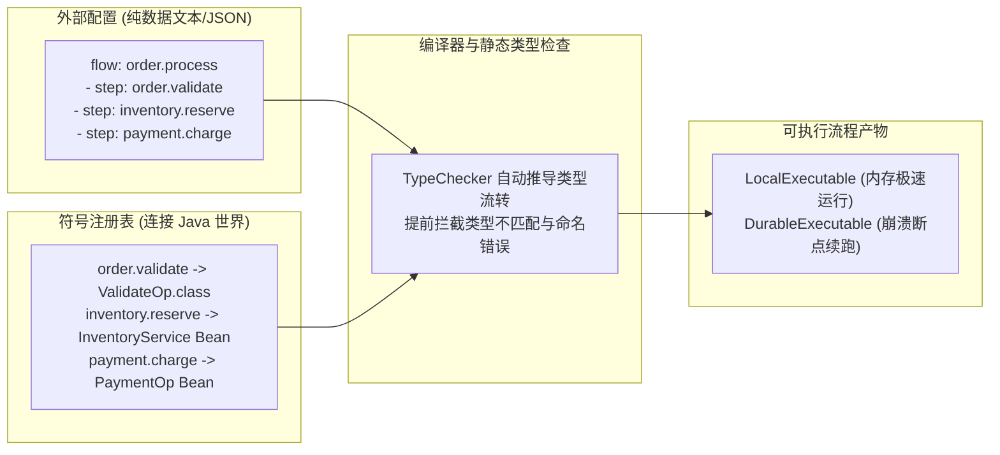
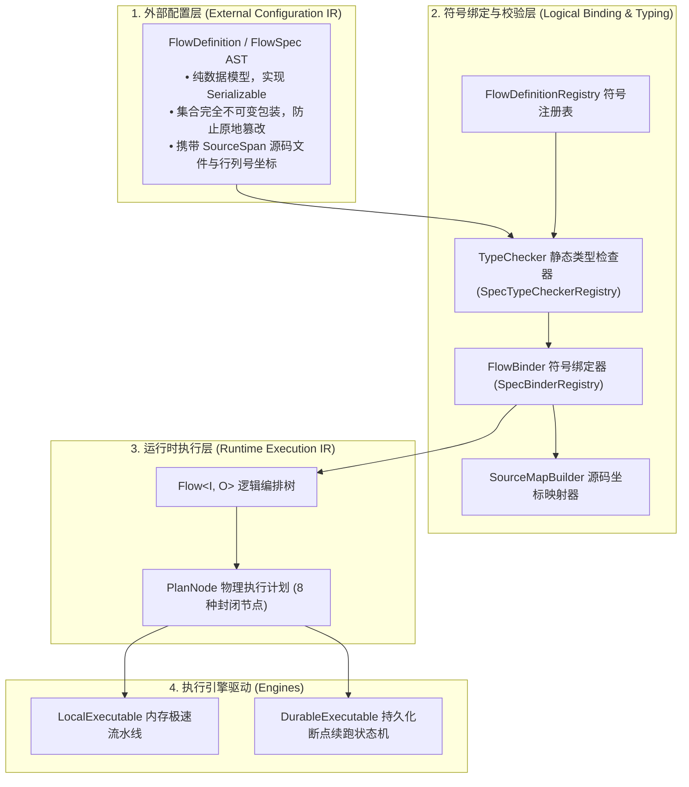
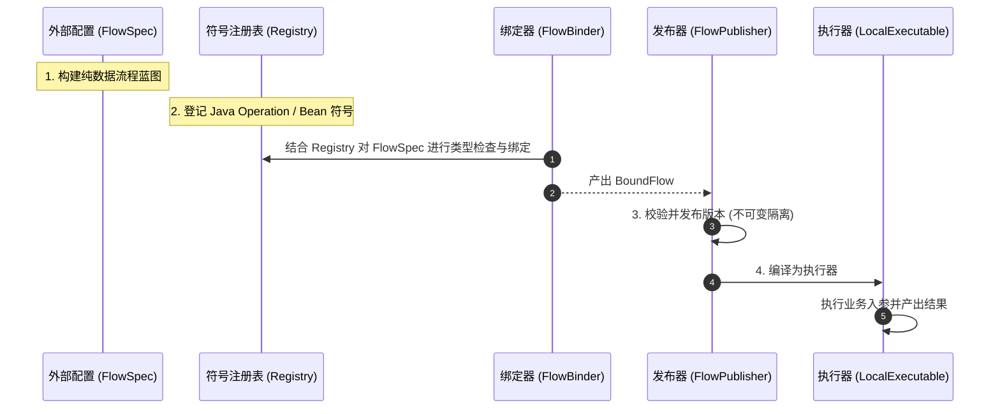
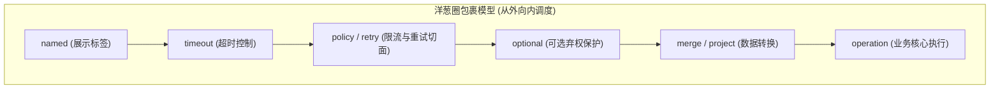

# 外部流程定义与符号注册 (team4u-flow-definition)

`team4u-flow-definition` 是流程引擎连接外部世界（如文本 DSL、JSON/YAML 配置、数据库动态规则、低代码可视化编排等）的核心桥梁。

通过纯数据描述与运行时解耦的架构，它允许开发者在不修改、不重新发布 Java 代码的前提下，动态下发并组装业务流程，同时享受编译级的静态类型检查与极致的执行性能。

---

## 引入依赖

```xml
<dependency>
    <groupId>com.team4u</groupId>
    <artifactId>team4u-flow-definition</artifactId>
</dependency>
```

---

## 为什么需要这个模块

在传统的业务流程开发中，我们通常面临两难的选择：

- **硬编码在 Java 代码中**：类型安全且执行速度极快，但业务流程一旦变动（例如大促期间调整履约规则、增加风控校验），必须重新编译并上线发布；
- **使用传统的动态脚本或反射引擎**：虽然支持配置化，但通常直接在 JSON 配置文件中写满 Java 类名、包路径，不仅重构容易引发线上崩溃，而且缺乏类型检查，配置一旦写错只有在真实用户请求跑到那一步时才会抛出异常。

`team4u-flow-definition` 提出了全新的解决方案：



- **纯数据解耦**：流程定义是一份纯粹的数据蓝图（`FlowSpec`），只记录业务步骤的名字（如 `order.validate`），绝不硬编码任何 Java 类名或 Lambda 表达式，天然支持存储在 MySQL、Redis 或配置中心；
- **符号显式映射**：通过符号注册表（`FlowDefinitionRegistry`），将字符串名字显式绑定到 Spring Bean 或 Java 方法，杜绝不安全的动态反射；
- **启动期静态类型推导**：通过 `TypeChecker` 在流程加载时自动推导整个流水线的入参和出参，提前拦截类型不匹配的错误；
- **不可变发布与防篡改**：通过 `FlowPublisher` 保证发布后的版本全局不可变，彻底消除并发运行时的脏覆盖风险。

---

## 核心架构与设计模型

框架内部严格划分为三层抽象，职责清晰正交：



| 层次 | 核心载体 | 核心特点与职责 |
| :--- | :--- | :--- |
| **外部配置层** | [`FlowDefinition`](file:///root/code/team4u-framework/modules/flow/definition/src/main/java/com/team4u/framework/flow/definition/model/FlowDefinition.java), [`FlowSpec`](file:///root/code/team4u-framework/modules/flow/definition/src/main/java/com/team4u/framework/flow/definition/model/FlowSpec.java) | 纯数据 AST，无代码依赖，用于接收 DSL/JSON/低代码平台输出 |
| **符号绑定层** | [`FlowDefinitionRegistry`](file:///root/code/team4u-framework/modules/flow/definition/src/main/java/com/team4u/framework/flow/definition/registry/FlowDefinitionRegistry.java), [`FlowBinder`](file:///root/code/team4u-framework/modules/flow/definition/src/main/java/com/team4u/framework/flow/definition/binding/FlowBinder.java) | 将字符串符号解析为 Java 实例/Bean 契约，完成类型推导与拓扑校验 |
| **运行时执行层** | [`PlanNode`](file:///root/code/team4u-framework/modules/flow/core/src/main/java/com/team4u/framework/flow/compiler/PlanNode.java) | 编译优化后的只读执行拓扑，驱动 Local/Durable 引擎运行 |

---

## 核心使用步骤与完整示例

使用 `team4u-flow-definition` 构建动态流程只需直观的四步：



### 定义纯数据流程蓝图 (FlowSpec)

在不依赖任何 Java 业务类的前提下，构建一个包含“参数校验 -> 锁定库存 -> 扣减支付”的顺序流水线蓝图：

```java
// 声明三个原子业务步骤的符号引用
StepSpec validateStep = new StepSpec(SymbolRef.of("order.validate"), null, null);
StepSpec inventoryStep = new StepSpec(SymbolRef.of("inventory.reserve"), null, null);
StepSpec paymentStep = new StepSpec(SymbolRef.of("payment.charge"), null, null);

// 组合为顺序流水线 AST
SequenceSpec pipeline = new SequenceSpec(Arrays.asList(validateStep, inventoryStep, paymentStep), null);

// 包装为完整的流程定义（包含流程标识与版本号）
FlowDefinition definition = new FlowDefinition(
        1,                     // schema 规范版本
        "order.fulfillment",   // 流程全局唯一标识
        "1.0",                 // 流程版本号
        pipeline               // 根语法节点
);
```

### 在符号表中登记真实的 Java 组件 (FlowDefinitionRegistry)

将上述蓝图中引用的字符串标识（`order.validate` 等），映射到具体的 Java 实例、方法引用或 Spring Bean 契约上。

框架内置了**泛型反射自动推导机制**，只要传入具体的组件实现类或实例，框架将自动分析接口签名提取入参和出参类型，**无需手动重复声明 `Class<I>, Class<O>`**：

```java
FlowDefinitionRegistry registry = FlowDefinitionRegistry.builder()
        // 自动反射推导 ValidateOrderOp 的入参 OrderContext 与出参 OrderContext
        .operation("order.validate", new ValidateOrderOp())
        
        // 自动反射推导 Spring 契约接口的泛型类型，并在运行时从 Spring 容器解析
        .operation("inventory.reserve", InventoryService.class, "defaultInventory")
        
        // 自动反射推导契约 Class
        .operation("payment.charge", ChargePaymentOp.class)
        .build();
```

> [!TIP]
> **约定优于配置（Convention Fallback）**：
> 如果 Spring 容器中已经存在与 DSL 符号同名的 Bean（如 `@Component("order.validate")`），`FlowDefinitionRegistry` 默认会通过 `BeanOperationResolver` 进行回退查找并自动推导其泛型类型。这意味着在标准 Spring Boot 项目中，**即使不在 Registry 中显式登记该符号，也能直接零代码解析并执行**！

> [!TIP]
> **SPI 自动发现**：
> `FlowDefinitionRegistry.builder()` 默认会自动通过 `ServiceLoaderUtil` 扫描 classpath 下的所有扩展（如 `team4u-flow-retry`、`team4u-flow-ratelimiter`），无需手动编写策略注册代码即可自动获得开箱即用的重试与限流能力。

### 静态类型检查与符号绑定 (FlowBinder)

使用 `FlowBinder` 进行一键编译绑定。绑定器会自动完成：
1. 校验流程中引用的每个符号是否存在（先查显式注册表，未命中则自动回退到 Spring 容器）；
2. 静态推导上游步骤的输出类型是否满足下游步骤的输入要求；
3. 将纯数据 AST 转换为强类型 `Flow<I, O>` 并生成行列号坐标映射（`SourceMap`）。

```java
// 执行绑定（如果类型不匹配或符号不存在，会即时抛出 FlowDiagnosticException）
BoundFlow boundFlow = FlowBinder.bind(definition, registry);

System.out.println("输入类型: " + boundFlow.inputType().typeName());
System.out.println("输出类型: " + boundFlow.outputType().typeName());
```

> [!TIP]
> **Spring Bean 自动解析**：
> 只要项目中引入了 `team4u-flow-bean`（配合 `team4u-bean-spring`），`FlowBinder` 默认会通过 SPI 自动加载 [`BeanOperationResolver`](file:///root/code/team4u-framework/modules/flow/bean/src/main/java/com/team4u/framework/flow/bean/BeanOperationResolver.java)，自动完成 Spring 单例 Bean 与限定符的依赖注入，无需在代码中手动传递任何 resolver 参数。

若配置中存在类型不兼容（例如上游输出 `OrderContext`，下游步骤却需要 `PaymentRequest`），编译器将在启动时立即报错并精确指出问题节点：

```
[TYPE_MISMATCH] ($/2) Operation 'payment.charge' expects input PaymentRequest but received OrderContext
```

### 原子发布与并发执行 (FlowPublisher)

通过 `FlowPublisher` 进行版本发布。发布器保障同一个 `(flowId, version)` 一旦发布即全局不可变，并支持随时获取已编译好的极速执行器：

```java
FlowPublisher publisher = new FlowPublisher(registry);

// 发布 1.0 版本
publisher.publish(definition);

// 尝试重复发布相同版本 1.0 将被拒绝并抛出异常，防止线上配置脏覆盖
// publisher.publish(definition); // Throws IllegalStateException

// 检索已发布流程并编译为极速内存执行器
BoundFlow bound = publisher.get("order.fulfillment", "1.0");
LocalExecutable<OrderContext, OrderResult> executable = bound.compileLocal();

// 执行流程
OrderContext context = new OrderContext("ORD-10001", 199.00);
FlowResult<OrderResult> result = executable.run(context);

if (result.isAccepted()) {
    OrderResult output = result.requireAccepted();
    System.out.println("订单履约成功: " + output.getPaymentId());
}
```

---

## 纯数据语法节点全景 (FlowSpec 家族)

所有语法节点均实现 [`FlowSpec`](file:///root/code/team4u-framework/modules/flow/definition/src/main/java/com/team4u/framework/flow/definition/model/FlowSpec.java) 接口，支持自由组合嵌套：

| 语法节点模型 | 表达的业务语义 | 核心属性与方法 |
| :--- | :--- | :--- |
| [`StepSpec`](file:///root/code/team4u-framework/modules/flow/definition/src/main/java/com/team4u/framework/flow/definition/model/StepSpec.java) | 单个原子业务步骤 | `operation()`（业务符号）、`project()`（入参提取）、`merge()`（结果合并）、`modifiers()`（修饰器列表） |
| [`SequenceSpec`](file:///root/code/team4u-framework/modules/flow/definition/src/main/java/com/team4u/framework/flow/definition/model/SequenceSpec.java) | 顺序执行流水线 | `elements()`（按序执行的子节点只读列表）、`scopeName()`（命名作用域） |
| [`RouteSpec`](file:///root/code/team4u-framework/modules/flow/definition/src/main/java/com/team4u/framework/flow/definition/model/RouteSpec.java) | 多路条件分支路由 | `selector()`（选择器符号）、`cases()`（Case 分支列表）、`otherwise()`（兜底分支） |
| [`FirstApplicableSpec`](file:///root/code/team4u-framework/modules/flow/definition/src/main/java/com/team4u/framework/flow/definition/model/FirstApplicableSpec.java) | 按优先级尝试候选分支 | `branches()`（候选分支列表，遇 `Skipped` 自动尝试下一个，首个 `Accepted` 即终止） |
| [`RecoverSpec`](file:///root/code/team4u-framework/modules/flow/definition/src/main/java/com/team4u/framework/flow/definition/model/RecoverSpec.java) | 失败降级与补偿 | `body()`（主执行流）、`onFailure()`（主流程发生 `Failed` 时的补偿流） |
| [`ParallelSpec`](file:///root/code/team4u-framework/modules/flow/definition/src/main/java/com/team4u/framework/flow/definition/model/ParallelSpec.java) | 结构化多分支并发 | `branches()`（多命名并发分支）、`join()`（汇聚策略符号，如 `allAccepted`） |
| [`AwaitSpec`](file:///root/code/team4u-framework/modules/flow/definition/src/main/java/com/team4u/framework/flow/definition/model/AwaitSpec.java) | 异步外部挂起等待 | `resumePoint()`（挂起点符号，等待外部异步信号唤醒） |
| [`CompleteSpec`](file:///root/code/team4u-framework/modules/flow/definition/src/main/java/com/team4u/framework/flow/definition/model/CompleteSpec.java) | 显式返回终态结果 | `kind()`（`ACCEPTED`/`REJECTED`/`SKIPPED`/`FAILED`）、`literal()`（原因码/描述） |
| [`ControlSpec`](file:///root/code/team4u-framework/modules/flow/definition/src/main/java/com/team4u/framework/flow/definition/model/ControlSpec.java) | 作用域级策略控制 | `kind()`（`TIMEOUT`/`POLICY`/`RETRY`/`SCOPE`/`NAMED`）、`configuration()`、`body()` |

---

## 步骤修饰器与洋葱圈模型 (Step Modifiers)

单个业务步骤（[`StepSpec`](file:///root/code/team4u-framework/modules/flow/definition/src/main/java/com/team4u/framework/flow/definition/model/StepSpec.java)）可以通过修饰器列表（[`ModifierSpec`](file:///root/code/team4u-framework/modules/flow/definition/src/main/java/com/team4u/framework/flow/definition/model/ModifierSpec.java)）叠加治理能力：



### 内置修饰器一览

- **入参提取 (`project`)**：从上游复合上下文大对象中只提取当前步骤需要的字段入参（$I \to P$）；
- **结果合并 (`merge`)**：将步骤执行返回的局部结果合并回主状态流水线（$(I, R) \to O$）；
- **可选步骤 (`optional`)**：声明该步骤为可选；当步骤弃权返回 `Skipped` 时，自动透传步骤入口原值继续执行后续流程；
- **业务标签 (`named`)**：为步骤赋予中文展示名称，用于日志追踪与 Mermaid 流程图可视化；
- **超时控制 (`timeout`)**：指定该步骤的最大允许耗时（如 `500ms`, `2s`）；
- **策略切面 (`policy`)**：绑定限流、鉴权等治理切面，支持指定路由 Key 提取器与配置字典；
- **重试切面 (`retry`)**：绑定重试策略，支持动态配置最大重试次数与退避时长。

---

## 强类型配置读取器 (MapReader)

在编写自定义策略提供者（[`PolicyProvider`](file:///root/code/team4u-framework/modules/flow/definition/src/main/java/com/team4u/framework/flow/definition/registry/PolicyProvider.java)）时，外部传入的配置通常是弱类型的 `Map<String, Object>`。[`MapReader`](file:///root/code/team4u-framework/modules/base/core/src/main/java/com/team4u/framework/base/util/MapReader.java) 提供了统一的安全读取工具：

```java
public class MyRateLimitProvider implements PolicyProvider {
    @Override
    public PolicyBinding create(Map<String, Object> configuration) {
        MapReader reader = MapReader.of(configuration);

        // 支持多别名容错（自动兼容 camelCase 与 kebab-case 命名）
        int permits = reader.getInt("permits", 1, "limit-count");
        Duration timeout = reader.getDuration("timeout", Duration.ofSeconds(1));
        Action action = reader.getEnum(Action.class, "action", Action.REJECT);

        return PolicyBinding.builder()
                .instance(new RateLimitPolicy(permits, timeout, action))
                .persistent(false)
                .build();
    }
}
```

---

## 常见问题与最佳实践

### 外部流程定义可以直接持久化到数据库吗？

可以。所有的 `FlowDefinition`、`FlowSpec` 与 `SourceSpan` 模型均实现了 `java.io.Serializable`，并且内部不包含任何 Class 或函数引用。你可以直接使用通用的 JSON 序列化工具（如 Jackson、Fastjson）将其存为数据库 TEXT 字段，或者存放在 Nacos、Apollo 等配置中心。

### 为什么修改了已发布的流程定义版本会抛出异常？

在分布式与持久化断点续跑场景中，若正在运行的流程定义被原地篡改，会导致已持久化的状态快照在恢复时发生节点对齐错乱。因此 `FlowPublisher` 强制实施不可变版本约束：当业务流程变更时，应递增版本号（例如从 `1.0` 升级为 `2.0`）进行发布，旧版本流程继续支撑存量任务平滑运行。

### 如何排查流程绑定时的类型错误？

`FlowBinder` 抛出的 [`FlowDiagnosticException`](file:///root/code/team4u-framework/modules/flow/definition/src/main/java/com/team4u/framework/flow/definition/diagnostic/FlowDiagnosticException.java) 包含了完整的结构化诊断信息列表。通过 `ex.diagnostics()` 可以直接获取每个错误的诊断码（如 `TYPE_MISMATCH`）、节点路径（如 `$/1/0`）以及 DSL 源码所在的行列号。
