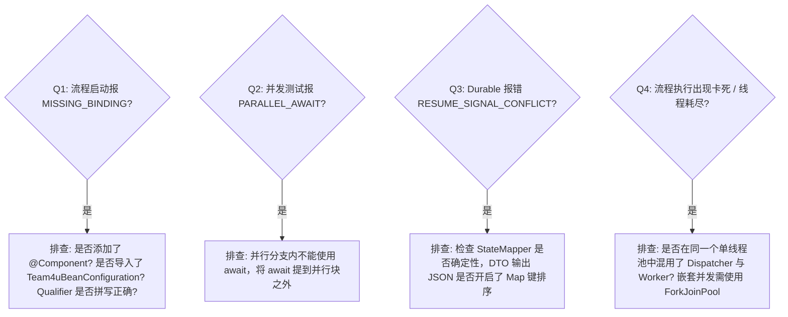

# 诊断码体系与故障排查手册

在复杂的业务流程编排、异步长事务与跨系统调用中，快速定位故障根因是运维治理的关键。

`team4u-flow` 建立了全链路覆盖的**标准诊断码体系**，严禁未受检异常向外逃逸，将所有编译期违规、运行时业务拒绝/弃权、系统技术失败与 Durable 状态机异常收敛为稳定、不可变的诊断码。

本文汇总了框架完整的诊断码清单、触发场景、底层根因及生产排查自查指南。

---

## 诊断码全景分类架构

```mermaid
graph TD
    DIAG["team4u-flow 诊断体系"]
    
    subgraph "编译期拓扑与契约诊断 (FlowBuildException)"
        B1["DUPLICATE_LABEL / DUPLICATE_SCOPE"]
        B2["PARALLEL_AWAIT / PARALLEL_PERSISTENT_POLICY"]
        B3["INVALID_BINDING / MISSING_BINDING / BINDING_TYPE / DUPLICATE_ROUTE_CASE"]
    end
    
    subgraph "运行时 Failed 失败诊断 (FlowDiagnosticCodes)"
        R1["OPERATION_EXCEPTION / OPERATION_INTERRUPTED / OPERATION_CANCELLED"]
        R2["TIMEOUT / EXECUTOR_REJECTED / WAIT_INTERRUPTED"]
        R3["POLICY_EXCEPTION / JOIN_EXCEPTION / PARALLEL_EXCEPTION / QUORUM_NOT_REACHED"]
    end
    
    subgraph "运行时 Skipped 弃权诊断 (Reason.code)"
        S1["NO_ROUTE / NO_APPLICABLE_BRANCH"]
    end
    
    subgraph "Durable 持久化状态机异常 (DurableException.Error)"
        D0["INVALID_DEFINITION / INVALID_CONFIGURATION / FORMAT_MISMATCH"]
        D1["REVISION_CONFLICT / FLOW_MISMATCH / RESUME_SIGNAL_CONFLICT"]
        D2["EXECUTION_EXISTS / EXECUTION_NOT_FOUND / CODEC_FAILURE / STORE_FAILURE"]
        D3["LIFECYCLE_MISMATCH / RESUME_POINT_MISMATCH / FRAME_MISMATCH / ASYNC_EXECUTOR_MISSING"]
    end
    
    DIAG --> B1 & B2 & B3
    DIAG --> R1 & R2 & R3
    DIAG --> S1
    DIAG --> D0 & D1 & D2 & D3
```

---

## 编译期静态校验诊断码

当调用 `Local.compile(flow)` 或 `Durable.compile(flow, ...)` 时，框架对拓扑结构与 Bean 契约进行严格静态扫描。若存在违规项，将聚合所有违规路径并抛出 `FlowBuildException`（非受检异常，直接继承自 `RuntimeException`，不会被针对参数校验异常 `IllegalArgumentException` 的通用捕获逻辑误伤），可通过 `exception.problems()` 获取全部诊断明细：

| 诊断码 | 校验分类 | 触发原因 | 修复建议 |
| :--- | :--- | :--- | :--- |
| **`DUPLICATE_LABEL`** | 节点标签 | 同一节点被多次调用 `.named("xxx")` 赋予了不同标签 | 每个节点仅保留一个唯一的 `named` 声明 |
| **`DUPLICATE_SCOPE`** | 具名作用域 | 流程中存在两个同名的 `Flow.scope("name", ...)` | 检查具名作用域命名，确保全局唯一 |
| **`DUPLICATE_BRANCH`** | 并行分支 | `Flow.parallel` 中声明了相同名称的 `Branch.of("name", ...)` | 检查分支命名，区分各并发分支 |
| **`DUPLICATE_RESUME_POINT`** | 挂起点 | 同一流程定义内声明了同名的 `ResumePoint.named("point")` | 为不同的挂起步骤指定不同的挂起点名称 |
| **`PARALLEL_AWAIT`** | 并发约束 | 在 `parallel` 分支内部使用了 `await` 挂起点 | 并行分支禁止异步挂起，将挂起点提升至并行块之前或之后 |
| **`PARALLEL_PERSISTENT_POLICY`** | 并发约束 | 在 `parallel` 分支内部挂载了 `PersistentPolicy` | 策略持久化要求串行推进，将策略移至并行块外层 |
| **`INVALID_BINDING`** | 契约违规 | 绑定的 Class 未实现 `Operation`、`Policy` 或 `PersistentPolicy` 接口 | 确认绑定的类实现了框架对应的扩展点接口 |
| **`MISSING_BINDING`** | 依赖缺失 | `BeanManager` 容器中未找到声明的 Bean（类型或限定符不匹配） | 确认已加 `@Component`、在 Spring 扫描路径下，并检查 `@Import(Team4uBeanConfiguration.class)` |
| **`BINDING_TYPE`** | 实例类型 | 容器解析出的 Bean 实例与 Flow 声明的泛型契约不一致 | 检查 Spring 容器中同名 Bean 的实际实现类型 |
| **`DUPLICATE_ROUTE_CASE`** | 路由键 | `route().caseOf(key, ...)` 中声明了重复的 case 键 | 检查路由分支键，消除重复分支（声明时即刻抛出） |

---

## 运行时失败诊断码

当流程执行产生 `Outcome.Failed` 时，可通过 `failure.code()` 获取标准失败码：

| 失败码 | 触发场景 | 排查指引与自查步骤 |
| :--- | :--- | :--- |
| **`OPERATION_EXCEPTION`** | 业务 `Operation` 内部抛出了未捕获的 Exception 或返回了 null | 查看 `failure.message()` 中的异常类名与消息（框架已将异常类名拼入消息）、结合应用日志堆栈，排查业务代码空指针、RPC 故障或非法返回值 |
| **`OPERATION_INTERRUPTED`** | 操作执行线程被物理中断（`isInterrupted == true`） | 排查是否触发了外层 `timeout` 时限或外部调用了 `cancellation.cancel()` |
| **`OPERATION_CANCELLED`** | 操作在执行中主动检测到 `cancellation.isCancelled()` | 正常协作取消，无需额外处理 |
| **`TIMEOUT`** | 子流程执行耗时超出了 `timeout(Duration)` 设定的时限 | 检查下游 RPC 耗时、数据库慢查询或网络延迟 |
| **`EXECUTOR_REJECTED`** | 提交异步任务或并发分支时底层线程池饱和拒绝 (`RejectedExecutionException`) | 扩大 Worker 线程池容量或增加平滑降级策略 |
| **`WAIT_INTERRUPTED`** | 策略在退避延时（Backoff Sleep）等待中被线程中断 | 流程正在被协作取消或容器正在平滑停机 |
| **`POLICY_EXCEPTION`** | `Policy` 的 `before` 或 `after` 回调中抛出未捕获异常 | 检查自定义 Policy 中的逻辑，避免切面逻辑自身抛出未捕获异常 |
| **`JOIN_EXCEPTION`** | 自定义 `JoinStrategy.join()` 汇聚逻辑中抛出异常 | 检查汇聚函数中的空值判断与分支结果提取逻辑 |
| **`PARALLEL_EXCEPTION`** | 并行分支执行发生严重未捕获异常 | 查看分支内的根因堆栈并增加分支内错误捕获 |
| **`PARALLEL_INTERRUPTED`** | 主线程在等待并行分支完成时被中断 | 排查上层线程中断信号 |
| **`QUORUM_NOT_REACHED`** | `quorum(n)` 汇聚时，成功分支数未达到法定门槛 $n$ | 检查下游各服务节点的健康度与可用分支比例 |

---

## 运行时弃权诊断码

| 弃权码 | 触发场景 | 业务含义与处理建议 |
| :--- | :--- | :--- |
| **`NO_ROUTE`** | 条件路由 `route` 未命中任何 `caseOf` 且未提供 `otherwise` | 业务输入未匹配当前路由规则，若属正常现象可由外层 `firstApplicable` 降级 |
| **`NO_APPLICABLE_BRANCH`** | 并行汇聚使用 `firstAccepted()` 时无任何分支成功 | 所有并发分支均返回了非 Accepted 状态 |

---

## Durable 持久化异常

`DurableException` 为运行时异常（`extends RuntimeException`），携带固定错误码枚举 `Error`。完整码表如下：

| 错误码 | 严重级别 | 根本原因 | 运维处理指引 |
| :--- | :--- | :--- | :--- |
| **`INVALID_DEFINITION`** | 严重 (Error) | 流程定义非法（如快照恢复时拓扑校验失败、编译期结构违规） | 检查 Flow 定义结构，确认与落库快照的拓扑版本一致 |
| **`INVALID_CONFIGURATION`** | 错误 (Error) | 运行时配置非法 | 核对 `Durable` 装配参数（如 store、stateMapper 等） |
| **`REVISION_CONFLICT`** | 警告 (Warn) | 多个分布式节点并发驱动同一个 `executionId` 导致 CAS 冲突 | 正常并发竞争保护。客户端稍后重新读取最新快照重试 |
| **`FLOW_MISMATCH`** | 严重 (Error) | 尝试恢复的快照其 `flowId` 或 `flowVersion` 与当前代码不一致 | 确认是否发生了流程定义拓扑变更；使用与快照版本匹配的 Flow 运行时进行恢复 |
| **`FORMAT_MISMATCH`** | 严重 (Error) | 快照格式 ID 或格式版本与当前运行时不兼容 | 检查快照 `formatId`/`formatVersion`，确认集群内框架版本一致后重试 |
| **`RESUME_SIGNAL_CONFLICT`** | 严重 (Error) | 恢复信号落库后发生重启，外部重试时传入了**不同的信号载荷** | 检查外部回调网关的重试逻辑，确保幂等重试时注入完全相同的信号对象 |
| **`EXECUTION_EXISTS`** | 错误 (Error) | `start` 时指定的 `executionId` 在存储中已存在 | 检查流水号生成器，避免重复生成相同的流水号 |
| **`EXECUTION_NOT_FOUND`** | 错误 (Error) | 指定的 `executionId` 在存储中不存在 | 检查执行流水号是否正确，或确认数据库记录是否被过期清理 |
| **`CODEC_FAILURE`** | 严重 (Error) | `StateMapper` 编解码业务状态槽位失败 | 检查业务 DTO 是否有默认无参构造器、字段类型是否发生不兼容变更 |
| **`STORE_FAILURE`** | 严重 (Error) | 底层 `DurableStore` 发生数据库连接中断或 I/O 错误 | 检查底层 Redis / MySQL 存储连通性与网络状况 |
| **`LIFECYCLE_MISMATCH`** | 错误 (Error) | 在非法的生命周期下调用命令（例如对已 COMPLETED 实例调用 recover） | 校验调用时序，避免对终态实例再次发起驱动 |
| **`RESUME_POINT_MISMATCH`** | 错误 (Error) | resume 传入的挂起点名称与快照中实际等待的点不一致 | 核对外部回调注入的挂起点标识 |
| **`FRAME_MISMATCH`** | 严重 (Error) | 快照帧栈元数据损坏或与当前拓扑不匹配 | 排查存储数据完整性或代码结构变更 |
| **`ASYNC_EXECUTOR_MISSING`** | 错误 (Error) | 调用异步命令（`startAsync` / `resumeAsync`）但未配置 `executor` | 在 `Durable.builder` 中显式配置线程池 |

---

## 外部定义与 DSL 诊断码

当使用 `team4u-flow-definition` 或 `team4u-flow-dsl` 对外部纯数据 AST 进行词法扫描、语法解析、静态类型检查或符号绑定时，发现的所有错误均被封装为带源码行列号坐标的 [`Diagnostic`](file:///root/code/team4u-framework/modules/flow/definition/src/main/java/com/team4u/framework/flow/definition/diagnostic/Diagnostic.java) 对象并由 [`FlowDiagnosticException`](file:///root/code/team4u-framework/modules/flow/definition/src/main/java/com/team4u/framework/flow/definition/diagnostic/FlowDiagnosticException.java) 抛出：

| 诊断码 | 所属阶段 | 根本原因 | 修复指引 |
| :--- | :--- | :--- | :--- |
| **`DSL_SYNTAX_ERROR`** | Parser | DSL 文本语法错误、非预期记号或未闭合大括号 | 检查报错行号列号，修正 DSL 语法结构 |
| **`DSL_UNSUPPORTED_SCHEMA`** | Parser | DSL 声明的 `schema` 版本不受支持 | 当前支持 `schema 1` 与 `schema 2` |
| **`UNKNOWN_OPERATION`** | Symbol | DSL 中引用的步骤符号未在 `FlowDefinitionRegistry` 中注册 | 在 Registry 中通过 `.operation(id, ...)` 进行登记 |
| **`UNKNOWN_POLICY`** | Symbol | 引用的治理策略符号未在 Registry 中注册 | 在 Registry 中通过 `.policy(id, ...)` 或引入对应 SPI 模块 |
| **`UNKNOWN_PROJECTOR`** | Symbol | 引用的入参提取函数 `project` 符号未注册 | 在 Registry 中通过 `.projector(id, ...)` 注册对应映射函数 |
| **`UNKNOWN_MERGER`** | Symbol | 引用的结果合并函数 `merge` 符号未注册 | 在 Registry 中通过 `.merger(id, ...)` 注册对应合并双函数 |
| **`UNKNOWN_JOIN`** | Symbol | 并行引用的 `join` 汇聚策略未注册 | 在 Registry 中通过 `.join(id, ...)` 注册汇合策略 |
| **`UNKNOWN_RESUME_POINT`** | Symbol | 挂起引用的 `await` 挂起点未注册 | 在 Registry 中通过 `.resumePoint(id, ...)` 注册挂起点 |
| **`TYPE_MISMATCH`** | Type | 上游步骤输出类型与下游步骤输入类型不兼容 | 检查两步骤间的数据契约，必要时通过 `project`/`merge` 进行类型转换 |
| **`INVALID_ROUTE_CASE`** | Type | 路由 Case 的字面量值无法解码为 Selector 的输出类型 | 检查 `case` 后的常量值是否符合选择器返回类型的字面量格式 |
| **`INVALID_OPTIONAL_STEP`** | Type | 可选步骤的输入与输出类型不一致（无法在 Skipped 时透传原值） | 保证可选步骤的入参与出参类型对称 |
| **`INVALID_PROJECTOR`** | Type | Projector 的入参出参类型与流水线上下文或 Operation 不匹配 | 检查投影函数的入参是否兼容上游状态 |
| **`INVALID_MERGER`** | Type | Merger 的参数类型与主状态或 Operation 返回值不匹配 | 检查合并函数的签名是否匹配 |
| **`UNSUPPORTED_PROJECTION_SPEC`** | Binding | 投影规范类型不受当前绑定上下文支持 | 使用受支持的 `PropertyProjectionSpec` 或 `SymbolProjectionSpec` |
| **`UNSUPPORTED_MERGE_SPEC`** | Binding | 合并规范类型不受当前绑定上下文支持 | 使用受支持的 `PropertyMergeSpec` 或 `SymbolMergeSpec` |
| **`PROPERTY_NOT_READABLE`** | Property | 属性路径中属性缺少读取方法（无 getter 或不可读） | 补充属性读取方法或排查路径拼写 |
| **`PROPERTY_NOT_WRITABLE`** | Property | 属性路径中属性缺少写入方法（无 setter 或不可写） | 补充属性写入方法或排查路径拼写 |
| **`PROPERTY_NULL_VALUE`** | Property | 读取属性路径时遇到了 null 属性值 | 确保读取路径前置对象非空，或避免向 null 对象提取嵌套属性 |

---

## 常见反模式自查决策树

---

## 关联章节与进一步阅读

- 外部流程定义与静态类型检查：[外部流程定义与符号注册 (team4u-flow-definition)](flow-definition.md)
- 文本 DSL 语法与统一门面：[文本 DSL 语法与统一门面 (team4u-flow-dsl)](flow-dsl.md)
- 深入掌握四态模型与执行生命周期：[四态业务结果与生命周期模型](flow-outcome.md)
- 了解四态传播与短路规则：[四态传播规则与消费机制](flow-propagation.md)
- 查阅单元测试与断言工具：[测试支持与测试套件](flow-test.md)
- 了解 Durable 状态机核心机制：[Durable 状态机与 CAS 检查点机制](flow-durable-core.md)
