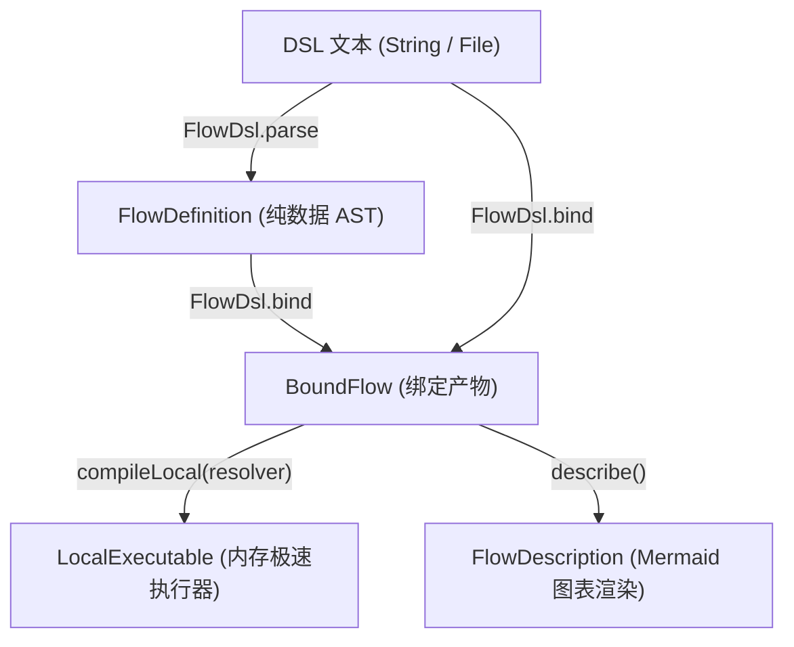

# 文本 DSL 语法与统一门面 (team4u-flow-dsl)

`team4u-flow-dsl` 提供了人类可读的流程声明式文本领域特定语言（Flow DSL）。通过极简、直观的类自然语言语法，开发者、业务人员与架构师可以轻松编排复杂的顺序流水线、条件路由、并行并发、超时限流、重试补偿与异步挂起流程，并由统一门面 `FlowDsl` 一键编译为强类型执行器。

---

## 引入依赖

```xml
<dependency>
    <groupId>com.team4u</groupId>
    <artifactId>team4u-flow-dsl</artifactId>
</dependency>
```

---

## 10 秒极简速览 (Quick Taste)

一份典型的 `.flow` 文件如下所示：

```dsl
schema 1

flow order.fulfillment version 1 {
    # 1. 基础校验
    step order.validate
    
    # 2. 锁定库存（带 1 秒超时与可选弃权保护）
    step inventory.reserve {
        project order.items
        merge order.withReservation
        timeout 1s
    }

    # 3. 扣减支付（自动重试 3 次，每次退避 100ms）
    step payment.charge {
        retry payment.standard {
            maxAttempts: 3,
            backoff: 100ms
        }
    }

    # 4. 根据支付结果多路分流
    route order.paymentStatus {
        case PAID {
            step order.fulfill
            step invoice.issue
        }
        case UNPAID {
            step order.close
            rejected "PAYMENT_FAILED"
        }
    }
}
```

在 Java 代码中只需一行即可编译并运行：

```java
// 结合符号表完成解析、类型检查并编译为极速执行器
BoundFlow bound = FlowDsl.bind(dslText, "order.flow", registry);
LocalExecutable<OrderContext, OrderContext> executable = bound.compileLocal();

// 执行业务流程
FlowResult<OrderContext> result = executable.run(new OrderContext("ORD-1001"));
```

---

## 核心设计理念

- **纯声明式与无隐式副作用**：无死循环、无全局可变变量，所有数据流转由入参出参严格驱动；
- **解耦符号身份**：DSL 文本中严格只使用业务字符串标识（如 `order.validate`、`payment.standard`），不暴露任何 Java 类名、包路径，彻底隔离配置层与实现层；
- **单模型多执行引擎 (Single Execution Model)**：同一份 DSL 既可编译为极速内存同步执行器（`Local`），也可直接驱动支持 CAS 检查点与断点续跑的持久化执行器（`Durable`）；
- **编译期零反射与精准报错**：在 `FlowDsl.bind` 时一次性完成静态类型推导与符号注入，运行时执行原生委托，零反射开销；语法错误精确提示到源码行号与列号。

---

## 语法速查卡片 (Syntax Cheat Sheet)

| 业务诉求 | DSL 语法表达 | 简要说明 |
| :--- | :--- | :--- |
| **声明流程** | `flow <flowId> [version <ver>] { ... }` | 声明一个具有全局唯一标识与版本号的流程 |
| **单步执行** | `step <operation-id>` | 执行一个业务原子操作 |
| **数据投影与合并** | `step op { project p; merge m; }` | 步骤入参提取（$I \to P$）与结果合并（$(I, R) \to O$） |
| **单步超时** | `step op { timeout 1s; }` | 限制步骤最长执行时间（支持 `ms`, `s`, `m`, `h`） |
| **策略治理切面** | `step op { policy p key k { ... } }` | 附加限流、鉴权等治理策略 |
| **重试与退避** | `step op { retry r { maxAttempts: 3 } }` | 附加失败重试策略与动态参数 |
| **可选步骤** | `step op { optional; }` | 步骤返回 `Skipped` 弃权时自动透传原值向下执行 |
| **条件路由** | `route selector { case A { ... } otherwise { ... } }` | 根据选择器返回值多路分流 |
| **优先级候选** | `firstApplicable { step c1; step c2; }` | 遇到 `Skipped` 自动尝试下一个，首个成功即采纳 |
| **失败补偿** | `recover { body { ... } onFailure { ... } }` | 主流程发生失败时的逆向补偿流水线 |
| **结构化并行** | `parallel { branch b1 { ... } join j; }` | 多分支并发执行与汇聚治理 |
| **异步挂起** | `await resumePoint` | 流程在此暂停并释放计算线程，等待外部信号唤醒 |
| **显式结果** | `accepted` / `rejected` / `skipped` / `failed` | 显式返回四态结果并终止当前分支 |
| **全局作用域** | `timeout 10s { ... }` / `scope "name" { ... }` | 对一组连续语句应用全局时限或划分逻辑边界 |

---

## 完整语法原语详解

### 流程声明与版本 (Flow Declaration)

每个 DSL 文本以可选的 `schema` 头部开头，随后使用 `flow` 声明根流程块：

```dsl
# 语法版本标识（当前为 schema 1）
schema 1

flow order.fulfillment version 1.0 {
    # 流程正文语句
}
```

### 步骤与修饰符 (Step & Modifiers)

原子业务步骤使用 `step <operation-id>` 声明，支持附加各类修饰器：

```dsl
step inventory.reserve {
    # 1. 入参提取：从大对象中提取当前步骤所需的入参 (I -> P)
    project order.items
    
    # 2. 结果合并：将步骤返回值合并回主状态 ((I, R) -> O)
    merge order.withReservation
    
    # 3. 可选跳过：步骤若弃权返回 Skipped，自动使用步骤入口原值继续执行
    optional
    
    # 4. 中文展示标签：用于日志与流程图渲染
    named "锁定商品库存"
    
    # 5. 单步超时
    timeout 2s
    
    # 6. 限流治理：指定限流 Key 提取器与配置字典
    policy inventory.rateLimit key order.userId {
        permits: 1,
        action: "REJECT"
    }
    
    # 7. 重试策略
    retry payment.standard {
        maxAttempts: 3,
        backoff: 100ms
    }
}
```

> [!NOTE]
> **洋葱圈嵌套规则 (Onion-Skin Model)**：
> 在单个 `step` 内声明多个修饰器时，框架严格由外向内包裹执行：`named -> timeout -> policy / retry -> optional -> merge/project(operation)`。

### 条件路由 (Route)

使用 `route <selector-id>` 根据选择器操作返回的键值进行多路分支匹配：

```dsl
route order.paymentStatus {
    case PAID {
        step order.fulfill
        step invoice.issue
    }
    case REFUNDED {
        step order.closeRefund
    }
    case CANCELLED {
        step inventory.release
    }
    otherwise {
        skipped "UNRECOGNIZED_STATUS"
    }
}
```

- `selector`：返回枚举、字符串、数字或布尔值的判决操作符；
- `case <literal>`：匹配特定分支（支持枚举名称、带引号字符串或数字）；
- `otherwise`：当所有 `case` 均未命中时的兜底流程（若未显式声明且未命中，默认以 `NO_ROUTE` 弃权短路）。

### 首选候选分支 (FirstApplicable)

表达按优先级尝试多个备选方案的语义。按顺序尝试各分支，只要遇到首个 `Accepted` 成功即采纳并结束；若返回 `Skipped` 弃权则自动尝试下一个备选：

```dsl
firstApplicable {
    # 候选 1：优先从本地高速缓存获取
    step cache.find
    
    # 候选 2：从分布式缓存集群获取
    step redis.find
    
    # 候选 3：回源数据库全量查询
    step db.find
}
```

### 失败恢复与补偿 (Recover)

声明针对业务拒绝（`Rejected`）或技术故障（`Failed`）的补偿流程：

```dsl
recover {
    body {
        step payment.charge
        step order.markPaid
    }
    onFailure {
        # 补偿流程入参为 Recovery<OrderContext>，包含原流程输入与失败原因
        step payment.cancelAuth
        step alert.notifyAdmin
    }
}
```

### 结构化并行 (Parallel & Join)

使用 `parallel` 声明多分支并发执行，并通过 `join <join-id>` 指定结果汇合策略：

```dsl
parallel {
    branch riskCheck {
        step risk.evaluate
    }
    branch inventoryCheck {
        step inventory.verify
    }
    branch couponVerify {
        step coupon.validate
    }
    join order.parallelSummary
}
```

### 异步挂起等待 (Await)

使用 `await <resume-point-id>` 声明流程在此处暂停执行并让出当前计算线程。流程状态在唤醒时将转变为复合类型 `Resumed<V, S>`（原值与唤醒信号载荷）：

```dsl
# 挂起等待外部支付网关异步回调通知
await payment.callback

# 唤醒续接步骤（入参类型自动推导为 Resumed<OrderContext, PaymentCallbackSignal>）
step payment.processCallback
```

### 显式终态结果 (Complete)

显式构造四态业务结果并终止当前分支或整个流程：

```dsl
accepted "ORDER_SUCCESS"      # 显式成功完成，附带输出字面量
rejected "USER_BLACKLISTED"   # 显式业务拒绝，附带拒绝码
skipped "CONDITION_NOT_MET"   # 显式弃权
failed "THIRD_PARTY_TIMEOUT"  # 显式技术失败，附带错误码
```

### 作用域治理控制 (Scope Controls)

支持对一组连续语句应用全局切面治理：

```dsl
# 全局时限作用域
timeout 10s {
    step step1
    step step2
}

# 全局治理策略作用域
policy system.globalLimit key user.id {
    step step3
    step step4
}

# 具名逻辑作用域（划分独立作用域边界）
scope "settlementPhase" {
    step account.freeze
    step ledger.record
}
```

---

## 统一门面 API (FlowDsl)

[`FlowDsl`](file:///root/code/team4u-framework/modules/flow/dsl/src/main/java/com/team4u/framework/flow/dsl/FlowDsl.java) 是面向业务调用方的统一静态入口：



### 常用门面方法速查

```java
// 1. 纯语法解析：仅检查语法结构，返回纯数据 AST
FlowDefinition def = FlowDsl.parse(dslText, "order.flow");

// 2. 语法解析 + 类型检查 + 符号绑定：返回强类型 BoundFlow
BoundFlow boundFlow = FlowDsl.bind(dslText, "order.flow", registry);

// 3. 结合 Spring / 自定义 Bean 容器的完整绑定
BoundFlow boundFlow = FlowDsl.bind(dslText, "order.flow", registry, springBeanResolver);

// 4. 对已存在的 FlowDefinition AST 执行绑定
BoundFlow boundFlow = FlowDsl.bind(def, registry, springBeanResolver);
```

---

## 错误诊断体验 (Diagnostics & Error Reporting)

当 DSL 文本存在语法拼写错误、括号未闭合或类型不兼容时，`FlowDsl` 会抛出结构化异常 [`FlowDiagnosticException`](file:///root/code/team4u-framework/modules/flow/definition/src/main/java/com/team4u/framework/flow/definition/diagnostic/FlowDiagnosticException.java)，精准打印源文件名、行号与列号：

```
order.flow:18:9: [TYPE_MISMATCH] ($/1/0) Operation 'payment.charge' expects input PaymentRequest but received OrderContext
```

```
order.flow:24:5: [DSL_SYNTAX_ERROR] Expected '}' to close route block but found 'step'
```

---

## 端到端生产级实战示例

以下示例演示了一个包含**参数提取投影、动态限流重试、多路路由、并行汇聚与单元测试断言**的完整电商订单履约实战。

### 业务流程 DSL 文本 (order-fulfillment.flow)

```dsl
schema 1

flow order.fulfillment version 1.0 {

    # 1. 参数合规校验
    step order.validate {
        named "入参合规校验"
        timeout 500ms
    }

    # 2. 扣减库存（使用投影提取 items，并合并锁定结果）
    step inventory.reserve {
        named "锁定商品库存"
        project order.items
        merge order.withReservation
        timeout 1s
    }

    # 3. 执行支付（带限流与重试切面治理）
    step payment.charge {
        named "扣减支付账户"
        policy payment.rateLimit key order.userId {
            permits: 1,
            action: "REJECT"
        }
        retry payment.retryPolicy {
            maxAttempts: 3,
            backoff: 100ms
        }
        timeout 3s
    }

    # 4. 根据支付状态多路路由
    route order.paymentStatus {
        case PAID {
            # 并行执行风控复核与通知推送
            parallel {
                branch riskAudit {
                    step risk.audit
                }
                branch customerNotify {
                    step notify.sendSms
                }
                join order.parallelPassed
            }
            step order.finish
        }
        case UNPAID {
            step order.closeUnpaid
            rejected "ORDER_PAYMENT_FAILED"
        }
        otherwise {
            skipped "UNKNOWN_PAYMENT_STATUS"
        }
    }
}
```

### Java 符号绑定与执行测试

```java
public class OrderFulfillmentTest {

    static class OrderContext {
        private String orderId;
        private String userId;
        private List<String> items;
        private String reservationId;
        private boolean paid;
        private List<String> logs = new ArrayList<>();

        public OrderContext(String orderId, String userId, List<String> items, boolean paid) {
            this.orderId = orderId;
            this.userId = userId;
            this.items = items;
            this.paid = paid;
        }

        public String getUserId() { return userId; }
        public List<String> getItems() { return items; }
        public void setReservationId(String reservationId) { this.reservationId = reservationId; }
        public List<String> getLogs() { return logs; }
    }

    enum PaymentState { PAID, UNPAID }

    @Test
    public void testOrderFulfillmentFlow() {
        String dsl = "..."; // 加载上述 DSL 文本

        // 1. 注册业务组件符号
        FlowDefinitionRegistry registry = FlowDefinitionRegistry.builder()
                .operation("order.validate", (ctx, in) -> {
                    in.getLogs().add("validated");
                    return Outcome.accepted(in);
                }, OrderContext.class, OrderContext.class)

                .operation("inventory.reserve", (ctx, items) -> {
                    return Outcome.accepted("RES_" + items.size());
                }, (Class) List.class, String.class)

                .operation("payment.charge", (ctx, in) -> {
                    in.getLogs().add("charged");
                    return Outcome.accepted(in);
                }, OrderContext.class, OrderContext.class)

                .operation("order.paymentStatus", (ctx, in) -> {
                    return Outcome.accepted(in.paid ? PaymentState.PAID : PaymentState.UNPAID);
                }, OrderContext.class, PaymentState.class)

                .operation("risk.audit", (ctx, in) -> {
                    in.getLogs().add("risk_passed");
                    return Outcome.accepted(in);
                }, OrderContext.class, OrderContext.class)

                .operation("notify.sendSms", (ctx, in) -> {
                    in.getLogs().add("sms_sent");
                    return Outcome.accepted(in);
                }, OrderContext.class, OrderContext.class)

                .operation("order.finish", (ctx, in) -> {
                    in.getLogs().add("finished");
                    return Outcome.accepted(in);
                }, OrderContext.class, OrderContext.class)

                // 注册数据投影与结果合并
                .projector("order.items", OrderContext.class, (Class) List.class, OrderContext::getItems)
                .merger("order.withReservation", OrderContext.class, String.class, OrderContext.class, (ctx, res) -> {
                    ctx.setReservationId(res);
                    ctx.getLogs().add("reserved:" + res);
                    return ctx;
                })

                // 注册 Key 提取器与治理策略
                .keyProjection("order.userId", OrderContext.class, String.class, OrderContext::getUserId)
                .policy("payment.rateLimit", RateLimitPolicy.<String>builder()
                        .point("payment.charge")
                        .permits(10)
                        .action(RateLimitAction.REJECT)
                        .build(), String.class)
                .policy("payment.retryPolicy", FlowRetryPolicy.<Object>builder()
                        .maxAttempts(3)
                        .backoff(Backoffs.fixed(100))
                        .build())

                // 注册并行汇聚策略
                .join("order.parallelPassed", (JoinResults<OrderContext> results) -> {
                    return Outcome.accepted(results.branches().get(0).requireAccepted());
                }, OrderContext.class)
                .build();

        // 2. 编译并绑定
        BoundFlow boundFlow = FlowDsl.bind(dsl, "order-fulfillment.flow", registry);
        LocalExecutable<OrderContext, OrderContext> executable = boundFlow.compileLocal();

        // 3. 执行业务流程
        OrderContext input = new OrderContext("ORD-9999", "USER-88", Arrays.asList("apple", "banana"), true);
        FlowResult<OrderContext> result = executable.run(input);

        // 4. 验证断言
        Assert.assertTrue(result.isAccepted());
        OrderContext output = result.requireAccepted();
        Assert.assertEquals("RES_2", output.reservationId);
        Assert.assertTrue(output.getLogs().contains("validated"));
        Assert.assertTrue(output.getLogs().contains("reserved:RES_2"));
        Assert.assertTrue(output.getLogs().contains("charged"));
        Assert.assertTrue(output.getLogs().contains("finished"));
    }
}
```
