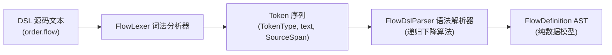
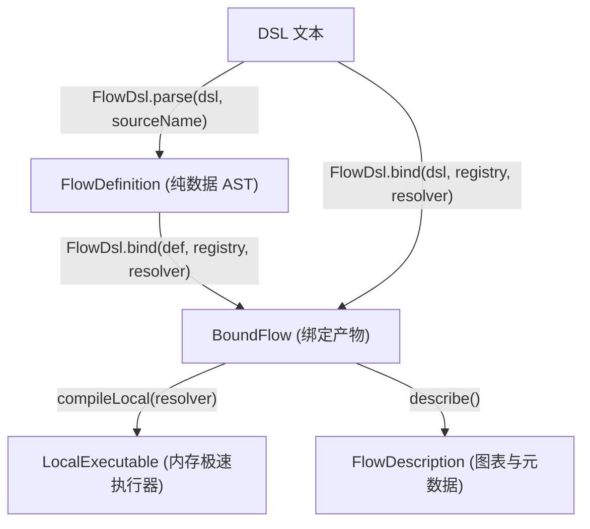

# 文本 DSL 语法与统一门面 (team4u-flow-dsl)

`team4u-flow-dsl` 提供了基于文本的人类可读领域特定语言（Flow DSL）解析与执行绑定能力。通过纯声明式语法，开发者或运维配置人员可以直观地描述复杂的顺序流水线、多路路由、首选候选、失败补偿、结构化并行、异步挂起与切面治理策略，并在编译期无缝映射为强类型执行流。

---

## 引入依赖

```xml
<dependency>
    <groupId>com.team4u</groupId>
    <artifactId>team4u-flow-dsl</artifactId>
</dependency>
```

---

## DSL 设计理念与规范

`team4u-flow-dsl` 遵循四大核心设计准则：

- **单执行模型 (Single Execution Model)**：同一份 DSL 文本既可直接绑定编译为极速内存同步执行器（`Local`），也可投影绑定为支持节点边界 CAS 检查点与断点续跑的持久化执行器（`Durable`）。
- **解耦身份 (Decoupled Identity)**：DSL 语法树中严格只包含字符串标识符（如 `order.validate`、`payment.rate-limit`），不硬编码任何 Java 类名、包路径或代码逻辑；物理组件的解析与绑定由 [`FlowDefinitionRegistry`](file:///root/code/team4u-framework/modules/flow/definition/src/main/java/com/team4u/framework/flow/definition/registry/FlowDefinitionRegistry.java) 统一负责。
- **编译期零反射绑定 (Zero Reflection at Runtime)**：所有符号解析、类型推导、Spring Bean 依赖注入均在 `FlowDsl.bind` 编译期一次性完成；运行时直接执行编译好的强类型操作委托，无任何反射开销。
- **纯声明式语法 (Pure Declarative Syntax)**：无死循环、无隐式副作用，语义正交清晰，天然支持精确的行号列号诊断定位与图表逆向可视化。

---

## 完整语法原语规范与示例

### 流程声明与版本

每个 DSL 文本以可选的 `schema` 头部规范版本开头，随后使用 `flow <flowId> [version <versionId>]` 声明流程根块：

```dsl
# DSL 语法规范版本（当前为 schema 1）
schema 1

# 流程标识与版本号声明
flow order.fulfillment version 1 {
    # 流程正文语句
}
```

### 步骤与修饰符 (Step & Modifiers)

原子业务步骤使用 `step <operation-id>` 声明，支持通过大括号附加修饰符：

```dsl
# 简单单步
step order.validate

# 带修饰符的高级步骤
step inventory.reserve {
    # 入参提取投影：从上游复合状态中提取所需入参 (I -> P)
    project order.items
    
    # 结果合并：将步骤返回值合并回主状态流水线 ((I, R) -> O)
    merge order.withReservation
    
    # 可选步骤：当节点弃权返回 Skipped 时，自动透传步骤入口原值继续执行
    optional
    
    # 业务展示标签（用于监控、结构化日志与 Mermaid 图表渲染）
    named "锁定库存"
    
    # 单步超时控制
    timeout 1s
    
    # 治理策略切面（支持指定键提取器与动态参数配置）
    policy inventory.rate-limit key order.userId {
        permits: 1,
        action: "REJECT"
    }
    
    # 重试策略（支持动态配置最大尝试次数与退避时长）
    retry payment.standard {
        maxAttempts: 3,
        backoff: 100ms
    }
}
```

> [!NOTE]
> **洋葱圈嵌套修饰规则 (Onion Skin Modifiers)**：
> 在单个 `step` 内部声明多个修饰器时，框架严格遵循洋葱圈由外向内包裹规则：`named -> timeout -> policy / retry -> optional -> merge/project(operation)`。

### 条件路由 (Route)

使用 `route <selector-id>` 根据选择器操作返回的键值进行多路分支匹配分发：

```dsl
route order.paymentStatus {
    case PAID {
        step order.fulfill
        step invoice.issue
    }
    case REFUNDED {
        step order.closeRefund
    }
    case CANCELLED {
        step inventory.release
    }
    otherwise {
        skipped "UNRECOGNIZED_STATUS"
    }
}
```

- `selector`：返回枚举、字符串、数字或布尔值的判决操作符；
- `case <literal>`：匹配特定分支（支持枚举常量名、带引号字符串或数字）；
- `otherwise`：当所有 `case` 均未匹配时的兜底流程（若未显式声明且未匹配，将默认以 `NO_ROUTE` 弃权短路）。

### 首选候选分支 (FirstApplicable)

使用 `firstApplicable` 表达按优先级尝试多个候选方案的语义。只要某个分支成功返回 `Accepted` 即采纳并结束候选尝试；若分支返回 `Skipped` 则自动尝试下一个分支：

```dsl
firstApplicable {
    # 候选 1：优先从本地高速缓存查找
    step cache.find
    
    # 候选 2：从分布式缓存集群查找
    step redis.find
    
    # 候选 3：回源数据库全量查询
    step db.find
}
```

### 失败恢复与补偿 (Recover)

使用 `recover` 声明针对业务拒绝（`Rejected`）或技术故障（`Failed`）的补偿流程：

```dsl
recover {
    body {
        step payment.charge
        step order.markPaid
    }
    onFailure {
        # 补偿流程入参为 Recovery<OrderContext>，包含原流程输入与失败原因
        step payment.cancelAuth
        step alert.notifyAdmin
    }
}
```

### 结构化并行 (Parallel & Join)

使用 `parallel` 声明结构化并发分支，并通过 `join <join-id>` 指定结果汇合策略：

```dsl
parallel {
    branch riskCheck {
        step risk.evaluate
    }
    branch inventoryCheck {
        step inventory.verify
    }
    branch couponVerify {
        step coupon.validate
    }
    join order.parallelSummary
}
```

### 异步挂起等待 (Await)

使用 `await <resume-point-id>` 声明流程在此处暂停执行并让出当前计算线程。流程状态在恢复时将转变为复合类型 `Resumed<V, S>`（原值与唤醒信号载荷）：

```dsl
# 挂起等待外部支付网关异步回调通知
await payment.callback

# 续接步骤（入参类型自动推导为 Resumed<OrderContext, PaymentCallbackSignal>）
step payment.processCallback
```

### 显式终态结果 (Complete)

使用终态原语显式构造四态业务结果并终止当前分支或整个流程：

```dsl
# 显式成功完成，附带输出字面量
accepted "ORDER_SUCCESS"

# 显式业务拒绝，附带拒绝码
rejected "USER_BLACKLISTED"

# 显式弃权
skipped "CONDITION_NOT_MET"

# 显式技术失败，附带错误码
failed "THIRD_PARTY_TIMEOUT"
```

### 作用域治理控制 (Scope Controls)

支持对一组顺序语句应用全局切面治理：

```dsl
# 全局时限作用域
timeout 10s {
    step step1
    step step2
}

# 治理策略作用域
policy system.globalLimit key user.id {
    step step3
    step step4
}

# 具名逻辑作用域（为局部子流水线划分独立作用域边界）
scope "settlementPhase" {
    step account.freeze
    step ledger.record
}
```

---

## 词法扫描与语法解析架构

DSL 模块包含完整的词法分析器与语法解析器实现，保障对源码行列号坐标（[`SourceSpan`](file:///root/code/team4u-framework/modules/flow/definition/src/main/java/com/team4u/framework/flow/definition/model/SourceSpan.java)）的 100% 精确保留。



### 词法分析器 (FlowLexer)

[`FlowLexer`](file:///root/code/team4u-framework/modules/flow/dsl/src/main/java/com/team4u/framework/flow/dsl/lexer/FlowLexer.java) 将输入字符串逐字符扫描为带有行号、列号坐标的 [`Token`](file:///root/code/team4u-framework/modules/flow/dsl/src/main/java/com/team4u/framework/flow/dsl/lexer/Token.java) 列表：

- **关键字识别**：精准匹配 [`TokenType`](file:///root/code/team4u-framework/modules/flow/dsl/src/main/java/com/team4u/framework/flow/dsl/lexer/TokenType.java) 枚举中定义的保留字（`flow`, `step`, `route`, `parallel`, `await` 等）；
- **标识符与点分符号**：支持包含 `.` 与 `-` 的复合标识符（如 `inventory.reserve`、`rate-limit`）；
- **字符串与转义**：支持双引号与单引号包裹的文本，完整处理 `\n`、`\t`、`\"` 等转义字符；
- **时间长度解析**：原生识别带单位的时间字面量（`ns`, `us`, `ms`, `s`, `m`, `h`, `d`）并自动解码为 `java.time.Duration`；
- **注释过滤**：支持 `#` 单行注释、`//` 单行注释以及 `/* ... */` 跨行块注释。

### 语法解析器 (FlowDslParser)

[`FlowDslParser`](file:///root/code/team4u-framework/modules/flow/dsl/src/main/java/com/team4u/framework/flow/dsl/parser/FlowDslParser.java) 采用直观高效的递归下降算法，将 Token 流解析为 [`FlowDefinition`](file:///root/code/team4u-framework/modules/flow/definition/src/main/java/com/team4u/framework/flow/definition/model/FlowDefinition.java) 纯数据语法树。当遇到非预期记号或格式错误时，即时生成带有精确源码文件、行号与列号的 [`Diagnostic`](file:///root/code/team4u-framework/modules/flow/definition/src/main/java/com/team4u/framework/flow/definition/diagnostic/Diagnostic.java) 诊断信息。

---

## 统一门面 API (FlowDsl)

[`FlowDsl`](file:///root/code/team4u-framework/modules/flow/dsl/src/main/java/com/team4u/framework/flow/dsl/FlowDsl.java) 提供了面向业务使用者的静态统一门面入口：



### 门面方法速查

```java
public final class FlowDsl {
    // 仅执行语法解析，返回纯数据 AST
    public static FlowDefinition parse(String dsl);
    public static FlowDefinition parse(String dsl, String sourceName);

    // 解析并执行静态类型检查与符号绑定，返回 BoundFlow
    public static BoundFlow bind(String dsl, FlowDefinitionRegistry registry);
    public static BoundFlow bind(String dsl, String sourceName, FlowDefinitionRegistry registry);
    
    // 带容器 OperationResolver 的完整绑定
    public static BoundFlow bind(String dsl, FlowDefinitionRegistry registry, OperationResolver resolver);
    public static BoundFlow bind(String dsl, String sourceName, FlowDefinitionRegistry registry, OperationResolver resolver);
    
    // 对已存在的 FlowDefinition AST 执行绑定
    public static BoundFlow bind(FlowDefinition definition, FlowDefinitionRegistry registry);
    public static BoundFlow bind(FlowDefinition definition, FlowDefinitionRegistry registry, OperationResolver resolver);
}
```

---

## 生产级业务流程 DSL 实战全景

以下示例展示了一个包含**参数投影提取、治理修饰器、条件多路路由、结构化并行汇聚与测试驱动验证**的端到端生产级订单履约流程。

### 业务流程 DSL 描述 (order-fulfillment.flow)

```dsl
schema 1

flow order.fulfillment version 1 {

    # 1. 基础参数与黑名单校验
    step order.validate {
        named "入参合规校验"
        timeout 500ms
    }

    # 2. 扣减库存（使用投影提取 items，并合并锁定结果）
    step inventory.reserve {
        named "锁定商品库存"
        project order.items
        merge order.withReservation
        timeout 1s
    }

    # 3. 执行支付（带限流与重试切面治理）
    step payment.charge {
        named "扣减支付账户"
        policy payment.rateLimit key order.userId {
            permits: 1,
            action: "REJECT"
        }
        retry payment.retryPolicy {
            maxAttempts: 3,
            backoff: 100ms
        }
        timeout 3s
    }

    # 4. 根据支付状态多路路由
    route order.paymentStatus {
        case PAID {
            # 并行执行风控复核与通知推送
            parallel {
                branch riskAudit {
                    step risk.audit
                }
                branch customerNotify {
                    step notify.sendSms
                }
                join order.parallelPassed
            }
            step order.finish
        }
        case UNPAID {
            step order.closeUnpaid
            rejected "ORDER_PAYMENT_FAILED"
        }
        otherwise {
            skipped "UNKNOWN_PAYMENT_STATUS"
        }
    }
}
```

### Java 符号注册与测试执行代码

```java
public class OrderFulfillmentDslTest {

    // 业务上下文模型
    static class OrderContext {
        private String orderId;
        private String userId;
        private List<String> items;
        private String reservationId;
        private boolean paid;
        private List<String> executionLogs = new ArrayList<>();

        public OrderContext(String orderId, String userId, List<String> items, boolean paid) {
            this.orderId = orderId;
            this.userId = userId;
            this.items = items;
            this.paid = paid;
        }

        public String getUserId() { return userId; }
        public List<String> getItems() { return items; }
        public void setReservationId(String reservationId) { this.reservationId = reservationId; }
        public List<String> getExecutionLogs() { return executionLogs; }
    }

    enum PaymentState {
        PAID,
        UNPAID
    }

    @Test
    public void testCompleteOrderFulfillment() {
        String dsl = "..."; // 上述 DSL 文本内容

        // 1. 构建符号注册表
        FlowDefinitionRegistry registry = FlowDefinitionRegistry.builder()
                // 注册步骤 Operation
                .operation("order.validate", (OperationContext ctx, OrderContext in) -> {
                    in.getExecutionLogs().add("validated");
                    return Outcome.accepted(in);
                }, OrderContext.class, OrderContext.class)

                .operation("inventory.reserve", (OperationContext ctx, List<String> items) -> {
                    return Outcome.accepted("RES_" + items.size());
                }, (Class) List.class, String.class)

                .operation("payment.charge", (OperationContext ctx, OrderContext in) -> {
                    in.getExecutionLogs().add("charged");
                    return Outcome.accepted(in);
                }, OrderContext.class, OrderContext.class)

                .operation("order.paymentStatus", (OperationContext ctx, OrderContext in) -> {
                    return Outcome.accepted(in.paid ? PaymentState.PAID : PaymentState.UNPAID);
                }, OrderContext.class, PaymentState.class)

                .operation("risk.audit", (OperationContext ctx, OrderContext in) -> {
                    in.getExecutionLogs().add("risk_ok");
                    return Outcome.accepted(in);
                }, OrderContext.class, OrderContext.class)

                .operation("notify.sendSms", (OperationContext ctx, OrderContext in) -> {
                    in.getExecutionLogs().add("sms_sent");
                    return Outcome.accepted(in);
                }, OrderContext.class, OrderContext.class)

                .operation("order.finish", (OperationContext ctx, OrderContext in) -> {
                    in.getExecutionLogs().add("finished");
                    return Outcome.accepted(in);
                }, OrderContext.class, OrderContext.class)

                // 注册 Projector 与 Merger 函数
                .projector("order.items", OrderContext.class, (Class) List.class, OrderContext::getItems)
                .merger("order.withReservation", OrderContext.class, String.class, OrderContext.class, (ctx, res) -> {
                    ctx.setReservationId(res);
                    ctx.getExecutionLogs().add("reserved:" + res);
                    return ctx;
                })

                // 注册 Key 提取函数
                .keyProjection("order.userId", OrderContext.class, String.class, OrderContext::getUserId)

                // 注册治理策略
                .policy("payment.rateLimit", RateLimitPolicy.<String>builder()
                        .point("payment.charge")
                        .permits(10)
                        .action(RateLimitAction.REJECT)
                        .build(), String.class)

                .policy("payment.retryPolicy", FlowRetryPolicy.<Object>builder()
                        .maxAttempts(3)
                        .backoff(Backoffs.fixed(100))
                        .build())

                // 注册并行汇聚策略
                .join("order.parallelPassed", (JoinResults<OrderContext> results) -> {
                    // 取首个分支输出继续向下流转
                    return Outcome.accepted(results.branches().get(0).requireAccepted());
                }, OrderContext.class)
                .build();

        // 2. 编译并绑定
        BoundFlow boundFlow = FlowDsl.bind(dsl, "order-fulfillment.flow", registry);
        LocalExecutable<OrderContext, OrderContext> executable = boundFlow.compileLocal();

        // 3. 执行测试
        OrderContext context = new OrderContext("ORD_8888", "USER_101", Arrays.asList("item1", "item2"), true);
        FlowResult<OrderContext> result = executable.run(context);

        // 4. 断言验证
        Assert.assertTrue(result instanceof FlowResult.Completed);
        OrderContext out = result.requireAccepted();
        Assert.assertEquals("RES_2", out.reservationId);
        Assert.assertTrue(out.getExecutionLogs().contains("validated"));
        Assert.assertTrue(out.getExecutionLogs().contains("reserved:RES_2"));
        Assert.assertTrue(out.getExecutionLogs().contains("charged"));
        Assert.assertTrue(out.getExecutionLogs().contains("finished"));
    }
}
```
