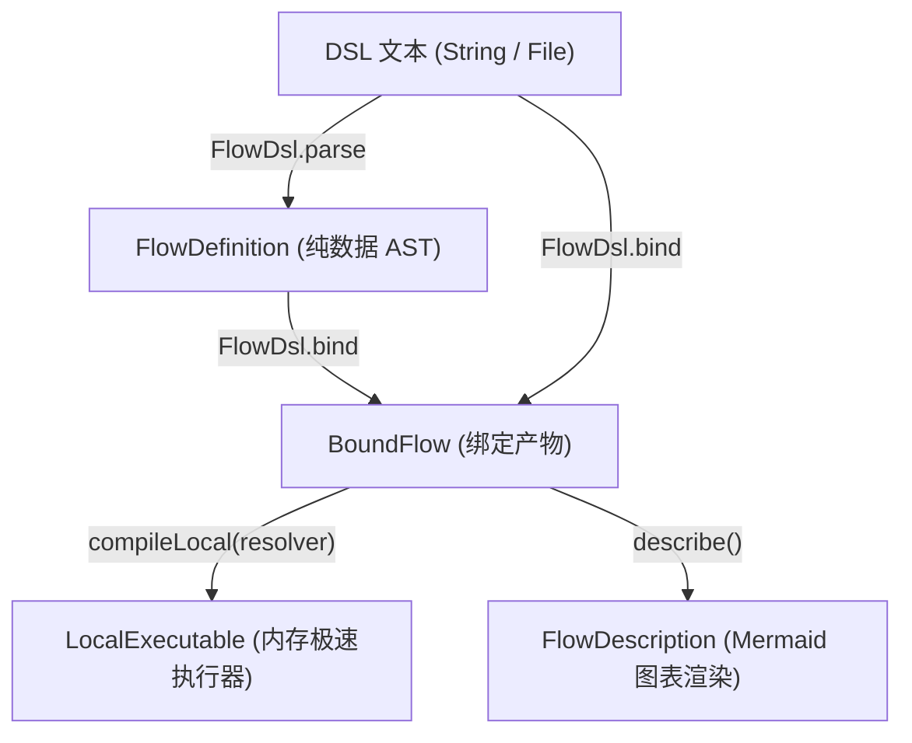
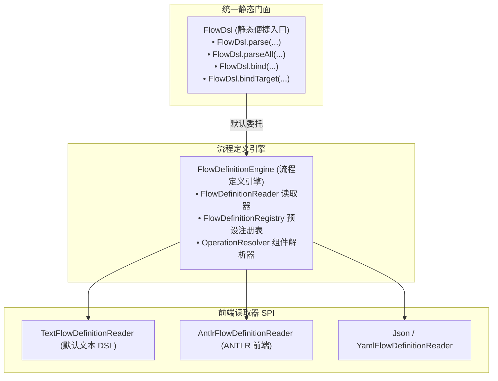

# 文本 DSL 语法与统一门面

`team4u-flow-dsl` 提供了人类可读的流程声明式文本领域特定语言（Flow DSL）。通过极简、直观的类自然语言语法，开发者、业务人员与架构师可以轻松编排复杂的顺序流水线、条件路由、并行并发、超时限流、重试补偿与异步挂起流程，并由统一门面 `FlowDsl` 一键编译为强类型执行器。

---

## 引入依赖

```xml
<dependency>
    <groupId>com.team4u</groupId>
    <artifactId>team4u-flow-dsl</artifactId>
</dependency>
```

---

## 极简速览

一份典型的 `.flow` 文件如下所示：

```dsl
schema 1

flow order.fulfillment version 1 {
    # 1. 基础校验
    step order.validate
    
    # 2. 锁定库存（带 1 秒超时与可选弃权保护）
    step inventory.reserve {
        project order.items
        merge order.withReservation
        timeout 1s
    }

    # 3. 扣减支付（自动重试 3 次，每次退避 100ms）
    step payment.charge {
        retry payment.standard {
            maxAttempts: 3,
            backoff: 100ms
        }
    }

    # 4. 根据支付结果多路分流
    route order.paymentStatus {
        case PAID {
            step order.fulfill
            step invoice.issue
        }
        case UNPAID {
            step order.close
            rejected "PAYMENT_FAILED"
        }
    }
}
```

在 Java 代码中只需一行即可编译并运行：

```java
// 结合符号表完成解析、类型检查并编译为极速执行器
BoundFlow bound = FlowDsl.bind(dslText, "order.flow", registry);
LocalExecutable<OrderContext, OrderContext> executable = bound.compileLocal();

// 执行业务流程
FlowResult<OrderContext> result = executable.run(new OrderContext("ORD-1001"));
```

---

## 核心设计理念

- **纯声明式与无隐式副作用**：无死循环、无全局可变变量，所有数据流转由入参出参严格驱动；
- **解耦符号身份**：DSL 文本中严格只使用业务字符串标识（如 `order.validate`、`payment.standard`），不暴露任何 Java 类名、包路径，彻底隔离配置层与实现层；
- **单模型多执行引擎** ：同一份 DSL 既可编译为极速内存同步执行器（`Local`），也可直接驱动支持 CAS 检查点与断点续跑的持久化执行器（`Durable`）；
- **编译期零反射与精准报错**：在 `FlowDsl.bind` 时一次性完成静态类型推导与符号注入，运行时执行原生委托，零反射开销；语法错误精确提示到源码行号与列号。

---

## 语法速查卡片

| 业务诉求 | DSL 语法表达 | 简要说明 |
| :--- | :--- | :--- |
| **声明流程** | `flow <flowId> [version <ver>] { ... }` | 声明一个具有全局唯一标识与版本号的流程 |
| **单步执行** | `step <operation-id>` | 执行一个业务原子操作 |
| **子流程调用** | `call <subflow-id> [ { ... } ]` | 调用同脚本或注册表中的模块化子流程 |
| **数据投影与合并** | `step op { project p; merge m; }` | 步骤入参提取（$I \to P$）与结果合并（$(I, R) \to O$），支持注册符号或 `$.path` 属性表达式 |
| **单步超时** | `step op { timeout 1s; }` | 限制步骤最长执行时间（支持 `ms`, `s`, `m`, `h`） |
| **策略治理切面** | `step op { policy p key k { ... } }` | 附加限流、鉴权等治理策略 |
| **重试与退避** | `step op { retry r { maxAttempts: 3 } }` | 附加失败重试策略与动态参数 |
| **可选步骤** | `step op { optional; }` | 步骤返回 `Skipped` 弃权时自动透传原值向下执行 |
| **条件路由** | `route selector { case A { ... } otherwise { ... } }` | 根据选择器返回值多路分流 |
| **优先级候选** | `firstApplicable { step c1; step c2; }` | 遇到 `Skipped` 自动尝试下一个，首个成功即采纳 |
| **失败补偿** | `recover { body { ... } onFailure { ... } }` | 主流程发生失败时的逆向补偿流水线 |
| **结构化并行** | `parallel { branch b1 { ... } join all; }` | 多分支并发执行，支持内置汇聚策略（`all`、`first`、`collect`、`quorum <n>`）或自定义符号 |
| **异步挂起** | `await resumePoint` | 流程在此暂停并释放计算线程，等待外部信号唤醒 |
| **显式结果** | `accepted` / `rejected` / `skipped` / `failed` | 显式返回四态结果并终止当前分支 |
| **全局作用域** | `timeout 10s { ... }` / `scope "name" { ... }` | 对一组连续语句应用全局时限或划分逻辑边界 |

---

## 完整语法原语详解

### 流程声明与版本

每个 DSL 文本以可选的 `schema` 头部开头，随后使用 `flow` 声明根流程块：

```dsl
# 语法版本标识（当前为 schema 1）
schema 1

flow order.fulfillment version 1.0 {
    # 流程正文语句
}
```

### 步骤与修饰符

原子业务步骤使用 `step <operation-id>` 声明，支持附加各类修饰器：

```dsl
step inventory.reserve {
    # 1. 入参提取：支持符号引用（如 order.items）或 $.path 属性路径表达式（如 $.items）
    project $.items
    
    # 2. 结果合并：支持符号引用或 $.path 属性路径表达式回写主状态
    merge $.inventoryResult
    
    # 3. 可选跳过：步骤若弃权返回 Skipped，自动使用步骤入口原值继续执行
    optional
    
    # 4. 中文展示标签：用于日志与流程图渲染
    named "锁定商品库存"
    
    # 5. 单步超时
    timeout 2s
    
    # 6. 限流治理：指定限流 Key 提取器与配置字典
    policy inventory.rateLimit key order.userId {
        permits: 1,
        action: "REJECT"
    }
    
    # 7. 重试策略
    retry payment.standard {
        maxAttempts: 3,
        backoff: 100ms
    }
}
```

> [!NOTE]
> **属性访问与编译期元数据缓存** ：
> 当使用 `project $.path` 或 `merge $.path` 进行属性级数据提取与合并时，属性结构在 `bind` 阶段完成合法性检查与反射元数据缓存，运行时避免重复属性发现。
>
> **洋葱圈嵌套规则** ：
> 在单个 `step` 内声明多个修饰器时，框架严格由外向内包裹执行：`named -> timeout -> policy / retry -> optional -> merge/project(operation)`。

### 条件路由

使用 `route <selector-id>` 根据选择器操作返回的键值进行多路分支匹配：

```dsl
route order.paymentStatus {
    case PAID {
        step order.fulfill
        step invoice.issue
    }
    case REFUNDED {
        step order.closeRefund
    }
    case CANCELLED {
        step inventory.release
    }
    otherwise {
        skipped "UNRECOGNIZED_STATUS"
    }
}
```

- `selector`：返回枚举、字符串、数字或布尔值的判决操作符；
- `case <literal>`：匹配特定分支（支持枚举名称、带引号字符串或数字）；
- `otherwise`：当所有 `case` 均未命中时的兜底流程（若未显式声明且未命中，默认以 `NO_ROUTE` 弃权短路）。

### 首选候选分支

表达按优先级尝试多个备选方案的语义。按顺序尝试各分支，只要遇到首个 `Accepted` 成功即采纳并结束；若返回 `Skipped` 弃权则自动尝试下一个备选：

```dsl
firstApplicable {
    # 候选 1：优先从本地高速缓存获取
    step cache.find
    
    # 候选 2：从分布式缓存集群获取
    step redis.find
    
    # 候选 3：回源数据库全量查询
    step db.find
}
```

### 失败恢复与补偿

声明针对业务拒绝（`Rejected`）或技术故障（`Failed`）的补偿流程：

```dsl
recover {
    body {
        step payment.charge
        step order.markPaid
    }
    onFailure {
        # 补偿流程入参为 Recovery<OrderContext>，包含原流程输入与失败原因
        step payment.cancelAuth
        step alert.notifyAdmin
    }
}
```

### 结构化并行与汇聚

使用 `parallel` 声明多分支并发执行，并通过 `join` 指定结果汇合策略：

```dsl
parallel {
    branch riskCheck {
        step risk.evaluate
    }
    branch inventoryCheck {
        step inventory.verify
    }
    branch couponVerify {
        step coupon.validate
    }
    # 汇聚策略：支持内置汇聚算子（join all、join first、join collect、join quorum <n>）
    # 或指定注册表中的自定义汇聚器标识（如 join order.parallelSummary）
    join all
}
```

### 异步挂起等待

使用 `await <resume-point-id>` 声明流程在此处暂停执行并让出当前计算线程。流程状态在唤醒时将转变为复合类型 `Resumed<V, S>`（原值与唤醒信号载荷）：

```dsl
# 挂起等待外部支付网关异步回调通知
await payment.callback

# 唤醒续接步骤（入参类型自动推导为 Resumed<OrderContext, PaymentCallbackSignal>）
step payment.processCallback
```

### 显式终态结果

显式构造四态业务结果并终止当前分支或整个流程：

```dsl
accepted "ORDER_SUCCESS"      # 显式成功完成，附带输出字面量
rejected "USER_BLACKLISTED"   # 显式业务拒绝，附带拒绝码
skipped "CONDITION_NOT_MET"   # 显式弃权
failed "THIRD_PARTY_TIMEOUT"  # 显式技术失败，附带错误码
```

### 作用域治理控制

支持对一组连续语句应用全局切面治理：

```dsl
# 全局时限作用域
timeout 10s {
    step step1
    step step2
}

# 全局治理策略作用域
policy system.globalLimit key user.id {
    step step3
    step step4
}

# 具名逻辑作用域（划分独立作用域边界）
scope "settlementPhase" {
    step account.freeze
    step ledger.record
}
```

---

## 嵌套流程与子流程编排

在面对大型、复杂的业务编排时，将庞大的流水线拆解为层次分明、高内聚的嵌套子结构或独立子流程，是保持流程清晰与高可维护性的关键。`team4u-flow-dsl` 原生支持以下编排模式：

- **单文件多流程独立声明与原生调用** ：同一 DSL 文件内支持定义多个独立的 `flow <id> { ... }` 块，主流程使用原生 `call <subflowId>` 语法进行模块化调用；
- **跨文件/注册表模块化子流程** ：将子流程定义注册至 [`FlowDefinitionRegistry`](file:///root/code/team4u-framework/modules/flow/definition/src/main/java/com/team4u/framework/flow/definition/registry/FlowDefinitionRegistry.java)，通过 `call` 跨脚本/跨模块复用；
- **语法块级多层控制流嵌套** ：在 `route` 分支、`parallel` 并行分支、`recover` 补偿块或治理 `scope` 内部，自由多层嵌套子路由、子并行与顺序流水线；
- **上下文投影与结果融合** ：`call` 原语原生支持 `project` 与 `merge`，实现主流程与子流程入参裁剪与出参回写的无缝解耦。

### 单文件多 Flow 独立声明与 call 调用

在同一个 DSL 脚本中，可以按业务领域拆分声明各个子流程，并在主流程中通过 `call` 直接引用：

```dsl
schema 1

# 1. 独立声明风控评估子流程
flow subflow.risk version 1 {
    step risk.blacklistCheck
    step risk.deviceFingerprint
    step risk.creditScore
}

# 2. 独立声明支付扣款子流程
flow subflow.payment version 1 {
    step payment.validateAccount
    firstApplicable {
        step payment.payWithBalance
        step payment.payWithCredit
    }
    step payment.issueReceipt
}

# 3. 声明主履约流程：原生 call 编排各个子流程
flow main.orderCheckout version 1 {
    step order.validate

    # 调用风控子流程（同上下文类型，直接传递）
    call subflow.risk

    # 调用支付子流程（上下文切片与结果合并）
    call subflow.payment {
        named "执行支付扣款"
        project order.toPaymentRequest
        merge order.withPaymentReceipt
        timeout 5s
    }

    step order.dispatchDelivery
}
```

### 跨脚本与注册表子流程复用

当子业务流程需要在多个父流程之间跨脚本共享复用时，可将子流程通过 [`FlowDefinitionRegistry.Builder.subflow(...)`](file:///root/code/team4u-framework/modules/flow/definition/src/main/java/com/team4u/framework/flow/definition/registry/FlowDefinitionRegistry.java) 注册为公共子流程：

```java
// 1. 注册原子 Operation、子流程及上下文投影/合并器
FlowDefinition paymentSubflow = FlowDsl.parse(paymentDslText, "payment-subflow.flow");

FlowDefinitionRegistry registry = FlowDefinitionRegistry.builder()
        // 注册独立子流程 AST
        .subflow(paymentSubflow)
        
        // 注册原子操作
        .operation("order.validate", new ValidateOrderOp())
        .operation("payment.validateAccount", new ValidateAccountOp())
        .operation("payment.payWithBalance", new PayWithBalanceOp())
        .operation("payment.payWithCredit", new PayWithCreditOp())
        .operation("payment.issueReceipt", new IssueReceiptOp())
        .operation("order.dispatchDelivery", new DispatchDeliveryOp())
        
        // 注册数据投影与合并
        .projector("order.toPaymentRequest", OrderContext.class, PaymentRequest.class, OrderContext::toPaymentRequest)
        .merger("order.withPaymentReceipt", OrderContext.class, PaymentReceipt.class, OrderContext.class, OrderContext::withPaymentReceipt)
        .build();

// 2. 绑定并编译主流程（主流程 DSL 中直接 call payment.subflow）
BoundFlow mainBound = FlowDsl.bind(mainDslText, "main-order.flow", registry);
LocalExecutable<OrderContext, OrderContext> executable = mainBound.compileLocal(OrderContext.class, OrderContext.class);

FlowResult<OrderContext> result = executable.run(new OrderContext("ORD-001"));
```

### 语法块级多层控制流嵌套

DSL 的语法块（`route`、`parallel`、`recover`、`firstApplicable`、`scope`、`timeout`、`policy` 等）均天然支持多层复合嵌套。

以下示例演示了一个在全渠道履约场景下，**条件路由内部嵌套超时作用域，超时作用域内部嵌套结构化并行分支**的 DSL：

```dsl
schema 1

flow order.omnichannel version 1 {
    step order.validate

    # 顶层条件路由：区分线上履约与门店履约
    route order.channel {
        case "ONLINE" {
            # 线上履约具名作用域（带 5 秒全局超时控制）
            timeout 5s {
                step inventory.lockOnline

                # 作用域内嵌套结构化并行分支
                parallel {
                    branch payment {
                        step payment.chargeOnline {
                            retry payment.quickRetry {
                                maxAttempts: 2
                            }
                        }
                    }
                    branch logistics {
                        step logistics.generateWaybill
                    }
                    join order.onlineSummary
                }
            }
        }
        case "STORE" {
            step inventory.lockStore
            step pos.settleOffline
        }
        otherwise {
            rejected "UNSUPPORTED_CHANNEL"
        }
    }

    step order.notifyCustomer
}
```

### 嵌套流程设计最佳实践

- **优先拆解独立 Flow 与原生 call 调用** ：避免将上百行的庞大业务逻辑堆砌在单一 flow 块内。按业务内聚度将主干与分支拆为多个 subflow，利用 `call` 原生组装，使 DSL 具备极高的可读性与模块化维护体验；
- **上下文数据隔离** ：主流程与子流程避免强制绑定同一个扁平大 Context。优先使用 `project`（入参裁剪提取）与 `merge`（输出合并回写），使每个子流程保持强类型单一职责与独立单测能力；
- **嵌套并发线程池配置** ：当在 `parallel` 分支内部进一步嵌套 `parallel` 并行或 `timeout` 超时控制时，底层 Worker 线程池推荐配置支持工作窃取与动态补偿的 `ForkJoinPool`，防止传统固定容量线程池在多层嵌套阻塞等待时产生线程饥饿死锁。

---

## 统一门面 API

[`FlowDsl`](file:///root/code/team4u-framework/modules/flow/dsl/src/main/java/com/team4u/framework/flow/dsl/FlowDsl.java) 是面向业务调用方的统一静态入口：



### 常用门面方法速查

```java
// 1. 纯语法解析：仅检查语法结构，返回纯数据 AST
FlowDefinition def = FlowDsl.parse(dslText, "order.flow");

// 2. 语法解析 + 类型检查 + 符号绑定：返回强类型 BoundFlow
BoundFlow boundFlow = FlowDsl.bind(dslText, "order.flow", registry);

// 3. 结合 Spring / 自定义 Bean 容器的完整绑定
BoundFlow boundFlow = FlowDsl.bind(dslText, "order.flow", registry, springBeanResolver);

// 4. 对已存在的 FlowDefinition AST 执行绑定
BoundFlow boundFlow = FlowDsl.bind(def, registry, springBeanResolver);
```

---

## 错误诊断与提示

当 DSL 文本存在语法拼写错误、括号未闭合或类型不兼容时，`FlowDsl` 会抛出结构化异常 [`FlowDiagnosticException`](file:///root/code/team4u-framework/modules/flow/definition/src/main/java/com/team4u/framework/flow/definition/diagnostic/FlowDiagnosticException.java)，精准打印源文件名、行号与列号：

```
order.flow:18:9: [TYPE_MISMATCH] ($/1/0) Operation 'payment.charge' expects input PaymentRequest but received OrderContext
```

```
order.flow:24:5: [DSL_SYNTAX_ERROR] Expected '}' to close route block but found 'step'
```

---

## 端到端生产级实战示例

以下示例演示了一个包含**参数提取投影、动态限流重试、多路路由、并行汇聚与单元测试断言**的完整电商订单履约实战。为了直观展示文本 DSL 与 Java Bean 容器编排两种开发范式的异同，本节分别提供 **Flow DSL 声明模式** 与 **Spring Bean 容器编排模式** 的完整实现代码与对比选型建议。

### 业务模型与 Spring Bean 组件定义

两种模式共用的业务上下文模型与 Spring Bean 业务组件：

```java
// 业务上下文与状态枚举
public class OrderContext {
    private String orderId;
    private String userId;
    private List<String> items;
    private String reservationId;
    private boolean paid;
    private List<String> logs = new ArrayList<>();

    public OrderContext(String orderId, String userId, List<String> items, boolean paid) {
        this.orderId = orderId;
        this.userId = userId;
        this.items = items;
        this.paid = paid;
    }

    public String getOrderId() { return orderId; }
    public String getUserId() { return userId; }
    public List<String> getItems() { return items; }
    public boolean isPaid() { return paid; }
    public String getReservationId() { return reservationId; }
    public void setReservationId(String reservationId) { this.reservationId = reservationId; }
    public List<String> getLogs() { return logs; }
}

public enum PaymentState { PAID, UNPAID }

// 1. 入参校验组件
@Component("order.validate")
public class ValidateOrderOp implements Operation<OrderContext, OrderContext> {
    @Override
    public Outcome<OrderContext> execute(OperationContext context, OrderContext in) {
        in.getLogs().add("validated");
        return Outcome.accepted(in);
    }
}

// 2. 库存扣减组件（接收 items 列表，返回预留流水号）
@Component("inventory.reserve")
public class ReserveInventoryOp implements Operation<List<String>, String> {
    @Override
    public Outcome<String> execute(OperationContext context, List<String> items) {
        return Outcome.accepted("RES_" + items.size());
    }
}

// 3. 支付扣款组件（支持 Spring 声明式事务）
@Component("payment.charge")
public class ChargePaymentOp implements Operation<OrderContext, OrderContext> {
    @Override
    @Transactional(rollbackFor = Exception.class)
    public Outcome<OrderContext> execute(OperationContext context, OrderContext in) {
        in.getLogs().add("charged");
        return Outcome.accepted(in);
    }
}

// 4. 支付状态路由判决器
@Component("order.paymentStatus")
public class PaymentStatusSelector implements Operation<OrderContext, PaymentState> {
    @Override
    public Outcome<PaymentState> execute(OperationContext context, OrderContext in) {
        return Outcome.accepted(in.isPaid() ? PaymentState.PAID : PaymentState.UNPAID);
    }
}

// 5. 风控复核并行分支
@Component("risk.audit")
public class RiskAuditOp implements Operation<OrderContext, OrderContext> {
    @Override
    public Outcome<OrderContext> execute(OperationContext context, OrderContext in) {
        in.getLogs().add("risk_passed");
        return Outcome.accepted(in);
    }
}

// 6. 短信通知并行分支
@Component("notify.sendSms")
public class SendSmsOp implements Operation<OrderContext, OrderContext> {
    @Override
    public Outcome<OrderContext> execute(OperationContext context, OrderContext in) {
        in.getLogs().add("sms_sent");
        return Outcome.accepted(in);
    }
}

// 7. 未支付关单组件
@Component("order.closeUnpaid")
public class CloseUnpaidOp implements Operation<OrderContext, OrderContext> {
    @Override
    public Outcome<OrderContext> execute(OperationContext context, OrderContext in) {
        in.getLogs().add("closed");
        return Outcome.accepted(in);
    }
}

// 8. 流程完结组件
@Component("order.finish")
public class OrderFinishOp implements Operation<OrderContext, OrderContext> {
    @Override
    public Outcome<OrderContext> execute(OperationContext context, OrderContext in) {
        in.getLogs().add("finished");
        return Outcome.accepted(in);
    }
}

// 9. 并行分支汇聚策略
@Component("order.parallelPassed")
public class ParallelPassedJoin implements JoinStrategy<OrderContext> {
    @Override
    public Outcome<OrderContext> join(JoinResults<OrderContext> results) {
        return Outcome.accepted(results.branches().get(0).requireAccepted());
    }
}

// 10. 支付限流策略 Bean
@Component("payment.rateLimit")
public class PaymentRateLimitPolicy implements Policy<String> {
    @Override
    public Gate before(PolicyContext context, String userId) {
        return Gate.proceed();
    }
}
```

### 文本 DSL 声明模式

文本 DSL 模式将流程拓扑抽取为纯文本脚本，通过符号表解耦业务标识与实现代码。

#### 业务流程 DSL 文本

```dsl
schema 1

flow order.fulfillment version 1.0 {

    # 1. 参数合规校验
    step order.validate {
        named "入参合规校验"
        timeout 500ms
    }

    # 2. 扣减库存（使用投影提取 items，并合并锁定结果）
    step inventory.reserve {
        named "锁定商品库存"
        project order.items
        merge order.withReservation
        timeout 1s
    }

    # 3. 执行支付（带限流与重试切面治理）
    step payment.charge {
        named "扣减支付账户"
        policy payment.rateLimit key order.userId {
            permits: 1,
            action: "REJECT"
        }
        retry payment.retryPolicy {
            maxAttempts: 3,
            backoff: 100ms
        }
        timeout 3s
    }

    # 4. 根据支付状态多路路由
    route order.paymentStatus {
        case PAID {
            # 并行执行风控复核与通知推送
            parallel {
                branch riskAudit {
                    step risk.audit
                }
                branch customerNotify {
                    step notify.sendSms
                }
                join order.parallelPassed
            }
            step order.finish
        }
        case UNPAID {
            step order.closeUnpaid
            rejected "ORDER_PAYMENT_FAILED"
        }
        otherwise {
            skipped "UNKNOWN_PAYMENT_STATUS"
        }
    }
}
```

#### DSL 符号注册与执行测试

在 `FlowDefinitionRegistry` 中，提供了多种注册模式以适配不同的开发场景：

##### Bean / Class 注册模式（非 Lambda 推荐模式）

当注册实现了 `Operation<I, O>` 或 `Policy<K>` 契约的 Bean 实例或 Class 时，注册表通过 `GenericTypeResolver` **自动从接口泛型中推导入参与出参类型，无需显式指定任何 Class 类型参数**：

```java
public class DslOrderFulfillmentBeanRegistryTest {

    @Test
    public void testOrderFulfillmentWithBeanRegistry() {
        String dsl = "..."; // 加载上述 DSL 文本

        // 1. 直接注册 Bean 实例（或 Class），泛型类型由注册表自动推导
        FlowDefinitionRegistry registry = FlowDefinitionRegistry.builder()
                // 注册业务 Operation Bean（无需手动传入 OrderContext.class 等入参/出参类型）
                .operation("order.validate", new ValidateOrderOp())
                .operation("inventory.reserve", new ReserveInventoryOp())
                .operation("payment.charge", new ChargePaymentOp())
                .operation("order.paymentStatus", new PaymentStatusSelector())
                .operation("risk.audit", new RiskAuditOp())
                .operation("notify.sendSms", new SendSmsOp())
                .operation("order.closeUnpaid", new CloseUnpaidOp())
                .operation("order.finish", new OrderFinishOp())

                // 注册数据投影与合并
                .projector("order.items", OrderContext.class, (Class) List.class, OrderContext::getItems)
                .merger("order.withReservation", OrderContext.class, String.class, OrderContext.class, (ctx, res) -> {
                    ctx.setReservationId(res);
                    ctx.getLogs().add("reserved:" + res);
                    return ctx;
                })

                // 注册 Key 提取器与治理策略（Policy Bean 自动推导 Key 为 String 类型）
                .keyProjection("order.userId", OrderContext.class, String.class, OrderContext::getUserId)
                .policy("payment.rateLimit", new PaymentRateLimitPolicy())
                .policy("payment.retryPolicy", FlowRetryPolicy.<Object>builder()
                        .maxAttempts(3)
                        .backoff(Backoffs.fixed(100))
                        .build())

                // 注册并行汇聚策略
                .join("order.parallelPassed", new ParallelPassedJoin(), OrderContext.class)
                .build();

        // 2. 编译并绑定
        BoundFlow boundFlow = FlowDsl.bind(dsl, "order-fulfillment.flow", registry);
        LocalExecutable<OrderContext, OrderContext> executable = boundFlow.compileLocal();

        // 3. 执行业务流程
        OrderContext input = new OrderContext("ORD-9999", "USER-88", Arrays.asList("apple", "banana"), true);
        FlowResult<OrderContext> result = executable.run(input);

        // 4. 验证断言
        Assert.assertTrue(result.isAccepted());
        OrderContext output = result.requireAccepted();
        Assert.assertEquals("RES_2", output.getReservationId());
        Assert.assertTrue(output.getLogs().contains("validated"));
        Assert.assertTrue(output.getLogs().contains("reserved:RES_2"));
        Assert.assertTrue(output.getLogs().contains("charged"));
        Assert.assertTrue(output.getLogs().contains("finished"));
    }
}
```

##### Spring 容器约定自动发现模式（零手动注册）

在 Spring 环境下（引入 `team4u-flow-bean`），所有标注了 `@Component("order.validate")` 等与 DSL 符号名同名的 Spring Bean，会被注册表的 `fallbackResolver` **自动发现并完成类型推导与实例绑定，无需在 Registry 中逐个手动注册**：

```java
@RunWith(SpringRunner.class)
@ContextConfiguration(classes = {
        Team4uBeanConfiguration.class,
        ValidateOrderOp.class,
        ReserveInventoryOp.class,
        ChargePaymentOp.class,
        PaymentStatusSelector.class,
        RiskAuditOp.class,
        SendSmsOp.class,
        CloseUnpaidOp.class,
        OrderFinishOp.class,
        ParallelPassedJoin.class,
        PaymentRateLimitPolicy.class
})
public class DslOrderFulfillmentSpringConventionTest {

    @Test
    public void testOrderFulfillmentWithSpringConvention() {
        String dsl = "..."; // 加载上述 DSL 文本

        // 仅需注册辅助的 Projector、Merger、KeyProjection 与重试配置，各 Operation / Policy Bean 由 Spring 自动解析
        FlowDefinitionRegistry registry = FlowDefinitionRegistry.builder()
                .projector("order.items", OrderContext.class, (Class) List.class, OrderContext::getItems)
                .merger("order.withReservation", OrderContext.class, String.class, OrderContext.class, (ctx, res) -> {
                    ctx.setReservationId(res);
                    ctx.getLogs().add("reserved:" + res);
                    return ctx;
                })
                .keyProjection("order.userId", OrderContext.class, String.class, OrderContext::getUserId)
                .policy("payment.retryPolicy", FlowRetryPolicy.<Object>builder()
                        .maxAttempts(3)
                        .backoff(Backoffs.fixed(100))
                        .build())
                .build();

        // 绑定时自动结合 Spring 容器发现并注入 Bean
        BoundFlow boundFlow = FlowDsl.bind(dsl, "order-fulfillment.flow", registry);
        LocalExecutable<OrderContext, OrderContext> executable = boundFlow.compileLocal();

        OrderContext input = new OrderContext("ORD-9999", "USER-88", Arrays.asList("apple", "banana"), true);
        FlowResult<OrderContext> result = executable.run(input);

        Assert.assertTrue(result.isAccepted());
        Assert.assertEquals("RES_2", result.requireAccepted().getReservationId());
    }
}
```

##### Lambda 内联注册模式（单测桩与临时逻辑）

当使用匿名 Lambda 表达式（如 `(ctx, in) -> ...`）快速构造单测桩时，由于 Java 运行时泛型擦除无法提取类型参数，此时需显式传入入参和出参的 `Class`：

```java
// 仅在 Lambda 匿名函数模式下才需要显式声明 Class 类型
FlowDefinitionRegistry registry = FlowDefinitionRegistry.builder()
        .operation("order.validate", (ctx, in) -> {
            in.getLogs().add("validated");
            return Outcome.accepted(in);
        }, OrderContext.class, OrderContext.class)
        .build();
```

### Spring Bean 容器编排模式

Spring Bean 编排模式通过 Java 强类型 Fluent API 构建流程拓扑，直接引用业务 Bean Class。**该模式在底层抽象语法树（AST）、执行语义、控制流拓扑与治理策略上与上述 DSL 文本保持 100% 严格等价**。编译期由 `BeanOperationResolver` 自动完成单例查找与契约校验，运行期享受零反射调用与 Spring 声明式事务（`@Transactional`）支持。

#### 语法与语义 1:1 等价映射对照

下表展示了上述 `order-fulfillment.flow` 文本中的各个原语与 Spring Bean Java 代码的严格等价对应关系：

| 业务编排环节 | 文本 DSL 语法表达 | Spring Bean 强类型 Java 等价表达 | 等价说明 |
| :--- | :--- | :--- | :--- |
| **基础入参校验** | `step order.validate { named "..."; timeout 500ms; }` | `Flow.step(ValidateOrderOp.class).named("...").timeout(Duration.ofMillis(500))` | 延迟解析 Class 契约，附加中文标签与超时时限修饰器 |
| **数据投影与合并** | `step inventory.reserve { project order.items; merge order.withReservation; timeout 1s; }` | `.use(ReserveInventoryOp.class, OrderContext::getItems, merger).named("...").timeout(Duration.ofSeconds(1))` | `use` 组合入参提取投影与出参回写合并 |
| **限流重试治理** | `step payment.charge { policy payment.rateLimit key ...; retry ...; timeout 3s; }` | `Flow.step(ChargePaymentOp.class).policy(PaymentRateLimitPolicy.class, keyFn).persistentPolicy(retryPolicy, keyFn)...` | 无状态准入 Policy 与持久化重试策略链式包裹 |
| **条件多路分流** | `route order.paymentStatus { case PAID { ... } case UNPAID { ... } otherwise { ... } }` | `Flow.route(PaymentStatusSelector.class).caseOf(PaymentState.PAID, ...).caseOf(PaymentState.UNPAID, ...).otherwise(...)` | 状态判决器返回路由键并精确匹配分支 |
| **结构化并行汇聚** | `parallel { branch riskAudit { ... } branch customerNotify { ... } join order.parallelPassed; }` | `Flow.parallel(Branch.of("riskAudit", RiskAuditOp.class), Branch.of("customerNotify", SendSmsOp.class)).join(new ParallelPassedJoin())` | 多分支并发执行与 JoinStrategy 汇聚归约 |
| **显式拒绝与弃权** | `rejected "ORDER_PAYMENT_FAILED"` / `skipped "UNKNOWN_PAYMENT_STATUS"` | `Flow.rejected(Reason.of("ORDER_PAYMENT_FAILED", "..."))` / `Flow.skipped(...)` | 显式返回非成功四态结果并触发分支短路 |

#### 容器配置与流程拓扑编排

```java
@Configuration
@Import(Team4uBeanConfiguration.class) // 桥接 Spring 容器至 BeanManager
public class OrderFulfillmentBeanConfiguration {

    @Bean
    public Flow<OrderContext, OrderContext> orderFulfillmentFlow() {
        return Flow
                // 1. 等价于 DSL 中的: step order.validate { named "入参合规校验"; timeout 500ms; }
                .step(ValidateOrderOp.class)
                .named("入参合规校验")
                .timeout(Duration.ofMillis(500))

                // 2. 等价于 DSL 中的: step inventory.reserve { project order.items; merge order.withReservation; timeout 1s; }
                .use(
                        ReserveInventoryOp.class,
                        OrderContext::getItems,
                        (ctx, res) -> {
                            ctx.setReservationId(res);
                            ctx.getLogs().add("reserved:" + res);
                            return ctx;
                        }
                )
                .named("锁定商品库存")
                .timeout(Duration.ofSeconds(1))

                // 3. 等价于 DSL 中的: step payment.charge { policy payment.rateLimit key order.userId; retry ...; timeout 3s; }
                .then(
                        Flow.step(ChargePaymentOp.class)
                                .policy(PaymentRateLimitPolicy.class, OrderContext::getUserId)
                                .persistentPolicy(
                                        FlowRetryPolicy.<OrderContext>builder()
                                                .maxAttempts(3)
                                                .backoff(Backoffs.fixed(100))
                                                .build(),
                                        OrderContext::getUserId
                                )
                                .named("扣减支付账户")
                                .timeout(Duration.ofSeconds(3))
                )

                // 4. 等价于 DSL 中的: route order.paymentStatus { case PAID { ... } case UNPAID { ... } otherwise { ... } }
                .then(
                        Flow.route(PaymentStatusSelector.class)
                                // case PAID 分支：等价于 parallel { branch riskAudit { ... } branch customerNotify { ... } join ... } + step order.finish
                                .caseOf(
                                        PaymentState.PAID,
                                        Flow.parallel(
                                                Branch.of("riskAudit", RiskAuditOp.class),
                                                Branch.of("customerNotify", SendSmsOp.class)
                                        )
                                        .join(new ParallelPassedJoin())
                                        .then(OrderFinishOp.class)
                                )
                                // case UNPAID 分支：等价于 step order.closeUnpaid + rejected "ORDER_PAYMENT_FAILED"
                                .caseOf(
                                        PaymentState.UNPAID,
                                        Flow.step(CloseUnpaidOp.class)
                                                .then(Flow.rejected(Reason.of("ORDER_PAYMENT_FAILED", "支付未完成，订单已关闭")))
                                )
                                // otherwise 分支：等价于 skipped "UNKNOWN_PAYMENT_STATUS"
                                .otherwise(Flow.skipped(Reason.of("UNKNOWN_PAYMENT_STATUS", "未知的支付状态")))
                );
    }

    @Bean
    public LocalExecutable<OrderContext, OrderContext> orderExecutable(
            Flow<OrderContext, OrderContext> orderFulfillmentFlow) {
        // Local.compile 自动通过 SPI 发现 BeanOperationResolver 并完成所有 Bean 依赖解析与类型校验
        return Local.compile(orderFulfillmentFlow);
    }
}
```

#### 容器环境执行测试

```java
@RunWith(SpringRunner.class)
@ContextConfiguration(classes = {
        OrderFulfillmentBeanConfiguration.class,
        ValidateOrderOp.class,
        ReserveInventoryOp.class,
        ChargePaymentOp.class,
        PaymentStatusSelector.class,
        RiskAuditOp.class,
        SendSmsOp.class,
        CloseUnpaidOp.class,
        OrderFinishOp.class,
        ParallelPassedJoin.class,
        PaymentRateLimitPolicy.class
})
public class BeanOrderFulfillmentTest {

    @Autowired
    private LocalExecutable<OrderContext, OrderContext> orderExecutable;

    @Test
    public void testBeanOrderFulfillmentFlow() {
        // 1. 构造测试入参
        OrderContext input = new OrderContext("ORD-9999", "USER-88", Arrays.asList("apple", "banana"), true);

        // 2. 执行流程
        FlowResult<OrderContext> result = orderExecutable.run(input);

        // 3. 验证断言
        Assert.assertTrue(result.isAccepted());
        OrderContext output = result.requireAccepted();
        Assert.assertEquals("RES_2", output.getReservationId());
        Assert.assertTrue(output.getLogs().contains("validated"));
        Assert.assertTrue(output.getLogs().contains("reserved:RES_2"));
        Assert.assertTrue(output.getLogs().contains("charged"));
        Assert.assertTrue(output.getLogs().contains("finished"));
    }
}
```

### 两种编排范式对比与选型

| 对比维度 | 文本 DSL 声明模式 (`team4u-flow-dsl`) | Spring Bean 容器编排模式 (`team4u-flow-bean`) |
| :--- | :--- | :--- |
| **流程定义载体** | 独立 `.flow` 纯文本声明文件或配置字符串 | Java `@Configuration` 代码与强类型 Fluent API |
| **组件解耦机制** | 基于字符串符号 ID 映射，业务逻辑与实现完全解耦 | 基于 Java `Class` 与 Spring Qualifier 限定符直接引用 |
| **类型检查时机** | `FlowDsl.bind` 时静态推导并严格校验 AST 输入输出类型契约 | Java 编译器泛型检查 + `Local.compile` 容器契约二次校验 |
| **动态性与热发布** | **极高** ：DSL 文本可外置于配置中心或数据库，支持不停机热更新 | **低** ：流程编排固化在 Java 字节码中，变更需重新编译与部署应用 |
| **业务人员可读性** | **优秀** ：类自然语言语法，非开发人员也能直观审阅与维护 | **一般** ：适合熟悉 Java 函数式语法的研发人员阅读与维护 |
| **IDE 与重构体验** | 依托 DSL 诊断器与行号报错，跨文件符号跳转需配合注册表 | 原生 Java 代码导航、类重命名与方法签名重构 100% 自动联动 |
| **Spring 事务与切面** | 符号若绑定为 Spring 代理 Bean，事务与 AOP 切面正常生效 | 原生无缝保留 `@Transactional`、`@Autowired` 与自定义 AOP 切面 |
| **可视化图表导出** | `boundFlow.describe()` 一键导出 Mermaid 流程图 | `flow.describe()` 一键导出 Mermaid 流程图 |
| **适用场景建议** | 流程多变、需动态配置下发、多方协作（产品/架构/开发）的复杂业务流 | 流程相对固定、重度依赖 Spring 容器管理组件、追求极致编译期安全的工程 |

---

## 门面模式与流程定义引擎
 
`team4u-flow-dsl` 采用清晰的门面与流程定义引擎分层架构：



### 静态门面

对于绝大多数应用场景，直接使用静态门面方法即可完成解析与绑定：

```java
// 一行完成文本 DSL 解析与强类型流程绑定
BoundFlow bound = FlowDsl.bind(dslText, "order.flow", registry);
```

### 引擎实例构建与定制

当需要注入预设注册表、组件解析器，或使用自定义前端解析器（如 ANTLR、JSON、YAML 等）时，可以通过 `FlowDefinitionEngine.builder()` 构建独立引擎实例：

```java
// 构建带有预设注册表与解析器的定制引擎
FlowDefinitionEngine engine = FlowDefinitionEngine.builder()
        .reader(TextFlowDefinitionReader.INSTANCE)
        .registry(preconfiguredRegistry)
        .resolver(springOperationResolver)
        .build();

// 直接绑定，无需每次重复传入注册表与解析器
BoundFlow bound = engine.bind(dslText);
LocalExecutable<OrderContext, OrderContext> exec = bound.compileLocal(OrderContext.class, OrderContext.class);
```

### 自定义前端读取器接入

所有前端读取器均实现 [`FlowDefinitionReader`](file:///root/code/team4u-framework/modules/flow/definition/src/main/java/com/team4u/framework/flow/definition/reader/FlowDefinitionReader.java) 接口，直接输出统一的 `FlowDefinition` AST 列表，核心校验与执行层零侵入：

```java
// 自定义读取器（如 JSON、YAML 或其他语法）
FlowDefinitionReader customReader = (source, sourceName) -> {
    return parseToFlowDefinitions(source, sourceName);
};

// 基于自定义读取器创建引擎
FlowDefinitionEngine customEngine = FlowDefinitionEngine.withReader(customReader);
BoundFlow bound = customEngine.bind(sourceText, registry);
```

