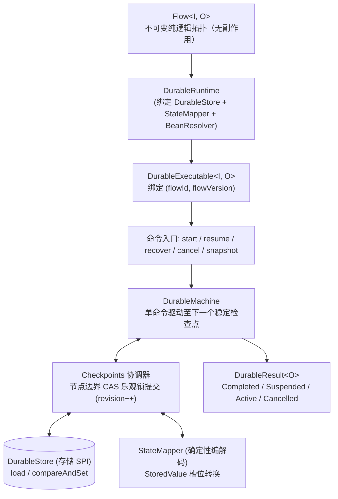
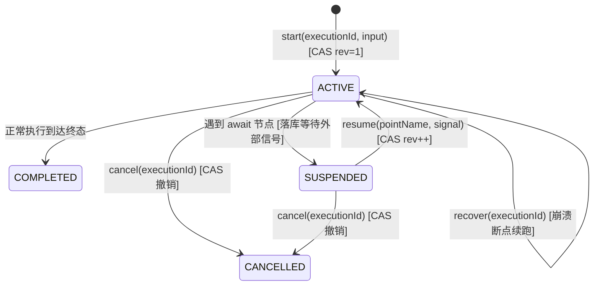
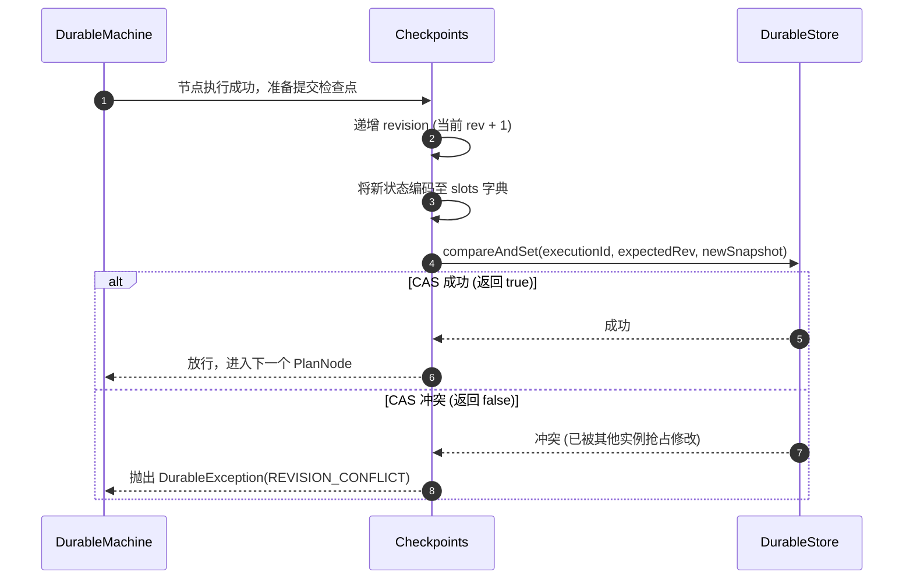

# Durable 状态机与 CAS 检查点机制

在分布式事务、长时业务流程（Long-Running Processes）、跨节点故障恢复与高可靠任务编排中，单纯的内存执行器无法应对机器重启、发布升级与物理机宕机。

`team4u-flow-durable` 是建立在核心 Flow 抽象之上的持久化执行器。它允许开发者在**完全不修改一行 Flow 业务定义代码**的前提下，将内存执行流无缝升级为具备节点级 CAS 检查点与跨进程断点续跑能力的持久化流程。

---

## 核心架构与设计原则



### 四大核心设计原则

1. **同一份 Flow 定义，零代码修改**：
   业务逻辑 `Flow<I, O>` 纯粹描述拓扑结构，既能交付给 `Local.compile` 作为微秒级同步执行器，也能交付给 `DurableRuntime.compile` 作为持久化状态机；
2. **零 Lambda 与代码序列化**：
   底层快照绝不序列化 Java 字节码、Lambda 闭包或 Bean 实例引用；快照中仅保存框架运行元数据与由 `StateMapper` 编码的业务槽位（`StoredValue`）；
3. **节点边界 CAS 检查点（Revision 乐观锁）**：
   每前进一步都在节点边界以 CAS 乐观锁推进 `revision`，防止多实例并发写冲突与脏写；
4. **版本强隔离 `(flowId, flowVersion)`**：
   以流标识与版本号作为快照的命名空间，杜绝代码更新后反序列化旧版本快照导致的数据错乱。

---

## 命令集与状态机驱动

`DurableExecutable` 提供了完整的状态机控制命令：



### 命令说明表

| 命令方法 | 初始前置状态 | 动作行为 | 产出结果 |
| :--- | :--- | :--- | :--- |
| **`start(id, input)`** | 不存在（`expectedRevision = -1`） | 创建初始 `ACTIVE` 快照（`revision=1`），存入输入并驱动首段 | `DurableResult` |
| **`resume(id, point, signal)`** | `SUSPENDED` | 执行两段式 CAS 提交：先落库信号并置为 ACTIVE，再驱动续接 | `DurableResult` |
| **`recover(id)`** | `ACTIVE` | 从最后提交的快照反序列化状态，重构执行帧栈并断点续跑 | `DurableResult` |
| **`cancel(id)`** | `ACTIVE` / `SUSPENDED` | 以 CAS 将生命周期强制翻转为 `CANCELLED` 并终止执行 | `DurableResult.Cancelled` |
| **`snapshot(id)`** | 任意状态 | 只读查询当前快照元数据与槽位，无任何写副作用 | `Optional<DurableSnapshot>` |

---

## 节点边界 CAS 检查点机制

当 `DurableMachine` 驱动流程向前推进时，每次跨越节点边界均会自动触发检查点提交：



### 乐观锁并发冲突处理
- 若两个分布式节点由于时序重试同时尝试驱动同一个 `executionId`，后提交的节点将遭遇 CAS 失败；
- 框架会抛出 `DurableException(REVISION_CONFLICT)`，安全阻止双重推进与重复执行。

---

## 稳定幂等键（`invocationId`）与 At-Least-Once 保证

在分布式环境中，**网络分区、宕机重启与重试必然导致步骤可能被多次执行（At-Least-Once）**。如何保证外部写操作（如银行扣款、扣减库存）不被重复执行？

框架为每一个执行节点计算了严格确定性的**稳定幂等键**：

$$\text{invocationId} = \text{flowId} : \text{flowVersion} : \text{executionId} : \text{path}$$

- **`flowId`**：流程业务标识（如 `order-checkout`）；
- **`flowVersion`**：流程拓扑版本号（如 `1`）；
- **`executionId`**：本次流程执行流水号（如 `ORD20260831001`）；
- **`path`**：当前节点在 AST 树中的拓扑路径（如 `$/0/1`）。

### 幂等公式
$$\text{At-Least-Once 框架驱动} + \text{invocationId 外部防重} = \text{Exactly-Once 业务效果}$$

```java
@Component
public class BankPaymentOperation implements Operation<PaymentReq, PaymentResp> {

    @Autowired
    private BankClient bankClient;

    @Override
    public Outcome<PaymentResp> execute(OperationContext context, PaymentReq req) {
        // 将 context.invocationId() 作为幂等请求头透传给外部银行网关
        // 即使服务崩溃重跑，该节点的 invocationId 绝对恒定，银行网关会直接返回已成功的幂等结果
        PaymentResp resp = bankClient.charge(context.invocationId(), req.getAmount());
        return Outcome.accepted(resp);
    }
}
```

---

## 版本强隔离契约

在业务迭代中，流程拓扑结构难免发生调整（例如新增节点、调整分支顺序）：

- 拓扑结构一旦发生变更，必须递增 `flowVersion`（如从版本 1 升至版本 2）；
- 当旧实例崩溃尝试调用 `recover(executionId)` 时，若当前运行时的 `flowVersion` 与快照中的记录不一致，框架会立即抛出 `DurableException(FLOW_MISMATCH)` 拒绝恢复；
- 该契约有效防止了“用新版代码恢复旧版拓扑快照”导致的字段错位与反序列化灾难。

---

## 关联章节与进一步阅读

- 深入学习两段式 CAS 恢复与 PersistentPolicy：[Durable 两段式恢复协议与 PersistentPolicy](flow-durable-resume.md)
- 深入剖析快照存储结构与 StateMapper 编解码：[快照存储结构与 StateMapper 编解码](flow-durable-snapshot.md)
- 了解 DurableStore SPI 与 KV 存储实现：[DurableStore 存储 SPI 与 KV 适配](flow-durable-kv.md)
- 查阅 Durable 异常错误码诊断手册：[诊断码体系与故障排查手册](flow-diagnostics.md)
