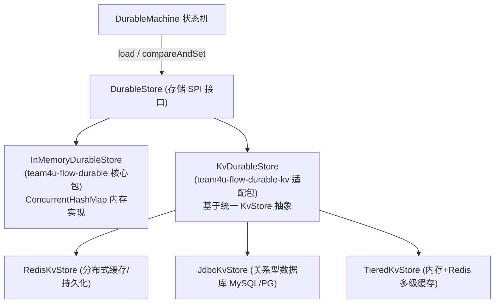

# DurableStore 存储 SPI 与 KV 适配

在持久化执行体系中，引擎本身不绑定任何具体的物理数据库技术。快照信封的读写与 CAS 乐观锁推进通过极简的 **`DurableStore` SPI** 进行解耦。

本文将详细解析 `DurableStore` SPI 规范、内置的内存实现以及基于 `team4u-kv` 的生产级多后端适配器 `KvDurableStore`。

---

## 存储架构全景



---

## 1. `DurableStore` SPI 接口契约

`DurableStore` 仅包含两个核心方法：

```java
package com.team4u.framework.flow.durable.store;

import com.team4u.framework.flow.durable.snapshot.DurableSnapshot;
import java.util.Optional;

public interface DurableStore {
    /**
     * 加载指定 executionId 的最新快照。
     *
     * @param executionId 执行流水号
     * @return 若存在返回快照 Optional，否则返回 empty
     */
    Optional<DurableSnapshot> load(String executionId);

    /**
     * 针对指定执行实例执行 CAS 乐观锁比较与更新。
     *
     * @param executionId      执行流水号
     * @param expectedRevision 期望的当前版本号。特别地，-1 表示仅在记录不存在时创建（用于 start）
     * @param update           待持久化的新快照实例
     * @return true 表示 CAS 成功；false 表示版本冲突已被其他实例抢占
     */
    boolean compareAndSet(String executionId, long expectedRevision, DurableSnapshot update);
}
```

---

## 2. 内存存储实现：`InMemoryDurableStore`

位于 `team4u-flow-durable` 核心包内，基于 `ConcurrentHashMap` 实现，适合单元测试、集成验证与本地快速原型开发：

```java
import com.team4u.framework.flow.durable.store.InMemoryDurableStore;

DurableStore memoryStore = new InMemoryDurableStore();

DurableRuntime runtime = DurableRuntime.builder(memoryStore)
        .build();
```

---

## 3. 生产级适配：`KvDurableStore` (`team4u-flow-durable-kv`)

在生产环境中，流程快照需要持久化至外部存储（如 Redis、MySQL、PostgreSQL 等），并在分布式多实例部署时支持集群协同。

`team4u-flow-durable-kv` 将 `DurableStore` 桥接到了框架统一的 `KvStore` 抽象上：

### 引入依赖

```xml
<dependency>
    <groupId>com.team4u</groupId>
    <artifactId>team4u-flow-durable-kv</artifactId>
</dependency>
```

### 构建与装配

`KvDurableStore` 自动将 `DurableSnapshot` 转换为紧凑的 `DurableSnapshotDto`，并通过 `CasCapable` 乐观锁进行安全原子写入：

```java
import com.team4u.framework.flow.durable.kv.KvDurableStore;
import com.team4u.framework.flow.durable.store.DurableStore;
import com.team4u.framework.kv.KvStore;
import com.team4u.framework.kv.redis.RedisKvStore;

// 1. 获取底层 KvStore 实例 (如 RedisKvStore 或 JdbcKvStore)
KvStore redisStore = new RedisKvStore(redisTemplate);

// 2. 构建 KvDurableStore (可指定 Key 前缀与快照 TTL 过期时间)
long oneDayTtlMs = 24 * 3600 * 1000L;
DurableStore durableStore = new KvDurableStore(
        redisStore, 
        "flow:durable:", // Redis Key 前缀
        oneDayTtlMs      // 可选 TTL: 完成或空闲快照 1 天后自动清理
);

// 3. 构建 DurableRuntime
DurableRuntime runtime = DurableRuntime.builder(durableStore)
        .build();
```

---

## 4. 常见后端存储方案选型

| 后端方案 | 适用场景 | 优势 | 注意事项 |
| :--- | :--- | :--- | :--- |
| **`RedisKvStore`** | 高并发短/中周期流程、微秒级状态机 | 极高的读写吞吐，原生支持 TTL 自动过期淘汰 | 需开启 AOF 持久化防止机房断电丢状态 |
| **`JdbcKvStore`** | 金融交易、长事务审批、永久审计归档 | 严格 ACID、支持 SQL 查询与报表统计 | 需建立 `(execution_id, revision)` 唯一索引与更新版本字段 |
| **`TieredKvStore`** | 超高频读取流程 | L1 本地内存 + L2 Redis，极大降低网络 I/O | 写操作自动广播同步，适用于读多写少场景 |

---

## 关联章节与进一步阅读

- 了解 Durable 状态机与检查点机制：[Durable 状态机与 CAS 检查点机制](flow-durable-core.md)
- 了解两段式 CAS 恢复与定时唤醒：[Durable 两段式恢复协议与 PersistentPolicy](flow-durable-resume.md)
- 了解快照存储槽位与确定性编解码：[快照存储结构与 StateMapper 编解码](flow-durable-snapshot.md)
- 探索统一 KV 存储组件更多特性：[键值存储组件 (team4u-kv)](../kv/README.md)
