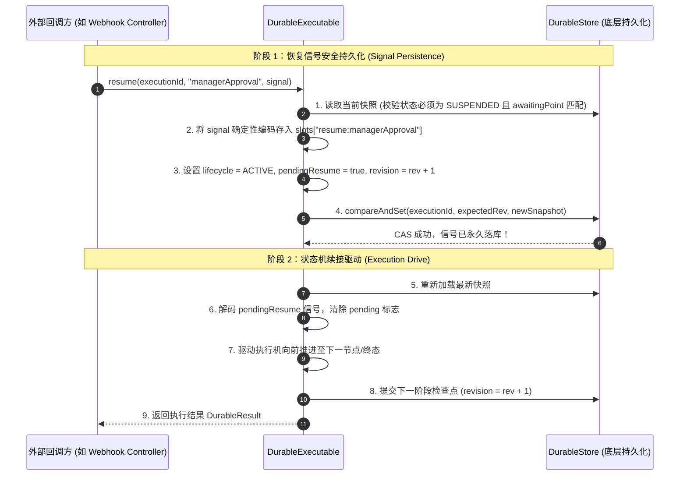

# Durable 两段式恢复协议与 PersistentPolicy

在分布式异步工作流与长事务编排中，挂起等待外部信号（如人工审批、支付 Webhook、第三方 MQ 回调）以及跨节点定时延时调度（如 10 分钟后重试、等待次日凌晨执行）是核心场景。

`team4u-flow-durable` 提出了**两段式 CAS 恢复协议（Two-Phase Resume Protocol）**与**持久化状态策略（`PersistentPolicy`）**，在遭遇任意时序的网络分区与机器崩溃时，仍能保证状态一致性与防冲突幂等。

---

## 两段式 CAS 恢复协议 (Two-Phase Resume)

当外部系统向挂起中的流程（`SUSPENDED`）注入恢复信号时，如果在“持久化信号”与“驱动流程向前执行”之间发生机器宕机，单纯的单步提交可能导致信号丢失或重复驱动。为此，框架采用了严密的两段式 CAS 协议：



---

## 阶段崩溃分析与幂等防御

两段式 CAS 协议在任何时刻发生崩溃均具备完备的自愈与防重机制：

| 崩溃时刻 | 快照当前状态 | 恢复与自愈行为 |
| :--- | :--- | :--- |
| **阶段 1 之前崩溃** | `SUSPENDED`（无信号） | 信号未落库。外部回调方稍后重试 `resume`，可正常执行阶段 1。 |
| **阶段 1 与阶段 2 之间崩溃** | `ACTIVE`，`pendingResume = true`，槽位已有信号 | **场景 A：外部重试同一信号**<br/>框架比对已持久化的信号；载荷一致时判定为幂等重试，直接跳过阶段 1，继续执行阶段 2。<br/><br/>** 场景 B：外部传入了不同信号**<br/>框架检测到信号冲突，抛出 `DurableException(RESUME_SIGNAL_CONFLICT)` 严格拒绝脏覆盖。<br/><br/>** 场景 C：由后台调度器调用 `recover(executionId)`**<br/>恢复器检测到 `pendingResume = true`，自动取出已落库的信号，继续驱动阶段 2。 |
| **阶段 2 执行中崩溃** | 保持阶段 1 快照或中间节点快照 | 重新调用 `recover(executionId)`，从最后成功提交的节点检查点无缝续跑。 |

---

## Spring 生产集成：从发起执行到 Webhook 异步唤醒

在微服务集群环境下，发起执行与接收回调通常发生在不同的机器节点上。Durable 执行器通过持久化快照实现了跨节点的无缝断点续跑：

```java
@RestController
@RequestMapping("/api/durable/orders")
public class DurableOrderController {

    @Autowired
    private DurableExecutable<OrderRequest, OrderReceipt> durableOrderExecutable;

    @Autowired
    private ResumePoint<ApprovalSignal> approvalPoint;

    /**
     * 1. 发起订单审批长流程 (节点 A 执行)
     */
    @PostMapping("/submit")
    public ResponseEntity<?> startOrderFlow(@RequestBody OrderRequest request) {
        String executionId = request.getOrderId(); // 业务单号作为全局唯一 executionId

        // 启动流程并落初始 ACTIVE 检查点
        DurableResult<OrderReceipt> result = durableOrderExecutable.start(executionId, request);

        if (result instanceof DurableResult.Suspended) {
            // 流程遇到 await(approvalPoint)，快照状态标记为 SUSPENDED 入库，线程安全释放
            DurableResult.Suspended<OrderReceipt> suspended = (DurableResult.Suspended<OrderReceipt>) result;
            return ResponseEntity.ok(Map.of(
                    "executionId", executionId,
                    "status", "SUSPENDED",
                    "awaitingPoint", suspended.resumePoint(),
                    "message", "订单长流程已挂起，等待主管审批"
            ));
        }

        if (result instanceof DurableResult.Completed) {
            return ResponseEntity.ok(((DurableResult.Completed<OrderReceipt>) result).outcome());
        }

        return ResponseEntity.status(500).body("Unexpected result");
    }

    /**
     * 2. 接收外部审批系统 Webhook 回调 (可能由集群中任意节点 B 处理)
     */
    @PostMapping("/callback/approval")
    public ResponseEntity<?> onApprovalWebhook(@RequestBody ApprovalWebhookDTO callback) {
        String executionId = callback.getOrderId();
        ApprovalSignal signal = new ApprovalSignal(callback.isApproved(), callback.getReviewerComment());

        try {
            // 核心：基于 executionId 和挂起点名称，注入 Signal 并两段式恢复流程
            DurableResult<OrderReceipt> finalResult = durableOrderExecutable.resume(
                    executionId, "managerApproval", signal);

            if (finalResult instanceof DurableResult.Completed) {
                Outcome<OrderReceipt> outcome = ((DurableResult.Completed<OrderReceipt>) finalResult).outcome();
                return ResponseEntity.ok(outcome);
            }

            return ResponseEntity.ok(Map.of("executionId", executionId, "status", "PROCESSED"));

        } catch (DurableException e) {
            if (e.getError() == DurableException.Error.RESUME_SIGNAL_CONFLICT) {
                // 收到冲突的重复信号报警
                return ResponseEntity.status(409).body("收到冲突的审批信号，拒绝处理");
            }
            throw e;
        }
    }
}
```

---

## 持久化策略：`PersistentPolicy<K, S>`

普通 `Policy<K>` 是无状态的，其状态在 JVM 内存中生命周期短暂。而 `PersistentPolicy<K, S>` 的状态 `S` 则由框架**完全持久化存储在快照的 `policy:<path>` 槽位中**，跨越进程重启仍能保留完整的计数器、窗口与历史状态。

### 接口契约

```java
public interface PersistentPolicy<K, S> {
    /**
     * 初始化策略状态（首次进入该策略作用域时调用）。
     *
     * @param key 策略路由键
     * @return 初始状态对象 S
     */
    S initialState(K key);

    /**
     * 前置拦截评估：返回决策与更新后的状态。
     *
     * @param context 策略上下文
     * @param key     策略路由键
     * @param state   从快照中反序列化的当前状态 S
     * @return Before 决策：Proceed(放行), WaitUntil(延时等待), Reject(拒绝), Fail(失败)
     */
    Before<S> before(PolicyContext context, K key, S state);

    /**
     * 后置通知回调：返回后置决策与更新后的状态。
     *
     * @param context    策略上下文
     * @param key        策略路由键
     * @param state      当前状态 S
     * @param completion 业务四态执行摘要
     * @return After 决策：Return(完成), RetryAt(指定时刻重试)
     */
    After<S> after(PolicyContext context, K key, S state, Completion completion);
}
```

---

## 定时延时调度与唤醒机制（`WaitUntil` / `RetryAt`）

`PersistentPolicy` 原生支持将流程置为定时延时等待状态，无需占用任何线程：

```mermaid
graph LR
    P_BEFORE["PersistentPolicy.before"] -->|"返回 PersistentPolicy.waitUntil(wakeInstant, newState)"| M["DurableMachine 写入检查点"]
    M -->|"保存 slots['policy:...']=newState<br/>保存 wakeAt=wakeInstant<br/>设置 lifecycle=ACTIVE"| DS[("DurableStore")]
    DS --> RES["返回 DurableResult.Active(wakeAt)"]
    
    RES -.->|"当前调用线程立即释放退出"| EXIT["线程释放 (Parked)"]
    
    SCHED["外部定时调度器 (结合 team4u-kv-lock 分布式锁)"`] -->|"扫描到到达 wakeAt 的记录"`| REC["调用 executable.recover(executionId)"]
    REC --> NEXT["从快照恢复策略状态并继续执行"]
```

### 示例：每日配额控制策略

`PersistentPolicy` 的决策原语均为接口上的静态工厂方法：

- 前置决策：`PersistentPolicy.proceed(state)`、`PersistentPolicy.waitUntil(instant, state)`、`PersistentPolicy.reject(reason, state)`、`PersistentPolicy.fail(failure, state)`；
- 后置决策：`PersistentPolicy.returning(state)`、`PersistentPolicy.retryAt(instant, state)`。

```java
public class DailyQuotaPolicy implements PersistentPolicy<String, DailyQuotaState> {

    @Override
    public DailyQuotaState initialState(String userId) {
        return new DailyQuotaState(0, Instant.now());
    }

    @Override
    public Before<DailyQuotaState> before(PolicyContext context, String userId, DailyQuotaState state) {
        if (state.getCount() >= 100) {
            // 超过每日额度，计算次日零点时刻并挂起等待
            Instant tomorrowMidnight = calculateTomorrowMidnight();
            return PersistentPolicy.waitUntil(tomorrowMidnight, state.resetForTomorrow());
        }
        // 放行并递增计数
        return PersistentPolicy.proceed(state.increment());
    }

    @Override
    public After<DailyQuotaState> after(PolicyContext context, String userId, DailyQuotaState state, Completion completion) {
        if (completion.kind() == Outcome.Kind.FAILED) {
            // 失败时 5 分钟后重试
            Instant retryTime = Instant.now().plus(Duration.ofMinutes(5));
            return PersistentPolicy.retryAt(retryTime, state);
        }
        return PersistentPolicy.returning(state);
    }
}
```

---

## 定时唤醒调度集成（scanDue + firstWakeAt）

生产环境中，`WaitUntil` / `RetryAt` 产生的定时唤醒由外部调度器扫描到期快照并调用
`recover(executionId)` 拉起续跑。当前版本已提供以下存储层能力：

- **`DurableSnapshot` 信封携带 `firstWakeAt` 字段**：记录本实例最近一次进入定时等待的
  首个唤醒时刻（从帧栈的 wake/deadline 取最早到期者，仅 ACTIVE 快照非空），便于
  调度器直接扫描与水位线统计，无需解码帧栈；
- **`DurableStore.scanDue(Instant, int)` 可选扫描接口**：按 `lifecycle = ACTIVE` 且
  `firstWakeAt` 已到期的条件批量返回待唤醒的快照，避免依赖各存储后端自建条件查询；
  不支持扫描的后端返回 `empty`；
- **`KvDurableStore` TTL 按终态 / 非终态分流**：非终态（ACTIVE / SUSPENDED）快照默认
  永不过期，保证待唤醒实例不被存储层误淘汰；终态（COMPLETED / CANCELLED）快照按
  `terminalTtlMillis` 归档清理，构造器提供 `(store, space, terminalTtlMillis, activeTtlMillis[, clock])`
  参数形态。

配合上述能力，典型的“定时唤醒调度器”集成模式为：

```text
[定时任务 + 分布式锁 (team4u-kv-lock)]
  -> store.scanDue(now, limit)           // 拉取到期待唤醒实例
  -> executable.recover(executionId)     // 逐个拉起续跑（幂等，并发竞争由 CAS 保护）
  -> 终态快照按 TTL 自动归档清理
```

---

以下是基于 `scanDue` 的定时调度器参考实现：

```java
// 定时调度器示例（每 500ms 扫描一批到期执行）
ScheduledExecutorService scheduler = Executors.newSingleThreadScheduledExecutor();

scheduler.scheduleWithFixedDelay(() -> {
    Optional<List<DurableSnapshot>> due = durableStore.scanDue(Instant.now(), 100);
    if (!due.isPresent()) {
        return; // 存储不支持扫描能力：需外部索引或延迟队列
    }
    for (DurableSnapshot snapshot : due.get()) {
        try {
            executable.recover(snapshot.executionId());
        } catch (DurableException conflict) {
            // REVISION_CONFLICT：另一节点已并发驱动，自然让位
        }
    }
}, 0, 500, TimeUnit.MILLISECONDS);
```

关键语义：
- **并发安全**：多个调度器扫描到同一到期执行时，CAS 乐观锁保证仅一方 recover 成功，
  另一方得到 `REVISION_CONFLICT`；
- **后端能力差异**：`InMemoryDurableStore` 与实现了 `ScanCapable` 的 KV 后端（如
  `InMemoryKvStore`）支持扫描；大键量 Redis 等场景建议用 ZSET 维护到期索引或使用独立
  延迟队列，`scanDue` 对不支持的存储返回 empty；
- **与 TTL 策略配合**：非终态快照默认永不过期（不会被 TTL 静默清理），终态快照按
  terminalTtl 归档淘汰，避免调度器扫描到已被清理的历史数据。

---

## 关联章节与进一步阅读

- 深入学习 Durable 核心架构与检查点：[Durable 状态机与 CAS 检查点机制](flow-durable-core.md)
- 深入剖析快照存储结构与 StateMapper 编解码：[快照存储结构与 StateMapper 编解码](flow-durable-snapshot.md)
- 了解 DurableStore SPI 与 KV 存储实现：[DurableStore 存储 SPI 与 KV 适配](flow-durable-kv.md)
- 查看完整的长流程实战案例：[实战案例库与生产模式](flow-sample.md)
