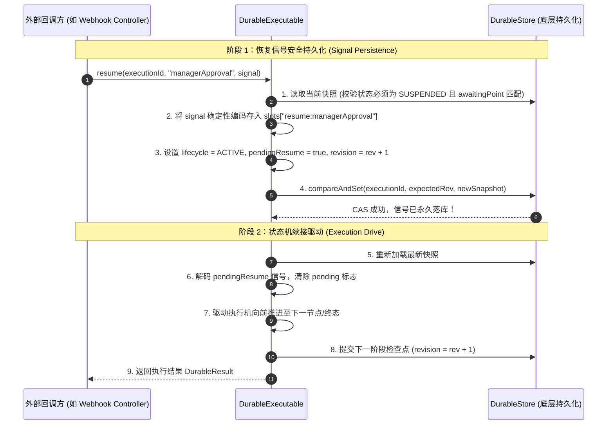
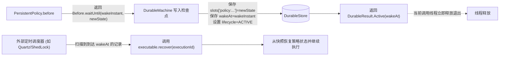

# Durable 两段式恢复协议与 PersistentPolicy

在分布式异步工作流与长事务编排中，挂起等待外部信号（如审批、支付 Webhook）以及跨节点定时延时调度（如 10 分钟后重试、等待特定时间点执行）是核心场景。

`team4u-flow-durable` 提出了**两段式 CAS 恢复协议（Two-Phase Resume Protocol）**与**持久化状态策略（`PersistentPolicy`）**，在遭遇任意时序的网络分区与机器崩溃时，仍能保证状态一致性与防冲突幂等。

---

## 两段式 CAS 恢复协议 (Two-Phase Resume)

当外部系统向挂起中的流程（`SUSPENDED`）注入恢复信号时，如果在“持久化信号”与“驱动流程向前执行”之间发生机器宕机，单纯的单步提交可能导致信号丢失或重复驱动。为此，框架采用了严密的两段式 CAS 协议：



---

## 阶段崩溃分析与幂等防御

两段式 CAS 协议在任何时刻发生崩溃均具备完备的自愈与防重机制：

| 崩溃时刻 | 快照当前状态 | 恢复与自愈行为 |
| :--- | :--- | :--- |
| **阶段 1 之前崩溃** | `SUSPENDED`（无信号） | 信号未落库。外部回调方稍后重试 `resume`，可正常执行阶段 1。 |
| **阶段 1 与阶段 2 之间崩溃** | `ACTIVE`，`pendingResume = true`，槽位已有信号 | **场景 A：外部重试同一信号**<br/>框架比对已持久化的信号；载荷一致时判定为幂等重试，直接跳过阶段 1，继续执行阶段 2。<br/><br/>**场景 B：外部传入了不同信号**<br/>框架检测到信号冲突，抛出 `DurableException(RESUME_SIGNAL_CONFLICT)` 严格拒绝脏覆盖。<br/><br/>**场景 C：由后台调度器调用 `recover(executionId)`**<br/>恢复器检测到 `pendingResume = true`，自动取出已落库的信号，继续驱动阶段 2。 |
| **阶段 2 执行中崩溃** | 保持阶段 1 快照或中间节点快照 | 重新调用 `recover(executionId)`，从最后成功提交的节点检查点无缝续跑。 |

---

## 持久化策略：`PersistentPolicy<K, S>`

普通 `Policy<K>` 是无状态的，其状态在 JVM 内存中生命周期短暂。而 `PersistentPolicy<K, S>` 的状态 `S` 则由框架**完全持久化存储在快照的 `policy:<path>` 槽位中**，跨越进程重启仍能保留完整的计数器、窗口与历史状态。

### 接口契约

```java
public interface PersistentPolicy<K, S> {
    /**
     * 初始化策略状态（首次进入该策略作用域时调用）。
     *
     * @param key 策略路由键
     * @return 初始状态对象 S
     */
    S initialState(K key);

    /**
     * 前置拦截评估：返回决策与更新后的状态。
     *
     * @param context 策略上下文
     * @param key     策略路由键
     * @param state   从快照中反序列化的当前状态 S
     * @return Before 决策：Proceed(放行), WaitUntil(延时等待), Reject(拒绝), Fail(失败)
     */
    Before<S> before(PolicyContext context, K key, S state);

    /**
     * 后置通知回调：返回后置决策与更新后的状态。
     *
     * @param context    策略上下文
     * @param key        策略路由键
     * @param state      当前状态 S
     * @param completion 业务四态执行摘要
     * @return After 决策：Return(完成), RetryAt(指定时刻重试)
     */
    After<S> after(PolicyContext context, K key, S state, Completion completion);
}
```

---

## 定时延时调度与唤醒机制（`WaitUntil` / `RetryAt`）

`PersistentPolicy` 原生支持将流程置为定时延时等待状态，无需占用任何线程：



### 示例：最大重试间隔控制策略

```java
public class DailyQuotaPolicy implements PersistentPolicy<String, DailyQuotaState> {

    @Override
    public DailyQuotaState initialState(String userId) {
        return new DailyQuotaState(0, Instant.now());
    }

    @Override
    public Before<DailyQuotaState> before(PolicyContext context, String userId, DailyQuotaState state) {
        if (state.getCount() >= 100) {
            // 超过每日额度，计算次日零点时刻并挂起等待
            Instant tomorrowMidnight = calculateTomorrowMidnight();
            return Before.waitUntil(tomorrowMidnight, state.resetForTomorrow());
        }
        // 放行并递增计数
        return Before.proceed(state.increment());
    }

    @Override
    public After<DailyQuotaState> after(PolicyContext context, String userId, DailyQuotaState state, Completion completion) {
        if (completion.kind() == Outcome.Kind.FAILED) {
            // 失败时 5 分钟后重试
            Instant retryTime = Instant.now().plus(Duration.ofMinutes(5));
            return After.retryAt(retryTime, state);
        }
        return After.result(state);
    }
}
```

---

## 关联章节与进一步阅读

- 深入学习 Durable 核心架构与检查点：[Durable 状态机与 CAS 检查点机制](flow-durable-core.md)
- 深入剖析快照存储结构与 StateMapper 编解码：[快照存储结构与 StateMapper 编解码](flow-durable-snapshot.md)
- 了解 DurableStore SPI 与 KV 存储实现：[DurableStore 存储 SPI 与 KV 适配](flow-durable-kv.md)
- 查看完整的长流程实战案例：[实战案例库与生产模式](flow-sample.md)
