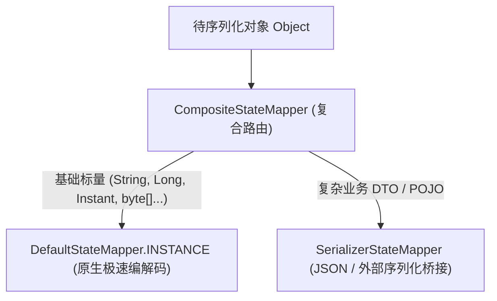

# 快照存储结构与 StateMapper 编解码

在 `team4u-flow-durable` 中，流程执行的完整上下文以不可变快照信封 `DurableSnapshot` 的形式持久化。底层状态数据绝不序列化任何 Java 代码或 Lambda 闭包，而是通过 **`StateMapper` 确定性编解码体系**将其离散存储至标准化的槽位（Slots）中。

本文将详细剖析快照内部字段设计、槽位布局、`StateMapper` 确定性契约以及在生产中接入 JSON 序列化器的最佳实践。

---

## 快照信封结构 (`DurableSnapshot`)

`DurableSnapshot` 是一个不可变的数据载体，包含两大部分：**框架运行元数据**与**业务状态槽位表**。

```mermaid
graph TD
    DS["DurableSnapshot (快照信封)"]
    
    subgraph "框架运行元数据 (Framework Metadata)"
        M1["executionId: 执行实例唯一流水号"]
        M2["flowId / flowVersion: 流程标识与版本"]
        M3["formatId / formatVersion: 存储格式契约版本"]
        M4["revision: 单调递增 CAS 乐观锁版本号"]
        M5["lifecycle: ACTIVE / SUSPENDED / CANCELLED / COMPLETED"]
        M6["awaitingPoint: 当前等待的挂起点 (若处于挂起态)"]
        M7["pendingResume: 是否有待消费的恢复信号"]
        M8["wakeAt: 定时唤醒时间戳 (若处于定时等待)"]
        M9["frameMetadata: 执行帧栈上下文"]
    end
    
    subgraph "业务状态槽位 (Business Slots Map)"
        S1["slots['input'] → StoredValue (初始输入)"]
        S2["slots['node:$/0/1'] → StoredValue (节点中间状态)"]
        S3["slots['policy:$/0'] → StoredValue (策略状态)"]
        S4["slots['resume:pointName'] → StoredValue (恢复信号)"]
    end
    
    DS --> M1 & M2 & M3 & M4 & M5 & M6 & M7 & M8 & M9
    DS --> S1 & S2 & S3 & S4
```



---

## 槽位命名规范 (Slot Layout)

业务数据被确定性编码为 `StoredValue` 后，存入 `slots: Map<String, StoredValue>` 字典中。框架定义了标准化的槽位键前缀：

| 槽位键格式 | 存储内容 | 生命周期与写入时机 |
| :--- | :--- | :--- |
| **`input`** | 流程启动时的初始输入入参 | `start` 命令初始化时写入，全程只读 |
| **`node:<path>`** | 对应 AST 路径节点产生/消费的中间业务数据 | 节点执行完成并提交检查点时更新 |
| **`policy:<path>`** | `PersistentPolicy` 的内部状态 `S` | 策略前置/后置评估并提交检查点时更新 |
| **`resume:<name>`** | 外部注入目标挂起点的恢复信号（Signal） | `resume` 第一阶段 CAS 成功时写入 |

---

## `StoredValue` 存储值模型

```java
public final class StoredValue {
    private final String typeName;     // 类型标识 (如 "java.lang.String" 或 "com.example.Order")
    private final String format;       // 编码格式 (如 "raw", "json:jackson", "kryo")
    private final int version;         // 数据格式版本
    private final byte[] payload;      // 二进制数据载荷 (严格确定性字节序列)
}
```

---

## `StateMapper` 确定性编解码契约

`StateMapper` 是连接业务 Java 领域对象与二进制存储载荷的 SPI 核心契约：

```java
public interface StateMapper {
    /**
     * 将业务对象编码为存储值对象。
     * 
     * @param value 业务对象
     * @return 确定性的 StoredValue
     */
    StoredValue encode(Object value) throws Exception;

    /**
     * 从存储值对象解码还原为业务对象。
     * 
     * @param storedValue 存储值
     * @return 还原后的业务对象
     */
    Object decode(StoredValue storedValue) throws Exception;
}
```

### 确定性契约（Deterministic Contract）的重要性

> [!IMPORTANT]
> **确定性要求**：对于同一个业务对象（在 `equals` 意义下相同），多次调用 `encode` 生成的 `StoredValue` 载荷字节序列必须**逐字节完全一致（Bit-for-bit Equality）**。

**为什么确定性至关重要？**
- 在两段式 CAS 恢复协议中，当外部重复发起 `resume` 时，框架通过比对新信号编码后的字节数组与已持久化信号是否一致来判定是否为幂等重放；
- 如果序列化器在输出 JSON 时包含无序的 Map 键值对、随机盐值或未格式化的动态时间戳，将导致相同对象计算出不同的字节散列，从而引发 `RESUME_SIGNAL_CONFLICT` 误判！

---

## 内置 StateMapper 与集成配置

框架提供了分层渐进的 `StateMapper` 实现：



### 1. `DefaultStateMapper`
- 处理常见标量：`String`、`Integer`、`Long`、`Double`、`Boolean`、`byte[]`、`Instant`；
- 零第三方依赖，极速原生二进制转换，严格保证确定性。

### 2. `SerializerStateMapper`
- 桥接外部序列化引擎（如 Jackson、Gson 等）；
- 支持类型注册与安全反序列化。

### 3. `CompositeStateMapper` 生产配置示例

在 Spring / 生产环境中，通常将 Jackson 与 Default 组合为复合映射器：

```java
import com.fasterxml.jackson.databind.ObjectMapper;
import com.fasterxml.jackson.databind.SerializationFeature;
import com.team4u.framework.flow.durable.snapshot.CompositeStateMapper;
import com.team4u.framework.flow.durable.snapshot.DefaultStateMapper;
import com.team4u.framework.flow.durable.snapshot.SerializerStateMapper;
import com.team4u.framework.flow.durable.snapshot.StateMapper;

// 1. 配置确定性 Jackson 映射器 (开启字段键排序)
ObjectMapper mapper = new ObjectMapper();
mapper.configure(SerializationFeature.ORDER_MAP_ENTRIES_BY_KEYS, true);

SerializerStateMapper jacksonStateMapper = new SerializerStateMapper(
        "json:jackson", 
        1, // 版本号
        obj -> mapper.writeValueAsBytes(obj),
        bytes -> mapper.readValue(bytes, Object.class)
);

// 2. 构建复合映射器：标量走 Default，复杂对象走 Jackson
StateMapper stateMapper = CompositeStateMapper.withDefault(jacksonStateMapper);

// 3. 注入 DurableRuntime
DurableRuntime runtime = DurableRuntime.builder(durableStore)
        .stateMapper(stateMapper)
        .build();
```

---

## 关联章节与进一步阅读

- 深入学习 Durable 核心架构与检查点：[Durable 状态机与 CAS 检查点机制](flow-durable-core.md)
- 深入学习两段式 CAS 恢复与持久化策略：[Durable 两段式恢复协议与 PersistentPolicy](flow-durable-resume.md)
- 了解 DurableStore 存储 SPI 与 KV 存储适配：[DurableStore 存储 SPI 与 KV 适配](flow-durable-kv.md)
- 查看完整的长流程实战案例：[实战案例库与生产模式](flow-sample.md)
