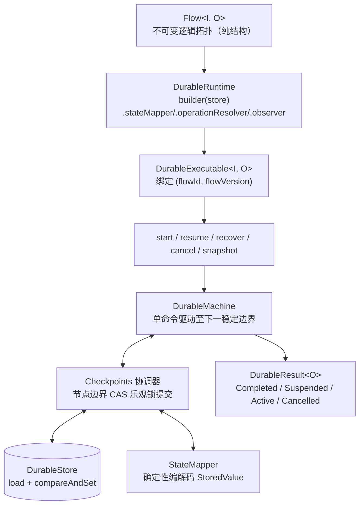

# Durable 持久化全景总览

`team4u-flow-durable` 是独立于核心的持久化执行器组件。在 `Local` 内存执行器上验证通过的 `Flow<I, O>` 纯逻辑拓扑，无需修改任何代码，原样交给 `DurableRuntime.compile` 编译后，即可获得节点级 CAS 检查点与跨进程断点续跑能力。

本章提供 Durable 执行器的全景架构与快速索引。各项专题已细化并独立成章，推荐结合各独立专章深入研读：

- 核心状态机与 CAS 检查点：[Durable 状态机与 CAS 检查点机制](flow-durable-core.md)
- 两段式恢复与 PersistentPolicy：[Durable 两段式恢复协议与 PersistentPolicy](flow-durable-resume.md)
- 快照存储槽位与 StateMapper：[快照存储结构与 StateMapper 编解码](flow-durable-snapshot.md)
- DurableStore 存储 SPI 与 KV 实现：[DurableStore 存储 SPI 与 KV 适配](flow-durable-kv.md)
- Durable 异常诊断与排查手册：[诊断码体系与故障排查手册](flow-diagnostics.md)

---

## 核心架构设计



### 四大核心设计原则

- **复用同一份 Flow 定义**：不另造 DSL，同一套 Flow 业务定义可在内存（`Local`）与持久化（`Durable`）执行器间无缝切换；
- **零 Lambda / 代码序列化**：快照仅保存框架元数据与由 `StateMapper` 编码后的 `StoredValue` 槽位，绝不序列化 Java 字节码、Operation 实例或 Lambda；
- **单调递增 revision CAS 检查点**：每次状态推进均以乐观锁提交，多实例并发写冲突时安全拒绝；
- **版本强隔离**：以 `(flowId, flowVersion)` 显式隔离快照，结构变更时版本递增。

---

## 快速上手

```java
import com.team4u.framework.flow.Flow;
import com.team4u.framework.flow.durable.DurableExecutable;
import com.team4u.framework.flow.durable.DurableResult;
import com.team4u.framework.flow.durable.DurableRuntime;
import com.team4u.framework.flow.durable.store.DurableStore;
import com.team4u.framework.flow.durable.store.InMemoryDurableStore;

// 1. 构建 Durable 运行时
DurableStore store = new InMemoryDurableStore(); // 生产环境替换为 KvDurableStore (Redis / JDBC)
DurableRuntime runtime = DurableRuntime.builder(store)
        .stateMapper(customMapper)          // 可选：业务状态编解码器
        .operationResolver(beanResolver)    // 可选：Bean 解析器
        .observer(flowObserver)             // 可选：流程观察者
        .durableObserver(durableObserver)   // 可选：检查点事件监听
        .executor(appExecutor)              // 可选：调用方拥有的线程池（借用，不关闭）
        .build();

// 2. 编译流程（绑定 flowId 与 flowVersion）
DurableExecutable<OrderRequest, Receipt> executable =
        runtime.compile(orderFlow, "order-fulfillment", 1);

// 3. 启动执行并落初始检查点
DurableResult<Receipt> result = executable.start("order-0001", request);
```

> [!IMPORTANT]
> **executor 借用语义**：通过 `DurableRuntime.builder(store).executor(...)` 传入的线程池，
> 其生命周期完全由调用方管理——`DurableRuntime` 仅在超时控制（限时执行）与异步命令
> （`startAsync` / `resumeAsync`）中借用该线程池，**绝不会在运行时关闭它**；
> 应用停机时须由上层自行 `shutdown`。未配置 executor 时调用异步命令将抛出
> `ASYNC_EXECUTOR_MISSING`；包含 timeout 作用域的流程要求显式配置 executor，
> 编译期校验缺失时 fail-fast 抛出 `INVALID_CONFIGURATION`。

---

## 命令与生命周期全景

### 命令方法对照表

| 命令方法 | 初始前置状态 | 语义说明 | 异常行为 |
| :--- | :--- | :--- | :--- |
| **`start(id, input)`** | 不存在（`expectedRev = -1`） | 创建 `ACTIVE` 初始快照（`revision=1`）并驱动首段 | 重复 start 抛 `EXECUTION_EXISTS` |
| **`resume(id, point, signal)`** | `SUSPENDED` | 向挂起执行注入信号并驱动续接（两段式 CAS 提交） | 状态不匹配抛 `LIFECYCLE_MISMATCH`；信号冲突抛 `RESUME_SIGNAL_CONFLICT` |
| **`recover(id)`** | `ACTIVE` | 从最后提交的快照解码状态并继续驱动 | 状态不匹配抛 `LIFECYCLE_MISMATCH`；流版本不一致抛 `FLOW_MISMATCH` |
| **`cancel(id)`** | `ACTIVE` / `SUSPENDED` | 将快照状态以 CAS 更新为 `CANCELLED` 终态并终止执行 | 已处于终态时抛 `LIFECYCLE_MISMATCH` |
| **`snapshot(id)`** | 任意状态 | 只读查询当前快照元数据与槽位（无任何写副作用） | 记录不存在时返回 `Optional.empty()` |
| **`startAsync` / `resumeAsync`** | 对应同步前置 | 异步版本命令，基于调用方配置的线程池返回 `CompletionStage` | 未配置 executor 时抛 `ASYNC_EXECUTOR_MISSING` |

### `DurableResult<O>` 四态生命周期闭集

| 结果状态 | 携带载荷 | 语义说明 |
| :--- | :--- | :--- |
| **`Completed`** | `Outcome<O>` + snapshot | 执行完成，携带最终业务四态结果。可通过 `requireAccepted()` 解包成功值。 |
| **`Suspended`** | `resumePoint` + snapshot | 流程处于挂起中，等待外部系统注入恢复信号。 |
| **`Active`** | `wakeAt`（`Optional<Instant>`）+ snapshot | 流程处于退避等待中，到点后由外部调度器调用 `recover` 唤醒。 |
| **`Cancelled`** | snapshot | 流程已被协作式令牌或显式命令取消。 |

---

## 稳定幂等键（`invocationId`）与 At-Least-Once 语义

每个节点在执行时均注入唯一的稳定幂等键：

$$\text{invocationId} = \text{flowId} : \text{flowVersion} : \text{executionId} : \text{path}$$

- **重试与重放恒定**：在 Retry 重试或崩溃恢复重放时，同一节点的 `invocationId` 保持绝对恒定；
- **外部写幂等去重**：外部副作用（如支付扣款、库存预占）应以 `invocationId` 作为防重 Token，实现 **At-Least-Once 框架驱动 + 外部幂等去重 = Exactly-Once 业务效果**。

---

## 事件监听：`DurableObserver`

除标准 `FlowObserver` 生命周期事件外，`DurableObserver` 提供持久化全链路事件追踪：

| 事件类型 (`DurableObserver.Type`) | 触发时机 | 扩展属性 (`attributes`) |
| :--- | :--- | :--- |
| **`CHECKPOINT_COMMITTED`** | 节点边界快照成功通过 CAS 提交入库 | `kind`（检查点类型）、`path`（节点路径） |
| **`CHECKPOINT_RESTORED`** | 调用 `recover` 成功从底层存储恢复快照 | `revision`（恢复时的快照版本号） |
| **`RESUME_SIGNAL_PERSISTED`** | resume 第一阶段完成，恢复信号成功入库 | `resumePoint`（目标挂起点名称） |

---

## `DurableException.Error` 错误码清单

`DurableException` 为运行时异常，携带固定错误码枚举。完整码表如下：

| 错误码 | 严重级别 | 根本原因 | 运维处理指引 |
| :--- | :--- | :--- | :--- |
| **`INVALID_DEFINITION`** | 严重 (Error) | 流程定义非法（如快照恢复时拓扑校验失败） | 检查 Flow 定义结构与快照拓扑版本 |
| **`INVALID_CONFIGURATION`** | 错误 (Error) | 运行时配置非法（如流程含 TIMEOUT 作用域而未配置 executor） | 核对 `DurableRuntime` 装配参数，为含 timeout 的流程显式配置 executor |
| **`REVISION_CONFLICT`** | 警告 (Warn) | 多个分布式节点并发驱动同一个 `executionId` 导致 CAS 冲突 | 正常并发竞争保护。客户端稍后重新读取最新快照重试 |
| **`FLOW_MISMATCH`** | 严重 (Error) | 尝试恢复的快照其 `flowId` 或 `flowVersion` 与当前代码不一致 | 确认是否发生了流程定义拓扑变更；使用与快照版本匹配的 Flow 运行时进行恢复 |
| **`FORMAT_MISMATCH`** | 严重 (Error) | 快照格式 ID 或版本与当前运行时不兼容 | 检查快照 `formatId`/`formatVersion`，确认集群内框架版本一致 |
| **`RESUME_SIGNAL_CONFLICT`** | 严重 (Error) | 恢复信号落库后发生重启，外部重试时传入了**不同的信号载荷** | 检查外部回调网关的重试逻辑，确保幂等重试时注入完全相同的信号对象 |
| **`EXECUTION_EXISTS`** | 错误 (Error) | `start` 时指定的 `executionId` 在存储中已存在 | 检查流水号生成器，避免重复生成相同的流水号 |
| **`EXECUTION_NOT_FOUND`** | 错误 (Error) | 指定的 `executionId` 在存储中不存在 | 检查执行流水号是否正确，或确认数据库记录是否被过期清理 |
| **`CODEC_FAILURE`** | 严重 (Error) | `StateMapper` 编解码业务状态槽位失败 | 检查业务 DTO 是否有默认无参构造器、字段类型是否发生不兼容变更 |
| **`STORE_FAILURE`** | 严重 (Error) | 底层 `DurableStore` 发生数据库连接中断或 I/O 错误 | 检查底层 Redis / MySQL 存储连通性与网络状况 |
| **`LIFECYCLE_MISMATCH`** | 错误 (Error) | 在非法的生命周期下调用命令（例如对已 COMPLETED 实例调用 recover） | 校验调用时序，避免对终态实例再次发起驱动 |
| **`RESUME_POINT_MISMATCH`** | 错误 (Error) | resume 传入的挂起点名称与快照中实际等待的点不一致 | 核对外部回调注入的挂起点标识 |
| **`FRAME_MISMATCH`** | 严重 (Error) | 快照帧栈元数据损坏或与当前拓扑不匹配 | 排查存储数据完整性或代码结构变更 |
| **`ASYNC_EXECUTOR_MISSING`** | 错误 (Error) | 调用异步命令（`startAsync` / `resumeAsync`）但未配置 `executor` | 在 `DurableRuntime.builder` 中显式配置线程池 |

---

## 关联章节与进一步阅读

- [Durable 状态机与 CAS 检查点机制](flow-durable-core.md)
- [Durable 两段式恢复协议与 PersistentPolicy](flow-durable-resume.md)
- [快照存储结构与 StateMapper 编解码](flow-durable-snapshot.md)
- [DurableStore 存储 SPI 与 KV 适配](flow-durable-kv.md)
- [实战案例库与生产模式](flow-sample.md)
