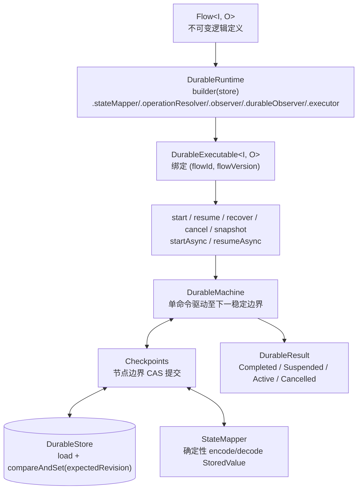

# Durable 持久化执行

`team4u-flow-durable` 提供跨进程、可崩溃恢复的持久化执行器：同一份逻辑 `Flow<I, O>` 无需改写即可获得节点级检查点与 at-least-once 恢复能力。

---

# 1. 架构



核心理念：

1. **完全复用同一份 Flow 定义**：不另造 DSL，本地纯内存验证通过的流程直接交给 `DurableRuntime.compile`。
2. **零 Lambda 序列化**：快照仅含框架元数据与编码后的 `StoredValue` 槽位，绝不序列化 Java 代码、Operation 实例或 Lambda。
3. **revision CAS 检查点**：每次状态推进以乐观锁提交，多实例并发操作同一执行时冲突方失败。
4. **版本强隔离**：以 `flowId + flowVersion` 显式标识；快照与可执行不匹配时直接拒绝，不做结构猜测与自动迁移。

`thenOptional` 在核心 DSL 中会展开为现有的 `FALLBACK(trigger=SKIPPED)` + `COMPLETE(identity)`，Durable 不需要新增控制种类或快照字段。因此 Local 与 Durable 共享完全相同的 Skipped 原值透传、Rejected/Failed 短路及 optional scope 入口值语义。

命令统一遵循模式：**load（无副作用）→ 校验生命周期 → 状态变更 → CAS 提交 → 驱动机器**。若进程在 CAS 提交后、驱动完成前崩溃，命令向调用方重抛原异常；由于快照已落库，重新 compile 后 `recover` 即可从最后提交的检查点继续。

---

# 2. 快速上手

```java
DurableStore store = new InMemoryDurableStore();          // 生产自建 JDBC 等实现
DurableRuntime runtime = DurableRuntime.builder(store)
        .stateMapper(mapper)                // 可选，默认 DefaultStateMapper
        .operationResolver(resolver)        // 可选，默认 rejecting
        .observer(flowObserver)             // 可选，FlowObserver
        .durableObserver(durableObserver)   // 可选，检查点事件
        .executor(executorService)          // 可选，仅借用不关闭
        .build();

DurableExecutable<OrderRequest, Receipt> executable =
        runtime.compile(flow, "order-fulfill", 3);   // flowId + flowVersion

DurableResult<Receipt> result = executable.start("order-20240101-0001", request);
```

命令集：

| 命令 | 语义 |
| :--- | :--- |
| `start(executionId, input)` | 开启新执行：先 CAS 创建 ACTIVE 初始快照（revision=1），再驱动首段；重复 start 以 `EXECUTION_EXISTS` 拒绝 |
| `resume(executionId, pointName, signal)` | 向 SUSPENDED 执行注入信号并驱动续接（两段 CAS，见第 5 节） |
| `recover(executionId)` | 恢复 ACTIVE 执行：从最后提交的快照解码并继续驱动；非 ACTIVE 以 `LIFECYCLE_MISMATCH` 拒绝 |
| `cancel(executionId)` | 取消 ACTIVE/SUSPENDED 执行：CAS 落 CANCELLED 终态 |
| `snapshot(executionId)` | 读取快照（无副作用） |
| `startAsync` / `resumeAsync` | 借用调用方 executor 的异步版本；未配置 executor 抛 `ASYNC_EXECUTOR_MISSING` |

生命周期：`ACTIVE -> COMPLETED | SUSPENDED | CANCELLED`；`SUSPENDED --resume--> ACTIVE -> ...`；退避等待（Retry backoff / PersistentPolicy WaitUntil/RetryAt）落 ACTIVE+wakeAt 快照并由命令返回 `DurableResult.Active(wakeAt)`，由外部调度在 wakeAt 后调用 `recover` 唤醒。

---

# 3. 快照内容边界与 StateMapper

## 3.1 快照只含元数据与编码槽

`DurableSnapshot` 信封字段：

- 标识：`executionId`、`flowId`、`flowVersion`、`formatId/formatVersion`（快照格式标识与版本）；
- 推进：`revision`（乐观锁版本）、`lifecycle`；
- 框架元数据：`frameMetadata`（帧栈结构骨架，框架内部编码）；
- 业务槽：`slots: Map<String, StoredValue>`——应用状态按角色名存放的编码值（如 scope entry、PersistentPolicy 状态、`resume:<name>` 恢复信号）。

**绝不**包含：Operation/Policy 实例、Lambda、Class 引用或任何可执行回调。`StoredValue` 对运行时是不透明数据（`codecId` + `codecVersion` + `payload` 字节）。

## 3.2 StateMapper 确定性契约

```java
public interface StateMapper {
    StoredValue encode(Object value) throws Exception;
    Object decode(StoredValue storedValue) throws Exception;
}
```

**确定性契约**：同一状态值多次 `encode` 必须产生 `equals` 相等的 `StoredValue`（相同 codec 标识与字节序列）。

- 默认实现 `DefaultStateMapper.INSTANCE` 支持基础标量（String/Integer/Long/Boolean/Double/Float/Short/Byte/Character）、`byte[]` 与 `Instant`。
- **复杂领域对象与 DTO 序列化**：
  - `SerializerStateMapper`：基于函数式接口桥接外部序列化器（如 Jackson、Fastjson、Protobuf 等），完全保持核心引擎的零多余依赖边界；
  - `CompositeStateMapper`：组合模式链式映射器，支持原生标量优先走 `DefaultStateMapper`，复杂实体自动回退到 `SerializerStateMapper`。

```java
// 结合 Jackson 构造复合状态映射器（优先标量，复杂实体走 Jackson）
ObjectMapper objectMapper = new ObjectMapper();
SerializerStateMapper jacksonMapper = new SerializerStateMapper(
        "json:jackson", 1,
        obj -> objectMapper.writeValueAsBytes(obj),
        bytes -> objectMapper.readValue(bytes, Object.class)
);

// 复合映射器：标量走 DefaultStateMapper，DTO 走 Jackson
StateMapper compositeMapper = CompositeStateMapper.withDefault(jacksonMapper);

DurableRuntime runtime = DurableRuntime.builder(store)
        .stateMapper(compositeMapper)
        .build();
```

---

# 4. invocationId 与 at-least-once

每个节点执行注入稳定幂等键：

```text
invocationId = flowId:flowVersion:executionId:path
```

- 同一执行内重试（Retry/PersistentPolicy）与崩溃恢复重放时，`invocationId` 保持绝对稳定。
- 外部副作用（支付扣款、库存预占）应以 `invocationId` 作为幂等键，把"框架可能重复驱动同一节点"转化为"外部系统按 key 去重"，实现 **at-least-once 外部写 + 幂等去重 = 有效 exactly-once 业务效果**。
- 恢复重放时节点是否真正重执行取决于快照推进边界：已提交检查点的节点不会重复执行，未提交的会从检查点重放——两种情况下幂等键不变。

---

# 5. resume 两段 CAS：信号先落库

`resume(executionId, pointName, signal)` 分两步独立提交：

```text
第一步（信号落库）：
  load 快照 -> 校验 lifecycle 与 awaitingPoint -> 信号 encode 进 resume:<name> 槽
  -> CAS(revision, ACTIVE + pendingResume=true) 提交

第二步（续接驱动）：
  重新 load -> 解码重建 pendingSignal -> 驱动机器消费信号并推进
```

崩溃语义：

- 崩溃在第一步之前：执行仍为 SUSPENDED，可重新 resume（同值或异值信号均可）。
- 崩溃在第一步之后、第二步之前：快照已 ACTIVE+pendingResume；再次 resume 同值信号幂等重驱动（编码确定性契约在此发挥作用），异值信号以 `RESUME_SIGNAL_CONFLICT` 拒绝；也可直接 `recover` 从快照续跑。
- `RESUME_POINT_MISMATCH`：挂起点 name 与快照 `awaitingPoint` 不一致时拒绝。

---

# 6. PersistentPolicy 状态持久化

`PersistentPolicy<K, S>` 的不可变状态 `S` 由框架编码进快照槽位：

- `initialState(key)` 首次评估时构造初始状态；
- before 的 `WaitUntil(instant, state)` 落 ACTIVE+wakeAt 快照，命令返回 `DurableResult.Active(wakeAt)`；到点后 `recover` 重新评估；
- after 的 `RetryAt(instant, state)` 同样以 ACTIVE+wakeAt 挂起；`Return(state)` 落终态；
- 每次状态变更随检查点 CAS 提交，崩溃后从快照恢复最后一次已提交的状态——策略状态与执行位置在同一快照内原子推进。

PersistentPolicy 不能用于 Parallel 分支（构建期拒绝）。

---

# 7. 并行串行驱动声明

**Durable 的 Parallel 分支按声明顺序串行驱动**：前序分支完成后才开始后序，不做并发执行。

- 这是崩溃一致性合同允许的简化：串行驱动下每个分支边界都是清晰的检查点边界，无需处理多分支并发写的 revision 风暴。
- wait-all 语义不变：全部分支完成后仍交给同一 `JoinStrategy` 合并，`invocationId` 规则不变。
- 需要真实并发执行时使用 Core 的 Local 执行器（其分支由 worker 线程池并发驱动，配合 `team4u-flow-test` 的 `ParallelBarrier` 可验证真并发）。

---

# 8. (flowId, flowVersion) 兼容边界

- Durable 身份是 `(flowId, flowVersion)` 二元组；快照在 load 时校验归属，不匹配以 `FLOW_MISMATCH` 拒绝。
- **快照格式不做跨版本兼容**：`FORMAT_MISMATCH` 直接拒绝旧/新格式快照，框架不提供迁移工具。
- 流程结构变更（增删节点、改变分支）必须递增 `flowVersion` 并以新版本 compile；旧版本执行只能由同版本可执行恢复。
- 结构投影（`flow.describe`）的节点 path 用于观测定位，**不承诺跨版本稳定**，不要把 path 持久化到业务库做跨版本比对。
- `executionId` 全局唯一由调用方保证；`start` 前先检查 `store.load(executionId)` 或依赖 `EXECUTION_EXISTS` 拒绝。

---

# 9. DurableStore SPI

```java
public interface DurableStore {
    Optional<DurableSnapshot> load(String executionId);
    boolean compareAndSet(String executionId, long expectedRevision, DurableSnapshot update);
}
```

- `expectedRevision = -1` 表示 create-if-absent（start 命令用）。
- `compareAndSet` 返回 false 表示 revision 冲突（并发写）；存储层异常由调用方包装，框架以 `STORE_FAILURE` 边界抛出 `DurableException`。
- 实现须无副作用 load（仅读取）。内置 `InMemoryDurableStore` 用于测试与演示；生产环境自建 JDBC/Redis 等实现（一张表、一列字节即可承载快照信封）。

错误码闭集（`DurableException.Error`）：`EXECUTION_EXISTS`、`EXECUTION_NOT_FOUND`、`FLOW_MISMATCH`、`FORMAT_MISMATCH`、`FRAME_MISMATCH`、`CODEC_FAILURE`、`STORE_FAILURE`、`REVISION_CONFLICT`、`LIFECYCLE_MISMATCH`、`RESUME_POINT_MISMATCH`、`RESUME_SIGNAL_CONFLICT`、`ASYNC_EXECUTOR_MISSING` 等，便于调用方做稳定分支处理。
