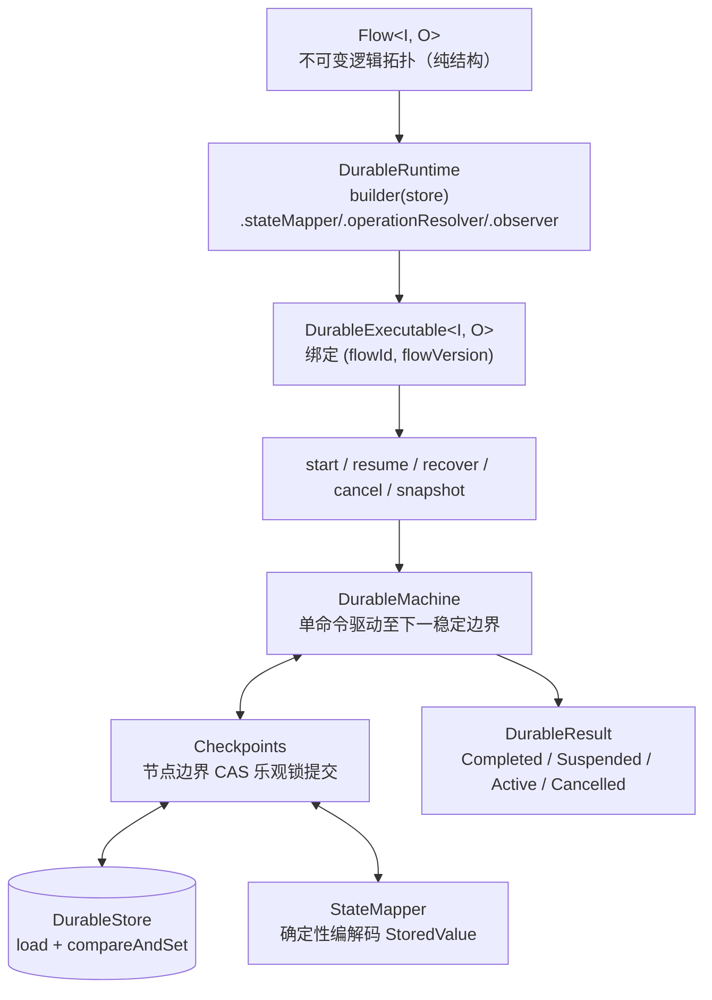

# Durable 持久化执行

`team4u-flow-durable` 是独立于核心的持久化执行器组件。在 `Local` 上验证通过的 `Flow<I, O>` 逻辑定义，无需修改任何代码，原样交给 `DurableRuntime.compile` 编译后，即可获得节点级 CAS 检查点与跨进程断点恢复能力。

---

## 架构设计



核心设计原则：

- **复用同一份 Flow 定义**：不另造 DSL，同一套 Flow 业务定义可在内存与持久化执行器间无缝切换；
- **零 Lambda 序列化**：快照仅保存框架元数据与编码后的 `StoredValue` 槽位，绝不序列化 Java 代码、Operation 实例或 Lambda；
- **revision CAS 检查点**：每次状态推进均以乐观锁提交，多实例并发写冲突时安全拒绝；
- **版本强隔离**：以 `(flowId, flowVersion)` 显式隔离快照，结构变更时版本递增。

---

## 快速上手

```java
import com.team4u.framework.flow.Flow;
import com.team4u.framework.flow.durable.DurableExecutable;
import com.team4u.framework.flow.durable.DurableResult;
import com.team4u.framework.flow.durable.DurableRuntime;
import com.team4u.framework.flow.durable.store.DurableStore;
import com.team4u.framework.flow.durable.store.InMemoryDurableStore;

// 1. 构建 Durable 运行时
DurableStore store = new InMemoryDurableStore(); // 生产环境替换为 JDBC 等持久化存储
DurableRuntime runtime = DurableRuntime.builder(store)
        .stateMapper(customMapper)          // 可选，状态编解码器
        .operationResolver(beanResolver)    // 可选，Bean 解析器
        .observer(flowObserver)             // 可选，流程观察者
        .durableObserver(durableObserver)   // 可选，检查点事件监听
        .build();

// 2. 编译流程（绑定 flowId 与 flowVersion）
DurableExecutable<OrderRequest, Receipt> executable =
        runtime.compile(orderFlow, "order-fulfillment", 1);

// 3. 启动执行并落初始检查点
DurableResult<Receipt> result = executable.start("order-0001", request);
```

### 命令与生命周期

| 命令方法 | 语义说明 |
| :--- | :--- |
| `start(executionId, input)` | 开启新执行：CAS 创建 ACTIVE 初始快照（`revision=1`）并驱动首段；重复 start 抛 `EXECUTION_EXISTS` |
| `resume(executionId, pointName, signal)` | 向 SUSPENDED 执行注入信号并驱动续接（两段 CAS 提交） |
| `recover(executionId)` | 恢复 ACTIVE 执行：从最后提交的快照解码状态并继续驱动；非 ACTIVE 执行拒绝 |
| `cancel(executionId)` | 取消 ACTIVE / SUSPENDED 执行，CAS 更新为 CANCELLED 终态 |
| `snapshot(executionId)` | 读取当前快照元数据（只读操作，无副作用） |
| `startAsync` / `resumeAsync` | 异步版本命令，基于调用方配置的线程池返回 `CompletionStage` |

### DurableResult 状态闭集

| `DurableResult<O>` | 携带内容 | 语义说明 |
| :--- | :--- | :--- |
| `Completed` | `Outcome<O>` + snapshot | 执行完成，携带最终业务四态结果 |
| `Suspended` | `resumePoint` + snapshot | 挂起中，等待外部系统注入恢复信号 |
| `Active` | `wakeAt`（`Optional<Instant>`）+ snapshot | 退避等待中，到点后由外部调度调用 `recover` 唤醒 |
| `Cancelled` | snapshot | 流程被取消 |

> [!TIP]
> `result.requireAccepted()` 仅在 `Completed` 且结果为 `Outcome.Accepted` 时返回业务载荷，否则抛出 `IllegalStateException`。

---

## 快照结构与 StateMapper 编解码

### 快照元数据与槽位设计

`DurableSnapshot` 信封包含以下核心属性：
- **标识元数据**：`executionId`、`flowId`、`flowVersion`、`formatId` / `formatVersion`；
- **状态推进**：`revision`（单调递增的乐观锁版本号）、`lifecycle`（生命周期状态）；
- **恢复协调**：`awaitingPoint`（当前等待的挂起点）、`pendingResume`（是否有待消费的恢复信号）；
- **框架内部元数据**：`frameMetadata`（执行帧栈结构）；
- **业务槽位**：`slots: Map<String, StoredValue>`，存放初始输入（`input`）、节点中间状态（`node:<path>`）、策略状态（`policy:<path>`）及恢复信号（`resume:<name>`）。

### StateMapper 确定性契约

```java
public interface StateMapper {
    StoredValue encode(Object value) throws Exception;
    Object decode(StoredValue storedValue) throws Exception;
}
```

> [!IMPORTANT]
> **确定性契约**：同一业务对象多次调用 `encode` 必须生成 `equals` 相等的 `StoredValue`（字节载荷严格一致）。避免在载荷中包含随机盐、当前时间戳或未排序的 Map 键值对，以确保 resume 信号的幂等比对准确可靠。

- `DefaultStateMapper.INSTANCE`：默认实现，支持常见标量（String、Integer、Long、Boolean 等）、`byte[]` 与 `Instant`；
- `SerializerStateMapper`：基于外部序列化框架（如 Jackson、Fastjson 等）桥接复杂 DTO；
- `CompositeStateMapper`：复合映射器，原生标量优先走默认映射器，复杂对象回退至 JSON 序列化器。

```java
// 基于 Jackson 构建复合映射器
ObjectMapper objectMapper = new ObjectMapper();
SerializerStateMapper jacksonMapper = new SerializerStateMapper(
        "json:jackson", 1,
        obj -> objectMapper.writeValueAsBytes(obj),
        bytes -> objectMapper.readValue(bytes, Object.class)
);

StateMapper compositeMapper = CompositeStateMapper.withDefault(jacksonMapper);

DurableRuntime runtime = DurableRuntime.builder(store)
        .stateMapper(compositeMapper)
        .build();
```

---

## 幂等性与 at-least-once 语义

每个节点在执行时均注入唯一的稳定幂等键：

```text
invocationId = flowId:flowVersion:executionId:path
```

- **重试与重放稳定**：在 Retry 重试或崩溃恢复重放时，同一节点的 `invocationId` 保持绝对恒定；
- **外部写幂等去重**：外部副作用（如支付扣款、库存预占）应以 `invocationId` 作为防重 Token，实现 **at-least-once 框架驱动 + 外部幂等去重 = exactly-once 业务效果**。

---

## 挂起与 resume 两段 CAS 机制

向挂起的流程注入恢复信号时，采用两段独立 CAS 提交：

- **第一阶段（信号安全落库）**：
  读取快照 -> 校验挂起点 -> 将信号编码入 `resume:<name>` 槽位 -> 以 CAS 将状态更新为 `ACTIVE` 且 `pendingResume=true`。
- **第二阶段（续接驱动）**：
  重新读取快照 -> 解码待处理信号 -> 驱动流程状态机向前推进。

崩溃恢复保证：
- 若在第一阶段前崩溃：快照保持 `SUSPENDED`，可重新发起 resume；
- 若在两阶段之间崩溃：快照已落库为 `ACTIVE`，再次以同值信号 resume 将幂等重驱动；异值信号将被拒绝（`RESUME_SIGNAL_CONFLICT`）；亦可直接调用 `recover` 从快照继续。

---

## PersistentPolicy 状态持久化

`PersistentPolicy<K, S>` 的不可变状态 `S` 由框架自动持久化至快照中的 `policy:<path>` 槽位：
- `initialState(key)` 初始化策略状态；
- `before` 返回 `WaitUntil(instant, state)` 时，流程保存为 `ACTIVE` 且附带 `wakeAt` 快照，退出当前线程；
- `after` 返回 `RetryAt(instant, state)` 时同样保存 `wakeAt`；
- 崩溃重启后，策略状态原位从快照恢复，计数与窗口等状态不丢失。

---

## 并行分支调度说明

在 Durable 模式下，`parallel` 分支按声明顺序**串行驱动**：
- 前序分支执行完毕并完成检查点落库后，才开始后序分支驱动；
- 该设计避免了多分支并发写数据库时导致的 CAS revision 冲突风暴；
- wait-all 语义与 Join 合并规则保持完全一致。如需真并发执行，请使用 Local 执行器。

---

## 版本管理与兼容边界

- **版本标识**：流程身份由 `(flowId, flowVersion)` 二元组确定，快照加载时会校验版本匹配性（不匹配报 `FLOW_MISMATCH`）；
- **版本演进**：当流程结构发生变更（增删节点、改变分支）时，必须递增 `flowVersion`；
- **节点路径**：节点 `path` 仅用于单次编译产物内的定位与断言，不承诺跨版本稳定，不要将其持久化至业务表中进行跨版本关联。

---

## 事件监听 (DurableObserver)

除标准 `FlowObserver` 事件外，`DurableObserver` 提供持久化全链路事件监听：

| 事件类型 (`DurableObserver.Type`) | 触发时机 | 扩展属性 (`attributes`) |
| :--- | :--- | :--- |
| `CHECKPOINT_COMMITTED` | 节点边界快照成功通过 CAS 提交入库 | `kind`（检查点类型）、`path`（节点路径） |
| `CHECKPOINT_RESTORED` | 调用 `recover` 成功从底层存储恢复快照 | `revision`（恢复时的快照版本号） |
| `RESUME_SIGNAL_PERSISTED` | resume 第一阶段完成，恢复信号成功入库 | `resumePoint`（目标挂起点名称） |

---

## DurableStore 存储 SPI 与异常体系

### DurableStore 接口

```java
public interface DurableStore {
    Optional<DurableSnapshot> load(String executionId);
    boolean compareAndSet(String executionId, long expectedRevision, DurableSnapshot update);
}
```

- `expectedRevision = -1` 表示仅在记录不存在时创建（用于 `start` 命令）；
- `compareAndSet` 返回 `false` 表示乐观锁版本冲突。

### 开箱即用存储实现

| 实现类 | 所属模块 | 说明 | 适用场景 |
| :--- | :--- | :--- | :--- |
| `InMemoryDurableStore` | `team4u-flow-durable` | 基于 `ConcurrentHashMap` 的纯内存实现 | 单元测试、本地调试与快速原型验证 |
| `KvDurableStore` | `team4u-flow-durable-kv` | 基于统一 `KvStore` 与 `CasCapable` 的多后端存储适配器，支持 Redis / JDBC / 内存，可选 TTL 与装饰链 | 生产环境持久化、分布式多节点部署 |

```java
// 生产环境使用 KvDurableStore 接入 Redis 或 JDBC 存储
KvStore redisStore = new RedisKvStore(redisTemplate);
DurableStore durableStore = new KvDurableStore(redisStore, "flow_durable", 86400_000L); // 可选 1 天 TTL

DurableRuntime runtime = DurableRuntime.builder(durableStore)
        .build();
```

### DurableException 错误码闭集与处理指引

| 错误码 (`DurableException.Error`) | 触发原因 | 处理策略 |
| :--- | :--- | :--- |
| `INVALID_DEFINITION` | 流程结构非法（如 Parallel 分支以非 COMPLETED 结束） | 修正 Flow 拓扑后重新编译 |
| `INVALID_CONFIGURATION` | 运行时配置参数非法 | 检查 `DurableRuntime.builder` 配置项 |
| `EXECUTION_EXISTS` | `start` 时指定的 `executionId` 已存在 | 检查流水号生成逻辑，避免重复启动 |
| `EXECUTION_NOT_FOUND` | 指定的 `executionId` 在存储中不存在 | 检查执行 ID 或确认存储数据是否被误删 |
| `FLOW_MISMATCH` | 快照所属的 `flowId` 或 `flowVersion` 与当前运行时不一致 | 确保使用相同版本的 Flow 进行恢复 |
| `FORMAT_MISMATCH` | 快照的存储格式版本不兼容 | 使用对应版本的框架运行时进行恢复 |
| `FRAME_MISMATCH` | 快照帧栈元数据损坏或与当前拓扑不匹配 | 排查存储数据完整性或代码结构变更 |
| `CODEC_FAILURE` | 使用 `StateMapper` 编解码状态槽位失败 | 检查业务 DTO 是否变更或补充缺失的编解码器 |
| `STORE_FAILURE` | 底层 `DurableStore` 发生数据库或 IO 异常 | 检查数据库连通性并由上层重试 |
| `REVISION_CONFLICT` | 并发操作同一执行实例时 CAS 乐观锁版本冲突 | 多实例并发竞争，稍后重新读取最新快照重试 |
| `LIFECYCLE_MISMATCH` | 在非法的生命周期状态下调用命令（如 recover 终态执行） | 校验调用时序，避免对终态实例发起驱动 |
| `RESUME_POINT_MISMATCH` | resume 传入的挂起点名称与快照中实际等待的点不一致 | 核对外部回调注入的挂起点标识 |
| `RESUME_SIGNAL_CONFLICT` | 恢复信号落库后发生崩溃，再次 resume 时传入了不同信号 | 确保重试时注入相同的信号内容 |
| `ASYNC_EXECUTOR_MISSING` | 调用异步命令但未配置 `executor` | 在 `DurableRuntime.builder` 中显式配置线程池 |

---

## 下一步

- 查看扩展机制与自定义存储实现：[扩展机制与 SPI](flow-extension.md)
- 学习支付挂起与崩溃恢复实战：[实战案例](flow-sample.md)
