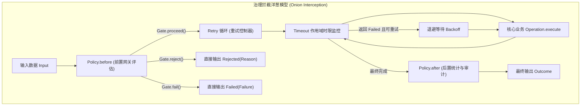

# 流程治理概览：Policy、Retry 与 Timeout

在生产级分布式应用中，业务步骤往往面临突发流量、下游不稳定、慢调用与偶发性故障。`team4u-flow` 提供了企业级的治理控制原语，包括无状态网关拦截（`Policy`）、状态持久化策略（`PersistentPolicy`）、自适应重试（`FlowRetryPolicy`）与超时控制（`Timeout`）。

---

## 治理架构与拦截模型

治理控制通过 `CONTROL` 节点自外向内包裹业务子流程，形成洋葱圈式的拦截调用链：



---

## 核心治理契约

`team4u-flow` 内核保持极致纯净，通过两套正交且完备的抽象契约支撑上层丰富的治理生态：

| 治理类型 | 核心契约 | 生命周期与行为特性 | 适用场景 |
| :--- | :--- | :--- | :--- |
| **无状态切面治理** | [`Policy<K>`](policy-custom.md#无状态策略契约policyk) | 零状态开销。在前置 `before` 与后置 `after` 进行门控裁决与指标统计。 | 准入放行、限流、鉴权、黑白名单、动态开关、审计埋点 |
| **有状态持久化治理** | [`PersistentPolicy<K, S>`](policy-custom.md#有状态持久化策略契约persistentpolicyk-s) | 具备不可变状态 `S`。支持 `proceed`、`returning`、`waitUntil` 挂起与 `retryAt` 定时退避唤醒；无缝兼容 Durable 检查点存储。 | 故障重试、多算法退避、状态机变迁、断点唤醒 |
| **时效控制治理** | `Duration` (`flow.timeout(...)`) | 施加最大执行耗时上限。超时向执行线程发送物理中断并置为取消。 | 防止下游死锁、阻塞慢调用熔断 |

---

## 开箱即用治理策略生态

为了保持 Core 零外部依赖，框架通过独立的桥接子模块提供生产级治理能力：

```
modules/flow/
├── ratelimiter/    # team4u-flow-ratelimiter (限流治理策略)
├── retry/          # team4u-flow-retry (重试与退避治理策略)
└── criterion/      # team4u-flow-criterion (表达式规则门控策略)
```

### 限流治理：`team4u-flow-ratelimiter`

基于 [`team4u-ratelimiter`](../ratelimiter/README.md) 分布式限流引擎，支持固定窗口、滑动窗口、令牌桶等算法：

```java
import com.team4u.framework.flow.ratelimiter.RateLimitPolicies;

// 用户维度限流：超限产生 Gate.fail 触发外层重试，或 Gate.reject 直接短路
Flow<OrderRequest, Receipt> flow = Flow.step(chargeOp)
        .policy(RateLimitPolicies.of("order.charge", OrderRequest::getUserId));
```

[查看专章详解：限流治理策略 (team4u-flow-ratelimiter)](policy-ratelimiter.md)

---

### 重试与退避治理：`team4u-flow-retry`

基于 [`team4u-retry`](../retry/README.md) 退避算法引擎，支持指数退避、随机抖动（Jitter）、条件故障码过滤与动态规则热加载：

```java
import com.team4u.framework.flow.retry.FlowRetries;
import com.team4u.framework.flow.retry.FlowRetryPolicy;

// 指数退避重试（最多 5 次，初始 100ms，2.0 倍递增，上限 2s）
Flow<OrderRequest, Receipt> flow = Flow.step(chargeOp)
        .persistentPolicy(FlowRetries.exponential(5, 100, 2.0, 2000), OrderRequest::getUserId);
```

[查看专章详解：重试与退避治理策略 (team4u-flow-retry)](policy-retry.md)

---

### 表达式规则门控：`team4u-flow-criterion`

基于 [`team4u-criterion`](../criterion/README.md) 规则引擎，支持通过类 SQL 动态文本表达式进行准入校验与分支判定：

```java
import com.team4u.framework.flow.criterion.CriterionPolicies;

// 动态表达式门控：仅允许 18 岁以上用户进入流程
Flow<UserRequest, Receipt> flow = Flow.step(chargeOp)
        .policy(CriterionPolicies.permitIf("age >= 18", "UNDERAGE", "用户未满 18 岁"), req -> req);
```

[查看专章详解：表达式规则门控策略 (team4u-flow-criterion)](policy-criterion.md)

---

### 自定义策略开发

开发者可通过实现 `Policy<K>` 或 `PersistentPolicy<K, S>` 轻松扩展专属业务治理逻辑，并支持 Spring 容器依赖注入。

[查看专章详解：自定义治理策略开发指南](policy-custom.md)

---

## 治理策略的组合与嵌套

在实际编排中，各项治理策略可按洋葱圈模型自由链式嵌套。控制方法的声明顺序决定了拦截层级（自内向外层层包裹）：

```java
// 组合示例：限流检查 (内层) -> 重试控制器 (中层) -> 表达式准入 (外层) -> 超时监控 (最外层)
Flow<OrderRequest, Receipt> flow = Flow.step(chargeOp)
        .policy(RateLimitPolicies.of("order.charge", OrderRequest::getUserId))
        .persistentPolicy(FlowRetries.exponential(3, 100, 2.0, 1000), OrderRequest::getUserId)
        .policy(CriterionPolicies.permitIf("amount > 0", "INVALID_AMOUNT", "金额必须大于0"), req -> req)
        .timeout(Duration.ofSeconds(5));
```

```text
[CriterionPolicy.before] 
  -> [Retry 循环开始] 
    -> [RateLimitPolicy.before] (每次重试均重新获取令牌)
      -> [Timeout 计时开始 -> 业务执行 -> Timeout 计时结束]
    -> [RateLimitPolicy.after] 
  -> [Retry 循环结束] 
[CriterionPolicy.after]
```

---

## 治理主题专章导航

为了便于针对性深入研读，各项治理能力已拆分为独立专章：

- [限流治理策略 (team4u-flow-ratelimiter)](policy-ratelimiter.md)：限流模式、`RateLimitAction` 决策、动态 Permits、配置驱动。
- [重试与退避治理策略 (team4u-flow-retry)](policy-retry.md)：多算法退避、随机抖动防风暴、条件快速失败、Local/Durable 双引擎调度。
- [表达式规则门控策略 (team4u-flow-criterion)](policy-criterion.md)：`CriterionPolicy` 门控、`CriterionPredicate` 条件分支、语法速查。
- [自定义治理策略开发指南](policy-custom.md)：`Policy<K>` 无状态拦截、`PersistentPolicy<K, S>` 有状态调度、Spring Bean 集成。
- [并行分支与汇合治理](flow-parallel.md)：并发分支调度与 `JoinStrategy`。
- [挂起续接与协作式取消合同](flow-suspend.md)：异步挂起、`ResumePoint` 与 `Cancellation`。
- [Local 线程模型与死锁防御机制](flow-threading.md)：Dispatcher/Worker 双线程池与死锁防御。
