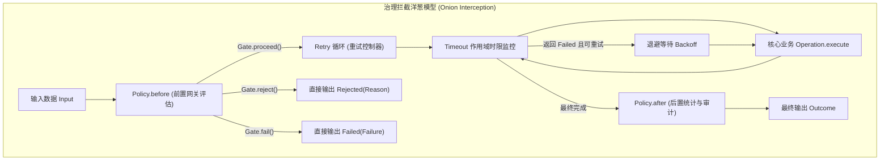

# 流程治理：Policy 策略、Retry 重试与 Timeout 控制

在生产级分布式应用中，业务步骤往往面临突发流量、下游不稳定、慢调用与偶发性故障。`team4u-flow` 提供了企业级的治理控制原语，包括无状态网关拦截（`Policy`）、状态持久化策略（`PersistentPolicy`）、自适应重试（`Retry`）与超时控制（`Timeout`）。

---

## 治理架构与拦截模型

治理控制通过 `CONTROL` 节点自外向内包裹业务子流程，形成洋葱圈式的拦截调用链：



---

## 1. 无状态网关策略：`Policy<K>`

`Policy<K>` 是通用的无状态切面拦截契约，适用于限流、黑白名单校验、权限鉴权、动态开关与指标埋点。

### 接口定义

```java
public interface Policy<K> {
    /**
     * 前置评估网关：在目标流程执行前调用。
     *
     * @param context 策略上下文（包含 flowId、invocationId 等）
     * @param key     从输入中提取的策略路由键
     * @return Gate 判定结果：放行（proceed）、业务拒绝（reject）或系统故障（fail）
     */
    Gate before(PolicyContext context, K key);

    /**
     * 后置通知回调：在目标流程执行完成后调用（无论成功、拒绝、跳过或失败）。
     *
     * @param context    策略上下文
     * @param key        策略路由键
     * @param completion 完成摘要（包含四态 kind、耗时等）
     */
    default void after(PolicyContext context, K key, Completion completion) { }
}
```

### `Gate` 三态判定

- `Gate.proceed()`：放行，继续执行目标业务流程；
- `Gate.reject(Reason.of("BLACKLIST", "用户已被列入黑名单"))`：拦截并直接以 `Rejected` 短路退出，不执行后续业务，亦不触发系统重试；
- `Gate.fail(Failure.of("RATE_LIMIT_EXCEEDED", "触发系统级限流熔断"))`：拦截并直接以 `Failed` 退出，可触发上层容灾恢复。

### 示例：自定义风控校验策略

```java
public class UserRiskPolicy implements Policy<String> {

    @Autowired
    private RiskService riskService;

    @Override
    public Gate before(PolicyContext context, String userId) {
        if (riskService.isBlacklisted(userId)) {
            return Gate.reject(Reason.of("USER_BLOCKED", "该账户处于风险冻结状态"));
        }
        return Gate.proceed();
    }

    @Override
    public void after(PolicyContext context, String userId, Completion completion) {
        // 记录调用审计日志或上报指标
        log.info("Policy after: user={}, outcome={}, duration={}ms",
                userId, completion.kind(), completion.durationMs());
    }
}
```

### DSL 绑定

```java
Flow<OrderRequest, Receipt> protectedFlow = flow
        .policy(UserRiskPolicy.class, OrderRequest::getUserId);
```

---

### 开箱即用限流适配：`team4u-flow-ratelimiter`

为了保持 `team4u-flow` 内核的极简与零外部冗余依赖，流程限流能力由独立的桥接适配模块 **`team4u-flow-ratelimiter`** 提供。该模块将 Flow 的 `Policy<K>` 契约与框架的分布式限流引擎 [`team4u-ratelimiter`](../ratelimiter/README.md) 无缝融合。

#### 1. 引入依赖

```xml
<dependency>
    <groupId>com.team4u</groupId>
    <artifactId>team4u-flow-ratelimiter</artifactId>
</dependency>
```

#### 2. 限流决策动作：`RateLimitAction`

| 动作枚举 | 门控返回值 | 适用场景 |
| :--- | :--- | :--- |
| **`RateLimitAction.FAIL`** *(默认)* | `Gate.fail(Failure)` | 系统级限流/排队。配合外层 `FlowRetryPolicy` 实现退避重试获取令牌。 |
| **`RateLimitAction.REJECT`** | `Gate.reject(Reason)` | 业务级快速失败/降级短路。直接产生 `Rejected` 结果，**绝不发起重试**。 |

#### 3. 编排示例

```java
import com.team4u.framework.flow.ratelimiter.RateLimitPolicy;
import com.team4u.framework.flow.ratelimiter.RateLimitPolicies;
import com.team4u.framework.flow.ratelimiter.RateLimitAction;

// 1. 最简模式：直接指定限流检查点（默认 FAIL 模式，触发重试）
Flow<OrderRequest, Receipt> flow1 = Flow.step(chargeOp)
        .policy(RateLimitPolicy.of("order.charge"), OrderRequest::getUserId);

// 2. 拒绝模式：限流直接短路业务，不重试
Flow<OrderRequest, Receipt> flow2 = Flow.step(chargeOp)
        .policy(RateLimitPolicies.reject("order.charge", OrderRequest::getUserId));

// 3. 高级定制：动态消耗多 Permits + 提取复杂上下文 + 自定义失败诊断
RateLimitPolicy<OrderRequest> customPolicy = RateLimitPolicy.<OrderRequest>builder()
        .point("order.batch")
        .contextExtractor(OrderRequest::getUserId)
        .permitsExtractor(OrderRequest::getItemCount) // 按批量大小动态扣减
        .action(RateLimitAction.FAIL)
        .failureFactory((result, req) -> Failure.of("RATE_LIMIT_EXCEEDED", 
                "下单频次超限，建议等待 " + result.getRetryAfterMillis() + "ms"))
        .build();

Flow<OrderRequest, Receipt> flow3 = FlowRetries.fixed(3, 200)
        .wrap(Flow.step(chargeOp).policy(customPolicy, req -> req));
```

---

### 开箱即用表达式规则门控：`team4u-flow-criterion`

为了支持动态文本表达式驱动的分支判定与前置准入校验，**`team4u-flow-criterion`** 模块将 Flow 的 `Policy<K>` / `Predicate<T>` 契约与框架的规则引擎 [`team4u-criterion`](../criterion/README.md) 无缝结合。

#### 1. 引入依赖

```xml
<dependency>
    <groupId>com.team4u</groupId>
    <artifactId>team4u-flow-criterion</artifactId>
</dependency>
```

#### 2. 门控策略：`CriterionPolicy<K>` 与 `CriterionPolicies`

基于文本表达式（如 `"age >= 18 && verified == true"` 或 `"blacklisted == true || riskScore > 80"`）实现前置门控拦截：

- **`CriterionPolicies.permitIf(expression)`**：满足表达式则放行，不满足则以 `Reason` 业务拒绝短路；
- **`CriterionPolicies.rejectIf(expression)`**：满足表达式则以 `Reason` 业务拒绝短路，不满足则放行；
- **`CriterionPolicies.failIf(expression, code, message)`**：满足表达式则以 `Failure` 系统故障抛出（可触发重试），不满足则放行。

```java
import com.team4u.framework.flow.criterion.CriterionPolicies;
import com.team4u.framework.flow.criterion.CriterionPolicy;

// 1. 准入放行：仅允许 18 岁以上用户进入
Flow<UserRequest, Receipt> flow1 = Flow.step(chargeOp)
        .policy(CriterionPolicies.permitIf("age >= 18", "UNDERAGE", "用户未满 18 岁"), req -> req);

// 2. 风险拦截：命中黑名单或风控分过高直接短路拒绝
Flow<UserRequest, Receipt> flow2 = Flow.step(chargeOp)
        .policy(CriterionPolicies.rejectIf("blacklisted == true || riskScore > 80", "RISK_BLOCKED", "风控拦截"), req -> req);
```

#### 3. 条件分支谓词：`CriterionPredicates`

在条件判断、`firstApplicable`、`route` 或步骤内部无缝作为 `Predicate<T>` 使用：

```java
import com.team4u.framework.flow.criterion.CriterionPredicates;

// 动态判断是否满足 VIP 折扣规则
CriterionPredicate<Order> vipCheck = CriterionPredicates.of("vip == true && amount >= 200");

Flow<Order, Receipt> flow = Flow.step((ctx, order) -> 
        vipCheck.test(order) 
                ? Outcome.accepted(applyDiscount(order)) 
                : Outcome.skipped(Reason.of("NOT_ELIGIBLE", "不满足优惠条件"))
);
```

---

## 2. 重试治理：`PersistentPolicy` 与 `team4u-flow-retry`

在 team4u-flow 的纯净化对称治理架构中，核心框架不硬编码任何特化的 Retry 原语，而是通过 **`PersistentPolicy<K, S>`（有状态持久化策略）** 统一承载所有具备状态变迁与定时退避唤醒能力的治理模型。所有重试治理能力完整收敛于 **`team4u-flow-retry`** 模块中。

### 架构对称性设计

| 治理类型 | 核心契约 | 典型模块 | 适用场景 |
| :--- | :--- | :--- | :--- |
| **无状态治理** | `Policy<K>` | `team4u-flow-ratelimiter`<br>`team4u-flow-criterion` | 纯内存/分布式准入放行、限流、动态规则门控、黑白名单 |
| **有状态治理** | `PersistentPolicy<K, S>` | `team4u-flow-retry` | 故障退避重试、状态变迁、Durable 崩溃恢复与断点恢复 |
| **时效控制** | `Timeout` | `team4u-flow` (核心) | 节点与作用域最大执行时限 |

---

### `team4u-flow-retry` 重试与退避治理

`team4u-flow-retry` 将成熟的重试退避算法体系（`team4u-retry`）与 `PersistentPolicy<K, FlowRetryState>` 契约深度融合，提供 **`FlowRetryPolicy<K>`** 与工厂工具类 **`FlowRetries`**。

#### 引入依赖

```xml
<dependency>
    <groupId>com.team4u</groupId>
    <artifactId>team4u-flow-retry</artifactId>
</dependency>
```

#### 核心特性与架构能力

1. **多算法退避体系**：无缝接入 `team4u-retry` 的 Backoff 引擎：
   - **固定延迟（Fixed）**：`FlowRetries.fixed(maxAttempts, delayMillis)`
   - **指数退避（Exponential）**：`FlowRetries.exponential(maxAttempts, initialDelay, multiplier, maxDelay)`
   - **随机抖动退避（Full / Equal Jitter）**：`FlowRetries.jitter(maxAttempts, initialDelay, multiplier, maxDelay)`，有效平抑重试风暴。
   - **等差递增（Increment）**：`FlowRetries.increment(maxAttempts, initialDelay, stepMillis)`
2. **条件重试判定（`Predicate<Failure>`）与快速短路**：
   - 支持按错误码（`retryOnCodes(...)` / `abortOnCodes(...)`）或自定义谓词（`retryOn(...)`）精准过滤可重试异常；
   - 命中不可重试异常时，`after` 后置阶段直接返回 `PersistentPolicy.returning(state)`，立即结束重试循环并提交结果，**绝不空耗重试额度与阻塞线程**。
3. **动态与命名规则注册**：
   - 支持通过 `FlowRetries.named("policyName")` 自动检索 `NamedRetryPolicyRegistry` 或对接配置中心（`DynamicRetryPolicyRegistry`）实现重试次数与退避参数热更新。
4. **Local / Durable 双引擎无缝兼容**：
   - 在 Local 内存引擎下，基于退避时间计算自动休眠并支持协作式中断；
   - 在 Durable 持久化引擎下，自动设置 `wakeAt` 检查点并挂起，进程崩溃或重启后通过 `recover` 精确唤醒恢复。

#### 编排使用示例

```java
import com.team4u.framework.flow.retry.FlowRetries;
import com.team4u.framework.flow.retry.FlowRetryPolicy;
import com.team4u.framework.retry.common.backoff.Backoffs;

// 1. 指数退避重试（初始 100ms，2 倍递增，上限 2s，最多尝试 5 次）
FlowRetryPolicy<OrderRequest> expPolicy = FlowRetries.exponential(5, 100, 2.0, 2000);
Flow<OrderRequest, Receipt> flow1 = expPolicy.wrap(Flow.step(chargeOp), Function.identity());

// 2. 随机抖动退避 + 条件重试（只对 TIMEOUT 与 NETWORK_ERROR 重试，其余异常快速失败）
FlowRetryPolicy<OrderRequest> conditionalPolicy = FlowRetryPolicy.<OrderRequest>builder()
        .maxAttempts(4)
        .backoff(Backoffs.exponentialJitter(50, 2.0, 1000))
        .retryOnCodes("TIMEOUT", "NETWORK_ERROR") // 仅对网络超时重试
        .build();

Flow<OrderRequest, Receipt> flow2 = FlowRetries.policy(Flow.step(chargeOp), conditionalPolicy, Function.identity());

// 3. 动态配置规则（按名称动态从注册表或配置中心加载）
FlowRetryPolicy<OrderRequest> namedPolicy = FlowRetries.named("order-charge-retry");
Flow<OrderRequest, Receipt> flow3 = namedPolicy.wrap(Flow.step(chargeOp), Function.identity());
```

---

### 3. 关键语义与幂等保证

- **仅对 `Failed` 重试**：若步骤返回 `Accepted`（业务成功）、`Rejected`（业务拒绝）或 `Skipped`（弃权跳过），框架认为这是正常业务结论，**绝不发起重试**；
- **条件快速失败（Fast-Fail）**：若步骤返回不可重试的 `Failed`，`FlowRetryPolicy` 立即以 `returning` 结束重试；
- **稳定幂等键（`invocationId`）**：在多次重试过程中，节点上下文的 `context.invocationId()` 保持恒定不变（`flowId:flowVersion:executionId:path`）。外部服务可以安全地使用该 ID 进行幂等防重校验。

---

## 3. 超时控制：`Timeout`

`Timeout` 原语为指定的子流程或作用域施加最大执行耗时上限：

```java
Flow<OrderRequest, Receipt> timedFlow = flow.timeout(Duration.ofSeconds(3));
```

### 执行与中断机制

- **计时范围**：从进入该作用域的一刻起开始计时，覆盖其包含的所有串行步骤、并行分支与重试退避；
- **超时动作**：一旦超过设定时限，框架向正在执行的工作线程发送物理中断信号（`Thread.interrupt()`），并通过协作式令牌将其置为取消；
- **诊断输出**：超时退出后，整体流程产生携带 `FlowDiagnosticCodes.TIMEOUT` 的 `Failed` 状态。

---

## 治理策略的挂载与组合

在流式编排中，无状态治理（`Policy<K>`）与有状态治理（`PersistentPolicy<K, S>`）可自由嵌套组合：

### 组合示例：限流 + 重试

```java
// 先进入限流 Policy（每次重试均重新获取令牌），外层挂载重试 PersistentPolicy
Flow<OrderRequest, Receipt> flow = Flow.step(chargeOp)
        .policy(rateLimitPolicy, OrderRequest::getUserId)
        .persistentPolicy(retryPolicy, OrderRequest::getOrderId);
```

---

## 关联章节与进一步阅读

- 了解并行分支的汇合与控制：[并行分支与汇合治理](flow-parallel.md)
- 了解 Durable 模式下的持久化策略 `PersistentPolicy`：[Durable 两段式恢复协议与 PersistentPolicy](flow-durable-resume.md)
- 了解 Local 线程池与超时死锁防御：[Local 线程模型与死锁防御机制](flow-threading.md)
- 查阅所有治理失败与中断诊断码：[诊断码体系与故障排查手册](flow-diagnostics.md)
