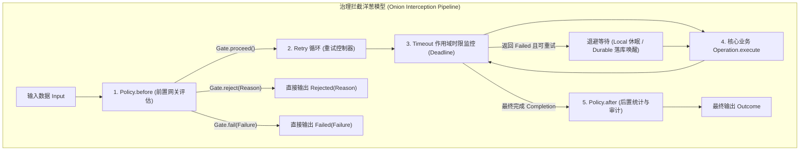
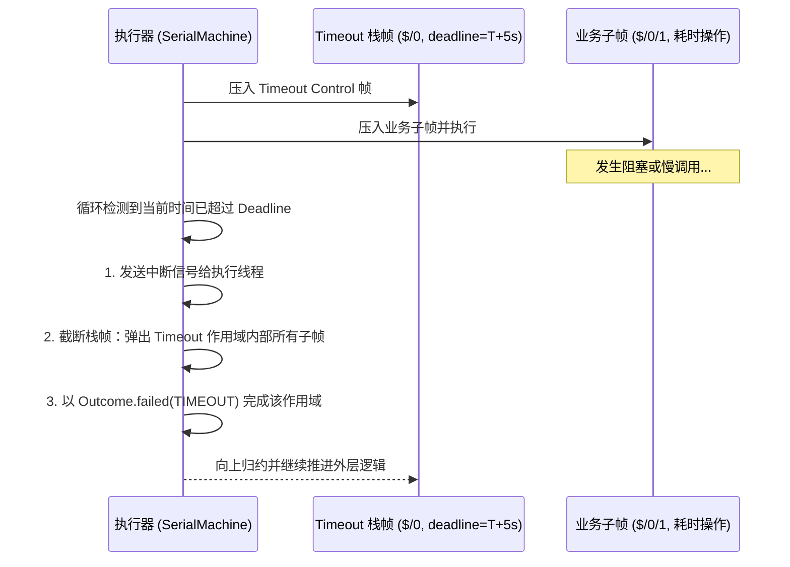

# 流程治理概览：Policy、Retry 与 Timeout

在生产级分布式应用中，业务步骤往往面临突发流量、下游不稳定、慢调用与偶发性故障。`team4u-flow` 提供了企业级的治理控制原语，包括无状态网关拦截（`Policy`）、状态持久化策略（`PersistentPolicy`）、自适应重试（`FlowRetryPolicy`）与超时时限监控（`Timeout`）。

本文将系统剖析治理体系的洋葱圈拦截模型、底层调用时序、超时作用域栈截断机制以及开箱即用的治理生态。

---

## 治理架构与洋葱圈拦截模型

治理控制通过 `CONTROL` 节点自外向内层层包裹业务子流程，形成洋葱圈式的拦截调用链：



### 声明顺序与调用层级映射

治理策略的链式声明顺序决定了洋葱圈的包裹层级（**后声明的方法在外层包裹**）：

```java
Flow<OrderRequest, Receipt> flow = Flow.step(chargeOperation)
        .policy(RateLimitPolicy.of("order.charge", OrderRequest::getUserId))     // 最内层：每次重试均重新获取令牌
        .persistentPolicy(FlowRetryPolicy.exponential(3, 100, 2.0, 1000), OrderRequest::getUserId) // 中层：重试控制器
        .policy(CriterionPolicy.builder()
                .expression("amount > 0")
                .mode(CriterionPolicy.Mode.REJECT_IF)
                .reasonFactory((ctx, req) -> Reason.of("INVALID_AMOUNT", "金额非法"))
                .build(), req -> req) // 外层：规则门控
        .timeout(Duration.ofSeconds(5)); // 最外层：全局超时时限
```

```text
[Timeout 计时开始]
  -> [CriterionPolicy.before 准入校验]
    -> [Retry 循环开始]
      -> [RateLimitPolicy.before 令牌获取]
        -> [Operation.execute 业务扣款]
      -> [RateLimitPolicy.after 令牌归还/统计]
    -> [Retry 循环结束]
  -> [CriterionPolicy.after 审计记录]
[Timeout 计时结束]
```

---

## 核心治理契约对比

`team4u-flow` 内核保持极致纯净，通过两套正交且完备的抽象契约支撑上层丰富的治理生态：

| 治理维度 | 契约接口 | 状态与生命周期 | 执行与调度特性 | 适用场景 |
| :--- | :--- | :--- | :--- | :--- |
| **无状态切面治理** | [`Policy<K>`](policy-custom.md#无状态策略契约policyk) | **无状态**（零内存开销） | 在前置 `before` 做出放行/拒绝/失败裁决；在后置 `after` 接收完成摘要 `Completion`。 | 准入放行、限流、鉴权、黑白名单、动态开关、审计埋点 |
| **有状态持久化治理** | [`PersistentPolicy<K, S>`](policy-custom.md#有状态持久化策略契约persistentpolicyk-s) | **不可变状态 `S`**（框架自动持久化至快照） | 支持 `Proceed`、`WaitUntil` 延时挂起与 `RetryAt` 定时退避唤醒；跨进程重启状态原位恢复。 | 故障自适应重试、多算法退避、状态机变迁、断点唤醒 |
| **时效控制治理** | `Duration` (`flow.timeout(...)`) | **无状态**（基于绝对 Deadline 计算） | 限定子流程最大耗时；超时由执行器发送物理中断并截断栈帧产出 `TIMEOUT` 失败。 | 防止慢调用堆积、下游死锁熔断、跨服务调用防护 |

---

## 超时作用域与栈截断机制 (Timeout Scope)

超时控制在 `SerialMachine` 与 `DurableMachine` 中被建模为**栈帧边界监视（Deadline-bounded Scope）**：



### 超时关键特性
1. **精确作用域限定**：`flow.timeout(duration)` 仅对其包裹的子流程生效。若外层配置了 `recoverWith`，超时产生的 `Failed(TIMEOUT)` 可被外层无缝捕获并执行降级；
2. **多层嵌套时限自适应**：当存在多层嵌套的 Timeout 时，执行器动态计算栈中所有活跃帧中**最紧迫的绝对 Deadline**，并优先触发最内层超时的作用域；
3. **线程中断与清理**：超时触发后，执行器会自动清理内部未完成的临时资源，绝不遗留悬挂状态。

---

## 策略异常隔离与安全网

在 `team4u-flow` 中，自定义 `Policy` 或 `PersistentPolicy` 的内部逻辑如果抛出未捕获异常，框架会提供严格的异常隔离：

- **`POLICY_EXCEPTION` 诊断收敛**：切面异常会被自动捕获并封装为 `Outcome.failed(Failure.of(FlowDiagnosticCodes.POLICY_EXCEPTION, e.getMessage(), e))`；
- **保障调用者线程安全**：切面抛错绝不会导致执行器线程崩溃或内部帧栈状态损坏；
- **可观察性**：通过 `FlowObserver.onEvent` 自动上报 `POLICY_WAITING`、`NODE_COMPLETED` 等事件。

---

## 开箱即用治理策略生态

为了保持 Core 零外部运行时依赖，框架通过独立的桥接模块提供生产级治理实现：

```
modules/flow/
├── ratelimiter/    # team4u-flow-ratelimiter (基于分布式限流引擎的无状态切面)
├── retry/          # team4u-flow-retry (基于多算法退避的有状态持久化策略)
└── criterion/      # team4u-flow-criterion (基于类 SQL 表达式的动态规则门控)
```

### 限流治理：`team4u-flow-ratelimiter`
基于 [`team4u-ratelimiter`](../ratelimiter/README.md) 分布式限流组件：
- **`RateLimitAction.FAIL`**：超限产出 `Gate.fail`，联动外层重试策略进行削峰排队；
- **`RateLimitAction.REJECT`**：超限产出 `Gate.reject`，快速短路，不触发重试。

[查看专章详解：限流治理策略 (team4u-flow-ratelimiter)](policy-ratelimiter.md)

---

### 重试与退避治理：`team4u-flow-retry`
基于 [`team4u-retry`](../retry/README.md) 退避算法引擎：
- **多算法退避**：固定延迟（Fixed）、指数退避（Exponential）、随机抖动（Jitter，防重试风暴）、等差递增（Increment）；
- **条件快速短路**：支持按白名单错误码（`retryOnCodes`）、黑名单（`abortOnCodes`）或自定义谓词快速失败；
- **双引擎调度**：Local 线程休眠 vs Durable 快照落库定时唤醒。

[查看专章详解：重试与退避治理策略 (team4u-flow-retry)](policy-retry.md)

---

### 表达式规则门控：`team4u-flow-criterion`
基于 [`team4u-criterion`](../criterion/README.md) 规则引擎：
- **`CriterionPolicy`**：类 SQL 表达式准入拦截（`permitIf` / `rejectIf` / `failIf`）；
- **`CriterionPredicate`**：在条件路由与分支中复用动态表达式谓词。

[查看专章详解：表达式规则门控策略 (team4u-flow-criterion)](policy-criterion.md)

---

### 自定义策略开发
开发者可通过实现 `Policy<K>` 或 `PersistentPolicy<K, S>` 轻松扩展专属业务治理逻辑，并支持 Spring 容器依赖注入。

[查看专章详解：自定义治理策略开发指南](policy-custom.md)

---

## 治理主题专章导航

- [限流治理策略 (team4u-flow-ratelimiter)](policy-ratelimiter.md)：限流模式、`RateLimitAction` 决策、动态 Permits、配置驱动。
- [重试与退避治理策略 (team4u-flow-retry)](policy-retry.md)：多算法退避、随机抖动防风暴、条件快速失败、Local/Durable 双引擎调度。
- [表达式规则门控策略 (team4u-flow-criterion)](policy-criterion.md)：`CriterionPolicy` 门控、`CriterionPredicate` 条件分支、语法速查。
- [自定义治理策略开发指南](policy-custom.md)：`Policy<K>` 无状态拦截、`PersistentPolicy<K, S>` 有状态调度、Spring Bean 集成。
- [并行分支与汇合治理](flow-parallel.md)：并发分支调度与 `JoinStrategy`。
- [挂起续接与协作式取消合同](flow-suspend.md)：异步挂起、`ResumePoint` 与 `Cancellation`。
- [Local 线程模型与死锁防御机制](flow-threading.md)：Dispatcher/Worker 双线程池与死锁防御。
