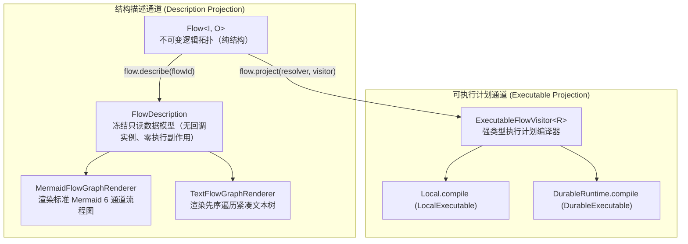
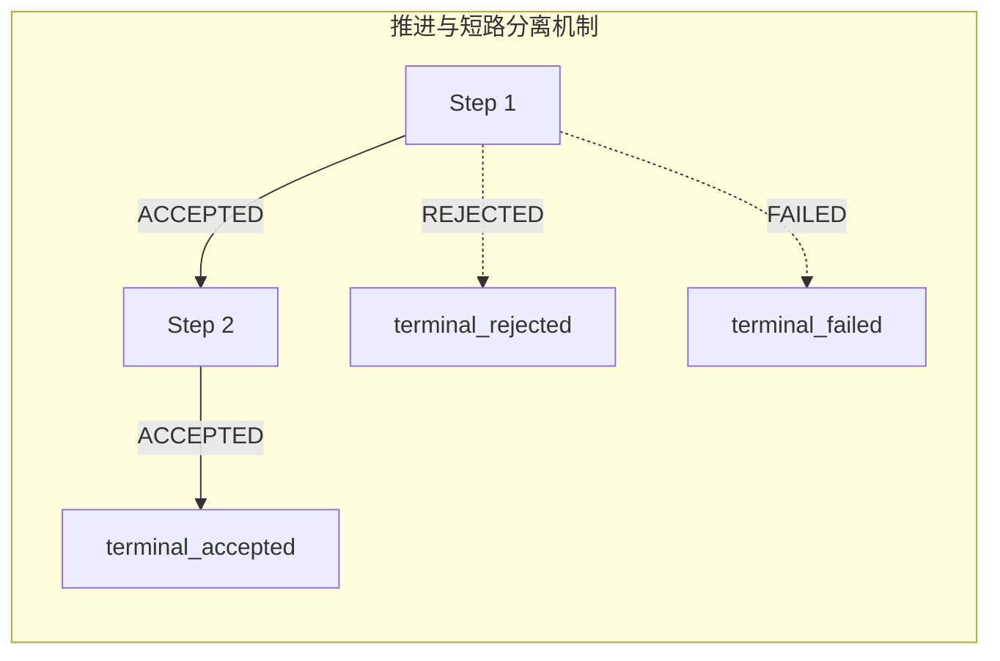

# 可视化图表渲染与双投影架构

`team4u-flow-graph` 负责将流程结构渲染为标准 Mermaid 流程图与紧凑文本树，适用于架构评审、开发文档自动化生成与日志排障。

渲染器仅消费由 `flow.describe(flowId)` 导出的只读结构模型 **`FlowDescription`**，不触及任何业务回调实例或执行状态，因此可在任何环境下安全调用而绝无副作用。

---

## 引入依赖

```xml
<dependency>
    <groupId>com.team4u</groupId>
    <artifactId>team4u-flow-graph</artifactId>
</dependency>
```

---

## 双投影架构设计 (Dual Projection)

`Flow<I, O>` 对外提供两条职责严格隔离的投影通道：



---

## 渲染器门面 API

```java
import com.team4u.framework.flow.desc.FlowDescription;
import com.team4u.framework.flow.graph.FlowGraphs;

// 1. 导出只读描述模型
FlowDescription description = checkoutFlow.describe("checkout-flow");

// 2. 渲染为 Mermaid 流程图脚本
String mermaidScript = FlowGraphs.mermaid().render(description);

// 3. 渲染为紧凑文本树
String textTree = FlowGraphs.text().render(description);
```

---

## Mermaid 六通道终结模型

Mermaid 渲染器通过**六个全局终结通道**刻画一次执行的所有可能归宿：

| 通道标识 | 对应终结点 | 含义说明 |
| :--- | :--- | :--- |
| `terminal_accepted` | `COMPLETED \| ACCEPTED` | 正常成功完成，携带业务输出 |
| `terminal_rejected` | `COMPLETED \| REJECTED` | 业务拒绝完成（预期内短路） |
| `terminal_skipped` | `COMPLETED \| SKIPPED` | 弃权跳过完成 |
| `terminal_failed` | `COMPLETED \| FAILED` | 发生技术失败或系统异常 |
| `terminal_suspended` | `SUSPENDED` | 挂起等待外部信号注入 |
| `terminal_cancelled` | `CANCELLED` | 流程被协作取消令牌终止 |



### 渲染规则要点
- **推进与短路分离**：Sequence 推进边仅标注推进态（`-->|ACCEPTED|`），非推进态（REJECTED / SKIPPED / FAILED）直接连接至对应的全局终结点；
- **可选步骤可视化**：`thenOptional` 描述为带有 SKIPPED 触发边的 Fallback 结构，图中直观展示 Skipped 被局部消费后经由 Identity 分支重新接入 Accepted 通道；
- **降级触发清晰**：`firstApplicable` 标注 `SKIPPED | next applicable` 边，`recoverWith` 标注 `FAILED | recover` 边；
- **取消出口绕过汇聚**：在 `parallel` 并行块中，分支若被取消（`CANCELLED`），其流向直接导向 `terminal_cancelled`，**绝不经过 wait-all 网关与 join 汇合节点**。

---

## 稳定渲染与 Opaque 机制

为了确保图表渲染的安全与确定性：
- **不透明路由键 (Opaque Keys)**：无法安全确定性序列化的路由键（如匿名类、闭包等）统一渲染为 `<opaque>` 占位符，渲染器从不主动调用其 `toString()`，防止引发副作用或泄露敏感信息；
- **确定性输出**：同一 `FlowDescription` 的渲染结果逐字节确定，无随机生成的 ID，便于进行自动化测试断言与 Git 版本比对；
- **特殊字符转义**：节点标签中的引号、换行符与管道符自动转义为标准 HTML 实体。

---

## 控制节点配置摘要

Control 节点在图表中渲染紧凑且标准化的配置摘要：

```text
control=RETRY config=maxAttempts=3,backoff=2s
control=TIMEOUT config=timeout=5s
control=POLICY config=<none>
control=PERSISTENT_POLICY config=<none>
```

---

## 紧凑文本树渲染

`FlowGraphs.text()` 采用先序遍历生成单行文本树，便于在控制台日志中输出或在单元测试中进行结构断言：

```text
flow id="checkout"
path="$" kind=SEQUENCE label=<none> scope=<none> children=2
path="$/0" kind=INVOKE label=<none> binding=OPERATION contract=com.example.RiskScan qualifier=<none>
path="$/1" kind=ROUTE label=<none> routes=2 otherwise=no-match:SKIPPED
path="$/1/selector" kind=INVOKE label=<none> binding=OPERATION contract=com.example.ChannelSelect qualifier=<none>
path="$/1/case:0" kind=COMPLETE label=<none> complete=ACCEPTED
path="$/1/case:1" kind=COMPLETE label=<none> complete=ACCEPTED
```

---

## 性能与深度嵌套支持

渲染器内部基于**显式栈的迭代机制**实现，而非递归调用。面对数千层嵌套的 Scope 或 Timeout 结构，均能在线性时间内稳定渲染，不会发生 JVM 栈溢出。

---

## 关联章节与进一步阅读

- 掌握单元测试断言与测试桩：[测试支持与测试套件](flow-test.md)
- 查看完整的业务流程图渲染实战示例：[实战案例库与生产模式](flow-sample.md)
