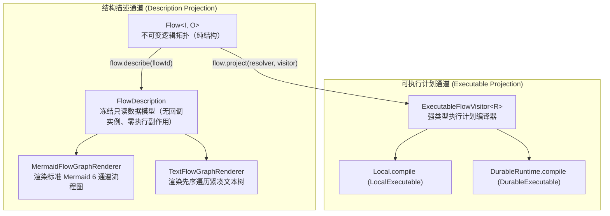
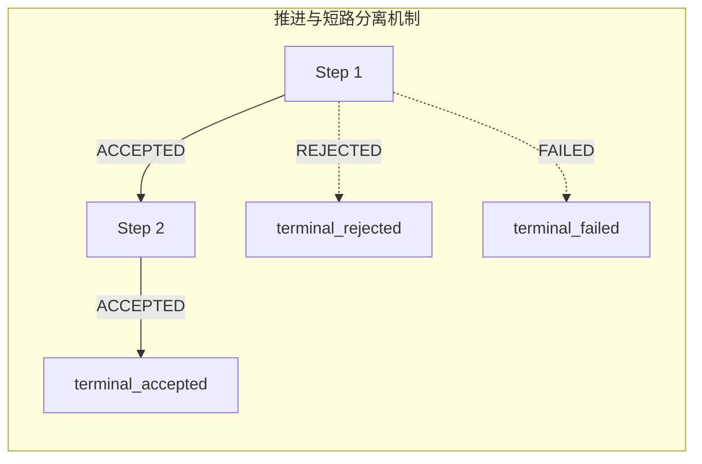

# 可视化图表渲染与双投影架构

`team4u-flow-graph` 负责将流程结构渲染为标准 Mermaid 流程图与紧凑文本树，适用于架构评审、开发文档自动化生成与日志排障。

渲染器仅消费由 `flow.describe(flowId)` 导出的只读结构模型 **`FlowDescription`**，不触及任何业务回调实例或执行状态，因此可在任何环境下安全调用而绝无副作用。

---

## 引入依赖

```xml
<dependency>
    <groupId>com.team4u</groupId>
    <artifactId>team4u-flow-graph</artifactId>
</dependency>
```

---

## 双投影架构设计 (Dual Projection)

`Flow<I, O>` 对外提供两条职责严格隔离的投影通道：



---

## 渲染器门面 API

```java
import com.team4u.framework.flow.desc.FlowDescription;
import com.team4u.framework.flow.graph.FlowGraphs;

// 1. 导出只读描述模型
FlowDescription description = orderFlow.describe("order-fulfillment-flow");

// 2. 渲染为 Mermaid 流程图脚本
String mermaidScript = FlowGraphs.mermaid().render(description);

// 3. 渲染为紧凑文本树
String textTree = FlowGraphs.text().render(description);
```

---

## 端到端实战：电商订单履约流程的可视化呈现

为了直观展示 `team4u-flow-graph` 的渲染效果，下面以一个包含 **前置拦截、动态路由、人工审批挂起、并行资源锁定、超时治理与失败降级** 的典型复杂业务流程为例，演示从 DSL 编排到实际渲染输出的全过程。

### 1. 业务流程编排定义 (Java DSL)

```java
package com.example.order;

import com.team4u.framework.flow.Flow;
import com.team4u.framework.flow.api.Branch;
import com.team4u.framework.flow.api.Operation;
import com.team4u.framework.flow.api.ResumePoint;
import com.team4u.framework.flow.desc.FlowDescription;
import com.team4u.framework.flow.graph.FlowGraphs;
import com.team4u.framework.flow.model.Outcome;
import com.team4u.framework.flow.model.Reason;
import com.team4u.framework.flow.model.Recovery;
import com.team4u.framework.flow.model.Resumed;

import java.time.Duration;

public class OrderFulfillmentExample {

    // 声明业务步骤契约接口（亦可直接对接 Spring Bean / Qualifier）
    public interface RiskCheckOperation extends Operation<String, String> {}
    public interface RiskRouter extends Operation<String, String> {}
    public interface PassAuditOperation extends Operation<Resumed<String, String>, String> {}
    public interface LockInventoryOperation extends Operation<String, String> {}
    public interface LockCouponOperation extends Operation<String, String> {}
    public interface ChargePaymentOperation extends Operation<String, String> {}
    public interface BackupPaymentOperation extends Operation<Recovery<String>, String> {}
    public interface IssueReceiptOperation extends Operation<String, String> {}

    public static Flow<String, String> buildOrderFlow() {
        // 1. 并行分支：库存预占（带 2s 超时）与卡券锁定并行执行
        Branch<String, String> inventoryBranch = Branch.of("lock-inventory",
                Flow.<String, String>step(LockInventoryOperation.class, "stock-service")
                        .timeout(Duration.ofSeconds(2))
                        .named("库存预占"));

        Branch<String, String> couponBranch = Branch.of("lock-coupon",
                Flow.<String, String>step(LockCouponOperation.class, "coupon-service")
                        .named("卡券锁定"));

        Flow<String, String> parallelLock = Flow.parallel(inventoryBranch, couponBranch)
                .join(results -> Outcome.accepted("resources-locked"))
                .named("并行资源锁定");

        // 2. 人工审批挂起子流程：await 挂起等待外部审批信号注入后唤醒推进
        Flow<String, String> manualAuditFlow = Flow.<String>identity()
                .await(ResumePoint.<String>named("manual-audit"))
                .then(Flow.step(PassAuditOperation.class, "audit-handler"))
                .named("高风险人工审核");

        // 3. 风控动态路由：LOW 直通，HIGH 挂起人工审批，其它高风险直接拒绝
        Flow<String, String> riskRoute = Flow.route(RiskRouter.class, "risk-router")
                .caseOf("LOW", Flow.<String>identity().named("低风险直通"))
                .caseOf("HIGH", manualAuditFlow)
                .otherwise(Flow.<String, String>rejected(Reason.of("HIGH_RISK_REJECT", "高风险直接阻断")));

        // 4. 支付扣款步骤：主通道带 5s 超时，超时或异常自动触发 recoverWith 降级至备用通道
        Flow<String, String> paymentStep = Flow.<String, String>step(ChargePaymentOperation.class, "main-gateway")
                .named("主通道支付扣款")
                .timeout(Duration.ofSeconds(5))
                .recoverWith(Flow.<Recovery<String>, String>step(BackupPaymentOperation.class, "backup-gateway").named("备用通道降级"));

        // 5. 组装完整流水线并包裹具名 Scope 作用域边界
        return Flow.scope("order-checkout-process",
                Flow.<String, String>step(RiskCheckOperation.class, "risk-checker").named("前置风控拦截")
                        .then(riskRoute)
                        .then(parallelLock)
                        .then(paymentStep)
                        .then(Flow.<String, String>step(IssueReceiptOperation.class, "receipt-service").named("生成出货单据"))
        ).named("order-fulfillment-flow");
    }

    public static void main(String[] args) {
        Flow<String, String> orderFlow = buildOrderFlow();

        // 导出只读描述拓扑（零执行副作用）
        FlowDescription desc = orderFlow.describe("order-fulfillment-flow");

        // 渲染为 Mermaid 流程图脚本
        String mermaidDsl = FlowGraphs.mermaid().render(desc);
        System.out.println(mermaidDsl);

        // 渲染为紧凑文本树
        String textTree = FlowGraphs.text().render(desc);
        System.out.println(textTree);
    }
}
```

### 2. 真实效果：Mermaid 流程图 (Live Graph)

> [!TIP]
> 下图由 `FlowGraphs.mermaid().render(desc)` 生成的标准 Mermaid 脚本直接渲染呈现。
> 流程图完整展现了**主干推进（实线 ACCEPTED）、异常与短路分流（虚线 REJECTED / SKIPPED / FAILED）、Await 挂起与恢复信号通道、Parallel 并行分支与汇聚 Join、超时控制与 Fallback 降级边**，以及**全生命周期的六大全局终结通道**与彩色标记。

```mermaid
flowchart TD
    flow_start(["START &#124; flow=order-fulfillment-flow"])
    n1["INVOKE &#124; path=$/0/0 &#124; label=前置风控拦截 &#124; binding=OPERATION contract=com.example.order.RiskCheckOperation qualifier=risk-checker"]
    n2["INVOKE &#124; path=$/0/1/selector &#124; label=&lt;none&gt; &#124; binding=OPERATION contract=com.example.order.RiskRouter qualifier=risk-router"]
    n3(["COMPLETE &#124; path=$/0/1/case:0 &#124; label=低风险直通 &#124; complete=IDENTITY"])
    n4(["COMPLETE &#124; path=$/0/1/case:1/0 &#124; label=&lt;none&gt; &#124; complete=IDENTITY"])
    n5["AWAIT &#124; path=$/0/1/case:1/1 &#124; label=&lt;none&gt; &#124; resume=manual-audit"]
    n6(["SUSPENDED &#124; resume=manual-audit"])
    n7(["RESUMED &#124; resume=manual-audit"])
    n5 -.->|SUSPENDED| n6
    n6 -->|resume signal| n7
    n8["INVOKE &#124; path=$/0/1/case:1/2 &#124; label=&lt;none&gt; &#124; binding=OPERATION contract=com.example.order.PassAuditOperation qualifier=audit-handler"]
    n9[["SEQUENCE &#124; path=$/0/1/case:1 &#124; label=高风险人工审核 &#124; scope=anonymous"]]
    n9 -->|enter| n4
    n4 -->|ACCEPTED| n5
    n7 -->|ACCEPTED| n8
    n10(["COMPLETE &#124; path=$/0/1/otherwise &#124; label=&lt;none&gt; &#124; complete=REJECTED"])
    n11{"ROUTE &#124; path=$/0/1 &#124; label=&lt;none&gt; &#124; cases=2 &#124; otherwise=branch"}
    n11 -->|selector| n2
    n2 -->|ACCEPTED &#124; case=LOW| n3
    n2 -->|ACCEPTED &#124; case=HIGH| n9
    n2 -->|ACCEPTED &#124; otherwise| n10
    n12["INVOKE &#124; path=$/0/2/branch:0/body &#124; label=&lt;none&gt; &#124; binding=OPERATION contract=com.example.order.LockInventoryOperation qualifier=stock-service"]
    n13["CONTROL &#124; path=$/0/2/branch:0 &#124; label=库存预占 &#124; control=TIMEOUT &#124; config=timeout=2s0ns"]
    n13 -->|proceed| n12
    n14["INVOKE &#124; path=$/0/2/branch:1 &#124; label=卡券锁定 &#124; binding=OPERATION contract=com.example.order.LockCouponOperation qualifier=coupon-service"]
    n15{{"PARALLEL &#124; path=$/0/2 &#124; label=并行资源锁定 &#124; branches=2"}}
    n16[["WAIT ALL &#124; branches=2"]]
    n17(["CANCEL &#124; branches=2"])
    n18(["BRANCH COMPLETE &#124; token=lock-inventory"])
    n15 -->|branch=lock-inventory| n13
    n12 -->|ACCEPTED| n18
    n12 -->|REJECTED| n18
    n12 -.->|SKIPPED| n18
    n12 -.->|FAILED| n18
    n13 -.->|FAILED| n18
    n13 -.->|CANCELLED| n17
    n18 -->|wait-all| n16
    n19(["BRANCH COMPLETE &#124; token=lock-coupon"])
    n15 -->|branch=lock-coupon| n14
    n14 -->|ACCEPTED| n19
    n14 -->|REJECTED| n19
    n14 -.->|SKIPPED| n19
    n14 -.->|FAILED| n19
    n19 -->|wait-all| n16
    n20["JOIN &#124; static outcome contract"]
    n16 -->|all branches complete| n20
    n15 -.->|CANCELLED| n17
    n21["INVOKE &#124; path=$/0/3/branch:0/body &#124; label=主通道支付扣款 &#124; binding=OPERATION contract=com.example.order.ChargePaymentOperation qualifier=main-gateway"]
    n22["CONTROL &#124; path=$/0/3/branch:0 &#124; label=&lt;none&gt; &#124; control=TIMEOUT &#124; config=timeout=5s0ns"]
    n22 -->|proceed| n21
    n23["INVOKE &#124; path=$/0/3/branch:1 &#124; label=备用通道降级 &#124; binding=OPERATION contract=com.example.order.BackupPaymentOperation qualifier=backup-gateway"]
    n24{"FALLBACK &#124; path=$/0/3 &#124; label=&lt;none&gt; &#124; recoverWith &#124; trigger=FAILED"}
    n24 -->|branch=0| n22
    n21 -.->|FAILED &#124; recover| n23
    n22 -.->|FAILED &#124; recover| n23
    n25["INVOKE &#124; path=$/0/4 &#124; label=生成出货单据 &#124; binding=OPERATION contract=com.example.order.IssueReceiptOperation qualifier=receipt-service"]
    n26[["SEQUENCE &#124; path=$/0 &#124; label=&lt;none&gt; &#124; scope=anonymous"]]
    n26 -->|enter| n1
    n1 -->|ACCEPTED| n11
    n3 -->|ACCEPTED| n15
    n8 -->|ACCEPTED| n15
    n20 -->|ACCEPTED| n24
    n21 -->|ACCEPTED| n25
    n23 -->|ACCEPTED| n25
    n27[["SEQUENCE &#124; path=$ &#124; label=order-fulfillment-flow &#124; scope=order-checkout-process"]]
    n27 -->|enter| n26
    terminal_accepted(["COMPLETED &#124; ACCEPTED"])
    terminal_rejected(["COMPLETED &#124; REJECTED"])
    terminal_skipped(["COMPLETED &#124; SKIPPED"])
    terminal_failed(["COMPLETED &#124; FAILED"])
    terminal_suspended(["SUSPENDED"])
    terminal_cancelled(["CANCELLED"])
    flow_start --> n27
    flow_start -.->|CANCELLED| terminal_cancelled
    n1 -->|REJECTED| terminal_rejected
    n1 -.->|SKIPPED| terminal_skipped
    n1 -.->|FAILED| terminal_failed
    n2 -->|REJECTED| terminal_rejected
    n2 -.->|SKIPPED| terminal_skipped
    n2 -.->|FAILED| terminal_failed
    n6 -.->|SUSPENDED| terminal_suspended
    n6 -.->|CANCELLED| terminal_cancelled
    n8 -->|REJECTED| terminal_rejected
    n8 -.->|SKIPPED| terminal_skipped
    n8 -.->|FAILED| terminal_failed
    n10 -->|REJECTED| terminal_rejected
    n20 -->|REJECTED| terminal_rejected
    n20 -.->|SKIPPED| terminal_skipped
    n20 -.->|FAILED| terminal_failed
    n17 -.->|CANCELLED| terminal_cancelled
    n21 -->|REJECTED| terminal_rejected
    n21 -.->|SKIPPED| terminal_skipped
    n22 -.->|CANCELLED| terminal_cancelled
    n23 -->|REJECTED| terminal_rejected
    n23 -.->|SKIPPED| terminal_skipped
    n23 -.->|FAILED| terminal_failed
    n25 -->|REJECTED| terminal_rejected
    n25 -.->|SKIPPED| terminal_skipped
    n25 -.->|FAILED| terminal_failed
    n25 -->|ACCEPTED| terminal_accepted
    classDef accepted fill:#dcfce7,stroke:#166534,color:#14532d
    classDef rejected fill:#ffedd5,stroke:#c2410c,color:#7c2d12
    classDef skipped fill:#f3f4f6,stroke:#4b5563,color:#1f2937
    classDef failed fill:#fee2e2,stroke:#b91c1c,color:#7f1d1d
    classDef suspended fill:#dbeafe,stroke:#1d4ed8,color:#1e3a8a
    classDef cancelled fill:#e5e7eb,stroke:#111827,color:#111827
    class terminal_accepted accepted
    class terminal_rejected rejected
    class terminal_skipped skipped
    class terminal_failed failed
    class terminal_suspended suspended
    class terminal_cancelled cancelled
```



### 3. 真实效果：紧凑文本树 (Text Tree)

`FlowGraphs.text().render(desc)` 生成的先序遍历文本树，每一行代表 AST 中的一个只读节点。非常适合输出在生产环境控制台日志、排障工具或 CI/CD 自动化测试断言中：

```text
flow id="order-fulfillment-flow"
path="$" kind=SEQUENCE label="order-fulfillment-flow" scope="order-checkout-process" children=1
path="$/0" kind=SEQUENCE label=<none> scope=<none> children=5
path="$/0/0" kind=INVOKE label="前置风控拦截" binding=OPERATION contract=com.example.order.RiskCheckOperation qualifier="risk-checker"
path="$/0/1" kind=ROUTE label=<none> routes=2 otherwise=branch
path="$/0/1/selector" kind=INVOKE label=<none> binding=OPERATION contract=com.example.order.RiskRouter qualifier="risk-router"
path="$/0/1/case:0" kind=COMPLETE label="低风险直通" complete=IDENTITY
path="$/0/1/case:1" kind=SEQUENCE label="高风险人工审核" scope=<none> children=3
path="$/0/1/case:1/0" kind=COMPLETE label=<none> complete=IDENTITY
path="$/0/1/case:1/1" kind=AWAIT label=<none> resume="manual-audit"
path="$/0/1/case:1/2" kind=INVOKE label=<none> binding=OPERATION contract=com.example.order.PassAuditOperation qualifier="audit-handler"
path="$/0/1/otherwise" kind=COMPLETE label=<none> complete=REJECTED
path="$/0/2" kind=PARALLEL label="并行资源锁定" branches=2 tokens=["lock-inventory","lock-coupon"] join=static
path="$/0/2/branch:0" kind=CONTROL label="库存预占" control=TIMEOUT config=timeout=2s0ns
path="$/0/2/branch:0/body" kind=INVOKE label=<none> binding=OPERATION contract=com.example.order.LockInventoryOperation qualifier="stock-service"
path="$/0/2/branch:1" kind=INVOKE label="卡券锁定" binding=OPERATION contract=com.example.order.LockCouponOperation qualifier="coupon-service"
path="$/0/3" kind=FALLBACK label=<none> trigger=FAILED branches=2
path="$/0/3/branch:0" kind=CONTROL label=<none> control=TIMEOUT config=timeout=5s0ns
path="$/0/3/branch:0/body" kind=INVOKE label="主通道支付扣款" binding=OPERATION contract=com.example.order.ChargePaymentOperation qualifier="main-gateway"
path="$/0/3/branch:1" kind=INVOKE label="备用通道降级" binding=OPERATION contract=com.example.order.BackupPaymentOperation qualifier="backup-gateway"
path="$/0/4" kind=INVOKE label="生成出货单据" binding=OPERATION contract=com.example.order.IssueReceiptOperation qualifier="receipt-service"
```

---

## Spring Boot 可视化端点实战（浏览器实时渲染 Flow 图表）

在微服务管理端或运维监控系统中，可以暴露一个轻量级的 Controller，将业务 Flow 渲染为网页可视化图表或纯文本 DSL：

```java
@RestController
@RequestMapping("/admin/flows")
public class FlowGraphVisualizerController {

    @Autowired
    private Flow<OrderRequest, Receipt> orderFlow;

    /**
     * 1. 获取原始 Mermaid DSL 脚本接口 (供前端组件或 Docsify 渲染)
     */
    @GetMapping(value = "/order/mermaid", produces = MediaType.TEXT_PLAIN_VALUE)
    public String getOrderFlowMermaid() {
        FlowDescription desc = orderFlow.describe("order-fulfillment-flow");
        return FlowGraphs.mermaid().render(desc);
    }

    /**
     * 2. 直接在浏览器中查看可视化流程图 HTML 页面
     */
    @GetMapping(value = "/order/view", produces = MediaType.TEXT_HTML_VALUE)
    public String viewOrderFlowHtml() {
        FlowDescription desc = orderFlow.describe("order-fulfillment-flow");
        String mermaidDsl = FlowGraphs.mermaid().render(desc);

        return "<!DOCTYPE html>\n" +
                "<html>\n" +
                "<head>\n" +
                "  <title>Flow Visualization</title>\n" +
                "  <script type=\"module\">\n" +
                "    import mermaid from 'https://cdn.jsdelivr.net/npm/mermaid@10/dist/mermaid.esm.min.mjs';\n" +
                "    mermaid.initialize({ startOnLoad: true, theme: 'default' });\n" +
                "  </script>\n" +
                "</head>\n" +
                "<body style=\"padding: 20px; font-family: sans-serif;\">\n" +
                "  <h2>订单履约流程拓扑图 (Live)</h2>\n" +
                "  <pre class=\"mermaid\">\n" +
                mermaidDsl + "\n" +
                "  </pre>\n" +
                "</body>\n" +
                "</html>";
    }
}
```

---

## Mermaid 六通道终结模型与流向规范

Mermaid 渲染器通过**六个全局终结通道**刻画一次执行的所有可能归宿：

| 通道标识 | 对应终结点 | 含义说明 | 色彩规范 |
| :--- | :--- | :--- | :--- |
| `terminal_accepted` | `COMPLETED \| ACCEPTED` | 正常成功完成，携带业务输出 | 绿色（`#dcfce7`） |
| `terminal_rejected` | `COMPLETED \| REJECTED` | 业务拒绝完成（预期内短路） | 橙色（`#ffedd5`） |
| `terminal_skipped` | `COMPLETED \| SKIPPED` | 弃权跳过完成 | 灰色（`#f3f4f6`） |
| `terminal_failed` | `COMPLETED \| FAILED` | 发生技术失败或系统异常 | 红色（`#fee2e2`） |
| `terminal_suspended` | `SUSPENDED` | 挂起等待外部信号注入 | 蓝色（`#dbeafe`） |
| `terminal_cancelled` | `CANCELLED` | 流程被协作取消令牌终止 | 深灰（`#e5e7eb`） |



### 渲染规则要点
- **推进与短路分离**：Sequence 推进边仅标注推进态（`-->|ACCEPTED|`），非推进态（REJECTED / SKIPPED / FAILED）使用虚线直接连接至对应的全局终结点；
- **可选步骤可视化**：`thenOptional` 描述为带有 SKIPPED 触发边的 Fallback 结构，图中直观展示 Skipped 被局部消费后经由 Identity 分支重新接入 Accepted 通道；
- **降级触发清晰**：`firstApplicable` 标注 `SKIPPED | next applicable` 边，`recoverWith` 标注 `FAILED | recover` 边；
- **取消出口绕过汇聚**：在 `parallel` 并行块中，分支若被取消（`CANCELLED`），其流向直接导向 `terminal_cancelled`，**绝不经过 wait-all 网关与 join 汇合节点**。

---

## 稳定渲染与 Opaque 机制

为了确保图表渲染的安全与确定性：
- **不透明路由键 (Opaque Keys)**：无法安全确定性序列化的路由键（如匿名类、闭包等）统一渲染为 `<opaque>` 占位符，渲染器从不主动调用其 `toString()`，防止引发副作用或泄露敏感信息；
- **确定性输出**：同一 `FlowDescription` 的渲染结果逐字节确定，无随机生成的 ID，便于进行自动化测试断言与 Git 版本比对；
- **特殊字符转义**：节点标签中的引号、换行符与管道符自动转义为标准 HTML 实体。

---

## 控制节点配置摘要

Control 节点在图表中渲染紧凑且标准化的配置摘要：

```text
control=RETRY config=maxAttempts=3,backoff=2s
control=TIMEOUT config=timeout=5s
control=POLICY config=<none>
control=PERSISTENT_POLICY config=<none>
```

---

## 紧凑文本树渲染规范

`FlowGraphs.text()` 采用先序遍历生成单行文本树，每行包含节点的唯一路径、种类、标签与关键属性：

```text
path="$/0/1" kind=ROUTE label=<none> routes=2 otherwise=branch
path="$/0/1/selector" kind=INVOKE label=<none> binding=OPERATION contract=com.example.ChannelSelect qualifier=<none>
path="$/0/1/case:0" kind=COMPLETE label=<none> complete=ACCEPTED
path="$/0/1/case:1" kind=COMPLETE label=<none> complete=ACCEPTED
```

- `path`：AST 拓扑绝对路径（`$` 为根节点，`/0`、`/1` 为步骤索引，`/selector`、`/branch:0` 为子节点）；
- `kind`：节点元类型（`SEQUENCE`、`INVOKE`、`ROUTE`、`PARALLEL`、`FALLBACK`、`AWAIT`、`CONTROL`、`COMPLETE`）；
- `label`：通过 `.named("...")` 显式指定的业务语义标签；
- `binding`：操作绑定的契约 Class 与限定符 Qualifier。

---

## 性能与深度嵌套支持

渲染器内部基于**显式栈的迭代机制**实现，而非递归调用。面对数千层嵌套的 Scope 或 Timeout 结构，均能在线性时间内稳定渲染，不会发生 JVM 栈溢出。

---

## 关联章节与进一步阅读

- 掌握单元测试断言与测试桩：[测试支持与测试套件](flow-test.md)
- 查看完整的业务流程图渲染实战示例：[实战案例库与生产模式](flow-sample.md)
