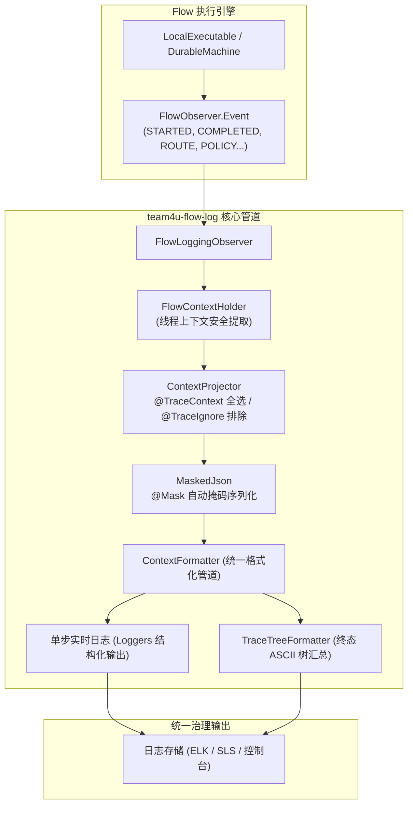

# 流程结构化日志与执行树 (team4u-flow-log)

# 背景

在分布式长事务与微服务业务流程编排中，全链路可视化排障与运行时状态监控至关重要。常规的流程日志记录通常面临以下痛点：

- **日志信息扁平无序**：单纯按时间顺序打印的单行日志无法清晰呈现复杂流程（分支路由、并行汇聚、嵌套子流程、重试治理）的调用栈与拓扑层级关系；
- **敏感信息明文泄漏**：业务流转上下文（如用户手机号、身份证、银行卡号、密码等）在记录日志时若缺乏统一的脱敏约束，极易引发合规与数据安全风险；
- **全量打印与大对象污染**：业务上下文 DTO 往往包含大量内部缓存、临时变量或超长报文，如果不加选择全量序列化，将导致日志文件急剧膨胀并消耗大量 I/O；
- **单步日志与最终汇总格式割裂**：执行过程中的中间状态与流程结束时的汇总结果格式不一致，增加排障与解析成本。

`team4u-flow-log` 是建立在 `team4u-flow`、`team4u-log` 与 `team4u-mask` 之上的结构化日志与执行树观察者模块，提供实时单步结构化日志输出、类与字段级属性挑选、自动安全掩码脱敏与终态 ASCII 执行树汇总。

---

# 核心架构设计



### 核心特性

- **单步与终态格式 100% 对齐**：运行中的单步日志与流程结束时的最终上下文，全部流经统一的 `ContextFormatter` 格式化管道，保证属性过滤与掩码算法严格一致；
- **类级别与字段级双轨属性挑选**：
  - **类级别（`@TraceContext`）**：声明在类上，默认输出全部字段，配合 `@TraceIgnore` 排除大字段；
  - **字段级别（`@TraceContext`）**：声明在字段上，作为精准白名单输出，并支持通过 `value` 设置日志属性别名；
  - **函数式投影（Lambda Selector）**：支持在编排期通过 `ContextProjector.of(...)` 动态定制字段输出；
- **无侵入安全脱敏（`team4u-mask` 原生集成）**：被选中的字段经由 `MaskedJson` 执行掩码序列化，Java 内存对象中的字段值始终保持明文，零业务污染；
- **ASCII 执行树渲染**：在流程结束时自动根据 AST 节点路径（`path`）构建并打印清晰的调用层级树（包含耗时、四态 Outcome 与重试轮次）。

---

# 引入依赖

在 `pom.xml` 中引入 `team4u-flow-log` 模块：

```xml
<dependency>
    <groupId>com.team4u</groupId>
    <artifactId>team4u-flow-log</artifactId>
</dependency>
```

---

# 注解声明与属性配置

### 注解一览表

| 注解 | 作用目标 | 核心语义 |
| :--- | :--- | :--- |
| **`@TraceContext`** | 类（`TYPE`） / 字段（`FIELD`） | • 标注在类上：该类所有非 static、非 transient 字段默认全部输出至日志；<br/>• 标注在字段上：白名单输出该字段，支持别名。 |
| **`@TraceIgnore`** | 字段（`FIELD`） / 方法（`METHOD`） | 当类标注了 `@TraceContext` 时，显式排除该字段，不输出至日志。 |
| **`@Mask(MaskType)`** | 字段（`FIELD`） | 对输出的敏感字段自动应用安全掩码（手机、身份证、银行卡等）。 |

### 业务 DTO 声明示例

```java
package com.example.order;

import com.team4u.framework.flow.log.TraceContext;
import com.team4u.framework.flow.log.TraceIgnore;
import com.team4u.framework.mask.Mask;
import com.team4u.framework.mask.MaskType;
import lombok.Data;

import java.util.Map;

@Data
@TraceContext // 1. 类级别声明：默认包含所有业务字段
public class OrderContext {

    private String orderId;

    @Mask(MaskType.NAME) // 姓名脱敏：张*丰
    private String realName;

    @Mask(MaskType.MOBILE) // 手机号脱敏：138*****000
    private String mobile;

    @Mask(MaskType.ID_CARD_NO) // 身份证脱敏：11010***********45
    private String idCardNo;

    @Mask(MaskType.BANK_CARD_NO) // 银行卡脱敏：622202******1234
    private String cardNo;

    private Double amount;
    private String status;

    @TraceIgnore // 2. 显式排除内部缓存，不污染日志
    private Map<String, Object> internalCache;

    @TraceIgnore // 3. 显式排除超大二进制报文
    private byte[] rawImagePayload;
}
```

---

# 核心 API 与使用方式

### 流程执行与上下文绑定

通过 `FlowContextHolder.runWith(...)` 将上下文对象绑定至当前线程执行生命周期，执行完毕后自动清理，杜绝内存泄漏：

```java
import com.team4u.framework.flow.Flow;
import com.team4u.framework.flow.Local;
import com.team4u.framework.flow.LocalExecutable;
import com.team4u.framework.flow.log.FlowContextHolder;
import com.team4u.framework.flow.log.FlowLoggingObserver;
import com.team4u.framework.flow.model.FlowResult;

// 1. 构建日志观察者
FlowLoggingObserver observer = FlowLoggingObserver.builder()
        .loggerNamePrefix("flow.trace") // 自定义 Logger 前缀
        .printStepLogs(true)            // 开启运行中单步实时日志
        .printTreeSummary(true)         // 开启流程结束时的 ASCII 执行树与最终上下文汇总
        .build();

// 2. 编译流程
LocalExecutable<OrderContext, OrderContext> executable = Local.from(orderFlow)
        .flowId("order-checkout")
        .flowVersion(1)
        .resolver(beanResolver)
        .observer(observer)
        .compile();

// 3. 在绑定的上下文内安全执行
OrderContext context = new OrderContext();
FlowResult<OrderContext> result = FlowContextHolder.runWith(context, () -> executable.run(context));
```

---

# 节点名称 (Label) 缺省回退展示机制

若在编排 DSL 时未显式通过 `.named("xxx")` 设置节点名称，`FlowLoggingObserver` 会依据 AST 描述符按以下优先级自动提取最直观的可读名称，避免日志中出现空白或难以识别的匿名符号：

| 优先级 | 判定条件 | 示例场景 | 默认展示名称 |
| :--- | :--- | :--- | :--- |
| **1. 显式指定** | 显式调用 `.named("xxx")` | `Flow.step(...).named("用户验签")` | `"用户验签"` |
| **2. 绑定的实现类** | 绑定了非 Lambda 的具体 Class | `Flow.step(ValidateOperation.class)` | `"ValidateOperation"`（若有 Spring 限定符则形如 `"ValidateOperation (vip)"`） |
| **3. 绑定的契约接口** | 绑定了契约接口 Class | `Flow.step(PaymentOperation.class)` | `"PaymentOperation"` |
| **4. 节点拓扑种类** | Lambda 匿名步骤或结构节点 | `Flow.step((ctx, req) -> ...)` 或 `Flow.parallel(...)` | 节点类型枚举名：`"INVOKE"`、`"PARALLEL"`、`"ROUTE"`、`"CONTROL"` 等 |
| **5. 顶层流程** | 流程根节点 | 顶层 `LocalExecutable` | `"flow: <flowId>"` |
| **6. 极端兜底** | 描述符信息缺失 | 外部未定义节点 | `"<unnamed>"` |

---

# 自定义属性投影选择器 (`ContextProjector`)

若需在特定流程中按需挑选字段，可配置不同的 `ContextProjector`：

### 注解驱动模式（默认）
```java
FlowLoggingObserver observer = FlowLoggingObserver.builder()
        .contextProjector(ContextProjector.annotated())
        .build();
```

### 函数式 Lambda 投影模式（类型安全）
```java
FlowLoggingObserver observer = FlowLoggingObserver.builder()
        .contextProjector(ContextProjector.of((OrderContext ctx) -> Map.of(
                "orderId", ctx.getOrderId(),
                "mobile", ctx.getMobile(),
                "status", ctx.getStatus()
        )))
        .build();
```

### 属性白名单模式
```java
FlowLoggingObserver observer = FlowLoggingObserver.builder()
        .contextProjector(ContextProjector.fields("orderId", "amount", "mobile"))
        .build();
```

---

# 链路树模型编程式获取与断言 (`TraceNode`)

除输出控制台与日志系统外，`FlowLoggingObserver` 还支持通过编程式 API 直接提取结构化的调用拓扑树模型，用于下游 APM 指标上报或单元测试断言：

```java
// 获取最近一次已完成执行的根追踪节点
TraceNode rootNode = observer.rootTraceNode();

// 或按 executionId 获取指定执行实例的根节点
TraceNode targetNode = observer.rootTraceNode("ORD-10086");

// 访问节点核心指标
String path = rootNode.getPath();            // AST 节点路径，如 "$"、"$/0"
String label = rootNode.getLabel();          // 节点显示标签
long duration = rootNode.getDurationMs();    // 耗时毫秒
String outcome = rootNode.getOutcome();      // 四态执行结果 (ACCEPTED / REJECTED / SKIPPED / FAILED)
String extra = rootNode.getExtra();          // 附加元数据 (如 attempt=2, selected=case:0)

// 获取线程安全的子节点快照
List<TraceNode> children = rootNode.snapshotChildren();
```

### 并发安全与多租户执行隔离

- **Per-Execution 槽位隔离**：`FlowLoggingObserver` 内部使用 `ConcurrentHashMap<String, ExecutionTrace>` 按 `executionId` 进行隔离。多个线程并发复用同一个编译好的 `LocalExecutable` 时，各自的链路追踪树互不干扰；
- **自闭环回收防泄漏**：当流程执行完毕（`FLOW_COMPLETED` / `FLOW_CANCELLED` / `FLOW_SUSPENDED`）时，当前执行树会自动从活跃跟踪表中弹出，保障高并发吞吐下的内存即时回收。

---

# 完整日志输出样式

### 运行中单步实时日志（逐行流式输出）

```text
[INFO] flow.trace.order-checkout | action=FLOW_STARTED | execId=ORD-10086 | context={"orderId":"ORD-10086","realName":"张*丰","mobile":"138*****000","idCardNo":"11010***********45","cardNo":"622202******1234","amount":299.0,"status":"INITIAL"} | status=start
[INFO] flow.trace.order-checkout | action=NODE_STARTED | execId=ORD-10086 | path=$/0 | label=用户实名核验 | context={"orderId":"ORD-10086","realName":"张*丰","mobile":"138*****000","idCardNo":"11010***********45","cardNo":"622202******1234","amount":299.0,"status":"INITIAL"} | status=start
[INFO] flow.trace.order-checkout | action=NODE_COMPLETED | execId=ORD-10086 | path=$/0 | label=用户实名核验 | duration=12ms | outcome=ACCEPTED | context={"orderId":"ORD-10086","realName":"张*丰","mobile":"138*****000","idCardNo":"11010***********45","cardNo":"622202******1234","amount":299.0,"status":"VERIFIED"} | status=success
[INFO] flow.trace.order-checkout | action=NODE_STARTED | execId=ORD-10086 | path=$/1 | label=银行扣款 | context={"orderId":"ORD-10086","realName":"张*丰","mobile":"138*****000","idCardNo":"11010***********45","cardNo":"622202******1234","amount":299.0,"status":"VERIFIED"} | status=start
[INFO] flow.trace.order-checkout | action=NODE_COMPLETED | execId=ORD-10086 | path=$/1 | label=银行扣款 | duration=85ms | outcome=ACCEPTED | attempt=2 | context={"orderId":"ORD-10086","realName":"张*丰","mobile":"138*****000","idCardNo":"11010***********45","cardNo":"622202******1234","amount":299.0,"status":"PAID"} | status=success
```

### 流程结束终态执行树与最终上下文汇总

```text
[INFO] Flow Execution Summary [flowId=order-checkout | execId=ORD-10086 | total=125ms | outcome=ACCEPTED]
└── [$] flow: order-checkout (125ms) [ACCEPTED]
    ├── [$/0] 用户实名核验 (12ms) [ACCEPTED]
    ├── [$/1] 支付渠道路由 (3ms) [ACCEPTED] selected=online
    │   └── [$/1/body] 重试治理控制器 (85ms) [ACCEPTED]
    │       └── [$/1/body/0] 银行扣款 (82ms) [ACCEPTED] attempt=2
    └── [$/2] 资源并行结算 (25ms) [ACCEPTED]
        ├── [$/2/branch:0] 库存预占 (18ms) [ACCEPTED]
        └── [$/2/branch:1] 电子发票开具 (22ms) [ACCEPTED]

Final Context:
{
  "orderId": "ORD-10086",
  "realName": "张*丰",
  "mobile": "138*****000",
  "idCardNo": "11010***********45",
  "cardNo": "622202******1234",
  "amount": 299.00,
  "status": "PAID"
}
```
