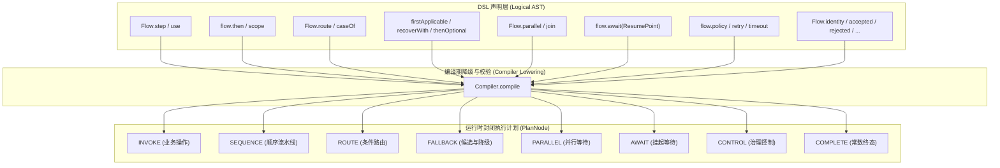
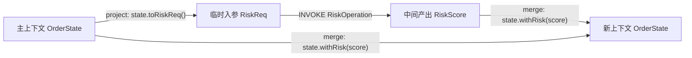

# 运行时节点与 DSL 编排原语

`team4u-flow` 采用“**不可变声明（Logical AST） -> 编译期降级校验（Compiler Lowering） -> 运行时封闭节点（PlanNode）**”的架构。在 DSL 构建阶段，用户使用丰富流畅的语义方法组装流程；在编译期，这些结构被统一规范化降级为八种封闭的运行时核心节点。

本文将详细剖析这八种核心节点的运行语义、DSL 声明方式以及内部执行机制。

---

## 节点体系与架构总览



> [!IMPORTANT]
> **运行时节点封闭原则**：框架的运行时节点类型（`NodeDescriptor.Kind`）是严格封闭的闭集，不开放自定义节点类型。所有高级业务编排语义均通过这八种基础节点进行正交组合，从而确保了 Local 引擎与 Durable 状态机引擎的绝对确定性与可维护性。

---

## 1. INVOKE 节点（业务调用）

`INVOKE` 节点是业务逻辑执行的最小原子单元，负责调用绑定的 `Operation`。

### 声明形式

```java
// 1. 实例绑定 / Lambda
Flow<Order, Receipt> flow1 = Flow.step((context, order) -> Outcome.accepted(new Receipt(order.getId())));

// 2. Class 绑定（编译期由 BeanManager 解析单例）
Flow<Order, Receipt> flow2 = Flow.step(OnlinePaymentOperation.class);

// 3. Class + 限定符绑定
Flow<Order, Receipt> flow3 = Flow.step(OnlinePaymentOperation.class, "wechatPayment");
```

### `use` 上下文投影与合并调用

在长流水线中，后续步骤可能只需要主上下文的一部分字段作为入参，并将产出的新字段写回主上下文。`use` 提供了声明式的入参投影（`project`）与结果合并（`merge`）：



```java
Flow<OrderState, OrderState> flow = Flow.<OrderState>identity().use(
        RiskCheckOperation.class,
        orderState -> new RiskReq(orderState.getUserId(), orderState.getAmount()), // project
        (orderState, riskScore) -> orderState.withRiskScore(riskScore)            // merge
);
```

- 如果被调用的 `Operation` 返回 `Accepted(score)`，则触发 `merge` 函数合成新的 `OrderState` 并继续后续流水线；
- 若返回 `Rejected`、`Skipped` 或 `Failed`，则直接短路，不调用 `merge`。

---

## 2. SEQUENCE 节点（顺序流水线）

`SEQUENCE` 节点按声明顺序串联子节点。

### 声明形式

```java
Flow<A, D> flow = Flow.step(stepA) // Step<A, B>
        .then(stepB)               // Step<B, C>
        .then(stepC);              // Step<C, D>
```

### 匿名合并优化与 `scope` 具名作用域

- **扁平化优化**：连续的匿名 `then` 步骤在编译期会被自动扁平化合并到同一个 `SEQUENCE` 的节点数组中，消除深层嵌套带来的调用栈开销；
- **具名作用域（`scope`）**：显式创建作用域边界，常用于界定事务、治理策略或超时控制范围：

```java
Flow<Order, Order> scopedFlow = Flow.scope("inventory-group", 
        Flow.step(checkStockOp)
            .then(lockStockOp)
            .then(deductStockOp)
);
```

---

## 3. ROUTE 节点（条件路由）

`ROUTE` 节点通过路由选择器计算路由键，按精确 `equals` 匹配分支。

### 声明形式

```java
Flow<OrderRequest, Receipt> routedFlow = Flow
        .route((context, order) -> Outcome.accepted(order.getPayChannel()))
        .caseOf("ALIPAY", alipayFlow)
        .caseOf("WECHAT", wechatFlow)
        .caseOf("CREDIT_CARD", creditCardFlow)
        .otherwise(manualReviewFlow); // 可选：兜底分支
```

### 契约与规则

1. **唯一性校验**：`caseOf` 中的路由键不能重复，否则在声明时立即抛出 `DUPLICATE_ROUTE_CASE`；
2. **`withoutOtherwise()`**：若未配置 `otherwise` 且未匹配到任何分支，整体流程产出 `Skipped(NO_ROUTE)`；
3. **选择器短路**：路由选择器本身若返回 `Rejected`、`Skipped` 或 `Failed`，则不进入任何分支，直接向外短路。

---

## 4. FALLBACK 节点（降级与恢复）

`FALLBACK` 节点按触发条件在多个候选分支间切换，包含两种底层触发器：

### SKIPPED 触发器（`firstApplicable` 与 `thenOptional`）

当分支返回 `Skipped` 时，尝试后续候选分支：

```java
Flow<User, AccessToken> loginFlow = Flow.firstApplicable(
        ssoAuthFlow,      // 若无 SSO Token 返回 Skipped
        cookieAuthFlow,   // 若无 Cookie 返回 Skipped
        passwordAuthFlow  // 最终账号密码认证
);
```

### FAILED 触发器（`recoverWith`）

当主分支返回 `Failed` 时，携带原始输入与 `Failure` 进入恢复分支：

```java
Flow<Order, Receipt> resilientFlow = Flow.step(chargeOperation)
        .recoverWith(Flow.step((context, recovery) -> {
            log.warn("主支付通道失败 [{}], 启动异步降级单", recovery.failure().code());
            return Outcome.accepted(createPendingReceipt(recovery.input()));
        }));
```

---

## 5. PARALLEL 节点（并行分支）

`PARALLEL` 节点支持同时分发多个独立分支，并在全部完成后由 `JoinStrategy` 进行汇合。

### 声明形式

```java
Branch<Order, RiskResult> riskBranch = Branch.of("riskBranch", riskFlow);
Branch<Order, InventoryResult> stockBranch = Branch.of("stockBranch", stockFlow);

Flow<Order, CheckoutResult> parallelFlow = Flow.<Order>parallel(riskBranch, stockBranch)
        .join(results -> {
            if (!results.allAccepted().isPresent()) {
                return Outcome.failed(Failure.of("PARALLEL_CHECK_FAILED", "风控或库存检查失败"));
            }
            return Outcome.accepted(new CheckoutResult(...));
        });
```

### 静态约束校验

为了防止并发环境下的状态竞争与死锁，编译期实施严格校验：
- **禁止在并行分支内部使用 `await`**（违规抛出 `PARALLEL_AWAIT`）；
- **禁止在并行分支内部使用 `persistentPolicy`**（违规抛出 `PARALLEL_PERSISTENT_POLICY`）；
- 分支名称在同一并行块内必须唯一（`DUPLICATE_BRANCH`）。

---

## 6. AWAIT 节点（挂起等待）

`AWAIT` 节点显式将当前执行挂起，等待外部系统（如人工审批、异步支付回调、延时 Webhook）注入信号。

### 声明形式

```java
ResumePoint<ApprovalSignal> approvalPoint = ResumePoint.named("managerApproval");

Flow<ExpenseRequest, ExpenseReport> flow = Flow.<ExpenseRequest>identity()
        .then(submitExpenseOp)
        .await(approvalPoint) // 流程在此挂起
        .then((context, resumed) -> {
            ExpenseRequest req = resumed.state();
            ApprovalSignal signal = resumed.signal();
            return Outcome.accepted(new ExpenseReport(req, signal.isApproved()));
        });
```

- Local 执行器在此处返回 `FlowResult.Suspended`，持有 `Suspension` 句柄；
- Durable 执行器在此处将快照更新为 `SUSPENDED` 并落库，等待调用 `resume(executionId, "managerApproval", signal)`。

---

## 7. CONTROL 节点（治理控制）

`CONTROL` 节点包裹在子流程外部，提供横切治理能力。包含四种控制形态（`ControlKind`）：

| 治理类型 | DSL 声明方法 | 作用 |
| :--- | :--- | :--- |
| **POLICY** | `flow.policy(policyInstance, keyFn)` | 无状态网关拦截（放行 / 拒绝 / 失败）及后置监控 |
| **PERSISTENT_POLICY** | `flow.persistentPolicy(policyClass, keyFn)` | 状态持久化的策略（支持定时唤醒 `WaitUntil`） |
| **RETRY** | `flow.retry(Retry.maxAttempts(3))` | Failed 时自动重试，支持固定与指数退避 |
| **TIMEOUT** | `flow.timeout(Duration.ofSeconds(3))` | 限定子流程最大执行时限，超时产生 TIMEOUT 失败 |

---

## 8. COMPLETE 节点（常数终态）

`COMPLETE` 节点用于快速构建常数结果或透传节点，无需编写单独的 `Operation`：

```java
Flow<User, User> identityFlow = Flow.identity(); // 原样透传输入

Flow<Void, String> acceptedFlow = Flow.accepted("SUCCESS");
Flow<Void, String> rejectedFlow = Flow.rejected(Reason.of("ACCESS_DENIED", "无权访问"));
Flow<Void, String> skippedFlow  = Flow.skipped(Reason.of("NOT_CONFIGURED", "未配置"));
Flow<Void, String> failedFlow   = Flow.failed(Failure.of("SYSTEM_ERROR", "系统错误"));
```

---

## 关联章节与进一步阅读

- 深入掌握 Policy 治理、Retry 与 Timeout：[流程治理：Policy 策略、Retry 重试与 Timeout 控制](flow-governance.md)
- 深入掌握并行汇合与策略定制：[并行分支与汇合治理](flow-parallel.md)
- 深入掌握挂起恢复与取消机制：[挂起续接与协作式取消合同](flow-suspend.md)
- 探索 Spring 容器中如何绑定 Bean 节点：[Bean 容器集成与 Spring 治理](flow-bean.md)
