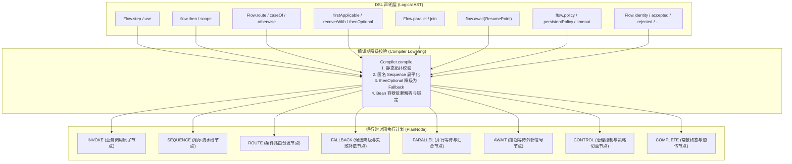
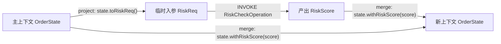
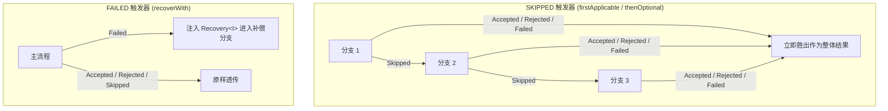

# 运行时节点与 DSL 编排原语

`team4u-flow` 采用“**不可变声明（Logical AST） -> 编译期降级校验（Compiler Lowering） -> 运行时封闭节点（PlanNode）**”的三层架构。

在 DSL 构建阶段，开发者使用丰富流畅的语义方法组装流程；在编译阶段，这些结构经过静态校验、扁平化优化与降级，统一规范化为八种封闭的运行时核心节点。

本文将深入剖析这八种核心节点的运行时状态机、DSL 声明形式、节点路径（Path）规范以及内部执行机制。

---

## 节点体系与降级编译架构



> [!IMPORTANT]
> **运行时节点封闭原则（Closed PlanNode Set）**：
> 框架的运行时节点类型（`NodeDescriptor.Kind`）是严格封闭的闭集（仅 8 种），**绝不开放自定义节点类型**。
> 所有高级业务编排语义均通过这八种基础节点进行正交组合。封闭性使得执行器内核（`SerialMachine`）、持久化状态机（`DurableMachine`）、Mermaid 渲染器（`FlowGraphs`）与调试工具具备了 100% 的确定性与可靠性。

---

## 节点路径命名规范 (AST Node Path)

每个运行时节点在 AST 树中都分配有严格唯一的层级路径（`path`），格式如下：

| 节点位置 | 路径示例 | 含义说明 |
| :--- | :--- | :--- |
| **根节点** | `$` | 整个 Flow 的根节点 |
| **Sequence 子节点** | `$/0`, `$/1`, `$/0/2` | 父路径加子步骤索引号 |
| **Route 关键组件** | `$/1/selector` | 路由选择器节点 |
| **Route 分支** | `$/1/case:0`, `$/1/case:1` | 第 0、1 个 case 分支 |
| **Route 兜底** | `$/1/otherwise` | 路由兜底分支 |
| **Parallel 分支** | `$/0/branch:risk` | 具名并行分支 |
| **Control 子流程** | `$/0/body` | 治理策略包裹的业务主体 |

该 `path` 会直接注入到节点的稳定幂等键中：
$$\text{invocationId} = \text{flowId} : \text{flowVersion} : \text{executionId} : \text{path}$$

---

## 1. INVOKE 节点（业务调用）

`INVOKE` 节点是业务逻辑执行的最小原子单元，负责调用绑定的 `Operation`。

### 声明形式与容器绑定

```java
// 1. 实例绑定 / Lambda
Flow<Order, Receipt> flow1 = Flow.step((context, order) -> 
        Outcome.accepted(new Receipt(order.getId())));

// 2. Class 绑定（编译期由 BeanManager 唯一解析单例）
Flow<Order, Receipt> flow2 = Flow.step(OnlinePaymentOperation.class);

// 3. Class + Qualifier 限定符绑定（按 Bean 名称查找）
Flow<Order, Receipt> flow3 = Flow.step(OnlinePaymentOperation.class, "wechatPaymentOperation");
```

### `use` 上下文投影与合并机制

在长流水线中，上下文对象通常很大，而某个业务步骤只需其中一部分字段作为输入，并将产出的新字段合并回主上下文。`use` 提供了声明式的字段投影（`project`）与结果合并（`merge`）：



```java
Flow<OrderState, OrderState> flow = Flow.<OrderState>identity().use(
        RiskCheckOperation.class,
        orderState -> new RiskReq(orderState.getUserId(), orderState.getAmount()), // project
        (orderState, riskScore) -> orderState.withRiskScore(riskScore)            // merge
);
```

#### 内核执行机制
1. 执行 `project(entry)` 派生出局部入参；
2. 调用绑定的 `Operation.execute(context, projectedInput)`；
3. 若返回 `Accepted(value)`，调用 `merge(entry, value)` 合成新上下文，并封装为 `Accepted(merged)` 继续推进；
4. 若返回 `Rejected`、`Skipped` 或 `Failed`，**不调用 merge**，直接将非 Accepted 状态向外短路。

---

## 2. SEQUENCE 节点（顺序流水线）

`SEQUENCE` 节点按声明顺序串联子节点列表。

### 声明形式与作用域

```java
Flow<A, D> flow = Flow.step(stepA) // Step<A, B>
        .then(stepB)               // Step<B, C>
        .then(stepC);              // Step<C, D>

// 具名作用域 (scope)
Flow<Order, Order> scopedFlow = Flow.scope("inventory-scope", 
        Flow.step(checkStockOp)
            .then(lockStockOp)
            .then(deductStockOp)
);
```

### 扁平化优化与帧状态机
- **编译期扁平化**：连续的匿名 `then` 步骤在编译期会被自动扁平化合并到同一个 `SEQUENCE` 的节点数组中，消除深层嵌套带来的调用栈与帧开销；
- **状态机阶段（Phases）**：
  - `phase = 0`：初始进入序列；
  - `phase = 1`：当前正在执行第 `index` 个子步骤；
  - 当第 `index` 个子步骤返回 `Accepted(value)` 时，`index++` 并将新值作为下一子步骤的输入；
  - 若子步骤返回非 `Accepted`，序列立即终止并归约弹出。

---

## 3. ROUTE 节点（条件路由）

`ROUTE` 节点通过路由选择器计算路由键，按精确 `equals` 匹配分支。

### 声明形式

```java
Flow<OrderRequest, Receipt> routedFlow = Flow
        .route((context, order) -> Outcome.accepted(order.getPayChannel()))
        .caseOf("ALIPAY", alipayFlow)
        .caseOf("WECHAT", wechatFlow)
        .caseOf("CREDIT_CARD", creditCardFlow)
        .otherwise(manualReviewFlow); // 可选：兜底分支，或 .withoutOtherwise()
```

### 状态机阶段与契约
- **`phase = 1`（选择器阶段）**：执行 `selector` 节点计算路由键；若选择器返回非 `Accepted`，直接短路退出；
- **`phase = 2`（分支执行阶段）**：根据路由键匹配对应的 `caseOf` 分支；若未命中且配置了 `otherwise`，进入兜底分支；若未配置 `otherwise`（`withoutOtherwise()`），整体产出 `Skipped(NO_ROUTE)`；
- **编译期唯一性校验**：`caseOf` 中的路由键不能重复，否则在声明时立即抛出 `DUPLICATE_ROUTE_CASE`。

---

## 4. FALLBACK 节点（降级与恢复）

`FALLBACK` 节点按触发条件在候选分支序列中切换，包含两种底层触发器：



### 1. SKIPPED 触发器（`firstApplicable` 与 `thenOptional`）
- 依次执行候选分支；
- 遇到 `Skipped` 时，消费弃权信号并尝试下一个候选分支；
- 遇到 `Accepted`、`Rejected` 或 `Failed` 时立即胜出作为最终结果。

### 2. FAILED 触发器（`recoverWith`）
- 主流程正常完成（`Accepted` / `Rejected` / `Skipped`）时原样透传；
- 主流程返回 `Failed` 时，将原始输入与 `Failure` 封装为 `Recovery<I>`，交由恢复分支执行补偿。

---

## 5. PARALLEL 节点（并行分支）

`PARALLEL` 节点支持同时分发多个独立分支，并在全部完成后由 `JoinStrategy` 进行汇合。

### 声明形式

```java
Branch<Order, RiskResult> riskBranch = Branch.of("riskBranch", riskFlow);
Branch<Order, InventoryResult> stockBranch = Branch.of("stockBranch", stockFlow);

Flow<Order, CheckoutResult> parallelFlow = Flow.<Order>parallel(riskBranch, stockBranch)
        .join(results -> results.allAccepted()
                .map(map -> new CheckoutResult(map.get(riskBranch), map.get(stockBranch))));
```

### 静态约束校验（Static Constraints）
为了防止并发环境下的状态竞争与死锁，编译期实施严格校验：
- **`PARALLEL_AWAIT`**：严禁在并行分支内部使用 `await` 挂起点；
- **`PARALLEL_PERSISTENT_POLICY`**：严禁在并行分支内部挂载持久化策略；
- **`DUPLICATE_BRANCH`**：同一并行块内各分支名称必须全局唯一。

---

## 6. AWAIT 节点（挂起等待）

`AWAIT` 节点显式将当前执行挂起，等待外部系统注入恢复信号（Signal）。

### 声明形式

```java
ResumePoint<ApprovalSignal> approvalPoint = ResumePoint.named("managerApproval");

Flow<ExpenseRequest, ExpenseReport> flow = Flow.<ExpenseRequest>identity()
        .then(submitExpenseOp)
        .await(approvalPoint) // 流程在此挂起！
        .then((context, resumed) -> {
            ExpenseRequest req = resumed.state();    // 挂起前的原值
            ApprovalSignal sig = resumed.signal();   // 外部注入的信号
            return Outcome.accepted(new ExpenseReport(req, sig.isApproved()));
        });
```

- **Local 模式**：释放当前线程并返回 `FlowResult.Suspended`，持有单次消费句柄 `Suspension`；
- **Durable 模式**：将快照生命周期更新为 `SUSPENDED` 并通过 CAS 落库，等待调用 `resume(executionId, "managerApproval", signal)`。

---

## 7. CONTROL 节点（治理控制）

`CONTROL` 节点包裹在业务子流程外部，提供洋葱圈式的横切治理能力。包含三种纯粹控制形态（`ControlKind`）：

| 控制类型 | DSL 声明方法 | 核心作用与行为 |
| :--- | :--- | :--- |
| **POLICY** | `flow.policy(policy, keyFn)` | 无状态准入网关：在 `before` 执行放行/拒绝/失败判定，在 `after` 收集完成指标 |
| **PERSISTENT_POLICY** | `flow.persistentPolicy(policy, keyFn)` | 有状态持久化策略：维护不可变状态 `S`，支持 `WaitUntil` 定时挂起与 `RetryAt` 故障退避重试 |
| **TIMEOUT** | `flow.timeout(Duration.ofSeconds(3))` | 施加最大执行时限：超时向执行线程发送中断信号并产出 `TIMEOUT` 失败 |

---

## 8. COMPLETE 节点（常数终态）

`COMPLETE` 节点用于快速构建静态常量结果或恒等透传节点，无需编写单独的 `Operation`：

```java
Flow<User, User> identityFlow = Flow.identity(); // 原样透传输入

Flow<Void, String> acceptedFlow = Flow.accepted("SUCCESS");
Flow<Void, String> rejectedFlow = Flow.rejected(Reason.of("ACCESS_DENIED", "无权访问"));
Flow<Void, String> skippedFlow  = Flow.skipped(Reason.of("NOT_CONFIGURED", "未配置"));
Flow<Void, String> failedFlow   = Flow.failed(Failure.of("SYSTEM_ERROR", "系统错误"));
```

---

## 编译期静态校验诊断码 (FlowBuildException)

在 `Compiler.compile(flow)` 阶段，框架会对整个 AST 树进行静态完整性校验，违规时聚合抛出 `FlowBuildException`：

| 诊断码 | 校验类别 | 违规原因 |
| :--- | :--- | :--- |
| `DUPLICATE_LABEL` | 节点标签 | 同一节点被重复调用 `.named("xxx")` 赋予了不同标签 |
| `DUPLICATE_SCOPE` | 具名作用域 | 流程中存在同名的 `Flow.scope("name", ...)` |
| `DUPLICATE_BRANCH` | 并行分支 | `Flow.parallel` 中声明了相同名称的 `Branch.of("name", ...)` |
| `DUPLICATE_RESUME_POINT` | 挂起点 | 同一流程定义内声明了同名的 `ResumePoint.named("point")` |
| `PARALLEL_AWAIT` | 并发约束 | 在 `parallel` 分支内部使用了 `await` 挂起点 |
| `PARALLEL_PERSISTENT_POLICY` | 并发约束 | 在 `parallel` 分支内部使用了 `persistentPolicy` |
| `INVALID_BINDING` | 契约违规 | 绑定的 Class 未实现 `Operation`、`Policy` 或 `PersistentPolicy` 接口 |
| `MISSING_BINDING` | 容器缺失 | `BeanManager` 容器中未找到声明的 Bean（类型或限定符不匹配） |
| `BINDING_TYPE` | 契约类型 | 容器解析出的 Bean 实例与 Flow 声明的泛型契约不一致 |
| `DUPLICATE_ROUTE_CASE` | 路由键 | `route` 中声明了重复的 case 键（声明时即刻抛出） |

---

## 关联章节与进一步阅读

- 深入掌握 Policy 治理、Retry 与 Timeout：[流程治理：Policy 策略、Retry 重试与 Timeout 控制](flow-governance.md)
- 深入掌握并行汇合与策略定制：[并行分支与汇合治理](flow-parallel.md)
- 深入掌握挂起恢复与取消机制：[挂起续接与协作式取消合同](flow-suspend.md)
- 探索 Spring 容器中如何绑定 Bean 节点：[Bean 容器集成与 Spring 治理](flow-bean.md)
