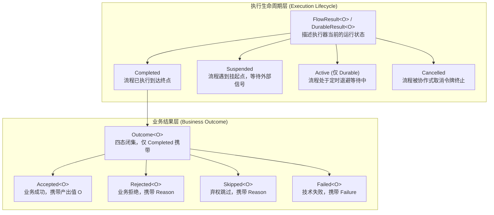

# 四态业务结果与生命周期模型

在复杂的业务系统（如交易履约、支付风控、审批工单等）中，传统编程模型常常将“业务拒绝”、“弃权跳过”、“技术异常”与“正常成功”混淆在 `boolean`、`null`、`Optional` 或未受检异常中。这种做法会导致错误被吞、无法进行细粒度的分支路由、难以统计业务健康度，且丢失了类型安全。

`team4u-flow` 提出了**业务四态代数类型（`Outcome<T>`）**与**执行生命周期（`FlowResult` / `DurableResult`）**严格分层的体系。本文将深入剖析该模型的设计原理、契约约束与代数操作。

---

## 核心分层架构

框架将运行结果清晰地划分为两层：



- **业务四态（Outcome）**：回答“业务逻辑达成了何种业务结论”；
- **执行生命周期（FlowResult / DurableResult）**：回答“当前执行处于何种运行状态”。

---

## Outcome 四态代数类型

`Outcome<T>` 是 Java 8 风格的封闭抽象类（包级私有构造器，禁止外部继承），包含且仅包含四种子类：

| 状态 | 对应类 | 携带载荷 | 语义定义 | 典型场景 |
| :--- | :--- | :--- | :--- | :--- |
| **Accepted** | `Outcome.Accepted<T>` | `T value`（非 null） | **业务成功**：节点产生符合预期的业务数据。**四态中唯一携带输出值的状态**。 | 订单创建成功、支付扣款成功、优惠计算完毕 |
| **Rejected** | `Outcome.Rejected<T>` | `Reason reason`（非 null） | **业务拒绝**：业务规则校验不通过或被风控拒绝。属于预期内的业务分支，**不属于系统故障**。 | 黑名单拦截、余额不足、账户被冻结、参数校验失败 |
| **Skipped** | `Outcome.Skipped<T>` | `Reason reason`（非 null） | **弃权跳过**：当前节点对于输入不适用或主动弃权。支持被外层算子消费以尝试后续分支。 | 用户未填写优惠券、非首单用户跳过新人礼包、无适用路由 |
| **Failed** | `Outcome.Failed<T>` | `Failure failure`（非 null） | **技术失败**：系统故障、RPC 超时、未受检异常或不可恢复错误。可触发框架级重试或补偿。 | 数据库连接超时、下游网关 502、序列化失败、线程池耗尽 |

---

## Reason 与 Failure 诊断值对象

为了保证分布式调用、日志追踪与可观测性的一致性，框架使用不可变的值对象 `Reason` 与 `Failure` 承载诊断信息：

### Reason 结构与工厂

用于 `Rejected` 与 `Skipped`：

```java
import com.team4u.framework.flow.model.Reason;

// 1. 基础构建：指定稳定错误码与说明
Reason r1 = Reason.of("INSUFFICIENT_BALANCE", "账户余额不足");

// 2. 携带扩展详情键值对
Reason r2 = Reason.of("DAILY_LIMIT_EXCEEDED", "超出单日转账限额")
        .withDetail("currentLimit", 50000)
        .withDetail("requestedAmount", 80000);

String code = r2.code();               // "DAILY_LIMIT_EXCEEDED"
String message = r2.message();         // "超出单日转账限额"
Map<String, Object> details = r2.details(); // {"currentLimit": 50000, ...}
```

### Failure 结构与工厂

用于 `Failed`：

```java
import com.team4u.framework.flow.model.Failure;

// 1. 基础构建
Failure f1 = Failure.of("RPC_TIMEOUT", "支付网关响应超时");

// 2. 绑定底层根因异常
try {
    invokeRemoteService();
} catch (Exception e) {
    Failure f2 = Failure.of("INVOCATION_ERROR", e.getMessage(), e)
            .withDetail("remoteIp", "10.0.12.34");
}
```

---

## Outcome 代数操作与映射

### 1. `map` 变换

`map` 函数仅对 `Accepted` 状态应用转换器；若当前为 `Rejected`、`Skipped` 或 `Failed`，则安全转换泛型参数并原样透传其诊断对象：

```java
Outcome<String> ok = Outcome.accepted("hello");
Outcome<Integer> lengthOutcome = ok.map(String::length); // Accepted(5)

Outcome<String> reject = Outcome.rejected(Reason.of("ERR", "拒绝"));
Outcome<Integer> mappedReject = reject.map(String::length); // Rejected(ERR, "拒绝")
```

### 2. 模式匹配与状态判定

通过 `kind()` 枚举或 `instanceof` 进行安全模式匹配：

```java
Outcome<Receipt> outcome = ...;

switch (outcome.kind()) {
    case ACCEPTED:
        Receipt receipt = ((Outcome.Accepted<Receipt>) outcome).value();
        processReceipt(receipt);
        break;
    case REJECTED:
        Reason reason = ((Outcome.Rejected<Receipt>) outcome).reason();
        log.warn("业务拒绝: [{}] {}", reason.code(), reason.message());
        break;
    case SKIPPED:
        Reason skipReason = ((Outcome.Skipped<Receipt>) outcome).reason();
        log.info("步骤跳过: [{}]", skipReason.code());
        break;
    case FAILED:
        Failure failure = ((Outcome.Failed<Receipt>) outcome).failure();
        log.error("执行失败: [{}] {}", failure.code(), failure.message(), failure.cause());
        break;
}
```

---

## 执行生命周期类型

### Local 执行结果：`FlowResult<O>`

Local 执行器运行后产生 `FlowResult<O>`，它是一个三态闭集：

```java
public abstract class FlowResult<O> {
    // 1. 正常执行到达终点，持有业务 Outcome
    public static final class Completed<O> extends FlowResult<O> {
        public Outcome<O> outcome();
    }

    // 2. 流程触发挂起点，持有单次消费句柄 Suspension
    public static final class Suspended<O> extends FlowResult<O> {
        public Suspension<O> suspension();
    }

    // 3. 流程被协作式令牌取消
    public static final class Cancelled<O> extends FlowResult<O> {
        public String executionId();
    }
}
```

### Durable 执行结果：`DurableResult<O>`

Durable 执行器运行后产生 `DurableResult<O>`，它是一个四态闭集：

```java
public abstract class DurableResult<O> {
    // 1. 执行完成，携带 Outcome 与最终快照
    public static final class Completed<O> extends DurableResult<O> {
        public Outcome<O> outcome();
        public DurableSnapshot snapshot();
    }

    // 2. 挂起中，携带挂起点名称与快照
    public static final class Suspended<O> extends DurableResult<O> {
        public String resumePoint();
        public DurableSnapshot snapshot();
    }

    // 3. 退避调度中，携带唤醒时刻与快照
    public static final class Active<O> extends DurableResult<O> {
        public Optional<Instant> wakeAt();
        public DurableSnapshot snapshot();
    }

    // 4. 流程已取消，携带取消快照
    public static final class Cancelled<O> extends DurableResult<O> {
        public DurableSnapshot snapshot();
    }
}
```

---

## `requireAccepted()` 严格解包契约

为了简化成功路径的编写，`FlowResult` 与 `DurableResult` 均提供了 `requireAccepted()` 便捷方法：

```java
FlowResult<Receipt> result = executable.run(request);

// 只有当 result 是 Completed 且其内部 outcome 是 Accepted 时返回非 null 值
// 否则抛出 IllegalStateException 并附带具体原因描述
Receipt receipt = result.requireAccepted();
```

> [!WARNING]
> 不要对可能发生正常业务拒绝的流程盲目调用 `requireAccepted()`。对于包含风控拒绝或多分支降级的流程，应显式通过 `instanceof` 分类处理，避免不必要的异常抛出与堆栈开销。

---

## 关联章节与进一步阅读

- 了解四态在流水线、路由与降级中的流转规则：[四态传播规则与消费机制](flow-propagation.md)
- 了解 8 种运行时节点如何处理四态：[运行时节点与 DSL 编排原语](flow-nodes.md)
- 了解 Local 挂起句柄与协作取消：[挂起续接与协作式取消合同](flow-suspend.md)
- 了解单元测试中如何对四态进行流畅断言：[测试支持与测试套件](flow-test.md)
