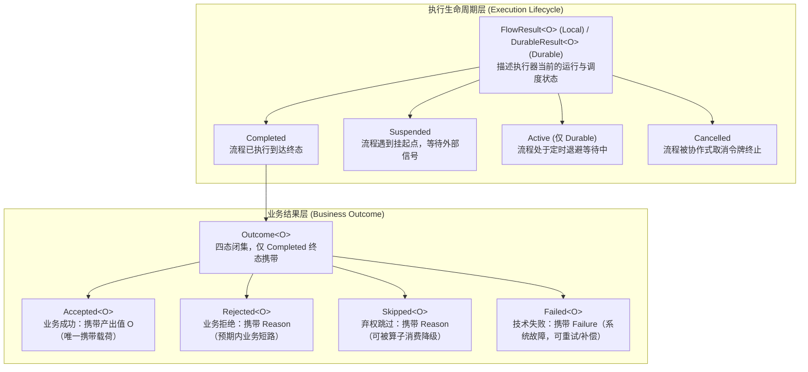
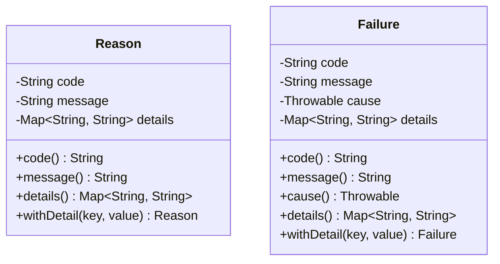

# 四态业务结果与生命周期模型

在现代复杂的企业级业务系统（如交易履约、支付结算、风控拦截、审批工单等）中，传统编程模型常常将“业务拒绝”、“弃权跳过”、“技术异常”与“正常成功”混淆在 `boolean`、`null`、`Optional` 或未受检异常中。这种做法存在显著弊端：
- **语义混淆与信息丢失**：`false` 或 `null` 无法表达“因何被拒”或“跳过原因”；
- **异常泛滥与性能损耗**：用业务异常承载正常分支会导致高昂的堆栈生成开销，且极易被上层 `catch (Exception e)` 意外吞噬；
- **类型不安全**：编译器无法约束只有成功状态才能提取产出值，运行时空指针异常频发；
- **生命周期割裂**：无法在统一模型中协调“内存同步执行”、“异步挂起等待外部信号”与“持久化断点续跑”。

`team4u-flow` 提出了**业务四态代数类型（`Outcome<T>`）**与**执行生命周期（`FlowResult<O>` / `DurableResult<O>`）**严格分层的架构模型。本文将深入剖析该模型的设计原理、代数操作、契约约束与底层实现。

---

## 核心分层架构

框架将一次流程的运行结果严格划分为**业务结果层**与**执行生命周期层**两套正交体系：



### 职责边界解耦
- **业务结果层（`Outcome<T>`）**：回答“**业务逻辑达成了何种业务结论**”。由业务步骤（`Operation`）、路由规则或治理策略产生；
- **执行生命周期层（`FlowResult` / `DurableResult`）**：回答“**当前执行处于何种运行与调度状态**”。由执行器引擎（`SerialMachine` / `DurableMachine`）管理。

> [!IMPORTANT]
> 只有当执行生命周期处于 `Completed` 时，才携带业务 `Outcome`；若流程处于 `Suspended`（挂起等待）或 `Cancelled`（已取消），流程尚未产出最终业务结论，因此不持有业务 `Outcome`。

---

## Outcome 四态代数类型

`Outcome<T>` 在 Java 中被设计为包级私有构造器的封闭抽象类（Sealed Class 语义，禁止外部非法继承扩展），包含且仅包含四种子类：

| 状态类型 | 对应子类 | 携带载荷 | 语义定义 | 典型业务场景 | 框架默认行为 |
| :--- | :--- | :--- | :--- | :--- | :--- |
| **Accepted** | `Outcome.Accepted<T>` | `T value`（非 null） | **业务成功**：节点顺利完成并产出符合预期的业务数据。**四态中唯一携带输出值的状态**。 | 订单创建成功、支付扣款成功、优惠计算完毕 | 驱动后置节点继续推进 |
| **Rejected** | `Outcome.Rejected<T>` | `Reason reason`（非 null） | **业务拒绝**：业务规则校验不通过或被风控拒绝。属于预期内的业务分支，**不属于系统故障**。 | 黑名单拦截、余额不足、账户被冻结、参数校验失败 | 终止序列并向外透传，**不触发重试与技术补偿** |
| **Skipped** | `Outcome.Skipped<T>` | `Reason reason`（非 null） | **弃权跳过**：当前节点对于输入不适用或主动弃权。支持被外层算子消费以尝试后续分支。 | 用户未提供优惠券、非首单跳过新人礼包、无适用路由分支 | 终止序列；可在 `thenOptional` / `firstApplicable` 边界被捕获消费 |
| **Failed** | `Outcome.Failed<T>` | `Failure failure`（非 null） | **技术失败**：系统故障、RPC 超时、未受检异常或不可恢复错误。 | 数据库连接超时、下游网关 502、线程池耗尽、序列化失败 | 终止序列；可触发 `retry` 重试或 `recoverWith` 补偿分支 |

---

## Reason 与 Failure 诊断值对象

为了保证分布式调用、日志追踪与链路可观测性的一致性，框架设计了两个不可变的诊断值对象：



### `Reason`：领域业务原因（用于 `Rejected` 与 `Skipped`）

`Reason` 代表业务预期的判定理由，不包含技术异常堆栈：

```java
import com.team4u.framework.flow.model.Reason;

// 1. 基础构建：指定稳定错误码与可读描述
Reason r1 = Reason.of("INSUFFICIENT_BALANCE", "账户余额不足");

// 2. 链式追加诊断详情键值对（生成新不可变实例）
Reason r2 = Reason.of("DAILY_LIMIT_EXCEEDED", "超出单日转账限额")
        .withDetail("currentLimit", "50000")
        .withDetail("requestedAmount", "80000");

String code = r2.code();                    // "DAILY_LIMIT_EXCEEDED"
String message = r2.message();              // "超出单日转账限额"
Map<String, String> details = r2.details(); // {"currentLimit": "50000", ...}
```

### `Failure`：系统故障诊断（用于 `Failed`）

`Failure` 代表技术故障与系统异常，支持绑定底层根因异常 `Throwable`：

```java
import com.team4u.framework.flow.model.Failure;

// 1. 基础构建
Failure f1 = Failure.of("RPC_TIMEOUT", "支付网关响应超时");

// 2. 绑定底层根因异常与网络元数据
try {
    invokeRemoteService();
} catch (Exception e) {
    Failure f2 = Failure.of("INVOCATION_ERROR", e.getMessage(), e)
            .withDetail("remoteIp", "10.0.12.34")
            .withDetail("timeoutMs", "3000");
    
    Throwable cause = f2.cause(); // 获取原始异常
}
```

---

## Outcome 代数操作与映射法则

`Outcome<T>` 具备严格的函子（Functor）代数性质，支持安全类型转换与函数映射。

### `map` 函子变换

`map` 函数仅对 `Accepted` 状态应用转换器 `Function<? super T, ? extends R>`；若当前状态为 `Rejected`、`Skipped` 或 `Failed`，则安全转换泛型签名并**原样透传其内部的诊断对象**：

$$\text{map}(f, \text{Accepted}(v)) = \text{Accepted}(f(v))$$
$$\text{map}(f, \text{Rejected}(r)) = \text{Rejected}(r)$$
$$\text{map}(f, \text{Skipped}(r)) = \text{Skipped}(r)$$
$$\text{map}(f, \text{Failed}(f)) = \text{Failed}(f)$$

```java
Outcome<String> accepted = Outcome.accepted("12345");
Outcome<Integer> lengthOutcome = accepted.map(String::length); // Accepted(5)

Outcome<String> rejected = Outcome.rejected(Reason.of("ERR", "业务拒绝"));
Outcome<Integer> mappedReject = rejected.map(String::length);  // Rejected(ERR, "业务拒绝")
```

### 模式匹配与状态消费

框架提供了 `kind()` 枚举方法以及传统的 `instanceof` 类型守卫，支持安全且完备的模式匹配：

```java
Outcome<Receipt> outcome = ...;

// 方式 A：通过 kind() 枚举分支
switch (outcome.kind()) {
    case ACCEPTED:
        Receipt receipt = ((Outcome.Accepted<Receipt>) outcome).value();
        handleSuccess(receipt);
        break;
    case REJECTED:
        Reason reason = ((Outcome.Rejected<Receipt>) outcome).reason();
        log.warn("业务拒绝: [{}] {}", reason.code(), reason.message());
        break;
    case SKIPPED:
        Reason skipReason = ((Outcome.Skipped<Receipt>) outcome).reason();
        log.info("节点弃权: [{}] {}", skipReason.code(), skipReason.message());
        break;
    case FAILED:
        Failure failure = ((Outcome.Failed<Receipt>) outcome).failure();
        log.error("系统故障: [{}] {}", failure.code(), failure.message(), failure.cause());
        break;
}
```

---

## 执行生命周期模型

### Local 执行生命周期：`FlowResult<O>`

Local 同步执行器产出 `FlowResult<O>`，它是一个三态闭集：

```java
public abstract class FlowResult<O> {
    // 1. 正常执行到达终点，持有业务 Outcome（Accepted / Rejected / Skipped / Failed）
    public static final class Completed<O> extends FlowResult<O> {
        public Outcome<O> outcome();
    }

    // 2. 流程触发挂起点，持有单次消费句柄 Suspension
    public static final class Suspended<O> extends FlowResult<O> {
        public Suspension<O> suspension();
    }

    // 3. 流程被协作式令牌取消
    public static final class Cancelled<O> extends FlowResult<O> {
        public String executionId();
    }
}
```

### Durable 持久化生命周期：`DurableResult<O>`

Durable 执行器产出 `DurableResult<O>`，它是一个四态闭集：

```java
public abstract class DurableResult<O> {
    // 1. 执行完成，携带 Outcome 与最终快照
    public static final class Completed<O> extends DurableResult<O> {
        public Outcome<O> outcome();
        public DurableSnapshot snapshot();
    }

    // 2. 挂起中，携带挂起点名称与快照
    public static final class Suspended<O> extends DurableResult<O> {
        public String resumePoint();
        public DurableSnapshot snapshot();
    }

    // 3. 定时退避中，携带计划唤醒时刻与快照
    public static final class Active<O> extends DurableResult<O> {
        public Optional<Instant> wakeAt();
        public DurableSnapshot snapshot();
    }

    // 4. 流程已取消，携带取消快照
    public static final class Cancelled<O> extends DurableResult<O> {
        public DurableSnapshot snapshot();
    }
}
```

---

## `requireAccepted()` 严格解包契约

为了简化纯成功路径的流式处理，`FlowResult` 与 `DurableResult` 均提供了 `requireAccepted()` 便捷方法：

```java
FlowResult<Receipt> result = executable.run(request);

// 仅当 result 是 Completed 且内部 outcome 是 Accepted 时返回非 null 值
// 否则立即抛出 IllegalStateException 并附带具体原因描述
Receipt receipt = result.requireAccepted();
```

### 解包失败异常映射表

| 当前结果状态 | `requireAccepted()` 抛出的异常消息示例 |
| :--- | :--- |
| `Completed(Rejected)` | `IllegalStateException: Flow completed with Rejected: INVALID_AMOUNT - 金额必须为正` |
| `Completed(Skipped)` | `IllegalStateException: Flow completed with Skipped: NO_ROUTE - 未匹配到路由` |
| `Completed(Failed)` | `IllegalStateException: Flow completed with Failed: RPC_TIMEOUT - 支付网关超时` |
| `Suspended` | `IllegalStateException: Flow is suspended at point: managerApproval` |
| `Cancelled` | `IllegalStateException: Flow execution was cancelled: exec-1001` |
| `Active (Durable)` | `IllegalStateException: Flow is active and waiting for backoff wake` |

> [!TIP]
> - 在单元测试与确定性成功的链路上，使用 `requireAccepted()` 可以大幅简化代码；
> - 在生产业务控制层，若流程包含正常风控拦截或多渠道降级，建议显式进行 `instanceof` 分类处理，避免依赖异常做控制流。

---

## 关联章节与进一步阅读

- 深入了解四态在流水线、路由与降级中的流转规则：[四态传播规则与消费机制](flow-propagation.md)
- 了解 8 种运行时节点如何处理四态：[运行时节点与 DSL 编排原语](flow-nodes.md)
- 了解 Local 挂起句柄与协作取消：[挂起续接与协作式取消合同](flow-suspend.md)
- 了解单元测试中如何对四态进行流畅断言：[测试支持与测试套件](flow-test.md)
