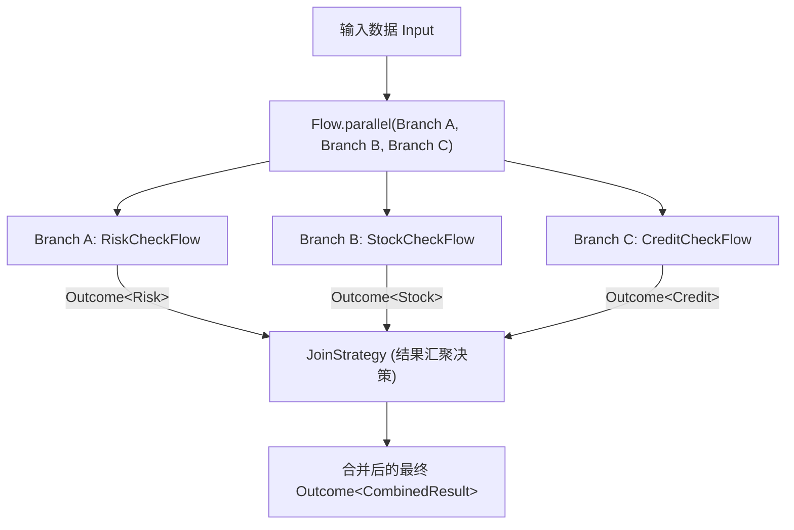
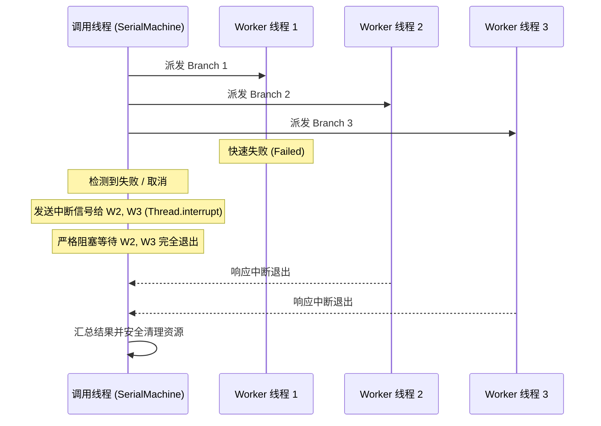

# 并行分支与汇合治理

在分布式业务聚合、并发检查（如风控、征信、库存并行校验）以及跨服务批量并发请求中，`team4u-flow` 提供了强类型、线程安全且具备严格退出合同的并行编排原语。

本文将详细解析 `Flow.parallel` 的声明语法、四大内置汇聚策略、自定义 `JoinStrategy` 模式与数据提取、True Wait-All 退出合同以及 Local 与 Durable 执行器的底层调度差异。

---

## 声明语法与架构模型



### 基础声明示例

```java
import com.team4u.framework.flow.Flow;
import com.team4u.framework.flow.api.Branch;
import com.team4u.framework.flow.model.Outcome;

// 1. 定义独立命名的强类型分支（Branch）
Branch<Order, RiskResult> riskBranch = Branch.of("riskBranch", riskFlow);
Branch<Order, StockResult> stockBranch = Branch.of("stockBranch", stockFlow);

// 2. 编排并行块并挂载汇聚策略
Flow<Order, CombinedReport> parallelFlow = Flow.<Order>parallel(riskBranch, stockBranch)
        .join(results -> {
            // results.outcome(branch) 返回该分支的四态结果 Outcome<T>
            Outcome<RiskResult> riskOutcome = results.outcome(riskBranch);
            Outcome<StockResult> stockOutcome = results.outcome(stockBranch);
            if (!(riskOutcome instanceof Outcome.Accepted)
                    || !(stockOutcome instanceof Outcome.Accepted)) {
                // 存在非成功分支，原样透传首个非成功结果交由上层处理
                return riskOutcome instanceof Outcome.Accepted
                        ? stockOutcome.map(ignored -> null)
                        : riskOutcome.map(ignored -> null);
            }
            RiskResult risk = ((Outcome.Accepted<RiskResult>) riskOutcome).value();
            StockResult stock = ((Outcome.Accepted<StockResult>) stockOutcome).value();
            return Outcome.accepted(new CombinedReport(risk, stock));
        });
```

---

## 内置汇聚策略与 Joins 工具类

框架在 `Joins` 工具类与 `ParallelResults` 中内置了四种开箱即用的高频汇聚策略：

| 汇聚策略 | Java 调用方式 | DSL 调用方式 | 成功判定规则 | 失败/弃权处理 |
| :--- | :--- | :--- | :--- | :--- |
| **全量成功** | `Joins.all()` | `join all` | 全部分支均为 `Accepted` 时返回包含所有分支结果的 `ParallelResults.Values` | 若有任意分支非 Accepted，按声明顺序返回首个非 Accepted 状态 |
| **首选成功** | `Joins.first()` | `join first` | 按声明顺序返回首个 `Accepted` 分支的输出值 | 若全部分支均未 Accepted，返回 `Skipped(NO_APPLICABLE_BRANCH)` |
| **法定票数仲裁** | `Joins.quorum(n)` | `join quorum <n>` | 达到或超过法定门槛 $n$ 个 `Accepted` 时即为成功并返回成功列表 | 若成功分支数不足 $n$，返回 `Failed(QUORUM_NOT_REACHED)` |
| **同质结果收集** | `Joins.collect()` | `join collect` | 同质类型分支全为 Accepted 时收集为 `List<T>` | 若有任意分支非 Accepted，返回首个非 Accepted 状态 |

### 全成功汇聚

```java
Flow<Order, ParallelResults.Values> allCheckFlow = Flow.<Order>parallel(branchA, branchB, branchC)
        .join(Joins.all());
```

### 法定票数仲裁

在多节点分布式投票、多渠道并发比价中：

```java
// 5 个询价节点中，至少需要 3 个节点返回有效报价
Flow<QuoteRequest, List<Price>> quorumFlow = Flow.<QuoteRequest>parallel(b1, b2, b3, b4, b5)
        .join(Joins.quorum(3));
```

### 上下文保序并行填充

各并行分支必须将父级输入视为只读。针对大上下文对象的多数据源并发丰富场景，`Flow.parallelFill` 原生支持以流水线方式声明各个计算分支，并在全部成功后将变动保序合并回主上下文：

```java
Flow<OrderContext, OrderContext> enrichedFlow = Flow.<OrderContext>identity()
        .parallelFill()
        .fork(OrderContext::getUserId, fetchUserOp, (ctx, user) -> { ctx.setUser(user); return ctx; })
        .fork(OrderContext::getAmount, fetchPromotionOp, (ctx, promo) -> { ctx.setPromo(promo); return ctx; })
        .timeout(Duration.ofSeconds(2))
        .build();
```

> [!NOTE]
> **合并函数契约约束**：各分支的合并函数（`merge`）应当保持纯粹的确定性计算且重放安全，严禁执行发送外部消息或写入外部存储等副作用操作；注意当后置合并函数发生异常时，流程虽返回 Failed 失败状态，但无法提供跨属性的事务性回滚保证。

---

## 自定义汇聚策略与分支数据提取指南

很多开发者在编写自定义 `JoinStrategy` 时容易困惑：**“`ParallelResults` 里究竟能拿到什么？各个分支成功、跳过或失败时该怎么安全解包？”**

### 核心解包方法与 API

`ParallelResults` 提供按分支令牌提取结果的核心方法：

```java
// 按分支令牌检索该分支的四态结果（类型安全）
Outcome<T> outcome = results.outcome(Branch<I, T> branch);

// allAccepted() 成功后，可通过 Values 查找表按令牌取具体输出值
ParallelResults.Values values = results.allAccepted().map(v -> v).value();
T value = values.get(branch); // 仅 Accepted 分支存在
```

> [!IMPORTANT]
> **关键认知**：`results.outcome(branch)` 返回的不是原始数据 `T`，而是 **`Outcome<T>`** ！
> 因为在并发执行中，某个分支可能成功（`Accepted`）、被风控拒绝（`Rejected`）、因不适用而弃权（`Skipped`）或抛出异常（`Failed`）。
> 若传入不属于本并行块的令牌，将抛出 `IllegalArgumentException`；若需要直接解包成功值，
> 可在流程最终结果上调用 `FlowResult.requireAccepted()` / `DurableResult.requireAccepted()`。

### 生产实战：多分支异构结果强弱依赖智能合并

以下是一个生产级订单结算聚合示例：
- **风控分支（`riskBranch`）**：强依赖。被拒或报错立即阻断；
- **库存分支（`stockBranch`）**：强依赖。必须成功；
- **优惠券分支（`couponBranch`）**：弱依赖。若用户无可用优惠券（返回 `Skipped`），降级为使用 0 元优惠，绝不阻断结算：

```java
Branch<Order, RiskResult> riskBranch = Branch.of("risk", riskFlow);
Branch<Order, StockResult> stockBranch = Branch.of("stock", stockFlow);
Branch<Order, CouponDiscount> couponBranch = Branch.of("coupon", couponFlow);

Flow<Order, CheckoutView> checkoutFlow = Flow.<Order>parallel(riskBranch, stockBranch, couponBranch)
        .join(results -> {
            // 1. 强依赖校验：风控必须通过
            Outcome<RiskResult> riskOutcome = results.outcome(riskBranch);
            if (!(riskOutcome instanceof Outcome.Accepted)) {
                // 阻断：原样透传风控被拒或失败信息
                return riskOutcome.map(ignored -> null);
            }
            RiskResult risk = ((Outcome.Accepted<RiskResult>) riskOutcome).value();

            // 2. 强依赖校验：库存扣减必须成功
            Outcome<StockResult> stockOutcome = results.outcome(stockBranch);
            if (!(stockOutcome instanceof Outcome.Accepted)) {
                return stockOutcome.map(ignored -> null);
            }
            StockResult stock = ((Outcome.Accepted<StockResult>) stockOutcome).value();

            // 3. 弱依赖降级：优惠券核销（若 Skipped 则降级为 0 折扣）
            Outcome<CouponDiscount> couponOutcome = results.outcome(couponBranch);
            CouponDiscount discount = (couponOutcome instanceof Outcome.Accepted)
                    ? ((Outcome.Accepted<CouponDiscount>) couponOutcome).value()
                    : CouponDiscount.zero(); // 降级默认值

            // 4. 组装最终结算视图
            return Outcome.accepted(new CheckoutView(risk, stock, discount));
        });
```

---

## True Wait-All 退出合同与悬挂线程防御

在多线程并发执行时，最隐蔽且危险的生产隐患之一是“主线程因某分支快速失败而提前退出，后台残留的悬挂线程继续读写资源导致脏数据或连接池泄露”。

`team4u-flow` 严格恪守 **True Wait-All 合同**：



1. **绝对不泄漏后台线程**：即使某个分支提前抛出异常或流程被外部 `Cancellation` 取消，框架调度器**必定等待所有已启动分支的工作线程完全执行完毕或响应中断退出后**，方才解除阻塞返回；
2. **取消绕过 Join 逻辑**：若流程在并行执行期间被外部取消，框架直接流向 `FlowResult.Cancelled`，**绝不会调用 `JoinStrategy`** ，避免在取消状态下产生脏数据。

---

## 编译期静态约束规则

在流程编译阶段（`Compiler.compile`），框架对 `parallel` 施加了严格的静态拓扑校验：

1. **禁止分支内 `await`（`PARALLEL_AWAIT`）**：
   并行分支内部严禁声明挂起点 `await`。因为并行分支的多实例异步恢复会打破状态机的单线推进因果律；
2. **禁止分支内 `persistentPolicy`（`PARALLEL_PERSISTENT_POLICY`）**：
   并行分支内部禁止挂载持久化策略；
3. **分支标识全局唯一（`DUPLICATE_BRANCH`）**：
   同一 `parallel` 内的各个 `Branch` 名称必须全局唯一。

---

## Local 与 Durable 执行器差异

| 维度 | Local 执行器 (`team4u-flow`) | Durable 执行器 (`team4u-flow-durable`) |
| :--- | :--- | :--- |
| **并发执行机制** | **真实多线程并发**（通过 Worker 线程池并发派发） | **按声明顺序串行驱动** |
| **架构设计考量** | 追求单机极速并发、低延迟与高吞吐 | 避免多个并发分支在写入持久化快照时引发 CAS 乐观锁冲突风暴 |
| **汇合裁决语义** | 100% 相同的 `JoinStrategy` 决策逻辑 | 100% 相同的 `JoinStrategy` 决策逻辑 |
| **断点恢复能力** | 纯内存生命周期 | 支持各分支在崩溃后从快照槽位顺序恢复 |

---

## 关联章节与进一步阅读

- 了解 Local 执行器的线程池隔离与死锁防御：[Local 线程模型与死锁防御机制](flow-threading.md)
- 了解并发测试同步屏障 `ParallelBarrier`：[测试支持与测试套件](flow-test.md)
- 了解协作式取消令牌与中断传递：[挂起续接与协作式取消合同](flow-suspend.md)
- 了解 Spring 容器中如何并发执行 Bean 步骤：[Bean 容器集成与 Spring 治理](flow-bean.md)
