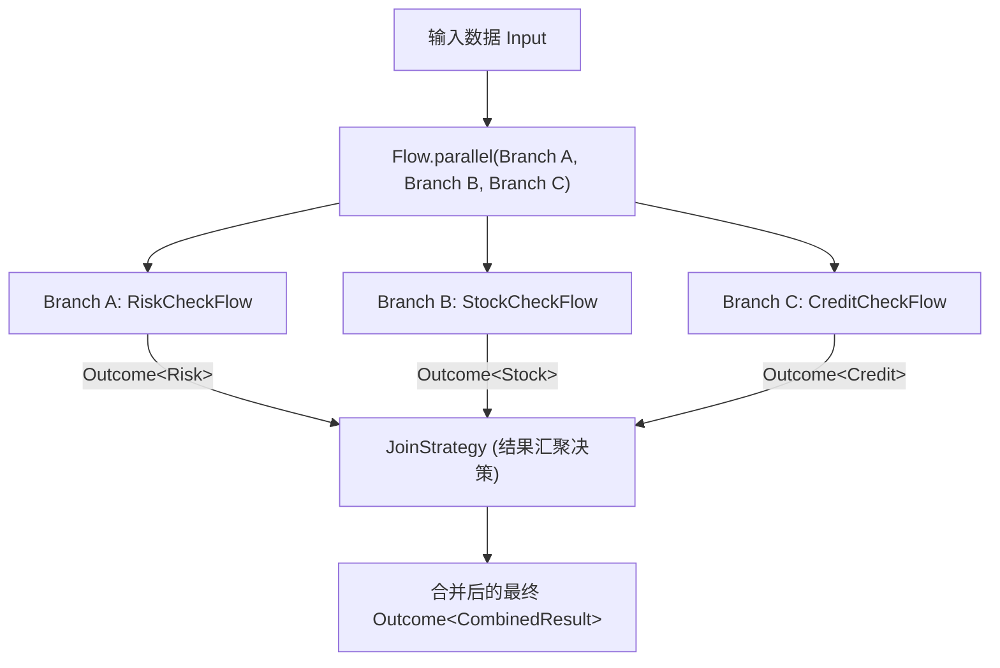
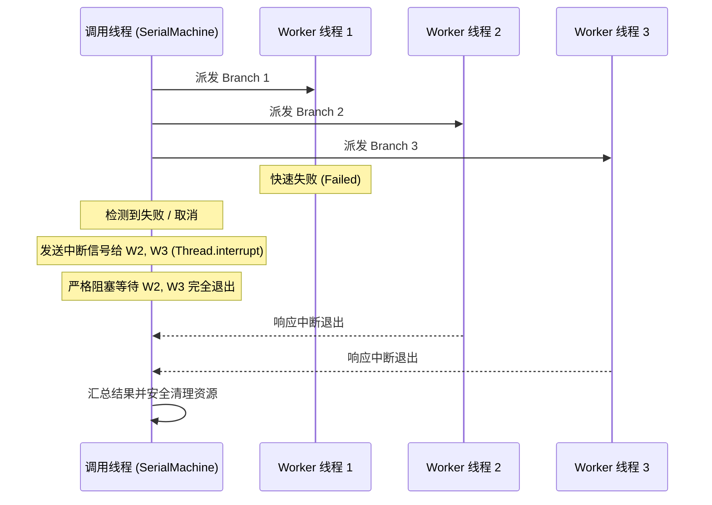

# 并行分支与汇合治理

在分布式业务聚合、并发检查（如风控、征信、库存并行校验）以及跨服务批量并发请求中，`team4u-flow` 提供了强类型、线程安全且具备严格退出合同的并行编排原语。

本文将详细解析 `Flow.parallel` 的声明语法、四大内置汇聚策略、自定义 `JoinStrategy` 模式、True Wait-All 退出合同以及 Local 与 Durable 执行器的底层调度差异。

---

## 声明语法与架构模型



### 基础声明示例

```java
import com.team4u.framework.flow.Flow;
import com.team4u.framework.flow.api.Branch;
import com.team4u.framework.flow.model.Outcome;

// 1. 定义独立命名的类型化分支（Branch）
Branch<Order, RiskResult> riskBranch = Branch.of("riskBranch", riskFlow);
Branch<Order, StockResult> stockBranch = Branch.of("stockBranch", stockFlow);

// 2. 编排并行块并挂载汇聚策略
Flow<Order, CombinedReport> parallelFlow = Flow.<Order>parallel(riskBranch, stockBranch)
        .join(results -> {
            RiskResult risk = results.get(riskBranch).requireAccepted();
            StockResult stock = results.get(stockBranch).requireAccepted();
            return Outcome.accepted(new CombinedReport(risk, stock));
        });
```

---

## 四大内置汇聚策略 (`JoinStrategy`)

框架在 `ParallelResults` 中内置了四种开箱即用的高频汇聚策略：

| 汇聚策略 | 调用方式 | 成功判定规则 | 失败/弃权处理 |
| :--- | :--- | :--- | :--- |
| **`allAccepted`** | `results.allAccepted()` | 全部分支均为 `Accepted` 时返回包含所有结果的类型安全映射表 | 若有任意分支非 Accepted，按声明顺序返回**首个非 Accepted 状态** |
| **`firstAccepted`** | `results.firstAccepted()` | 按声明顺序返回**首个 `Accepted` 分支**的输出值 | 若全部分支均未 Accepted，返回 `Skipped(NO_APPLICABLE_BRANCH)` |
| **`quorum(n)`** | `results.quorum(n)` | 达到或超过法定门槛 $n$ 个 `Accepted` 时即为成功 | 若成功分支数不足 $n$，返回 `Failed(QUORUM_NOT_REACHED)` |
| **`homogeneousCollect`** | `results.homogeneousCollect()` | 同质类型分支全为 Accepted 时收集为 `List<T>` | 若有任意分支非 Accepted，返回首个非 Accepted 状态 |

### 示例 1：全成功校验 (`allAccepted`)

```java
Flow<Order, Boolean> allCheckFlow = Flow.<Order>parallel(branchA, branchB, branchC)
        .join(results -> results.allAccepted()
                .map(map -> true)); // 全成功时产出 true，否则原样透传首个非成功分支的 Outcome
```

### 示例 2：法定票数仲裁 (`quorum`)

在多节点分布式投票、多渠道并发比价中：

```java
// 5 个询价节点中，至少需要 3 个节点返回有效报价
Flow<QuoteRequest, PriceSummary> quorumFlow = Flow.<QuoteRequest>parallel(b1, b2, b3, b4, b5)
        .join(results -> results.quorum(3)
                .map(validQuotes -> calculateAveragePrice(validQuotes)));
```

---

## 自定义汇聚策略 (`JoinStrategy<O>`)

当内置策略无法满足复杂的业务仲裁逻辑时，可直接实现 `JoinStrategy<O>` 接口：

```java
@FunctionalInterface
public interface JoinStrategy<O> {
    Outcome<O> join(ParallelResults results) throws Exception;
}
```

### 生产实战：强弱依赖隔离合并

在实际业务中，不同并发分支的依赖等级往往不同：
- **风控分支**：强依赖。若风控被拒（`Rejected`）或异常（`Failed`），整体直接阻断；
- **推荐分支**：弱依赖。若推荐失败或超时跳过，使用默认兜底推荐降级，绝不影响主干流程：

```java
public class CheckoutJoinStrategy implements JoinStrategy<CheckoutView> {
    private final Branch<Order, RiskResult> riskBranch;
    private final Branch<Order, RecommendResult> recoBranch;

    public CheckoutJoinStrategy(Branch<Order, RiskResult> riskBranch, Branch<Order, RecommendResult> recoBranch) {
        this.riskBranch = riskBranch;
        this.recoBranch = recoBranch;
    }

    @Override
    public Outcome<CheckoutView> join(ParallelResults results) {
        Outcome<RiskResult> riskOutcome = results.get(riskBranch);
        if (riskOutcome.kind() != Outcome.Kind.ACCEPTED) {
            // 强依赖非成功：直接向外透传，阻断结算
            return riskOutcome.map(ignored -> null);
        }

        Outcome<RecommendResult> recoOutcome = results.get(recoBranch);
        RecommendResult reco = (recoOutcome instanceof Outcome.Accepted)
                ? ((Outcome.Accepted<RecommendResult>) recoOutcome).value()
                : RecommendResult.defaultRecommendations(); // 弱依赖降级

        return Outcome.accepted(new CheckoutView(riskOutcome.requireAccepted(), reco));
    }
}
```

---

## True Wait-All 退出合同与悬挂线程防御

在多线程并发执行时，最隐蔽且危险的生产隐患之一是“主线程因某分支快速失败而提前退出，后台残留的悬挂线程继续读写资源导致脏数据或连接池泄露”。

`team4u-flow` 严格恪守 **True Wait-All 合同**：



1. **绝对不泄漏后台线程**：即使某个分支提前抛出异常或流程被外部 `Cancellation` 取消，框架调度器**必定等待所有已启动分支的工作线程完全执行完毕或响应中断退出后**，方才解除阻塞返回；
2. **取消绕过 Join 逻辑**：若流程在并行执行期间被外部取消，框架直接流向 `FlowResult.Cancelled`，**绝不会调用 `JoinStrategy`**，避免在取消状态下产生脏数据。

---

## 编译期静态约束规则

在流程编译阶段（`Compiler.compile`），框架对 `parallel` 施加了严格的静态拓扑校验：

1. **禁止分支内 `await`（`PARALLEL_AWAIT`）**：
   并行分支内部严禁声明挂起点 `await`。因为并行分支的多实例异步恢复会打破状态机的单线推进因果律；
2. **禁止分支内 `persistentPolicy`（`PARALLEL_PERSISTENT_POLICY`）**：
   并行分支内部禁止挂载持久化策略；
3. **分支标识全局唯一（`DUPLICATE_BRANCH`）**：
   同一 `parallel` 内的各个 `Branch` 名称必须全局唯一。

---

## Local 与 Durable 执行器差异

| 维度 | Local 执行器 (`team4u-flow`) | Durable 执行器 (`team4u-flow-durable`) |
| :--- | :--- | :--- |
| **并发执行机制** | **真实多线程并发**（通过 Worker 线程池并发派发） | **按声明顺序串行驱动** |
| **架构设计考量** | 追求单机极速并发、低延迟与高吞吐 | 避免多个并发分支在写入持久化快照时引发 CAS 乐观锁冲突风暴 |
| **汇合裁决语义** | 100% 相同的 `JoinStrategy` 决策逻辑 | 100% 相同的 `JoinStrategy` 决策逻辑 |
| **断点恢复能力** | 纯内存生命周期 | 支持各分支在崩溃后从快照槽位顺序恢复 |

---

## 关联章节与进一步阅读

- 了解 Local 执行器的线程池隔离与死锁防御：[Local 线程模型与死锁防御机制](flow-threading.md)
- 了解并发测试同步屏障 `ParallelBarrier`：[测试支持与测试套件](flow-test.md)
- 了解协作式取消令牌与中断传递：[挂起续接与协作式取消合同](flow-suspend.md)
- 了解 Spring 容器中如何并发执行 Bean 步骤：[Bean 容器集成与 Spring 治理](flow-bean.md)
