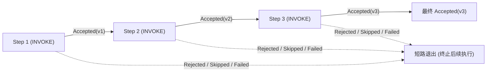
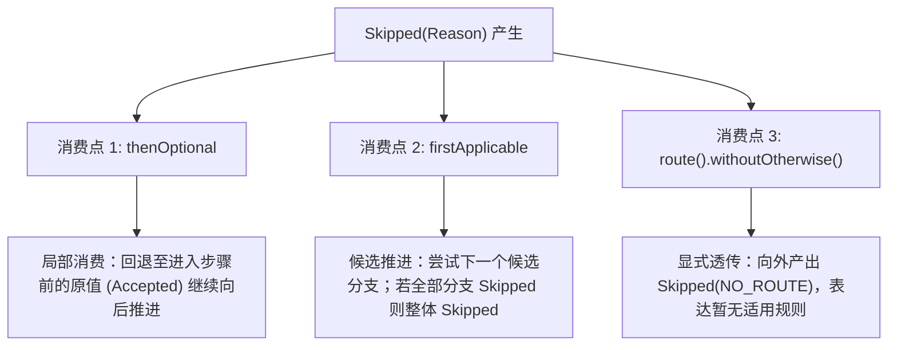
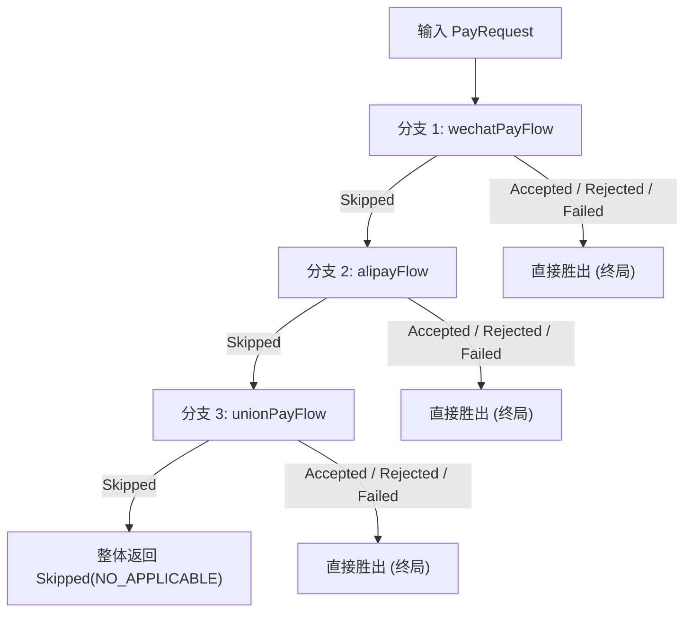
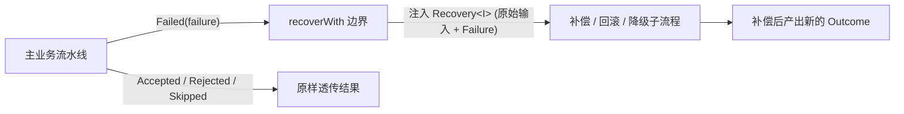

# 四态传播规则与消费机制

在 `team4u-flow` 中，业务四态（`Accepted`、`Rejected`、`Skipped`、`Failed`）拥有严格、确定的代数流转与短路规则。不同的编排算子对待这四种状态具有明确的边界契约。

本文将深入解析流水线短路传播、`Skipped` 弃权的三大消费机制、`Failed` 故障恢复补偿、`Recovery<I>` 数据模型与生产补偿实战，以及框架内置的异常收敛安全网。

---

## 传播规则总表

下表汇总了所有编排算子对四态的处理行为：

| 编排算子 | Accepted | Rejected | Skipped | Failed |
| :--- | :--- | :--- | :--- | :--- |
| **`then` (顺序流水线)** | **驱动推进**：输出作为后置节点输入 | **短路**：立即终止当前序列，逐层向外透传 | **短路**：立即终止当前序列，逐层向外透传 | **短路**：立即终止当前序列，逐层向外透传 |
| **`thenOptional` (可选步骤)** | **更新推进**：以新值继续后续步骤 | **短路**：向外透传 | **消费**：回退至**进入步骤前的原值**并转为 Accepted 推进 | **短路**：向外透传 |
| **`firstApplicable` (候选降级)** | **胜出**：作为整体结果并终止后续尝试 | **胜出**：作为整体结果并终止后续尝试（业务拒绝即终局） | **推进**：消费弃权，尝试下一候选分支 | **胜出**：作为整体结果并终止后续尝试（故障需显式处理） |
| **`recoverWith` (失败恢复)** | **透传**：原样向后透传 | **透传**：原样向后透传 | **透传**：原样向后透传 | **消费**：进入恢复分支，输入为 `Recovery<I>` |
| **`route` (条件路由)** | 路由命中：执行选中分支<br/>未命中且无 otherwise：整体产出 `Skipped(NO_ROUTE)` | 路由选择器若产出非 Accepted，短路终止 | 路由选择器若产出非 Accepted，短路终止 | 路由选择器若产出非 Accepted，短路终止 |
| **`parallel` (并行汇合)** | 收集全部分支结果，等待全部退出后由 `JoinStrategy` 统一合并决策 | 收集全部分支结果，由 `JoinStrategy` 统一合并决策 | 收集全部分支结果，由 `JoinStrategy` 统一合并决策 | 收集全部分支结果，由 `JoinStrategy` 统一合并决策 |

---

## 1. `then` 顺序流转与短路机制

顺序流水线（`Sequence`）采用**“仅 Accepted 推进”**的严格规则：



```java
Flow<OrderRequest, Receipt> pipeline = Flow.step(validateOrderOp)   // 若 Rejected，后续直接跳过
        .then(deductStockOp)     // 若 Failed，后续直接跳过
        .then(chargePaymentOp)   // 若 Accepted，产生最终 Receipt
        .then(sendNotificationOp);
```

### 内核执行与短路行为
1. **严格无副作用**：只要前置节点返回非 `Accepted`（无论是 `Rejected`、`Skipped` 还是 `Failed`），当前序列立即短路，**绝对不会调用后续节点的业务方法**；
2. **栈帧向上归约（Stack Reduction）**：当子节点产生非 `Accepted` 结果时，执行引擎直接弹出该子帧，父 `Sequence` 节点识别到非推进状态，不分配下一个子步骤，直接将该 `Outcome` 向上冒泡；
3. **元数据保留**：被短路的结果完整保留原有的 `Reason` 或 `Failure` 诊断信息，不发生任何信息退化。

---

## 2. `Skipped` 弃权的三大消费机制

`Skipped` 表示“当前节点或分支不适用于当前输入”。它是四态中**唯一可以在框架内部被算子捕获并消费**的状态。框架定义了三个标准的消费边界：



### 消费点 1：`thenOptional`（可选步骤增强）

用于非必填属性计算、可选优惠券核销、会员权益增强等场景：

```java
Flow<Order, Order> flow = Flow.<Order>identity()
        .thenOptional(applyCouponOp)  // 无优惠券时返回 Skipped("NO_COUPON")
        .then(calculateTaxOp);
```

#### 底层编译与 AST 展开
`thenOptional` 在 DSL 构建阶段复用了 `Fallback` 与 `Identity` 原语：

```java
flow.thenOptional(next);

// 其底层逻辑展开等价于：
flow.then(Flow.firstApplicable(next, Flow.identity()));
```

#### 执行与回退语义
- **Accepted 推进**：当 `applyCouponOp` 返回 `Accepted(discountedOrder)` 时，以折扣后的新订单继续推进给 `calculateTaxOp`；
- **Skipped 消费回退**：当 `applyCouponOp` 返回 `Skipped` 时，Fallback 算子捕获该弃权信号，并选择 Identity 分支——**将进入该步骤前的原始 `order` 对象重新包装为 `Accepted(order)` 推进给后续节点**；
- **Rejected / Failed 短路**：若 `applyCouponOp` 返回 `Rejected`（如优惠券已被冻结）或 `Failed`（RPC 超时），则严格短路，不发生回退；
- **类型不变性约束（Type Invariance）**：`thenOptional` 仅接受同类型转换 `Operation<O, O>` 或 `Flow<O, O>`。若步骤签名是跨类型的 `Operation<A, B>`，弃权时无法凭空构造出类型为 `B` 的对象，因此编译器在编译期直接报错拦截。

---

### 消费点 2：`firstApplicable`（候选降级链）

用于多通道轮询、多级缓存查询、首选与备用网关切换：

```java
Flow<PayRequest, PayResponse> smartPay = Flow.firstApplicable(
        wechatPayFlow,   // 若不可用/不支持返回 Skipped
        alipayFlow,      // 若不可用/不支持返回 Skipped
        unionPayFlow     // 兜底通道
);
```



#### 流转语义契约
1. **首个非 Skipped 胜出**：依次执行各个候选分支；只要某分支返回 `Accepted`、`Rejected` 或 `Failed`，该结果即被视为最终裁决，立即返回并终止后续候选分支；
2. **弃权推进**：仅当某分支返回 `Skipped` 时，框架才会消费弃权信号并尝试下一个分支；
3. **全弃权兜底**：若所有候选分支全部返回 `Skipped`，则整体结果为最后一个分支的 `Skipped`。

---

### 消费点 3：`route` 未命中显式弃权

在条件路由中，当输入未匹配到任何 `caseOf` 且显式声明了 `withoutOtherwise()` 时：

```java
Flow<Order, String> routed = Flow.route(Order::getCategory)
        .caseOf("FOOD", foodFlow)
        .caseOf("DIGITAL", digitalFlow)
        .withoutOtherwise(); // 未匹配时整体返回 Skipped(NO_ROUTE)
```

- 调用方感知到 `Skipped(NO_ROUTE)`，能够精确区分“业务处理失败”与“系统暂无适用的处理规则”；
- 该 `Skipped` 结果同样可以被外层的 `firstApplicable` 捕获并继续降级。

---

## 3. `Failed` 失败与 `recoverWith` 补偿机制

当节点发生技术故障、RPC 超时或未受检异常时，节点返回 `Outcome.failed(Failure)`。通过 `recoverWith` 可以在 Failed 边界实施补偿、回滚或降级恢复：



### `Recovery<I>` 数据模型与方法详解

在 `recoverWith` 分支中，入参对象为不可变包装类 `Recovery<I>`，提供两个核心方法：

| 方法 | 返回类型 | 说明与用途 |
| :--- | :--- | :--- |
| **`recovery.input()`** | `I` | **进入当前作用域时的原始输入对象**。<br/>让恢复步骤精准知道主分支是在处理哪个业务对象（如 `orderId`、`userId`、请求金额等）时发生失败的，从而能够执行针对性的回滚、库存释放或撤销操作。 |
| **`recovery.failure()`** | `Failure` | **触发失败时的故障诊断对象**。<br/>包含错误码 `code()`、错误消息 `message()`、根因异常 `cause()` 及详细元数据 `details()`，便于恢复逻辑针对不同错误原因采取不同的补偿策略。 |

---

### 生产实战：支付失败后的逆向回滚与降级凭证生成

```java
Flow<OrderRequest, Receipt> paymentWithCompensation = Flow.step(chargePaymentOp)
        // 挂载失败补偿处理
        .recoverWith(Flow.step((context, recovery) -> {
            OrderRequest originalReq = recovery.input();   // 拿到原始订单请求
            Failure failure = recovery.failure();          // 拿到失败原因

            log.error("订单 [{}] 扣款失败: [{} - {}], 启动自动回滚与补偿",
                    originalReq.getOrderId(), failure.code(), failure.message());

            // 1. 根据错误类型实施逆向补偿（如解冻预占额度）
            inventoryService.releaseHold(originalReq.getOrderId());

            // 2. 构造降级业务结果（转为 Accepted 返回给前端展示友好提示）
            Receipt fallbackReceipt = new Receipt(
                    originalReq.getOrderId(), 
                    "PAYMENT_PENDING_RETRY", 
                    "扣款遇阻，已为您锁定库存，请在 15 分钟内重新支付"
            );
            return Outcome.accepted(fallbackReceipt);
        }));
```

### 关键契约与生命周期
1. **非 Failed 原样透传**：若主分支未发生 `Failed`（即正常返回了 `Accepted`、`Rejected` 或 `Skipped`），`recoverWith` 分支完全不执行，原结果直接向外透传；
2. **补偿二次故障**：若补偿分支内部再次发生未捕获异常或返回 `Failed`，则对外输出补偿分支的新 `Failed`；
3. **支持重新抛出失败**：若补偿分支判定该错误不可恢复，可直接执行 `return Outcome.failed(recovery.failure())` 继续向上层冒泡。

---

## 4. 异常安全收敛网

在 `team4u-flow` 中，业务 `Operation` 内部允许自由抛出任何受检或未受检异常：

```java
Operation<String, String> op = (context, input) -> {
    if (input == null) {
        throw new IllegalArgumentException("Input must not be null");
    }
    return Outcome.accepted(input.toUpperCase());
};
```

### 框架异常拦截与收敛机制
1. **内核级异常沙箱**：执行引擎（`SerialMachine` / `DurableMachine`）在调用 `Operation` 时内置了异常拦截网；
2. **统一诊断码收敛**：任何从 `Operation` 中逃逸出来的 `Exception` 会被自动捕获并封装为：
   ```java
   Outcome.failed(Failure.of(FlowDiagnosticCodes.OPERATION_EXCEPTION, e.getMessage(), e))
   ```
3. **Null 安全检查**：若 `Operation` 违规返回了 `null`，框架会将其收敛为 `Failed(OPERATION_EXCEPTION, "Operation outcome must not be null")`；
4. **中断与取消特权传递**：`InterruptedException` 与 `CancellationException` 不会被普通业务异常吞噬，而是被框架转换为标准的中断与取消生命周期事件。

---

## 关联章节与进一步阅读

- 了解四态模型与执行生命周期：[四态业务结果与生命周期模型](flow-outcome.md)
- 了解 8 大运行时节点的执行机制：[运行时节点与 DSL 编排原语](flow-nodes.md)
- 了解重试策略（Retry）与超时控制（Timeout）：[流程治理：Policy 策略、Retry 重试与 Timeout 控制](flow-governance.md)
- 了解完整的诊断码清单：[诊断码体系与故障排查手册](flow-diagnostics.md)
