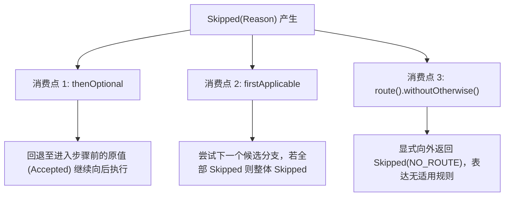

# 四态传播规则与消费机制

在 `team4u-flow` 中，业务四态（`Accepted`、`Rejected`、`Skipped`、`Failed`）定义了明确的代数流转规则。不同的编排算子对待这四种状态具有严格的确定性行为。深入理解四态的传播与消费机制，是编写健壮流程的核心关键。

---

## 传播规则总表

下表汇总了所有编排算子对四态的处理行为：

| 编排算子 | Accepted | Rejected | Skipped | Failed |
| :--- | :--- | :--- | :--- | :--- |
| **`then` (顺序串联)** | **驱动推进**：输出作为后置节点输入 | **短路**：立即终止序列，向外透传 | **短路**：立即终止序列，向外透传 | **短路**：立即终止序列，向外透传 |
| **`thenOptional` (可选步骤)** | **更新推进**：以新值继续后续步骤 | **短路**：向外透传 | **消费**：回退至**进入步骤前的原值**并转为 Accepted 推进 | **短路**：向外透传 |
| **`firstApplicable` (候选降级)** | **胜出**：作为整体结果并终止后续尝试 | **胜出**：作为整体结果并终止后续尝试（业务拒绝即终局） | **推进**：消费弃权，尝试下一候选分支 | **胜出**：作为整体结果并终止后续尝试（故障需显式处理） |
| **`recoverWith` (失败恢复)** | **透传**：原样向后透传 | **透传**：原样向后透传 | **透传**：原样向后透传 | **消费**：进入恢复分支，输入为 `Recovery<I>` |
| **`route` (条件路由)** | 路由命中：执行选中分支<br/>未命中且无 otherwise：整体产出 `Skipped(NO_ROUTE)` | 路由选择器如果产出非 Accepted，短路终止 | 路由选择器如果产出非 Accepted，短路终止 | 路由选择器如果产出非 Accepted，短路终止 |
| **`parallel` (并行汇合)** | 收集所有分支结果，全部完成后由 `JoinStrategy` 统一合并决策 | 收集所有分支结果，由 `JoinStrategy` 统一合并决策 | 收集所有分支结果，由 `JoinStrategy` 统一合并决策 | 收集所有分支结果，由 `JoinStrategy` 统一合并决策 |

---

## `then` 顺序流转与短路

顺序流水线（`Sequence`）采用**“仅 Accepted 推进”**的严格规则：

```mermaid
graph LR
    Step1["Step 1"] -->|Accepted(v1)| Step2["Step 2"]
    Step2 -->|Accepted(v2)| Step3["Step 3"]
    Step1 -.->|Rejected / Skipped / Failed| ShortCircuit["短路退出 (终止后续执行)"]
    Step2 -.->|Rejected / Skipped / Failed| ShortCircuit
```

```java
Flow<OrderRequest, Receipt> pipeline = Flow.step(validateOrderOp)   // 若 Rejected，后续直接跳过
        .then(deductStockOp)     // 若 Failed，后续直接跳过
        .then(chargePaymentOp)   // 若 Accepted，产生最终 Receipt
        .then(sendNotificationOp);
```

- 只要前置节点返回非 `Accepted`（无论是 `Rejected`、`Skipped` 还是 `Failed`），当前序列立即短路，绝不调用后置节点的业务代码；
- 被短路的结果携带其原有的诊断信息（`Reason` 或 `Failure`），完整向外层传播。

---

## `Skipped` 弃权的三大消费机制

`Skipped` 表示“当前节点或分支不适用于当前输入”。它是四态中**唯一可以在框架内部被算子捕获并消费**的状态。框架提供了三种标准的消费位置：



### 1. `thenOptional`：可选属性增强

用于非必填属性计算、可选优惠券应用等场景：

```java
Flow<Order, Order> flow = Flow.<Order>identity()
        .thenOptional(applyCouponOp)  // 无优惠券时返回 Skipped("NO_COUPON")
        .then(calculateTaxOp);
```

**内部机制**：
- 当 `applyCouponOp` 返回 `Skipped` 时，框架自动消费该弃权信号，并回退到进入该步骤前的原始 `order` 对象，将其重新包装为 `Accepted(order)` 继续推进给 `calculateTaxOp`；
- 若 `applyCouponOp` 返回 `Accepted(discountedOrder)`，则以折扣后的新订单继续推进；
- 若 `applyCouponOp` 返回 `Rejected`（如优惠券已被冻结）或 `Failed`（RPC 超时），则严格短路，不发生回退。

> [!NOTE]
> `thenOptional` 仅适用于类型不变的步骤 `Operation<O, O>`。如果步骤签名是跨类型的 `Operation<A, B>`，弃权时无法憑空凭造出类型为 `B` 的对象，因此编译器会直接拒绝非法调用。

### 2. `firstApplicable`：候选降级链

用于多通道轮询、多级缓存查询、首选与备用通道切换：

```java
Flow<PayRequest, PayResponse> smartPay = Flow.firstApplicable(
        wechatPayFlow,   // 若不可用/不支持返回 Skipped
        alipayFlow,      // 若不可用/不支持返回 Skipped
        unionPayFlow     // 兜底通道
);
```

**流转语义**：
- 依次执行各个分支；只要某分支返回 `Accepted`、`Rejected` 或 `Failed`，该结果即被视为最终决策，立即返回并终止后续候选分支；
- 仅当某分支返回 `Skipped` 时，框架才会消费弃权信号并尝试下一个分支；
- 如果所有候选分支全部返回 `Skipped`，则整体结果为最后一个分支（或聚合）的 `Skipped`。

### 3. `route` 未命中显式弃权

在规则路由中，当输入未匹配到任何 `caseOf` 且明确指定了 `withoutOtherwise()`：

```java
Flow<Order, String> routed = Flow.route(Order::getCategory)
        .caseOf("FOOD", foodFlow)
        .caseOf("DIGITAL", digitalFlow)
        .withoutOtherwise(); // 未匹配时整体返回 Skipped(NO_ROUTE)
```

调用方感知到 `Skipped(NO_ROUTE)`，能够精确区分“业务处理失败”与“系统暂无适用的处理规则”。

---

## `Failed` 失败与 `recoverWith` 补偿

当节点发生技术故障或系统异常时，节点返回 `Outcome.failed(Failure)`。通过 `recoverWith` 可以在 Failed 边界实施补偿或降级恢复：

```mermaid
graph LR
    Main["主业务流水线"] -->|Failed(failure)| Rec["recoverWith 边界"]
    Main -->|Accepted / Rejected / Skipped| Out["原样透传结果"]
    Rec -->|"注入 Recovery&lt;I&gt; (原始输入 + Failure)"| Comp["补偿 / 降级流程"]
    Comp --> Final["补偿后产生新的 Outcome"]
```

```java
Flow<OrderRequest, Receipt> robustFlow = Flow.step(chargePaymentOp)
        .recoverWith(Flow.step((context, recovery) -> {
            OrderRequest originalInput = recovery.input();
            Failure cause = recovery.failure();
            log.error("支付失败 [{}], 进入降级工单", cause.code());
            return Outcome.accepted(createManualReviewOrder(originalInput));
        }));
```

**关键语义**：
- `recoverWith` 的入参类型是 `Recovery<I>`，完整封装了**触发失败时的原始输入**与诊断信息 `Failure`；
- 若主分支未发生 `Failed`（即返回了 `Accepted`、`Rejected` 或 `Skipped`），`recoverWith` 分支完全不执行，原结果原样透传；
- 补偿分支内部如果再次失败，则抛出新的 `Failed`。

---

## 异常安全收敛

在 `team4u-flow` 中，业务 `Operation` 内部允许自由抛出任何受检或未受检异常：

```java
Operation<String, String> op = (context, input) -> {
    if (input == null) {
        throw new IllegalArgumentException("Input is null");
    }
    return Outcome.accepted(input.toUpperCase());
};
```

**框架收敛保证**：
- 框架内核在调用 `Operation` 时内置了异常拦截器；
- 任何逃逸出来的 `Exception` 会被自动捕获并封装为 `Outcome.failed(Failure.of(FlowDiagnosticCodes.OPERATION_EXCEPTION, e.getMessage(), e))`；
- 严禁任何业务异常直接破坏调用线程或中断执行器循环，保证了 Local 与 Durable 运行时的绝对健壮。

---

## 关联章节与进一步阅读

- 了解四态模型与执行生命周期：[四态业务结果与生命周期模型](flow-outcome.md)
- 了解 8 大运行时节点的执行机制：[运行时节点与 DSL 编排原语](flow-nodes.md)
- 了解重试策略（Retry）与超时控制（Timeout）：[流程治理：Policy 策略、Retry 重试与 Timeout 控制](flow-governance.md)
- 了解完整的诊断码清单：[诊断码体系与故障排查手册](flow-diagnostics.md)
